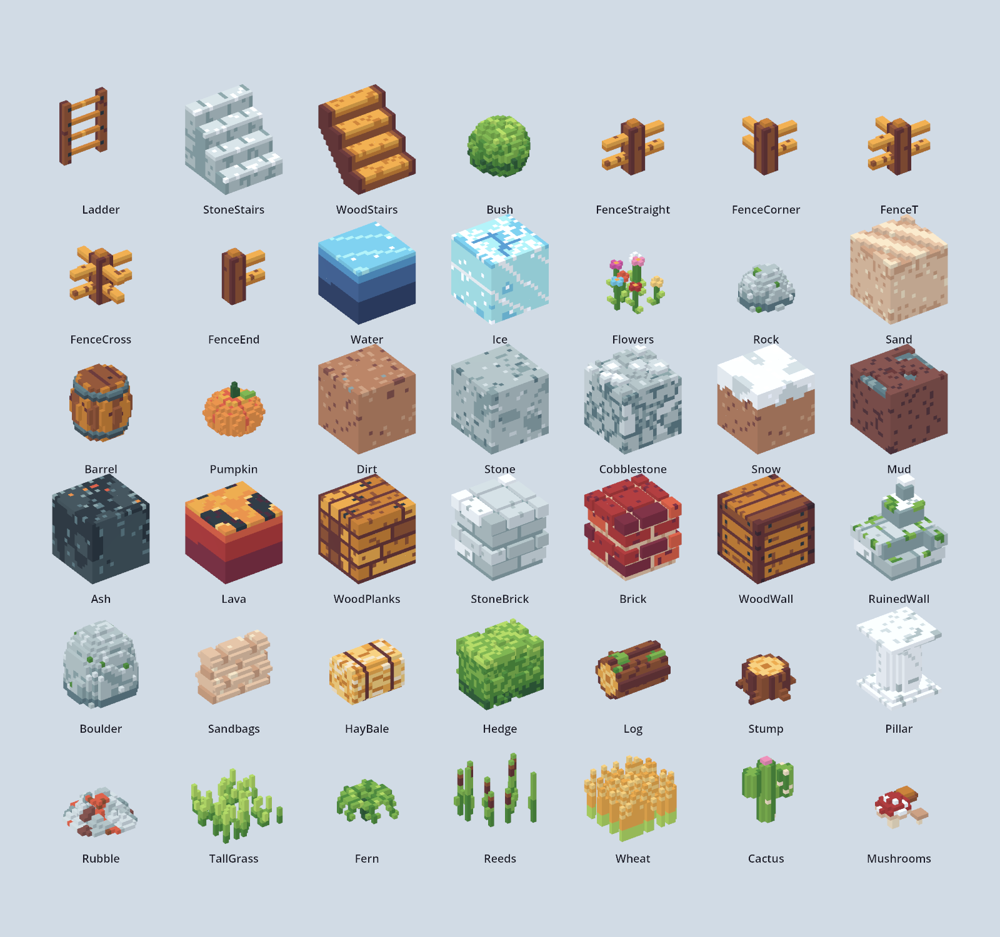

# Shapes

Basic voxel models, one to a `.vox`, each 16 x 16 x 16 voxels: a block's size, as the game imports
blocks (Scale 0.0625, one cell to sixteen voxels). `Preview.png` shows them all. Nothing in the game
uses them yet; they are a starting point to edit in MagicaVoxel or to bring in as blocks.



## How they are made

Every model is the same frame: a 16 x 16 x 16 model, placed where MagicaVoxel puts a new one
(translation `0 0 8`: centred, its bottom on the ground), as `BrightGrass1.vox` is. Each file
carries `LeafCluster1.vox`'s palette, materials, layers and render settings, so the shapes share the
colours the rest of the art is drawn in (the Apollo palette's rows, indices 193-254) and open looking
as the other files do.

- **Axes:** MagicaVoxel's x and y are across and z is up. The importer turns them into Godot's x, -z
  and y, so a model's +y side faces Godot's -z.
- **Ground blocks** fill the whole cell. Their patterns repeat every 16 voxels, so a field of them
  runs on without seams. Water and Lava are 14 voxels deep, so their surface sits two voxels below a
  ground block's top.
- **Everything else** stands on the bottom of the cell (z 0), as a crate does, to sit on top of a
  ground block.
- **Pieces that join their neighbours** run from edge to edge: the fences, Hedge, Sandbags and Wheat
  along the ground, Ladder up and down, and either stairs a cell up and a cell along (toward +y),
  carrying the flight on.
- **Materials:** every material is plain (diffuse), as in the other files. Water, Ice and Lava are
  opaque colours. The importer does read MagicaVoxel's glass and emissive materials (`_glass`,
  `_emit`; a glass one becomes transparent), so marking their colours so in MagicaVoxel would carry
  over.

## The shapes

Extents are in voxels, MagicaVoxel's axes, from 0.

| Shape | What it is | x / y / z |
| --- | --- | --- |
| **Ladder** | Two rails and four rungs against the +y side, the full height, so ladders stack | 2-13 / 14-15 / 0-15 |
| **StoneStairs** | Four solid stone steps, each 4 up and 4 along, rising toward +y to the full height | full |
| **WoodStairs** | Open wooden stairs: treads and risers between two side boards, rising toward +y | full |
| **Bush** | A round, leafy bush, holed at its surface | 1-14 / 1-14 / 0-12 |
| **FenceStraight** | Split-rail fence along x through the middle: a 4 x 4 post and two rails each way | 0-15 / 6-9 / 0-12 |
| **FenceCorner** | The post, with rails toward +x and +y | 6-15 / 6-15 / 0-12 |
| **FenceT** | Rails toward +x, -x and +y | 0-15 / 6-15 / 0-12 |
| **FenceCross** | Rails all four ways | full / full / 0-12 |
| **FenceEnd** | Rails toward +x only, to end a run | 6-15 / 6-9 / 0-12 |
| **Water** | A pool block, darker with depth, ripples and glints on top | full / full / 0-13 |
| **Ice** | Pale blue ice, white streaks, frost and a few cracks on top | full |
| **Flowers** | Seven flowers, each its own colour, on stems with leaves | 0-13 / 1-15 / 0-8 |
| **Rock** | A low, lumpy grey rock, a little moss on top | 2-13 / 2-12 / 0-7 |
| **Sand** | Pale sand, rippled on top, faint layers down its sides | full |
| **Barrel** | A bulging wooden barrel, two iron hoops at each end, a lid with a bung | 1-14 / 1-14 / 0-13 |
| **Pumpkin** | An eight-lobed pumpkin with a stem and a leaf | 1-14 / 1-14 / 0-11 |
| **Dirt** | The grass block's dirt, all through, a few pebbles on top | full |
| **Stone** | Grey rock all through | full |
| **Cobblestone** | Rounded stones in dark mortar, all through, standing proud of it on top | full |
| **Snow** | Dirt under a layer of snow that hangs down its sides, as the grass block's turf does | full |
| **Mud** | Dark mud, grey puddles a voxel down on top | full |
| **Ash** | Dark volcanic ash, pale flakes and a few embers on top | full |
| **Lava** | A molten pool, darker with depth, dark crust floating on top | full / full / 0-13 |
| **WoodPlanks** | Planks along x, staggered joints, nail heads: a floor | full |
| **StoneBrick** | Dressed stone, 8 long and 4 high in staggered courses, mortar set a voxel back | full |
| **Brick** | Red brick, the same courses, pale mortar set back | full |
| **WoodWall** | Horizontal boards round dark corner posts, nailed | full |
| **RuinedWall** | StoneBrick broken off stone by stone, falling from one corner to the other, stones knocked out of its faces, moss on top | full |
| **Boulder** | A boulder the full height of the block (full cover, where Rock is low) | 0-15 / 0-14 / 0-15 |
| **Sandbags** | Sandbags four high along x, staggered, so a wall of them runs on | 0-15 / 4-11 / 0-11 |
| **HayBale** | A square bale of straw tied with two loops of twine | 1-14 / 3-12 / 0-8 |
| **Hedge** | A clipped hedge along x, edge to edge | 0-15 / 2-13 / 0-12 |
| **Log** | A fallen log along x, rings at its ends, a broken branch, moss on top | 1-14 / 3-14 / 0-9 |
| **Stump** | A sawn stump, rings on top, five roots at its foot | 1-14 / 1-13 / 0-5 |
| **Pillar** | A fluted marble column between a square plinth and capital | 1-14 / 1-14 / 0-15 |
| **Rubble** | A low heap of broken stone and a little brick and earth | 0-14 / 0-15 / 0-5 |
| **TallGrass** | Blades of grass of many heights, some bent over | full / full / 0-8 |
| **Fern** | Seven fronds arching out from the middle and drooping | 1-14 / 0-13 / 0-6 |
| **Reeds** | Cattails, most with a brown head, and leaf blades | 0-13 / 2-14 / 0-13 |
| **Wheat** | Ripe wheat in rows along x, repeating every 4 voxels across | full / full / 0-11 |
| **Cactus** | A ribbed saguaro, an arm either side, a flower on top | 2-14 / 6-9 / 0-15 |
| **Mushrooms** | A red, white-spotted toadstool, a brown mushroom and a small pale one | 1-13 / 2-12 / 0-7 |

## Bringing one into the game

As a block, the way `BrightGrass1` and `BrightCrate1` are:

1. Copy the `.vox` into `vcom/Blocks/`.
2. Import it as **MagicaVoxel Mesh** at **Scale 0.0625** (the Import dock; the default scale is 0.1).
3. Add it to `vcom/Blocks/BlockLibrary.tres` as an item, with the others' `mesh_transform`
   (`y` -0.5). If the scenery round a battle should use it too, add it to `SceneryLibrary.tres` as
   well, with the same id and shadows off.
4. To have it break or wear away, give it a `Destruction` in `Resources/Destruction/Catalog.tres`
   (`CLAUDE.md`, "Breakable blocks are data").

Two things to know first:

- **The rules know only solid cells.** Any block in a cell fills it, whatever its shape: a fence,
  flowers or a ladder placed as a block is half cover that units stand on top of, and two stacked are
  full cover. Climbing, stairs, water, crossing a fence and rough ground (all on `todo.txt`'s list of
  terrain types) would each need rules of their own.
- **Blood reads every block in the library drawn from a `.vox` as a map loads**, used on the map or
  not (`CLAUDE.md`, Known gaps). That is fine for a handful more. With all of these in the library it
  would be worth reading only the blocks a map uses.

## Building them again

```bash
python3 make_shapes.py              # every shape
python3 make_shapes.py Ladder Rock  # only these, named as their files without .vox
```

Each shape is a function in `make_shapes.py`, listed in its `SHAPES` table, and everything random in
it is seeded, so a shape comes out the same every time. Building one again overwrites its file, so a
shape edited in MagicaVoxel is lost if it is rebuilt: name only the ones to rebuild. A new shape is a
function and a line in `SHAPES`.

`Preview.png` was rendered in Godot from copies imported in a throwaway folder (not kept), each
turned 35 degrees and lit by one sun, so it shows them as the importer makes them.
