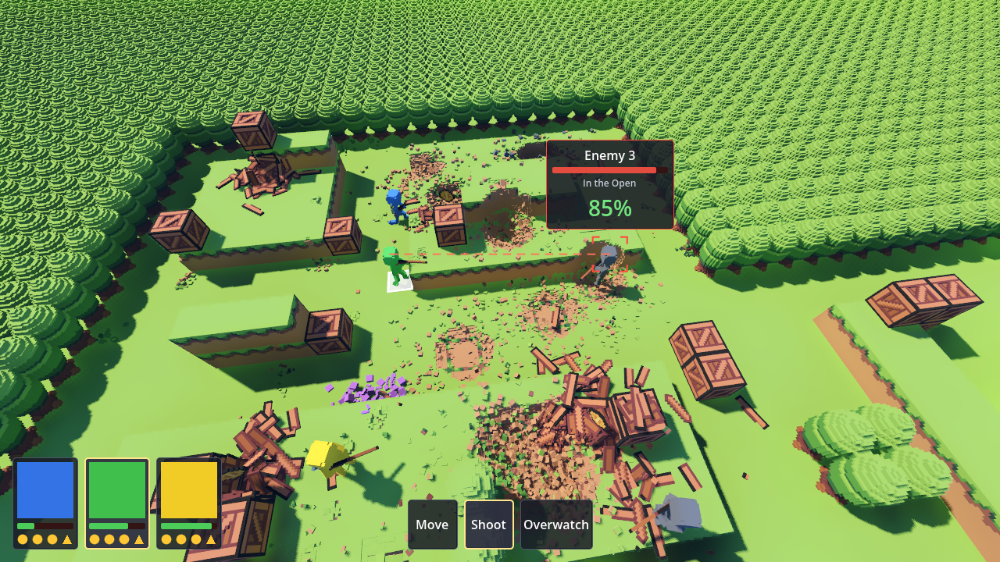
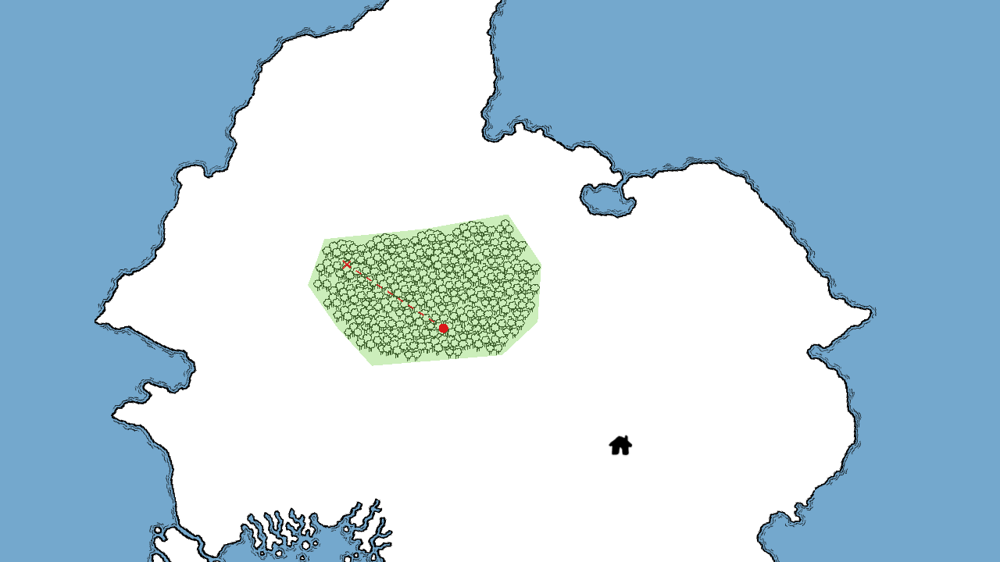

# VCOM

A turn-based tactics prototype in the vein of XCOM and Star Wars: Zero Company, built in Godot 4.7
on a voxel grid.

Squad members take on a map of enemies, a tile at a time: spend action points to move, take
cover behind terrain, lean out around it to find a firing angle, and roll against a percentage
chance to hit.



*A shot lined up late in a long fight, with blood turned off: grenade craters, broken crates and the
coins they left, and the heaps the fallen broke into. More screenshots are in [`Images/`](Images):
the world map, the menus, and battles just begun and long fought, clean and with blood.*

## Controls

The game plays with the keyboard and mouse or with a gamepad, whichever was touched last (see
[Gamepad](#gamepad)). Letter keys go by where they sit on the keyboard, not what is printed on them,
so `WASD` is `ZQSD` on an AZERTY keyboard. `Enter` and the number keys work on the number pad too.

`Esc` backs out one step at a time, on the world map and in combat alike: a path being previewed,
then the action that is up, then a village's menu. Only once there is nothing left to back out of
does it open the pause menu, and pressed again it closes it.

### World map

| | |
|---|---|
| Pan the map | `WASD`, push the cursor to a screen edge, or drag with the middle mouse button |
| Zoom | Mouse wheel, toward the point under the cursor |
| Send the party | Right-click anywhere on land. Right-click again on the way to send it somewhere else instead |
| Go to a village | Right-click its icon. The party goes to the village itself, wherever on the icon was clicked |
| See what is in a village | Hover over its icon |
| Use a village | Left-click its icon once the party is there, to open its menu |
| Open the pause menu | `Esc` |

The party is the only thing on the map that moves, so there is nothing to select first. A right-click
on the sea, or on land the party cannot reach, does nothing. The party has only arrived at a village
when it was sent there by a right-click on the icon, not somewhere near it.

#### Menus

The pause menu (its Campaign, Roster, Inventory and System tabs), a village's menu (a tab for each
place in it, such as the Hiring Board and the Market) and the roster that comes up before a battle
all pause the game behind them, and all work the same way.

| | |
|---|---|
| Change tab | Click it, or `←` / `→` while its row of tabs has the keyboard |
| Move between rows | `↓` / `↑`: from the tabs to any sub-tabs under them, to what is selected under those, and back |
| Move within a row or a grid | Arrow keys. Characters, items, slots and skills are selected as the keyboard reaches them. On the Skills page, `↑` / `↓` follow a skill tree and `←` / `→` cross to the trees beside it; the selected skill's circle is filled a shade lighter. `↓` past a tree's last skill goes on to the button under the page, where there is one (**Start**, **Hire**) |
| See what a skill is | On the Roster's Skills page, hover over it, or move the keyboard on to it: a panel beside it gives its name, a line about it, what the level the character has gives (**Current**) and what the next would (**Next**). It follows whichever of the mouse and the keyboard was used last |
| Press a button | Click it, or `Enter` / `Space` |
| Buy, sell, hire, or start a battle | Hold the button for 2 seconds, with the mouse or `Enter` / `Space`. One per press: let go and hold again for the next |
| Learn a skill | On the Roster's Skills page, hold an available skill (its edge lit) for 2 seconds, with the mouse or `Enter` / `Space`: it fills round like a clock face, from the top. It costs a skill point, and cannot be done during a battle. One per press. A skill with rings round it can be taken again, once for each ring: hold it again and the next ring out fills round the same way, for another skill point |
| Equip | On the Roster's Equipment page, pick a slot, then double-click an item under it, press `Enter` / `Space` on one, or press **Equip**. **Unequip** puts back what the slot holds |
| Choose who fights | Before a battle, double-click a character, or press `Enter` / `Space` on one, to tick or untick them (up to four), then hold **Start**. A single click only shows their pages |
| Close | `Esc`, or **Return to Game** on the pause menu's System tab. The roster before a battle cannot be closed: only **Start** leaves it |
| Show or hide the tile grid | **Tile Grid** on the pause menu's System tab. The lines show in combat, and stay as set until the game closes |
| Turn blood on or off | **Blood** on the pause menu's System tab, just below **Tile Grid**: off, battles are fought clean. It can only be changed on the world map, and is greyed out during a battle. It stays as set until the game closes |
| Quit the game | **Exit to Desktop** on the pause menu's System tab |

### Combat

| | |
|---|---|
| Pan the camera | `WASD`, push the cursor to a screen edge, or drag with the middle mouse button: the ground under the cursor comes with it |
| Turn the camera | Hold `Q` / `E` |
| Zoom | Mouse wheel |
| Select a squad member | `Tab` / `Shift+Tab`, left-click them, or click their card on the squad panel (bottom left) |
| Choose an action | Click its button on the action bar (bottom middle). Click it again, or press `Esc`, to put it away. **Move** is taken up whenever a squad member is selected |
| Move | Hold right-click to preview the path to the tile under the cursor, and let go to walk it. Let go off the tinted tiles, or press `Esc` while holding, to call it off |
| Shoot / Strike | `Tab` / `Shift+Tab` cycle targets, or click another target (left or right button) to line it up. Fire or strike with `Enter` / `Space`, by clicking the target lined up, or by clicking the tick beside its odds. The cursor turns to a hand over a target |
| Overwatch | `Enter` / `Space` goes on overwatch, for every action the squad member has left |
| Hunker Down | `Enter` / `Space` hunkers down behind cover, for one action. Only in cover; moving afterwards ends it |
| Reload | `Enter` / `Space` loads a fresh magazine, for one action (the gun's Reload). Greyed out while the magazine is full. The rounds left show in the bottom-right corner |
| Throw Grenade | Point at a tile to see the arc and the blast. Click it (left or right button), or press `Enter` / `Space`, to throw. A left click on a squad member still selects them |
| Use Medkit | `Tab` / `Shift+Tab` cycle the wounded allies next to the squad member, then the squad member themselves if wounded, or click another (left or right button) to line them up. Heal with `Enter` / `Space`, by clicking the one lined up, or by clicking the tick beside what they would gain. A left click on one of them heals or lines them up rather than selecting them. The cursor turns to a hand over them. The button's corner counts the uses the squad member can draw on where they stand: their own, and those of the squad members beside them with a Medkit |
| Show the hit breakdown | Hold `Ctrl` while a shot or a strike is lined up |
| React | During a reaction window, `1`–`4` fires the squad member with that number beside them (their place on the squad panel), and `0` lets the move carry on |
| End the turn early | Hold `Shift` for a second. Letting go, or pressing any other key, calls it off |
| Show or hide the tile grid | `G`, or **Tile Grid** on the pause menu's System tab: faint lines along the edges of the ground's tiles. Off until turned on |
| Open the pause menu | `Esc`, with no action up |

While Shoot, Strike or Use Medkit is up, `Tab` cycles targets rather than squad members. During the enemies'
turn only the camera, the reaction keys and the pause menu answer. The pause menu works as on the
world map, but equipment cannot be changed, nor skills learned, until the battle is over.

### Gamepad

Everything plays with a gamepad laid out as an Xbox controller's; a Steam Deck's buttons are the
same. Pressing a button or pushing a stick switches to it: the mouse pointer hides, and prompts show
what each button does right now, drawn as the buttons on the pad, in a column down the right of the
screen (on the world map and in combat) or a row along the bottom (in a menu). A key, a click or a
move of the mouse switches back.

`B` backs out as `Esc` does, a step at a time, but never opens the pause menu: `Menu` does that, and
closes it again.

**World map**

| | |
|---|---|
| Move the map | Left stick: the map slides under the reticle in the middle of the screen |
| Zoom | Right stick up / down, or the d-pad's up / down a step at a time, toward the reticle |
| Send the party | `A` with the reticle on land, or on a village's icon to go to the village. The prompt says which, and there is none over the sea |
| See what is in a village | Put the reticle on its icon |
| Use a village | `A` with the reticle on the village the party is in |
| Find the party | `L3` (press the left stick) brings it back to the middle of the screen |
| Open the pause menu | `Menu` |

**Menus**

| | |
|---|---|
| Move | D-pad or left stick, as the arrow keys |
| Change tab | `LB` / `RB` |
| Change sub-tab | `LT` / `RT`: the sub-tabs the selection is in (a character's pages, the kinds of item), or the first under the tabs |
| Press a button | `A` |
| Buy, sell, hire, learn a skill | Hold `A` on the button or the skill for 2 seconds. In a shop, `A` on an item or a character goes to the button that buys or hires it, to be held there |
| Choose who fights | `A` on a character ticks or unticks them. `Menu` goes to **Start**; hold `A` on it |
| Close | `B` or `Menu`. The roster before a battle cannot be closed |

**Combat**

| | |
|---|---|
| Point at a tile | Left stick: the tile cursor, a bright square with a marker bobbing over it, steps a tile at a time the way the stick is pushed on screen, and the camera follows it. `L3` puts it back on the selected squad member |
| Turn and zoom the camera | Right stick: left / right turns it, up / down zooms. The d-pad's up / down zoom a step at a time |
| Select a squad member | `LB` / `RB`, or the cursor on them and `A` while **Move** is up |
| Choose an action | D-pad left / right, through the actions the squad member can take now. `B` puts it away |
| Move | The path to the cursor is shown as it moves; `A` walks it |
| Shoot / Strike | `LB` / `RB` cycle targets, the cursor going with them, or put the cursor on one. `A` fires or strikes, as the `A` beside the odds says. Hold `LT` for the hit breakdown |
| Overwatch / Hunker Down / Reload | `A` |
| Throw Grenade | The arc and the blast follow the cursor; `A` throws |
| Use Medkit | `LB` / `RB` cycle the wounded allies next to the squad member, and the squad member themselves if wounded, the cursor going with them, or put the cursor on one. `A` heals |
| React | In a reaction window, one squad member's odds have an `A` beside them: `LB` / `RB` pick another, `A` fires, `B` lets the move carry on |
| End the turn early | Hold `View` for a second. Letting go, or pressing any other button, calls it off |
| Show or hide the tile grid | `R3` (press the right stick) |
| Open the pause menu | `Menu` |

## The campaign

The game opens on the world map. Send the party anywhere on land, and open the village it is
standing in to use it (see [Controls](#world-map)). A village's Hiring Board has fighters for hire,
who join the end of the roster, and its Market sells its stock and, on its Sell tab, buys anything
in the inventory (not equipped) for half its price, rounded down. Every hire, purchase and sale
takes holding its button for two seconds, so a stray click never spends anything. Travelling
through a forest (the green areas) risks an ambush: every short stretch of the way has a chance to
start a battle.



*The world map: the party, the red dot, on its way through a forest to the cross it was sent to, and a
village to the south-east.*

Before it starts, the roster comes up to choose who fights: tick up to four, then hold **Start** for
two seconds (see [Menus](#menus)). It opens with the last battle's squad ticked, less anyone who
fell, and it cannot be closed any other way.
What happens to them in the battle lasts. Wounds carry into the next battle unless they heal first:
everyone on the roster heals a little (1 HP) for every short stretch the party travels, and a
character who dies is gone from the roster for good, their gear back in the inventory (what they
are seen to drop on the battlefield is only for show). The battle
ends when either side is wiped out: **Victory** or **Defeat**, then back to the world map where the
party was, still on its way. If a defeat took the last character on the roster, the campaign is
lost: **Game Over** comes up on the world map and the game closes.

Everyone still standing at the end of a battle earns 50 experience, and a victory earns the party 10
gold, plus a gold for every coin still lying on the field (see Coins, below), plus whatever gold the
survivors' skills find, called over each one's head as "+5 Gold". Every 100 experience
becomes a skill point (the rest carries over), shown on the Roster's Skills tab as "Skills (1)".
That tab lays out a skill tree for each of the character's Species, Sub-Species, Main Class and
Multi-Class, headed by its name. A skill point learns any skill once every skill linked above it is
learned (see [Menus](#menus)). Some skills can be taken more than once, up to four more times, a
skill point each: such a skill has a ring round it for every further time, lit from the innermost
out as it is taken, and taking it once is enough to open the skills below it. What a skill gives, it
gives from the moment it is learned: a bonus to a stat shows on the Details page at once, and goes
into the next battle.

Everyone is a Human Minor Noble for now, and nobody has a class yet. The Human tree starts with
**Ambition**: +1 HP, and taken again +1, +1, +2 and +5 more, +10 HP in all. It raises the most health
the character can have, so one who is wounded stays as wounded as they were. Under it is
**Hardiness**: +1 Defense, taken once, which comes off every hit as armor's does and adds to it. Then
**Dexterity**: +1 Move, a tile further for every action spent moving, and +5 Evasion, off the chance of
every shot and strike at the character; taken once. Last is **Adaptability**: 5 skill points, there
and then, once. It costs the one it takes to learn, so it leaves a character four better off, to
spend on anything open to them.

The Minor Noble tree starts with **Money Grubbing**: +1 Gold for the party after a combat the
character fights in, and taken again +1, +3, +5 and +5 more, +15 Gold in all. Only for a battle they
were chosen for, and only if they are still standing at the end of it: one left on the roster finds
nothing, and neither does one who falls. Under it is **Ballistics Skill**: +10 Aim, taken once, on
every shot the character takes, reactions included (not on a melee strike, which goes by Melee
Accuracy). Then **Weapon Skill**: +10 Melee Accuracy, on every strike, and taken again +1 Strength as
well, a point more damage on every strike that lands. Last is **Rich Blood**, which is to unlock
rare goods at markets, at twice their usual price, while a character with it is in the party. It can
be learned, for a skill point like any other, but does nothing yet: the markets have no rare goods
to sell.

## Combat rules

### Actions and gear

Which actions a squad member has depends on what they have equipped. Everyone can **Move** and
**Hunker Down**. **Shoot**, **Overwatch** and **Reload** need a gun (the Rifle) in a weapon slot. **Strike**
needs a melee weapon (the Shortsword) in a weapon slot, and is greyed out until an enemy stands next
to the squad member. A squad member with neither can only move and hunker down. **Throw Grenade**
needs a grenade (the Frag Grenade) in an item slot. A thrown grenade is gone for good: its slot is
empty after the battle, and the Market sells more. **Use Medkit** needs a Medkit in an item slot, or
a squad member with a Medkit use left standing next to them (it comes and goes as they move). It is
greyed out until the squad member is wounded or a wounded ally stands next to them, and once there is
no Medkit use left to draw on, theirs or a neighbour's (see [Medkits](#medkits)).

What a squad member carries shows on them: the gun in their hands, a sword slung across their back
(drawn when they line up a Strike), and their grenades on their belt until thrown, with any medkits
beside them. While you line up a
shot they turn to the target with their gun raised, and they run, hop up and down ledges, kneel behind
half cover and press up to full cover, facing the nearest enemy. A unit that a shot can only see
where it leans out of its cover (see [Line of sight and cover](#line-of-sight-and-cover)) is seen
doing it: it steps to the end of its cover and leans out round it, looking at whoever is aiming,
from the moment it is targeted until the shot is over. Whoever dies, squad member or enemy,
breaks apart where they stand into a heap of chunks in their colour, knocked the way the killing blow
went: back from a shot, along a sword's swing, outward from a grenade. What they carried drops whole
beside them, and later shots and grenades wear it away like a crate's boards. It all stays for the
rest of the fight, and a grenade throws it about. None of it changes the rules: a shot, strike or throw
is settled exactly as below, the moment the gun fires, the blade lands or the grenade leaves the hand.

### Action points

Every unit gets **3 actions** a turn. Moving costs one action per `move_range` (4) tiles of path,
so a long walk can cost two or three. Shooting costs one, and so do striking, throwing a grenade,
using a medkit and hunkering down. Reloading costs what the gun's **Reload** says: one for the Rifle. The player's turn ends when every member has spent their budget, or early by
holding `Shift`.

### Reactions and overwatch

As in Pathfinder, every unit also gets **one reaction**, shown as the triangle beside its action
circles. Reactions are taken outside the unit's own turn, in answer to something another unit does,
and the unit gets its reaction back at the start of its turn.

**Overwatch** spends all the actions a unit has left and holds its reaction, for a shot at an enemy
moving across the ground it can see (marked in gold while the action is selected). The triangle has
a pale rim while it is held, and overwatch ends when it fires or when the unit's next turn starts.

**Reactions never go off by themselves.** When an enemy moves where squad members on overwatch can
see it, a *reaction window* opens:

- The move drops to **slow motion** (10% speed) and the camera pulls up to an angled top-down view
  of the enemy and everyone who could fire at it.
- Beside each of them is a number, `1`–`4`, their place on the squad panel, and the odds of their
  shot. The odds move as the enemy does; the number shown when the key goes down is the one rolled.
- Pressing a number fires that squad member: the enemy freezes while the shot plays out, then carries
  on. Their reaction is spent and their prompt goes.
- Pressing `0` lets the move play out at normal speed without firing.

Prompts come and go as the enemy moves in and out of sight, and the window closes when no one has a
shot left or the enemy stops moving; a standing enemy cannot be fired on. Every move is a new
trigger with the prompts back up, so the player can let an enemy come closer, or out of cover,
before choosing to fire. The camera goes back to its normal view when that enemy's turn is over.

A reaction shot costs **15 aim** (the **Reaction** term below), for being snapped off at a moving
target. Only walking sets off a window; leaning out of cover to shoot does not. A reaction has to
see the enemy on the tile it is crossing: a moving enemy is not leaning out of anything, so the
tiles it could lean out to (see [Leaning out gives you away](#line-of-sight-and-cover)) count for
nothing, in the window and on the ground overwatch marks.

### Hunkering down

**Hunker Down** can only be taken in cover, half or full, on any side of the squad member's tile;
out of cover its button is greyed out. It costs **one action**, and the rest of the turn is theirs:
they can shoot, strike, throw or go on overwatch from where they are, before or after, and stay
hunkered. Until the start of the player's next turn every shot at them loses **20 more aim** on
top of their cover's (the **Hunkered** term below), as long as their cover counts against that
shot: a shot that flanks them, or one taken after their cover has been shot away, loses nothing for
it. Melee counts no cover, so hunkering does nothing against a strike.

**Moving ends it.** The moment a hunkered squad member sets off on a **Move**, or falls when the
ground under them is broken, they are no longer hunkered; in cover again, they can hunker down
again for another action. Stepping out of cover to take a shot and back does not count as moving.
Nor does hunkering hide them: a shot that can only see them where they could lean out of their
cover (see [Leaning out gives you away](#line-of-sight-and-cover)) still sees them there, and they
lean out for it, as anyone does, and duck back down once it is over.

A hunkered squad member ducks low behind their cover, their weapon hugged close, and their card on
the squad panel shows a blue shield until it ends.

The enemies' odds count it as yours do, so an enemy with a choice of targets is likely to pick one
who has not hunkered down.

### Ammo and reloading

Every gun has a **Magazine**, the shots it holds, and a **Reload**, the actions it takes to load a
fresh one. The Rifle's are **5** and **1**. Every shot fired spends a round, a reaction shot as much
as one on the squad's own turn, hit or miss. With the magazine empty, **Shoot** and **Overwatch** are
greyed out and a squad member on overwatch is offered no reaction shot, until they **Reload**, which
is greyed out while the magazine is full and when they have too few actions left for it. Reloading
fills the magazine: there are no spare magazines to count, as in XCOM. Every battle starts with
everyone's magazine full; what is left at the end is not kept.

The rounds the selected squad member has left show in the bottom-right corner: a bar for each round
the magazine holds, gold while loaded and hollow once fired, the panel edged in red when it is empty.

A reload plays over whatever the squad member is doing with their legs, so they stay kneeling or
hunkered behind cover: the rifle comes up across the chest, the spent magazine is dropped, and a
fresh one is taken from the belt and slapped home. Nothing is called over their head: the reload
itself is the sign.

### Enemies

Enemies play by the squad's rules: an action per 4 tiles walked, one per shot, a round per shot and
an action to reload, and they walk into overwatch the same way. What each one does with its actions
is its AI's call. Every enemy so far uses the **assault** AI, which takes, for each action, the first
of these it can do:

1. **Its magazine empty:** reloads.
2. **Next to a squad member it can shoot:** shoots them. Once it gets there, every action it has
   left goes on them.
3. **Any action but its last:** moves as close as it can get to the nearest squad member, up to 4
   tiles. Nearest counts steps walked, not distance as the crow flies.
4. **Its last action:** shoots whoever it has the best odds on, or moves closer if it cannot see
   anyone.

"Next to" means one tile away in any of the eight directions, at most a level up or down. An enemy
that cannot get any closer shoots rather than waste the action, and with nothing to shoot either it
tops up a part-spent magazine. Its reload plays as the squad's does.

### The grid

The map is a `GridMap` of 1×1×1 cells. A tile is an empty cell with solid ground beneath it and two
cells of headroom — a unit fills its tile and the cell above. Units step to any of the eight
neighbours, climbing at most 1 level and dropping at most 2. Diagonal steps cost the same as
straight ones but cannot cut a corner. `G` draws the tiles' edges on the ground, for counting them.

### Line of sight and cover

Cover is whatever is solid beside a tile, on any of its four cardinal sides:

- **1 cell tall → half cover.** A unit sights from the centre of the cell above its own tile, so
  sight lines pass clean over anything only one cell high. Half cover costs the shooter aim but
  never blocks the shot.
- **2+ cells tall → full cover.** Tall enough to sit in the sight line and stop it dead.

**Stepping out.** A unit behind cover leans out to either side of it to shoot around it, exactly as
in XCOM, and the tile it leans to is marked on the map while you aim. The lean is played out: the
unit walks out, fires, and settles back into cover. Cover is what makes the lean possible — a unit
caught in the open has nothing to lean out from and fires from where it stands.

**Leaning out gives you away.** As in XCOM 2, a unit can be seen on its own tile *or on any tile it
could lean out to*: the same tiles beside its cover that it would shoot from. So nobody is safe
behind a pillar from someone who can see the ground beside it, and whoever can lean out and shoot
you can be shot back at round the same corner: sight always runs both ways. It only matters when
you cannot be seen where you stand, and it takes nothing off your cover: a unit caught leaning out
from behind full cover is still shot at through full cover, −40. A unit in the open has nowhere to
lean out to and is seen where it stands or not at all. The game shows it: a target your shot only
sees leaning out is drawn leaning out round the end of its cover, standing at full cover and on one
knee at half, while it is in your sights and until the shot is over, and the sight line and reticle
go to it there. Your own squad does the same when an enemy takes such a shot at them.

**Flanking** means the target is in cover but none of it faces your shot. A target standing in the
open is *not* flanked: there was nothing to get around.

Units never block line of sight; only terrain does. Sight is also slightly more permissive than
movement — a shot can thread a diagonal gap between two blocks that touch at a corner, which a unit
cannot walk through.

### Chance to hit

```
Aim − Evasion − Cover − Hunkered + Flanking + Height − Distance − Reaction
```

clamped to 0–100. Every term is whole percentage points, and all of it is measured from **where the
shot is actually taken** — a unit leaning out of cover has its height and distance reckoned from the
tile it leans to — to **the tile the target stands on**, even when the target is only seen where it
leans out: its cover, height and distance are its own tile's.

| Term | Source | Default |
|---|---|---|
| **Aim** | shooter's stat | 90 |
| **Evasion** | target's stat | 0 |
| **Cover** | half cover / full cover | −20 / −40 |
| **Hunkered** | the target has hunkered down, and its cover counts against the shot | −20 |
| **Flanking** | target in cover that does not face the shot | +20 |
| **Height** | shooter's stat, per tile of elevation difference | ±5 per tile |
| **Distance** | shooter's stat, per *full* 4 tiles to the target | −5 per step |
| **Reaction** | the shot is a reaction, such as overwatch fire | −15 |

Height tells both ways: shooting uphill costs exactly what shooting down gains. Distance is stepped
rather than continuous, so the number holds still while you shuffle about within a step — 0–3 tiles
is free, 4–7 costs one step, and so on.

Hold `Ctrl` while aiming to see the sum itself, one line per term that mattered.

Every shot that lands deals its weapon's damage (a rifle does 4 against 10 health), less the
target's **Defense**, down to nothing: a rifle does 3 to a target with 1 Defense, and none to one
with 4. Everyone's own Defense is 0 for now; armor adds to it, Light Armor by 1. There are no
critical hits yet, and damage does not vary.

### Melee

**Strike** hits an enemy on one of the eight tiles around the striker, up to a level above or below.
Its chance to hit is the same sum with **Melee Accuracy** (90 by default, shown on the Roster's
Details page) in place of Aim, and nothing about the ground counting:

```
Melee Accuracy − Evasion
```

Cover, flanking, height and distance are all worth nothing in melee for now, and a strike is never a
reaction. The target panel reads **Melee** where a shot's shows the target's cover, and `Ctrl` shows
the sum as it does for a shot. A strike that lands deals its weapon's damage (the Shortsword does 4)
plus the striker's **Strength** (0 by default, also on the Details page), and only then is the
target's Defense taken off, as it is from a shot: a Shortsword swung with 3 Strength does 7, or 6
to a target with 1 Defense. Strength adds nothing to shots. A strike lands at once, with its damage
or **MISS** called over the target, and never touches the terrain.

### Grenades

**Throw Grenade** throws the first grenade a squad member carries (Item 1, then Item 2, then Item 3)
at a tile up to **10 tiles** away across the ground, for one action. While it is selected, every tile
it can reach is tinted faintly. Point at one to see the throw: its arc, the ground the blast covers,
and a bracket on everyone it would catch, with the damage each would take, red on enemies and gold on
the squad. Click the tile, with either mouse button, or press `Enter` / `Space`, to throw. A left
click on a squad member's figure selects them instead, as it does whatever action is up, so to
throw at a tile one of them stands on, right-click it or use the keys.

- **The arc must be clear.** The grenade flies in an arc from over the thrower's head to the target,
  higher the further it goes. If anything solid stands in its way the arc turns red up to where it
  is stopped, with a cross there, and the throw cannot be made. Units never block it. It clears the
  thrower's own full cover, and drops behind half cover from the full 10 tiles, but it can never land
  right behind full cover: throw it a tile past whoever is hiding there and the blast still catches
  them.
- **Nothing is rolled.** A grenade always goes off where it is thrown.
- **The blast catches everyone in it**, friend or foe, the thrower included. It is a cube as tall as
  it is wide, centred on the target: the Frag Grenade's is **3×3** tiles across and reaches from the
  floor to head height, so it also catches anyone standing a level up or down. Anyone with any part
  of them inside it takes the grenade's damage (**5** for the Frag Grenade) less their Defense, as
  from a shot. Walls inside the blast shelter nobody.
- **It breaks every crate in the blast**, blows a crater in the grass and the trees there (see
  [Destructible terrain](#destructible-terrain)), and throws the debris there about. Crates stacked
  above the blast fall, and anyone left standing on nothing drops.
- **It is gone for good.** A thrown grenade is used up for the rest of the campaign; the Market
  sells more. With none left, the button leaves the action bar.

The throw range is the same for every squad member and every grenade (`Throwing.RANGE` in
`Scripts/Combat/Throwing.gd`); each kind of grenade sets its own blast size and damage.

### Medkits

A **Medkit** costs 10 gold; the village's Market has one. Equipped in an item slot, it gives the
squad member **Use Medkit**: for one action, heal themselves, or a wounded ally standing on one of the
eight tiles around them, up to a level above or below (a strike's reach), by **4 HP**, never above
the most. Lined up as a strike is, it draws a green line and reticle to the ally, and the panel over
them shows their health now and after, and the HP they would gain where a strike's odds would be.
Nothing is rolled: it always works. The squad member takes the medkit off their belt and holds it
out, and **+4 HP** (or less, for an ally nearly whole) is called over the ally in green as they mend.
Healing mends the character too, so it lasts after the battle as any wound does.

- **Themselves too.** A wounded squad member is on offer to their own medkit, after the allies
  beside them: the reticle and panel sit over them, with no line, and they press the medkit to their
  own middle rather than turn to anyone. Clicking themselves (either button) lines them up or heals
  them, as clicking an ally does. Never an enemy.
- **Once a battle for each Medkit.** Using one spends it for the rest of the battle, but it is never
  used up: it stays equipped and is ready again in the next battle. Two Medkits are two uses a
  battle, three are three.
- **Shared with those beside them.** A squad member standing next to someone whose Medkits have a
  use left gets **Use Medkit** too, even with no Medkit of their own, for as long as they stand there.
  They heal as the carrier would (themselves, or a wounded ally next to *them*), for one of their own
  actions, but the use is the carrier's: once a neighbour has spent a carrier's last use, the carrier
  has none left either. A squad member with Medkits of their own uses theirs first, and only then a
  neighbour's. With several neighbours to draw on, the first in the squad panel's order lends. The
  panel over the one lined up says whose it is ("Blue's Medkit"), and the borrower holds one in hand
  as they use it. The number in the corner of the action's button is every use the squad member can
  draw on where they stand: their own and their neighbours'.

### Where shots go

Every shot is drawn as a tracer, and its result, damage included, is called when the round arrives.
A hit flies straight along the sight line into the target, so it never touches terrain. It is drawn
landing somewhere on the side of the target facing the gun, mostly the torso, and the target bleeds
there (see [Blood](#blood)). A target caught leaning out of its cover is hit where it leans, on the
part of it that is out, and a miss is aimed round it there; the cover it leans out from is the
cover those misses chew.

A miss still goes somewhere, as in XCOM 2. Once the roll has said it misses, the round is aimed at a
point near the target (above or beside its body, never through it) and flies on until it strikes
something solid or leaves the map. When the target has cover facing the shot, about a third of misses
are aimed at that cover instead. With the misses that clip it anyway, around half of all misses
against a target in cover strike the cover.

- **A stray round never hurts anyone.** It never passes through another unit, friend or foe, unless
  that unit is standing right in the line of fire, where any round passes through it because units
  never block sight.
- **A miss never lands well short of the target**, no more than 2 tiles in front of it.

Where a miss strikes terrain it leaves a mark and is reported to the map with the weapon's
environmental damage (5 for a rifle). Grass and trees are hit where the round actually meets them,
voxel by voxel: a miss that passes beside a tree's trunk, or through a hole blown in a wall, flies on.

### Destructible terrain

**Crates break.** A crate struck by a stray round, or caught in a grenade's blast, is gone the
moment the round arrives or the grenade goes off: sight, cover and paths change at once, so an enemy
crouched behind it is in the open for the next shot. What is left of it bursts apart, throwing its
boards a cell or two, and further when a grenade did it.

- **Stacks fall, then break.** A crate stacked on a broken one drops whole and breaks where it
  lands, bursting apart just the same, and so does everything breakable above it. They are gone
  from the fight the moment the crate under them is struck; the fall is only for show.
  Unbreakable blocks stay where they are, and so does whatever stands on them.
- **A soldier on a crate falls.** Anyone left standing on nothing drops to the ground below.
- **The pieces are only for show.** They are real physics debris that stays for the rest of the
  fight and bumps off soldiers, but they never block sight, give cover or get in anyone's way.
- **The boards break down further.** Once the crate has come apart, each of its boards wears away
  as a block does: a round flying through one tears a bite out of it, three voxels for each point of
  environmental damage, and flies on as if it were not there; a grenade's blast craters the boards
  within its reach. A board shot in two becomes two boards, a splinter too small to stand on its own
  falls as lumps, and a board worn below half of itself crumbles.

**Grass and trees wear away, a few voxels at a time.** Every block is 16 voxels to a side, and these
come apart into them:

- **A round takes a bite** where it strikes: about a dozen voxels for each point of the weapon's
  environmental damage (60 for a rifle), knocked out of the face it hit in small lumps that fall and
  stay where they land.
- **A grenade blows a crater**: every voxel in a ball round where it goes off, as big as its
  environmental damage makes it (a little over two tiles across for the Frag Grenade), but only within its
  blast. Its earth is thrown up and out round the crater.
- **Worn is not gone.** However chewed up it looks, a block still counts as the whole block for sight,
  cover and movement until it is **worn below half** of its voxels. Then it collapses: it is gone from
  the fight at once, what is left of it crumbles into lumps, blocks stacked on it fall, and anyone on
  it drops.
- **Cut through, it falls.** A block holding something up collapses as soon as nothing joins its bottom
  to its top: a tree's thin trunk, shot through, brings its crown down with it.
- **The ground never gives way.** The bottom of the map only craters, and only a quarter of a tile
  deep. Soldiers still stand at the ground's full height, so they float a little over a crater.
- **What falls off hanging** - a lump of earth left holding on to nothing - drops with the rest.

As with crates, the debris is only for show and stays for the rest of the fight. After a great deal of
destruction, the debris furthest from where the camera is looking stops moving, though it stays where
it lies; a blast, the ground going from under it, or a soldier walking into it sets it moving again.

### Coins

**Three crates in four leave a coin** where they broke, spinning in the air at the height of the
crate's top, or where a falling crate landed. Coins on the same tile stack up, and a coin whose
ground is shot away drops to the ground below.

- **Walk through a coin to take it.** A soldier takes every coin on each tile they pass through,
  ending their move there or not: along a path, stepping out of cover to shoot, or dropping when the
  crate under them breaks. Each is 1 gold for the party at once, "+1 Gold" over their head, and is
  kept even if the battle is lost. Enemies ignore coins.
- **A victory sweeps up the rest.** Every coin still on the field is the party's the moment the
  last enemy falls.

### Blood

Every hit that does damage draws blood, as exaggerated as Fat Princess's, and all of it stays for the
rest of the fight; the next battle starts clean. It is only for show: it never changes a shot, cover
or a path.

**To play clean**, turn **Blood** off on the pause menu's System tab before a battle, on the world
map (see [Controls](#menus)): battles are then fought without any of it. It cannot be changed during
a battle; a battle keeps whatever it began with.

- **Wounds.** A hit lands anywhere on the side of the body facing whoever dealt it, mostly the torso,
  and the body is stained round there, the stain leaning a little downward. A round goes through and
  through: most of its blood sprays out of the far side along its flight,
  a little back toward the gun. A sword's sprays along its swing, a grenade's away from the blast.
  The more damage, the more blood, and a hit armor stops entirely draws none.
- **Spray.** Each drop flies as a voxel of blood, and stains whatever it lands on: the ground, walls,
  crates, debris, other soldiers and the guns they carry, and what the dead broke into.
- **Coins stay clean.** They are the one exception: blood flies straight through a coin, and never
  stains it.
- **Pools.** Blood runs where it lands, a voxel face at a time: it pools on flat ground, runs over an
  edge and down the wall below, and fills the bottom of a crater. Blood landing in a pool makes it
  bigger.
- **The dead bleed out.** A second after someone dies, once their chunks have mostly landed, a pool
  about two tiles across spreads out over a few seconds where they stood.
- **Blood goes with what it is on.** A bloody crate breaks into bloody boards, a bloody block falling
  takes its blood with it, earth shot out of a pool flies off as red lumps, a bloodied soldier breaks
  into chunks red where they bled, and their dropped gear keeps its blood.

Enemies are slate grey, so their wounds show.

## Notable decisions

**Cover is read off whole cells, not thin walls.** XCOM puts cover on tile edges; here every
obstacle is a full voxel. Mapping "1 cell tall" to half cover and "2+ cells" to full cover means the
eye-height sight line reproduces XCOM's behaviour for free, with no separate cover data to author —
build terrain and the cover falls out of it.

**Sight lines are symmetric by construction.** Where a shot crosses two cell boundaries at once — a
diagonal — it cuts the corner rather than clipping the cells to either side. This is verified across
every pair of tiles on the test map: if A can see B, B can see A, with no exceptions.

**So are shots, XCOM 2's way.** A sight line being symmetric is not enough when one end can step out
of cover and the other cannot: the unit behind the pillar could shoot and not be shot. XCOM 2 checks
every position the shooter can fire from against every position the target could lean out to, and so
does this: a target is seen on its own tile or on a tile it could lean out to, which makes having a
shot run both ways too. A target's lean tiles are only tried when it cannot be seen where it stands,
so the rule adds shots and never changes one; reactions leave them out, as XCOM 2's overwatch does,
since a unit on the move is not leaning anywhere. Checked by standing two units on thousands of
random pairs of tiles on every map: whenever one has a shot, so has the other.

**The number you are shown is the number that is rolled.** The hit chance is worked out once, when
the shot is lined up, and kept until the trigger goes.

**Where a miss goes is settled when it is fired, XCOM 2's way.** XCOM: Enemy Unknown flew a real
projectile and damaged whatever it bumped into on the way; XCOM 2 works the whole path out first and
has the tracer play it back. The path is traced through the voxel grid, with no physics, so it is
decided before anything is drawn and can be tested headless. It goes through grass and trees voxel by
voxel, so a round hits the trunk it is drawn hitting, but sight and cover still read whole blocks.

**Blocks wear away, the rules see whole blocks.** A block losing voxels is drawn as what is left of it,
but sight, cover and movement still read whole cells, so the fight stays as predictable as XCOM's:
a wall is cover until it collapses, and it collapses at a clear point (half gone, or cut through),
decided the moment the round or grenade lands.

**The rules never wait on physics.** A broken block leaves the grid the instant it is struck, and
so does everything breakable stacked on it, even while those blocks are still to be seen falling;
its debris is physics for the eye only. The fight stays exactly as predictable as before, however
the pieces happen to fall.

**Breakable blocks are data.** How a block breaks is a resource naming it, and a new breakable
object is a pre-cut MagicaVoxel model plus one of those. A block that wears away a voxel at a time
needs only the resource: its voxels are read from the model it is drawn with. No code changes are
needed. By default the
pieces simply collapse; whether they burst apart instead is a tick box on the resource, and where
the blast goes off and how hard is a marker placed in the model's scene. Whether the pieces then wear
away themselves is one more setting on it, how soft they are: their voxels are read from the models
they are drawn with, as a block's are.

**Any voxel model can wear away, not just blocks.** A crate's boards are the first loose models to:
pieces of debris that rounds and blasts eat into a few voxels at a time, which split in two when cut
through and crumble when worn down. Like all debris they are only for show, so a round tears through
them and flies on, and the rules never see them.

**A blast pushes like a real one.** Its push fades with the square of the distance, and each piece
catches it in proportion to the area it turns toward the blast. So the boards nearest and facing it
fly furthest, one edge-on to it far less, and every piece tumbles as it goes.

**A blocked throw is not thrown.** In XCOM 2 a grenade whose arc meets a wall goes off where it hits.
Here an arc that meets anything before its target cannot be thrown at all, so the blast the preview
shows is always where the grenade goes. The arc is traced through the same voxel grid as a round, and
the preview and the blast ask the same question of who is caught, so the two cannot disagree.

**Blood is painted on voxel faces, not into the voxels.** Each face of each voxel is stained or not,
and the stains are drawn as red squares just proud of the faces they cover. So blood keeps exactly
to the voxel grid, landing never rebuilds a block, a board or a body, and the rules never see it.
Where it lands it runs like a liquid, cheapest way first and downhill cheapest, so a pool fills a
crater and drips over a ledge with no fluid simulation.

**Death removes a unit at once.** A fallen unit leaves its groups immediately rather than when the
node is freed, so nothing shoots at it or paths around it in the meantime. Its figure breaks apart into
debris in the same moment, the way a crumbling block does, so nothing of it is left standing for the
rules to see.

**Enemy AI only decides.** An AI looks at the fight and names one action at a time — walk here,
shoot that — and the turn manager carries it out and charges for it. Walking, shooting, reactions
and the camera are the same code for every kind of enemy, so a new enemy type is a new decision
routine and nothing else.

## Layout

```
vcom/                     the Godot project
  Scripts/
    Campaign.gd           what outlives a battle: roster, inventory, gold, villages' stock, starting battles
    Unit.gd               health, actions, reaction, movement, taking a shot, striking, throwing a grenade
    PlayerSquad.gd        the squad spawned from the roster, and which member is selected
    TurnManager.gd        turn order, carrying out what enemy AI decides, victory and defeat
    Reactions.gd          the reaction window: slow motion, prompts, reaction fire
    CameraRig.gd          orbiting tactical camera, and the framed reaction view
    InputDevice.gd        which the player is using, the gamepad or the keyboard and mouse
    Combat/               the grid, sight and cover, hit chance, where rounds and grenades go, coins,
                          the tile grid's lines, the gamepad's tile cursor
    AI/                   enemy AI: the base, the assault AI, and the queries they share
    Terrain/              destructible terrain: what breaks, how, and what it brings down; blocks and
                          loose models (a crate's boards) that wear away voxel by voxel, and the voxels
                          broken off them; the blood stained on voxel faces
    Blood/                blood: wounds, the spray, and the pools it runs into
    Actions/              the action bar's actions: Move, Shoot, Strike, Overwatch, Reload, Hunker
                          Down, Throw Grenade, Use Medkit
    Characters/           the rigged voxel figure every unit wears: its rig, animations and how it is baked
    Items/                items: weapons, armor, grenades, and the inventory
    Roster/               characters and the roster
    WorldMap/             the campaign map: its camera, land, party, forests and villages, the
                          gamepad's reticle
    UI/                   HUD and menus, built in code rather than scenes, and the gamepad's prompts
  Resources/              shared resources: weapons and items, characters, AI, villages' locations
    Destruction/          what breaks and how: one resource per breakable block, and the catalog
  Scenes/
    WorldMap.tscn         the campaign map, where the game opens
    BoundaryMap.tscn      the map random encounters are fought on, in a ring of forest
    CombatMap.tscn        the same battlefield without the forest, and one enemy
    LineOfSightTest.tscn  harness for the sight and shot rules
    BaseCharacter.tscn    the figure every unit wears, baked from Characters/BaseCharacter.vox
    Destruct_*.tscn       the pieces a breakable block breaks into
MagicaVoxel/              source .vox art
  Shapes/                 basic 16x16x16 models (terrain, walls, props, plants) not yet in the game,
                          the script that makes them, and a preview of them all
Images/                   screenshots: the world map, the menus, and battles just begun and long fought,
                          clean and with blood
Styles/                   visual styles (05 is applied, the rest are candidates), and how to apply or revert one
ANIMATIONS.md             the figure's rig and animations, in full
```

## Credits

Map assets by Penflower Ink, 2025, www.penflower-ink.com

Voxel models are imported with [MagicaVoxel Importer with Extensions](vcom/addons/MagicaVoxel_Importer_with_Extensions).

Placeholder icons: nieobie.itch.io/free-icons
