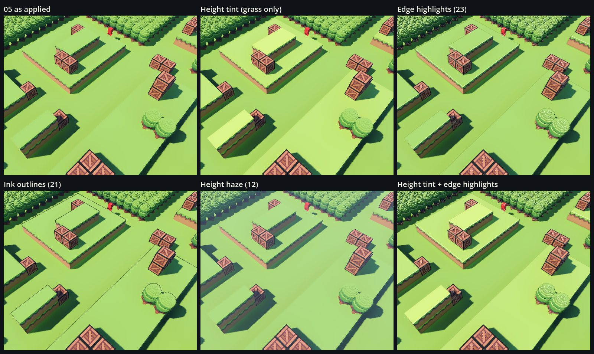
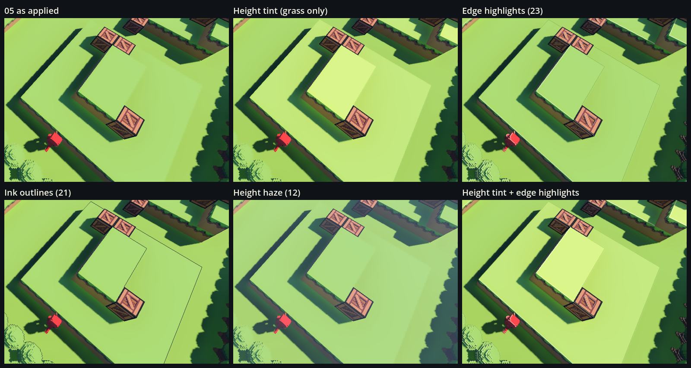

# Ledge readability: telling grass levels apart

**Status:** explored on 2026-10-01; nothing applied. The game uses style `05` (see [README.md](README.md)), and every picture here was rendered on top of it. This is where to pick the task up again: the problem, the options tried, how each looked, what wasn't tried, and how to apply the recommended fix.

## The problem

Where two heights of grass block meet, it's hard to see at a glance where the higher layer ends and the lower one begins.

Both levels' grass tops face straight up, so the sun lights them identically, and they're the same green. The only cues are:

- the dirt cliff face between them;
- the shadow the upper level casts.

When a ledge faces away from the camera, both are hidden, and all you see is green meeting green. The camera looks down at 55°, so for a 1 m step the strip of lower ground hidden behind the edge is about 0.7 m wide, and the darkening at the foot of the cliff is hidden too.

**Lighting alone can't fix this.** Style 05 already moved the sun off the camera's heading, which helped the cliff faces but can't make two upward-facing tops differ. Whatever fixes it has to mark the *level* or the *edge* itself.

## What was compared

Five fixes, each rendered on top of style 05, on BoundaryMap (the map every encounter uses). Each was seen from the in-game camera at its default zoom and pitch, in two views:

- **view 0:** the default heading;
- **view 1:** the camera turned around (yaw 225°).

Between them, both views show ledges facing the camera and facing away. HUD and tile highlights are hidden.

**The pictures** are kept in git:

- [ledges/sheet-view0.png](ledges/sheet-view0.png): the two-tier platform at the top centre and the long ridge on the left.
- [ledges/sheet-view1.png](ledges/sheet-view1.png): a two-level platform whose far edges face away from the camera, the hard case.

Each sheet is a 3×2 grid with the same crop in every panel:

| | | |
|---|---|---|
| 05 as applied | Height tint (grass only) | Edge highlights (23) |
| Ink outlines (21) | Height haze (12) | Height tint + edge highlights |

**To re-render** (about four minutes, in a window): from the repo root, run `Styles/harness/ledges/render.sh`. The full frames and the sheets go to `Styles/harness/out/ledges/`, which git ignores; pass `OUT_DIR=` to choose another folder.

- On 2026-10-01 a re-run reproduced both sheets byte for byte.
- The probe draws "the game as it currently looks", so after any visual change, treatment 0 and every panel change with it.
- The two camera views and the crops are fixed to BoundaryMap's current layout (`LedgeProbe.gd`'s `views`, `LedgeSheet.gd`'s rectangles). Edit those if the map changes.

## Results

| Fix | Result | Cost and catches |
|---|---|---|
| **Height tint, grass only** (a small shader written for this test) | **Clearest.** Each level is its own shade: floor, level 1 lighter, level 2 lighter still. A ledge facing away is as readable as one facing you. | Only a little extra arithmetic per pixel, and MSAA stays. Needs the block-material hookup from APPLYING.md, so worn blocks keep the tint. |
| **Edge highlights** (style 23) | A thin light lip on every ledge edge. It helps, but it's subtle. | A full-screen pass, and anti-aliasing must switch from MSAA to SMAA, which is a little softer. |
| **Ink outlines** (style 21) | A crisp dark line along every ledge. A strong cue. | It outlines everything (trees, crates, units), so the game looks more cartoon-like. Same SMAA switch. |
| **Height haze** (style 12) | Barely helps: fog changes too little over a 1 m step. It mostly makes the scene murky. | Not recommended. |
| **Height tint + edge highlights** | Best of all: colour separates the levels and a light line marks each edge. | Both of the above. |

The exact settings used:

- **Height tint:** [`harness/shaders/grass_height.gdshader`](harness/shaders/grass_height.gdshader), put on the `BrightGrass1` mesh only, at its defaults.
  - `floor_y` is 1.0.
  - Each level above the floor gets `value_per_level` = +12% brightness and `hue_per_level` = 6° toward yellow, on the green parts only (the top and its fringe; the dirt is untouched).
  - It uses Godot's standard lighting, so apart from the tint it looks exactly like 05.
- **Edge highlights:** style 23's outline settings: `line_tint_mix` 1, `line_darken` 0.5, `line_opacity` 0.7, `crease_width` 2, `highlight_opacity` 0.7, `highlight_min_up` 0.5, `crease_opacity` 0.4. MSAA off, SMAA on.
- **Ink outlines:** style 21's: `line_color` (0.10, 0.07, 0.14), `line_opacity` 0.9, `line_width` 1. MSAA off, SMAA on.
- **Height haze:** style 12's fog: exponential, `fog_density` 0.004, `fog_height` 1, `fog_height_density` 2.5, `fog_light_color` (0.64, 0.74, 0.87), `fog_aerial_perspective` 0.3, `fog_sun_scatter` 0.2, `fog_sky_affect` 0.

## Ideas not rendered

- **Ledge lines drawn from the grid:** thin lines placed only where the ground drops a level, worked out from the tile heights (`CombatGrid` knows them).
  - Precise, and it leaves crates, trees and units alone.
  - But it's more code, and the lines must be rebuilt whenever terrain breaks or wears.
- **Painting a lighter rim into the grass block's art:** every block is the same model, so it can't tell a ledge edge from the edge between two blocks at the same height. The whole floor would show a grid; style 19's grid lines do that on purpose.
- **Changing the sun again:** it only helps ledges on the shadowed side.

## Recommendation

**The height tint on its own.** It solves the hard case (a ledge facing away), costs almost nothing, keeps MSAA, and fits the voxel art.

- **The settings are a first guess.** Level 2 is already quite pale, so tone it down, perhaps a smaller brightness step and more of the hue shift.
- **Check it under the move-range highlights,** which cover the ground in play and were hidden in these renders.
- **If a crisp line is still wanted** at each edge, add the edge highlights afterwards. That means taking the SMAA switch.

## Applying the height tint later

The general recipe is [APPLYING.md](APPLYING.md) section 3 (block materials). What this one needs:

1. **The shader.** Copy `Styles/harness/shaders/grass_height.gdshader` into the project, e.g. as `vcom/Scripts/Rendering/GrassHeight.gdshader`.
2. **The hookup.** Give the `BrightGrass1` item's mesh a `ShaderMaterial` with that shader, `surface_set_material()` on the mesh itself, as `LedgeProbe._tint_grass()` does.
   - It must run **before `TerrainDestruction`'s `_ready`**: from a script on the `GridMap` node, or a node before `TerrainDestruction` in each map. `VoxelShape.read()` copies the block's material there, and worn blocks are drawn with that copy. Run later, and a grass block turns back to the old look the first time it's hit.
   - Make it `@tool` so the editor shows the tint too.
   - The mesh resource is shared, so `SceneryLibrary` (BoundaryMap's forest ring) gets the shader as well. That's harmless: the ring has no grass blocks (its ground is one plane, `Boundary/Ground`), and floor-level grass is level 0, which the tint leaves alone anyway.
3. **Every map that should show it:** BoundaryMap, CombatMap, and LineOfSightTest if the test lanes should match.
4. **Decisions to make, and things to check:**
   - **Debris:** `VoxelDebris` draws broken-off voxels with its own vertex-colour material, so lumps blasted off a raised block come out untinted, slightly darker than the block they left. Tint them by height too, or leave them.
   - **A falling block** (a stack whose support broke) changes tint a level at a time as it drops, because the level is read from the world height. It's brief; check whether it shows.
   - **Craters and worn faces** take their block's level, so a crater in a raised block keeps the block's tint.
   - **The level counts up from `floor_y` = 1,** the walkable floor in every current map. A map with a different floor height, or the multi-storey terrain on the todo list, needs another look.
5. **Verify** as APPLYING.md says: render before and after and compare, load headless with no new errors, and play-test, breaking a raised grass block.
6. **Record it** in REVERT.md's "Applied since" list and in CLAUDE.md's line about the applied style, so a revert removes it too.

## Files

| Path | What it is |
|---|---|
| `Styles/LEDGES.md` | This file. |
| `Styles/ledges/sheet-view0.png`, `sheet-view1.png` | The comparison sheets (kept in git). |
| `Styles/harness/shaders/grass_height.gdshader` | The height-tint shader. Its uniforms say what each does. |
| `Styles/harness/ledges/LedgeProbe.gd` | Renders BoundaryMap with treatment 0–5 from the two views. |
| `Styles/harness/ledges/LedgeSheet.gd` | Crops the frames into the two labelled sheets. |
| `Styles/harness/ledges/render.sh` | Runs both: all six treatments and the sheets. |
