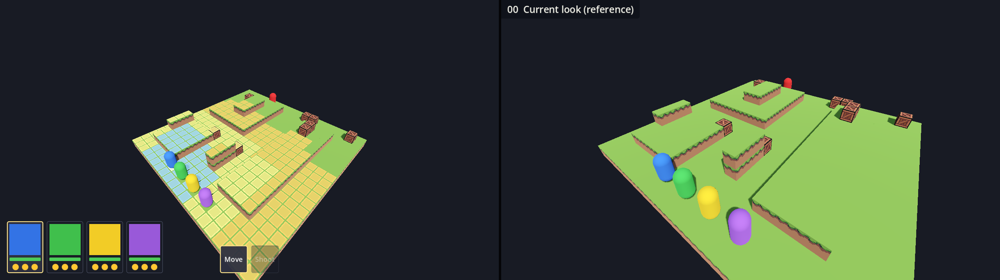
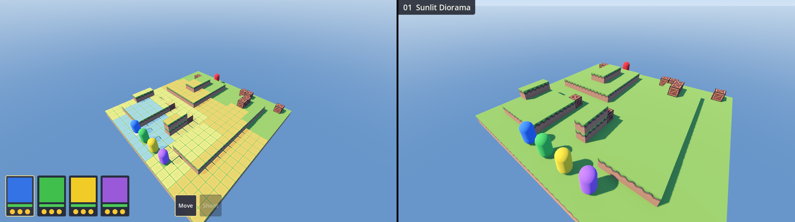
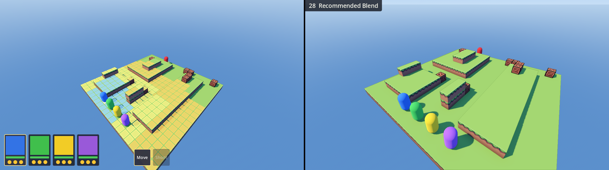

# Transcript: visual style exploration

A Claude Code session on 2026-09-26 (session `87b08547-8854-40f6-9a61-d090330480a4`, Claude Code 2.1.280, model Opus 5.5 `claude-opus-5-5`, working directory `vcom/`). In it Claude researched vibrant voxel looks for Godot, rendered 28 styles from the game, and documented the ones kept in this folder.

Generated from the session log.

- **Included:** the user's messages, Claude's replies, and every tool call. Expand a row to see the call's input and a trimmed copy of its result. Long inputs and outputs are cut, and full files live elsewhere in `Styles/`.
- **Left out:** the system context loaded into the session, Claude's private reasoning, harness reminders, and image data. Images Claude looked at are marked, not embedded.

The log was converted near the end of the last request, so the transcript stops shortly before the commit and push.

---


## User

We have a basic scene for my game. Now, I want to focus on improving the visual quality before adding to it. The goal is a vibrant art style for my voxel graphics. Research online suggestions for how to achieve this style in Godot, and apply at least 20 different variations to my project. Then, for each one, start the game and take a screenshot of the visuals, saving those screenshots in this project's root directory. Number the screenshots, and note down all of the different settings for each one, so that I can pick my favorite and you can then apply those settings to the project permanently. Ask any questions that you need to.

## Claude

I'll start by getting familiar with the project's current visual setup.

<details>
<summary><b>Bash</b> · List project files, todo, and pending diff</summary>


```bash
cd /c/Users/tandm/Documents/Projects/VoxelXCOM && ls -la && echo "---" && ls -la vcom && echo "---" && cat todo.txt 2>/dev/null | head -50 && echo "---" && git -C vcom diff project.godot
```

**Result**

```text
total 48
drwxr-xr-x 1 tandm 197609    0 Sep 23 11:07 .
drwxr-xr-x 1 tandm 197609    0 Sep 19 08:57 ..
drwxr-xr-x 1 tandm 197609    0 Sep 26 15:46 .git
-rw-r--r-- 1 tandm 197609 7650 Sep 22 22:31 CLAUDE.md
drwxr-xr-x 1 tandm 197609    0 Sep 20 11:08 MagicaVoxel
-rw-r--r-- 1 tandm 197609 6195 Sep 22 22:26 README.md
-rw-r--r-- 1 tandm 197609  787 Sep 26 12:17 todo.txt
drwxr-xr-x 1 tandm 197609    0 Sep 26 15:52 vcom
---
total 39
drwxr-xr-x 1 tandm 197609    0 Sep 26 15:52 .
drwxr-xr-x 1 tandm 197609    0 Sep 23 11:07 ..
-rw-r--r-- 1 tandm 197609   33 Sep 19 08:59 .editorconfig
-rw-r--r-- 1 tandm 197609   80 Sep 19 08:59 .gitattributes
-rw-r--r-- 1 tandm 197609   46 Sep 19 08:59 .gitignore
drwxr-xr-x 1 tandm 197609    0 Sep 26 15:52 .godot
drwxr-xr-x 1 tandm 197609    0 Sep 20 11:11 Addons
drwxr-xr-x 1 tandm 197609    0 Sep 24 15:41 Blocks
drwxr-xr-x 1 tandm 197609    0 Sep 22 19:53 Resources
drwxr-xr-x 1 tandm 197609    0 Sep 24 15:41 Scenes
drwxr-xr-x 1 tandm 197609    0 Sep 22 22:07 Scripts
-rw-r--r-- 1 tandm 197609 9550 Sep 26 15:52 project.godot
---
--TODO:
Improved color palette/vibrancy without being over-saturated
More easily readable terrain. Sharp green blocks are too over-saturated.
Destructible terrain: Scripted destruction, a few fallen blocks, total-shatter-destruction
Height/layers to terrain (Buildings with interiors)
Reactions/Overwatch

More terrain types: Ladders, fences, water, difficult ground, etc.
Impassible tiles
Action cam
Characters and animations

--LATER:
Grenades
Melee
Overworld and general game structure
… (trimmed; 64 lines in full)
```

</details>

<details>
<summary><b>Bash</b> · List Godot project files and show project settings</summary>


```bash
find . -type f -not -path "./.godot/*" -not -path "./.git/*" | head -100 && echo "---" && cat project.godot
```

**Result**

```text
./.editorconfig
./.gitattributes
./.gitignore
./Addons/MagicaVoxel_Importer_with_Extensions/.gitignore
./Addons/MagicaVoxel_Importer_with_Extensions/CHANGELOG.md
./Addons/MagicaVoxel_Importer_with_Extensions/Editor/vox_import_info_inspector_plugin.gd
./Addons/MagicaVoxel_Importer_with_Extensions/Editor/vox_import_info_inspector_plugin.gd.uid
./Addons/MagicaVoxel_Importer_with_Extensions/Editor/vox_import_info_panel.gd
./Addons/MagicaVoxel_Importer_with_Extensions/Editor/vox_import_info_panel.gd.uid
./Addons/MagicaVoxel_Importer_with_Extensions/framed_mesh_instance.png
./Addons/MagicaVoxel_Importer_with_Extensions/framed_mesh_instance.png.import
./Addons/MagicaVoxel_Importer_with_Extensions/icon.png
./Addons/MagicaVoxel_Importer_with_Extensions/icon.png.import
./Addons/MagicaVoxel_Importer_with_Extensions/LICENSE
./Addons/MagicaVoxel_Importer_with_Extensions/MeshGenerators/CulledMeshGenerator.gd
./Addons/MagicaVoxel_Importer_with_Extensions/MeshGenerators/CulledMeshGenerator.gd.uid
./Addons/MagicaVoxel_Importer_with_Extensions/MeshGenerators/Faces.gd
./Addons/MagicaVoxel_Importer_with_Extensions/MeshGenerators/Faces.gd.uid
./Addons/MagicaVoxel_Importer_with_Extensions/MeshGenerators/GreedyMeshGenerator.gd
./Addons/MagicaVoxel_Importer_with_Extensions/MeshGenerators/GreedyMeshGenerator.gd.uid
./Addons/MagicaVoxel_Importer_with_Extensions/plugin.cfg
./Addons/MagicaVoxel_Importer_with_Extensions/plugin.gd
./Addons/MagicaVoxel_Importer_with_Extensions/plugin.gd.uid
./Addons/MagicaVoxel_Importer_with_Extensions/README.md
./Addons/MagicaVoxel_Importer_with_Extensions/Runtime/framed_mesh_instance.gd
./Addons/MagicaVoxel_Importer_with_Extensions/Runtime/framed_mesh_instance.gd.uid
./Addons/MagicaVoxel_Importer_with_Extensions/vox-icon.vox
./Addons/MagicaVoxel_Importer_with_Extensions/vox-icon.vox.import
./Addons/MagicaVoxel_Importer_with_Extensions/VoxFormat/Model.gd
./Addons/MagicaVoxel_Importer_with_Extensions/VoxFormat/Model.gd.uid
./Addons/MagicaVoxel_Importer_with_Extensions/VoxFormat/VoxData.gd
./Addons/MagicaVoxel_Importer_with_Extensions/VoxFormat/VoxData.gd.uid
./Addons/MagicaVoxel_Importer_with_Extensions/VoxFormat/VoxFile.gd
./Addons/MagicaVoxel_Importer_with_Extensions/VoxFormat/VoxFile.gd.uid
./Addons/MagicaVoxel_Importer_with_Extensions/VoxFormat/VoxLayer.gd
./Addons/MagicaVoxel_Importer_with_Extensions/VoxFormat/VoxLayer.gd.uid
./Addons/MagicaVoxel_Importer_with_Extensions/VoxFormat/VoxMaterial.gd
./Addons/MagicaVoxel_Importer_with_Extensions/VoxFormat/VoxMaterial.gd.uid
./Addons/MagicaVoxel_Importer_with_Extensions/VoxFormat/VoxNode.gd
./Addons/MagicaVoxel_Importer_with_Extensions/VoxFormat/VoxNode.gd.uid
… (trimmed; 238 lines in full)
```

</details>

<details>
<summary><b>Bash</b> · Show the main combat scene file</summary>


```bash
cat Scenes/CombatMap.tscn | head -150 && echo "..." && wc -l Scenes/CombatMap.tscn Scenes/LineOfSightTest.tscn
```

**Result**

```text
[gd_scene format=3 uid="uid://uxu0hdwgskq0"]

[ext_resource type="MeshLibrary" uid="uid://cfo22uhygckag" path="res://Blocks/BlockLibrary.tres" id="1_ncftf"]
[ext_resource type="Script" uid="uid://cu8fl3v3n4717" path="res://Scripts/CameraRig.gd" id="2_camrig"]
[ext_resource type="Script" uid="uid://bci1llum4d32l" path="res://Scripts/Unit.gd" id="3_unit"]
[ext_resource type="Script" uid="uid://bpodq4lcjyqhx" path="res://Scripts/UI/SquadPanel.gd" id="4_squad"]
[ext_resource type="Script" uid="uid://fqwua6qridap" path="res://Scripts/PlayerSquad.gd" id="5_playersquad"]
[ext_resource type="Script" uid="uid://jy3wo1avod6c" path="res://Scripts/Combat/CombatGrid.gd" id="6_combatgrid"]
[ext_resource type="Script" uid="uid://3vbrdug4wc10" path="res://Scripts/Combat/TileHighlights.gd" id="7_highlights"]
[ext_resource type="Script" uid="uid://dxpofg7eiy3qu" path="res://Scripts/Actions/ActionController.gd" id="8_actions"]
[ext_resource type="Script" uid="uid://dnyie85ub5gul" path="res://Scripts/Actions/MoveAction.gd" id="9_move"]
[ext_resource type="Script" uid="uid://bchyfnuhaufwp" path="res://Scripts/Actions/ShootAction.gd" id="9_shoot"]
[ext_resource type="Script" uid="uid://cvit6k1o8lx0b" path="res://Scripts/UI/ActionBar.gd" id="10_actionbar"]
[ext_resource type="Script" uid="uid://buqpwf57t4422" path="res://Scripts/TurnManager.gd" id="11_turns"]
[ext_resource type="Script" uid="uid://dhl74vbchi0oa" path="res://Scripts/UI/TurnBanner.gd" id="12_banner"]
[ext_resource type="Script" uid="uid://0idaq4j8ybgl" path="res://Scripts/UI/EndTurnPrompt.gd" id="13_endturn"]
[ext_resource type="Script" uid="uid://bja5100blo2t5" path="res://Scripts/UI/ShotOverlay.gd" id="14_shotoverlay"]
[ext_resource type="Resource" path="res://Resources/Rifle.tres" id="15_rifle"]

[sub_resource type="ProceduralSkyMaterial" id="ProceduralSkyMaterial_sky"]

[sub_resource type="Sky" id="Sky_world"]
sky_material = SubResource("ProceduralSkyMaterial_sky")

[sub_resource type="Environment" id="Environment_world"]
background_mode = 1
background_color = Color(0.08, 0.09, 0.12, 1)
sky = SubResource("Sky_world")
ambient_light_source = 3
ambient_light_energy = 0.45
tonemap_mode = 2

[sub_resource type="CapsuleMesh" id="CapsuleMesh_unit"]
radial_segments = 16

[sub_resource type="StandardMaterial3D" id="Mat_player1"]
albedo_color = Color(0.2, 0.45, 0.9, 1)

[sub_resource type="StandardMaterial3D" id="Mat_player2"]
albedo_color = Color(0.25, 0.75, 0.3, 1)
… (trimmed; 154 lines in full)
```

</details>

<details>
<summary><b>Bash</b> · Show block library and voxel import settings</summary>


```bash
cat Blocks/BlockLibrary.tres | head -80 && echo "---" && cat Blocks/BrightGrass1.vox.import && echo "---" && cat Blocks/BrightCrate1.vox.import && echo "---" && ls -la ../MagicaVoxel
```

**Result**

```text
[gd_resource type="MeshLibrary" format=3 uid="uid://cfo22uhygckag"]

[ext_resource type="ArrayMesh" uid="uid://b32tejrd82h2l" path="res://Blocks/BrightGrass1.vox" id="1_80hp8"]
[ext_resource type="ArrayMesh" uid="uid://bii7daxc74i0m" path="res://Blocks/BrightCrate1.vox" id="2_53jod"]

[resource]
item/0/name = "BrightGrass1"
item/0/mesh = ExtResource("1_80hp8")
item/0/mesh_transform = Transform3D(1, 0, 0, 0, 1, 0, 0, 0, 1, 0, -0.5, 0)
item/0/mesh_cast_shadow = 1
item/0/shapes = []
item/0/navigation_mesh_transform = Transform3D(1, 0, 0, 0, 1, 0, 0, 0, 1, 0, 0, 0)
item/0/navigation_layers = 1
item/1/name = "BrightCrate1"
item/1/mesh = ExtResource("2_53jod")
item/1/mesh_transform = Transform3D(1, 0, 0, 0, 1, 0, 0, 0, 1, 0, -0.5, 1.3125)
item/1/mesh_cast_shadow = 1
item/1/shapes = []
item/1/navigation_mesh_transform = Transform3D(1, 0, 0, 0, 1, 0, 0, 0, 1, 0, 0, 0)
item/1/navigation_layers = 1
---
[remap]

importer="MagicaVoxel.With.Extensions.To.Mesh"
type="Mesh"
uid="uid://b32tejrd82h2l"
path="res://.godot/imported/BrightGrass1.vox-34e3e305adf285da4af3689b60faca3d.mesh"

[deps]

source_file="res://Blocks/BrightGrass1.vox"
dest_files=["res://.godot/imported/BrightGrass1.vox-34e3e305adf285da4af3689b60faca3d.mesh"]

[params]

Scale=0.0625
GreedyMeshGenerator=true
SnapToGround=false
FirstKeyframeOnly=true
---
… (trimmed; 66 lines in full)
```

</details>

<details>
<summary><b>Bash</b> · Show rest of combat scene and camera rig script</summary>


```bash
sed -n 150,209p Scenes/CombatMap.tscn && echo "---CAMERA---" && cat Scripts/CameraRig.gd
```

**Result**

```text
[node name="TurnManager" type="Node" parent="." unique_id=1000024]
script = ExtResource("11_turns")

[node name="HUD" type="CanvasLayer" parent="." unique_id=1000016]

[node name="ShotOverlay" type="Control" parent="HUD" unique_id=1000028]
layout_mode = 3
anchors_preset = 15
anchor_right = 1.0
anchor_bottom = 1.0
grow_horizontal = 2
grow_vertical = 2
script = ExtResource("14_shotoverlay")

[node name="SquadPanel" type="HBoxContainer" parent="HUD" unique_id=1000017]
anchors_preset = 2
anchor_top = 1.0
anchor_bottom = 1.0
offset_left = 16.0
offset_top = -16.0
offset_right = 16.0
offset_bottom = -16.0
grow_vertical = 0
theme_override_constants/separation = 8
script = ExtResource("4_squad")

[node name="ActionBar" type="HBoxContainer" parent="HUD" unique_id=1000023]
anchors_preset = 7
anchor_left = 0.5
anchor_top = 1.0
anchor_right = 0.5
anchor_bottom = 1.0
offset_top = -16.0
offset_bottom = -16.0
grow_horizontal = 2
grow_vertical = 0
theme_override_constants/separation = 8
script = ExtResource("10_actionbar")

[node name="EndTurnPrompt" type="VBoxContainer" parent="HUD" unique_id=1000025]
… (trimmed; 301 lines in full)
```

</details>

<details>
<summary><b>Bash</b> · Inspect voxel importer to see how materials are built</summary>


```bash
cd /c/Users/tandm/Documents/Projects/VoxelXCOM/vcom/Addons/MagicaVoxel_Importer_with_Extensions && cat VoxImporter/vox-importer-common.gd | head -150 && echo "---GREEDY---" && head -120 MeshGenerators/GreedyMeshGenerator.gd
```

**Result**

```text
const VoxFile = preload("../VoxFormat/VoxFile.gd");
const VoxData = preload("../VoxFormat/VoxData.gd");
const VoxNode = preload("../VoxFormat/VoxNode.gd");
const VoxMaterial = preload("../VoxFormat/VoxMaterial.gd");
const VoxLayer = preload("../VoxFormat/VoxLayer.gd");
const CulledMeshGenerator = preload("../MeshGenerators/CulledMeshGenerator.gd");
const GreedyMeshGenerator = preload("../MeshGenerators/GreedyMeshGenerator.gd");

const debug_file = false;
const debug_models = false;

var fileKeyframeIds = [];

func import(source_path, destination_path, options, _platforms, _gen_files):
	var scale = 0.1
	if options.Scale:
		scale = float(options.Scale)
	var greedy = true
	if options.has("GreedyMeshGenerator"):
		greedy = bool(options.GreedyMeshGenerator)
	var snaptoground = false
	if options.has("SnapToGround"):
		snaptoground = bool(options.SnapToGround)
	var mergeKeyframes = false
	if options.has("FirstKeyframeOnly"):
		mergeKeyframes = not bool(options.FirstKeyframeOnly)

	var read_result = read_vox_data(source_path)
	if read_result["error"] != OK:
		return read_result["error"]

	var vox = read_result["vox"] as VoxData
	var version = int(read_result["version"])
	print('Importing: ', source_path, ' (scale: ', scale, ', file version: ', version, ', greedy mesh: ', greedy, ', snap to ground: ', snaptoground, ')');

	var voxel_data = unify_voxels(vox, mergeKeyframes);
	var meshes = []
	for keyframeVoxels in voxel_data:
		if greedy:
			meshes.append(GreedyMeshGenerator.new().generate(vox, voxel_data[keyframeVoxels], scale, snaptoground))
… (trimmed; 270 lines in full)
```

</details>

<details>
<summary><b>Bash</b> · Read remaining greedy mesher and mesh importer code</summary>


```bash
sed -n 120,260p MeshGenerators/GreedyMeshGenerator.gd && echo "---MESH IMPORTER---" && cat VoxImporter/vox-importer-mesh.gd
```

**Result**

```text
for o in face_orientations:
		generate_geometry_for_orientation(voxel_data, o, scale, snaptoground)

	# Finish the mesh and material and return
	var material = StandardMaterial3D.new()
	material.vertex_color_is_srgb = true
	material.vertex_color_use_as_albedo = true
	material.roughness = 1
	st.set_material(material)
	return st.commit()

# Generates all of the geometry for a given face orientation
func generate_geometry_for_orientation(voxel_data :Dictionary, o :int, scale :float, snaptoground :bool) -> void:
	var da :int = depth_axis[o]
	var faces_by_slice := {}
	# 방향마다 복셀을 한 번만 훑어 보이는 면을 깊이별로 분류합니다.
	for v in voxel_data:
		if voxel_data.has(v + face_checks[o]):
			continue
		var slice = int(v[da])
		if not faces_by_slice.has(slice):
			faces_by_slice[slice] = {}
		faces_by_slice[slice][v] = voxel_data[v]

	var slices = faces_by_slice.keys()
	slices.sort()
	for slice in slices:
		generate_geometry(faces_by_slice[slice], o, slice, scale, snaptoground)

# Generates geometry for the given orientation for the set of faces
func generate_geometry(faces :Dictionary, o :int, _slice :float, scale :float, snaptoground :bool) -> void:
	var wa :int = width_axis[o]
	var ha :int = height_axis[o]
	var face_positions = faces.keys()
	# 빈 공간 전체 대신 실제 면 좌표만 행 순서로 순회해 같은 Greedy 병합 결과를 만듭니다.
	face_positions.sort_custom(func(a: Vector3, b: Vector3) -> bool:
		if a[ha] == b[ha]:
			return a[wa] < b[wa]
		return a[ha] < b[ha]
	)
… (trimmed; 166 lines in full)
```

</details>

Now let me see the other scripts that affect visuals, and render the current state as a baseline.

<details>
<summary><b>Bash</b> · Inspect highlight shader, unit visuals, and test scene lighting</summary>


```bash
cd /c/Users/tandm/Documents/Projects/VoxelXCOM/vcom && cat Scripts/Combat/TileHighlight.gdshader && echo "---" && sed -n 1,80p Scripts/Combat/TileHighlights.gd && echo "---UNIT---" && grep -n "Mesh\|material\|Material\|color\|Color" Scripts/Unit.gd | head -40 && echo "---LOS env---" && grep -n -A12 "Environment\|DirectionalLight" Scenes/LineOfSightTest.tscn | head -60
```

**Result**

```text
// Flat tile marker: a translucent fill with a solid border, tinted by the
// MultiMesh instance colour. INSTANCE_CUSTOM.r is the fill's opacity.
shader_type spatial;
render_mode unshaded, cull_disabled, depth_draw_never;

uniform float border_alpha : hint_range(0.0, 1.0) = 0.95;
// Border thickness as a fraction of the square's width.
uniform float border_width : hint_range(0.0, 0.5) = 0.09;

varying float fill_alpha;

void vertex() {
	fill_alpha = INSTANCE_CUSTOM.r;
}

void fragment() {
	vec2 from_center = abs(UV - 0.5) * 2.0;
	float edge = max(from_center.x, from_center.y);
	float border = step(1.0 - border_width * 2.0, edge);
	ALBEDO = COLOR.rgb;
	ALPHA = COLOR.a * mix(fill_alpha, border_alpha, border);
}
---
## Coloured squares laid on top of tiles, Final Fantasy Tactics style.
##
## Callers own named layers, so the move range and the selected-unit marker
## can each be replaced without touching the other. The layer set most
## recently draws on top.
class_name TileHighlights
extends MultiMeshInstance3D

## Width of a square, as a fraction of a tile.
const SQUARE_SIZE := 0.9
## Height above the floor, to keep the square from z-fighting with it.
const LIFT := 0.02
## Opacity of a square's fill; its border is always near-solid.
const DEFAULT_FILL := 0.55

@export var grid_path: NodePath = ^"../CombatGrid"

… (trimmed; 142 lines in full)
```

</details>

<details>
<summary><b>Bash</b> · Render baseline frames of the current game</summary>


```bash
G="/c/Program Files/Godot/Godot_v4.7-stable_win64_console.exe" && ls -la "$G" && SP="/c/Users/tandm/AppData/Local/Temp/claude/C--Users-tandm-Documents-Projects-VoxelXCOM-vcom/87b08547-8854-40f6-9a61-d090330480a4/scratchpad" && mkdir -p "$SP/base" && timeout 120 "$G" --path . --quit-after 90 --write-movie "$SP/base/f.png" --resolution 1280x720 2>&1 | tail -20 && ls "$SP/base" | tail -3
```

**Result**

```text
-rwxr-xr-x 1 tandm 197609 198152 Jun 17 19:47 /c/Program Files/Godot/Godot_v4.7-stable_win64_console.exe
Godot Engine v4.7.stable.official.5b4e0cb0f - https://godotengine.org
D3D12 12_0 - Forward+ - Using Device #0: NVIDIA - NVIDIA GeForce RTX 3060 Laptop GPU

Movie Maker mode enabled, recording movie in 1152×648 @ 60 FPS...
--------------------------------------------------------------------------------
Done recording movie at path: C:/Users/tandm/AppData/Local/Temp/claude/C--Users-tandm-Documents-Projects-VoxelXCOM-vcom/87b08547-8854-40f6-9a61-d090330480a4/scratchpad/base/f.png
90 frames at 60 FPS (movie length: 00:00:01:30), recorded in 00:00:05 (20% of real-time speed).
CPU render time: 0.04 seconds (average: 0.40 ms/frame)
GPU render time: 0.16 seconds (average: 1.78 ms/frame)
Encoding time: 2.29 seconds (average: 25.45 ms/frame)
--------------------------------------------------------------------------------
f00000087.png
f00000088.png
f00000089.png
```

</details>

<details>
<summary><b>Read</b> · Read C:\Users\tandm\AppData\Local\Temp\claude\C--Users-tandm-Documents-Projects-VoxelXCOM-vcom\87b08547-8854-40f6-9a61-d090330480a4\scratchpad\base\f00000089.png</summary>


**Result**

*(1 image shown to Claude; image data omitted)*

</details>

Baseline rendered: dark void background, flat ambient, saturated green, and the move-range overlay covers most of the terrain. Next I'll research techniques online.

<details>
<summary><b>ToolSearch</b> · Load tools: select:WebSearch,WebFetch</summary>


**Result**

*(empty)*

</details>

<details>
<summary><b>WebSearch</b> · Web search: Godot 4 vibrant stylized voxel game lighting environment settings tonemap glow SSAO</summary>


**Result**

```text
Web search results for query: "Godot 4 vibrant stylized voxel game lighting environment settings tonemap glow SSAO"

Links: [{"title":"Environment and Light in Godot: Setting Up For Photorealistic 3D Graphics | hexaquo","url":"https://hexaquo.at/pages/environment-and-light-in-godot-setting-up-for-photorealistic-3d-graphics/"},{"title":"GitHub - viktor-ferenczi/godot-voxel: Voxel rendering for Godot 4.3 (GPU, shader, DDA algorithm) · GitHub","url":"https://github.com/viktor-ferenczi/godot-voxel"},{"title":"Environment \"Glow\" should be put before the \"Tonemap\" · Issue #101497 · godotengine/godot","url":"https://github.com/godotengine/godot/issues/101497"},{"title":"Voxel | Godot Asset Library","url":"https://godotassetlibrary.com/asset/lmbY0A/voxel"},{"title":"[Tutorial] Realistic lighting in godot 4 - Tutorials - Godot Forum","url":"https://forum.godotengine.org/t/tutorial-realistic-lighting-in-godot-4/87219"},{"title":"Godot 4 Environment Lighting: WorldEnvironment, Sky Shaders, and PBR Workflows","url":"https://bitsoulhosting.com/marketplace/blog/godot-4-environment-lighting-worldenvironment-sky-shaders-pbr"},{"title":"Godot 3D Game Development: Complete Tutorial 2025","url":"https://generalistprogrammer.com/tutorials/godot-3d-game-development-complete-tutorial"},{"title":"Environment and post-processing — Godot Engine (4.4) documentation in English","url":"https://docs.godotengine.org/en/4.4/tutorials/3d/environment_and_post_processing.html"},{"title":"itch.io","url":"https://itch.io/post/7023450"}]

I found several relevant results about Godot 4 environment settings for stylized voxel games with lighting effects. Here's what I found:

## Key Environment Settings

The Environment resource controls six major subsystems: background, ambient light, reflected sky, fog, glow, and tone mapping.

## Tone Mapping

The recommended tone mapper is ACES, which provides a filmic response and is an industry standard.

## Glow/Bloom

You can activate glow in the environment and set bloom to a value above 0.0 to achieve a glow effect. The default blend mode of "softlight" is quite subtle; if you want stronger light bleeding, consider switching to "screen" with bloom at 0.1 for nice light bleeding effects.

## SSAO (Screen Space Ambient Occlusion)

Godot's environment offers Screen Space Ambient Occlusion (SSAO) for adding shadows into highly occluded areas. In practice, SSAO with a big radius in the environment helps to add more detail.

## Stylized Lighting Tips

For stylized games, you may want to try mixing some blue or purple into the ambient light as a contrast to a slightly yellow direct light.

## Post-Processing Note

The glow effect should be applied before the tone mapping, as any processing that can generate values higher than 1.0 needs to be put in pre-formation (pre-tonemapping).


REMINDER: You MUST include the sources above in your response to the user using markdown hyperlinks.
```

</details>

<details>
<summary><b>WebSearch</b> · Web search: how to make voxel art look good in game engine ambient occlusion colored shadows MagicaVoxel look</summary>


**Result**

```text
Web search results for query: "how to make voxel art look good in game engine ambient occlusion colored shadows MagicaVoxel look"

Links: [{"title":"Intensive Exposure: Building UE4 Game with Voxels","url":"https://80.lv/articles/intensive-exposure-building-ue4-game-with-voxels"},{"title":"I need advice on how to make voxel characters look good - GameDev.net Forums","url":"https://gamedev.net/forums/topic/714173-i-need-advice-on-how-to-make-voxel-characters-look-good/"},{"title":"Voxel","url":"https://en.wikipedia.org/wiki/Voxel"},{"title":"Voxel Engine - Part 3 - Ambient Occlusion & Colors - Ricardo Antunes","url":"https://riscadoa.com/game-dev/voxel-engine-3/"},{"title":"MagicaVoxel - 2D and 3D Art | GameDev.net Forums - GameDev.net","url":"https://gamedev.net/forums/topic/713213-magicavoxel/5451891/"},{"title":"Smooth Voxels - SmoothDev Projects","url":"https://www.smoothdev.nl/smoothvoxels/"},{"title":"itch.io","url":"https://itch.io/post/11145251"},{"title":"itch.io is community of indie game creators and players","url":"https://itch.io/devlog/688457/smooth-shaded-voxel-ambient-occlusion.amp"},{"title":"Follow Steven Abeyta","url":"https://stevenabeyta.itch.io"}]

Based on the search results, here are some key techniques for making voxel art look good in game engines using ambient occlusion, colored shadows, and MagicaVoxel:

## Lighting and Ambient Occlusion

Use ambient occlusion and lookup tables in postprocessing to enhance your voxel visuals. Ambient occlusion adds extra definition to voxels when combined with global illumination.

When implementing ambient occlusion, it's calculated by shooting rays out of each vertex to determine distance to other parts of the model - when other parts are near, the vertex is darkened, providing nice fading shadows and greatly improving realism. Ambient Occlusion has parameters including color (default is black, but you can use other colors for different effects).

## Lighting Strategy

Use dynamic lighting rather than lightmaps, and use one Movable Sky Light that emits from a custom cubemap, with the rest done in postprocessing. For shadows with MagicaVoxel models, you could use soft blob shadows per character, with ambient occlusion refining and adding detail.

## Camera and Style Considerations

When working with voxels, think about camera positioning – voxels look better from some angles than from others. Additionally, you can modify the parameters and colors of lighting to make scenes feel unique and evoke different emotions.


REMINDER: You MUST include the sources above in your response to the user using markdown hyperlinks.
```

</details>

<details>
<summary><b>WebSearch</b> · Web search: Godot 4 AgX tonemapper vs Filmic ACES saturation stylized games</summary>


**Result**

```text
Web search results for query: "Godot 4 AgX tonemapper vs Filmic ACES saturation stylized games"

Links: [{"title":"Environment and Light in Godot: Setting Up For Photorealistic 3D Graphics | hexaquo","url":"https://hexaquo.at/pages/environment-and-light-in-godot-setting-up-for-photorealistic-3d-graphics/"},{"title":"Add AgX tonemapper option to Environment by Calinou · Pull Request #87260 · godotengine/godot","url":"https://github.com/godotengine/godot/pull/87260"},{"title":"5 key features for CG artists in Godot 4.4 | CG Channel","url":"https://www.cgchannel.com/2025/03/5-key-features-for-cg-artists-in-godot-4-4/"},{"title":"Tonemap | Glossary | GDQuest","url":"https://school.gdquest.com/glossary/tonemap"},{"title":"Tonemap | Glossary | GDQuest Library","url":"https://www.gdquest.com/library/glossary/tonemap/"},{"title":"Add TonyMcMapface as a tonemapping mode (or allow using custom LUTs for tonemapping) · Issue #7263 · godotengine/godot-proposals","url":"https://github.com/godotengine/godot-proposals/issues/7263"},{"title":"Make Filmic tonemapper desaturate bright colors (like ACES) · Issue #6096 · godotengine/godot-proposals","url":"https://github.com/godotengine/godot-proposals/issues/6096"},{"title":"Improve AgX tonemapping curve. by allenwp · Pull Request #102435 · godotengine/godot","url":"https://github.com/godotengine/godot/pull/102435"},{"title":"Environment ToneMapper","url":"https://github.com/HaxeGodot/godot/blob/master/godot/Environment_ToneMapper.hx"},{"title":"github.com","url":"https://github.com/godotengine/godot/pull/52476"}]

Based on the search results, here's what I found about the differences between these tonemappers in Godot 4, particularly regarding saturation for stylized games:

## AgX vs Filmic/ACES Saturation Characteristics

Both ACES and AgX desaturate bright values in order to communicate brightness, but AgX is better at preserving hues and maintaining detail and contrast. Therefore, AgX will usually be the best choice for high-realism graphics.

However, there's an important caveat for stylized games: By default, AgX desaturates everything quite drastically, perhaps more than you'd like. To work around this, you can increase the contrast and saturation in the "adjustments" tab of the environment.

## Filmic vs ACES Comparison

With Filmic, colors are a bit more vibrant. In contrast, with ACES, the brighter the pixels are, the less vibrant they become. This means Filmic maintains more saturation in bright areas compared to ACES.

## For Stylized Games Specifically

For stylized aesthetic goals, for stylized games, you may want to try mixing some blue or purple into the ambient light as a contrast to a slightly yellow direct light.

If you're aiming for more saturated colors in stylized games, Filmic would preserve more saturation than either ACES or the default AgX settings, though AgX's saturation can be adjusted through environment controls.


REMINDER: You MUST include the sources above in your response to the user using markdown hyperlinks.
```

</details>

<details>
<summary><b>WebFetch</b> · Fetch https://hexaquo.at/pages/environment-and-light-in-godot-setting-up-for-photorealistic-3d-graphics/</summary>


Prompt: List every concrete Godot Environment/light setting recommended in this article with the specific values (tonemap mode, exposure, white, SSAO radius/intensity, SSIL, SDFGI, glow levels/blend/bloom/intensity, fog, adjustments, sky, ambient light source/energy, directional light energy/color, shadow settings). Also list any advice specifically for stylized (non-photorealistic) games.

**Result**

```text
# Godot Photorealistic Environment Settings

## Specific Recommended Values

**Tonemap & Camera:**
- Mode: AgX
- Contrast: 1.3
- Saturation: 1.3

**Sky:**
- Type: PhysicalSkyMaterial
- Energy: 1.5
- Ground color: white (optional, for demo scenes)

**Directional Light (Sun):**
- Energy: 3.0 (cloudless noon)
- Shadows: enabled
- Color: slight yellow tint optional

**Ambient Light:**
- Source: Background
- Sky contribution: 1.0 (adjustable for custom color mixing)

**Screen Space Ambient Occlusion (SSAO):**
- Intensity: 3.0
- Light Affect: 0.0 (or 1.0 for full-scene plasticity)
- AO Channel Affect: 0.0 (or 1.0 for full-scene effect)

**Screen Space Indirect Light (SSIL):**
- Enabled for color-accurate shadows from nearby geometry

**SDFGI:**
- Disabled in recommended setup (performance-heavy)

**Glow/Bloom:**
- Blend mode: "softlight" (subtle) or "screen" (stronger)
- Bloom: 0.1

**Fog:**
- Sky Affect: 0.0 (preserves sky)
… (trimmed; 47 lines in full)
```

</details>

<details>
<summary><b>WebFetch</b> · Fetch https://riscadoa.com/game-dev/voxel-engine-3/</summary>


Prompt: Summarize the techniques used to make voxels look good: ambient occlusion approach (per-vertex AO formula), color variation, face shading, any post processing. Include concrete numbers/formulas.

**Result**

```text
# Voxel Rendering Techniques Summary

Based on the article, Ricardo Antunes employed the following approaches to enhance voxel appearance:

**Ambient Occlusion:** The author implemented "screen space ambient occlusion which enhanced the look of the final rendering result." However, the article provides no specific per-vertex formulas or technical details about the SSAO implementation.

**Color Application:** The developer experimented with "adding colors to the voxels," demonstrating three visual examples. No color variation formulas or algorithms are described in the content.

**Notable Limitation:** The article doesn't elaborate on face shading techniques or post-processing methods beyond the SSAO mentioned. Instead of detailing existing approaches, the author focused on future improvements, noting that he planned to "implement a basic voxel raytracer/pathtracer which should make this easier" and transition from OpenGL to Vulkan for better performance.

The post emphasizes performance optimization over specific rendering technique documentation—the engine was "very CPU intensive," prompting the shift toward GPU acceleration rather than describing the mathematical foundations of the current visual enhancements.
```

</details>

<details>
<summary><b>WebSearch</b> · Web search: Godot 4 outline post process shader depth normal edge detection spatial shader fullscreen quad</summary>


**Result**

```text
Web search results for query: "Godot 4 outline post process shader depth normal edge detection spatial shader fullscreen quad"

Links: [{"title":"Post-Process Outline (Depth/Normal) - Godot Shaders","url":"https://godotshaders.com/shader/post-process-outline-depth-normal/"},{"title":"Sobel Outline Postprocess Shader - Godot Shaders","url":"https://godotshaders.com/shader/sobel-outline-shader/"},{"title":"High Quality Post Process Outline - Godot Shaders","url":"https://godotshaders.com/shader/high-quality-post-process-outline/"},{"title":"Thick 3D Screen Space – Depth – & Normal – Based Outline Shader. - Godot Shaders","url":"https://godotshaders.com/shader/thick-3d-screen-space-depth-normal-based-outline-shader/"},{"title":"3D Outlines in Godot","url":"https://jazzfool.github.io/post/godot-outlines/"},{"title":"Godot Post-Processing Outline Shader","url":"https://blog.vortexbasis.com/godot-post-processing-outline-shader"},{"title":"Godot Post Process Outlines | Godot Asset Library","url":"https://godotassetlibrary.com/asset/z2TUr9/godot-post-process-outlines"},{"title":"Godot Shader Project","url":"https://nuzcraft.substack.com/p/godot-shader-project"},{"title":"A downloadable asset pack","url":"https://pixelagegames.itch.io/godot-compositor-3d-pixel-art"}]

Based on the search results, here's what I found about Godot 4 outline post-processing shaders with depth and normal edge detection:

## Overview

The shader only works in Godot 4.x, as the normal buffer used by the shader is not available in 3.x versions of the engine. To set up the shader, apply it to a screen-space quad mesh in the scene.

## Edge Detection Methods

There are several approaches to creating outlines in Godot 4:

1. **Depth and Normal Detection**: For each pixel and a set of neighboring pixels, the depth value is sampled from the depth buffer and if the difference exceeds a certain threshold, the outline color is applied. The same process is done for normals since at the corner of a cube, pixels will all be similar distances from the camera but the direction they face will be different.

2. **Sobel Edge Detection**: A method uses Sobel Edge detection on a normal and depth texture.

## Key Parameters

Parameters include Depth Threshold (for detecting edges via depth texture sampling), Normal Threshold (for detecting edges via normal texture sampling), and Depth Normal Threshold Scale (modulation of the depth detection based on the normal angle to the camera).

## Resources

You can find ready-to-use implementations on GodotShaders.com, including the "Post-Process Outline (Depth/Normal)" shader and the "Sobel Outline Postprocess Shader," both of which are designed for use with fullscreen quads in Godot 4.


REMINDER: You MUST include the sources above in your response to the user using markdown hyperlinks.
```

</details>

<details>
<summary><b>WebFetch</b> · Fetch https://godotshaders.com/shader/post-process-outline-depth-normal/</summary>


Prompt: Give me the complete shader code verbatim, and the setup instructions (quad mesh size, flip faces, extra cull margin, render priority etc.).

**Result**

````text
# Post-Process Outline Shader - Godot 4.x

## Complete Shader Code

```glsl
// Ported from https://roystan.net/articles/outline-shader/ by ERInteractive
shader_type spatial;
render_mode unshaded;

uniform float depth_threshold : hint_range(0.0,10.0,0.01) = 0.2f;
uniform float depth_normal_threshold_scale : hint_range(0.0,10.0,0.01) = 0.2f;
uniform float normal_threshold : hint_range(0.0,10.0,0.01) = 0.2f;
uniform vec4 edge_color: source_color;


uniform sampler2D SCREEN_TEXTURE : hint_screen_texture, filter_linear_mipmap;
uniform sampler2D NORMAL_TEXUTRE : hint_normal_roughness_texture, filter_linear_mipmap;
uniform sampler2D DEPTH_TEXUTRE : hint_depth_texture, filter_linear_mipmap;

uniform float scale = 1.0;
void vertex()
{
	POSITION = vec4(VERTEX.xy, 1.0, 1.0);
}

void fragment() {
	float half_scale_floor = floor(scale * 0.5);
	float half_scale_ceil = ceil(scale * 0.5);
	
	vec2 SCREEN_PIXEL_SIZE = 1.0 / VIEWPORT_SIZE;
	
	// Flip UV on Y axis
	vec2 uv = UV * vec2(1.0,-1.0);
	
	vec2 bottom_left_UV = uv + vec2(SCREEN_PIXEL_SIZE.x, SCREEN_PIXEL_SIZE.y) * half_scale_floor;
	vec2 top_right_UV =  uv + vec2(SCREEN_PIXEL_SIZE.x, SCREEN_PIXEL_SIZE.y) * half_scale_ceil;  
	vec2 bottom_right_UV =  uv + vec2(SCREEN_PIXEL_SIZE.x * half_scale_ceil, -SCREEN_PIXEL_SIZE.y * half_scale_floor);
	vec2 top_left_UV =  uv + vec2(-SCREEN_PIXEL_SIZE.x * half_scale_floor, SCREEN_PIXEL_SIZE.y * half_scale_ceil);
	
	// Sample Normals
… (trimmed; 88 lines in full)
````

</details>

<details>
<summary><b>WebFetch</b> · Fetch https://jazzfool.github.io/post/godot-outlines/</summary>


Prompt: Summarize the outline technique, include key shader code fragments verbatim (depth linearization, normal sampling in Godot 4, the edge metric), and pitfalls noted (e.g. transparency, hint_normal_roughness_texture only in Forward+).

**Result**

````text
# 3D Outlines in Godot - Summary

## Technique Overview

The approach uses dual `SubViewport` instances: one renders the game scene normally, while a second isolates depth information for outlined objects only. Edge detection on this depth buffer identifies silhouettes, which are then composited as colored outlines over the main scene.

## Key Shader Components

**Depth Visualization** (vertex stage):
```glsl
vec4 ndc = PROJECTION_MATRIX * vec4(VERTEX, 1.0);
ndc.xyz /= ndc.w;
depth = ndc.z;
```

**Edge Detection** (post-process):
```glsl
return (abs(tex(uv, ts, -1, -1) - tex(uv, ts, 1, 1)) + 
        abs(tex(uv, ts, 1, -1) - tex(uv, ts, -1, 1)));
```

This samples four diagonal texels to compute depth discontinuities with minimal overhead.

## Notable Limitations

The author identifies three significant shortcomings:

1. **Memory inefficiency**: The depth viewport uses R8G8B8A8 format instead of a dedicated depth-only mode
2. **GPU underutilization**: Hardware depth writing exists but remains inaccessible; custom shaders duplicate this work unnecessarily
3. **Thickness constraints**: Large outline values degrade visually since edge detection only examines four adjacent pixels rather than performing radius-based sampling
````

</details>

<details>
<summary><b>WebSearch</b> · Web search: stylized voxel game art direction tips readability tactics game lighting &quot;warm light&quot; &quot;cool shadows&quot;</summary>


**Result**

```text
Web search results for query: "stylized voxel game art direction tips readability tactics game lighting "warm light" "cool shadows""

Links: [{"title":"Lighting as a Design Principle in Game Development","url":"https://gamedevnewsletter.substack.com/p/lighting-as-a-design-principle-in-game-development"},{"title":"7 Best Indie Game Art Styles: From Pixel Art to Voxel","url":"https://rocketbrush.com/blog/mastering-indie-game-art-exploring-styles-and-techniques-for-impactful-visuals"},{"title":"Exploring Lighting and Mood in Game Art","url":"https://www.ixiegaming.com/blog/exploring-lighting-and-mood-in-game-art/"},{"title":"Game Lighting Design: Complete Visual Guide 2025","url":"https://generalistprogrammer.com/tutorials/game-lighting-design-complete-visual-guide-2025"},{"title":"Voxel Art: Reducing the Greebles","url":"https://www.gamedeveloper.com/design/voxel-art-reducing-the-greebles"},{"title":"3D Art Styles for Games: Most Popular Types Overview","url":"https://rocketbrush.com/blog/exploring-3d-art-styles-for-games-a-guide-to-the-most-popular-types"},{"title":"Game Lighting Design - Creating Atmosphere and Mood in Your Games","url":"https://www.gamineai.com/blog/game-lighting-design-creating-atmosphere-and-mood-in-your-games"},{"title":"Voxelart Styles in Video Games","url":"https://www.gamedeveloper.com/art/voxelart-styles-in-video-games"},{"title":"21 Game Art Styles in Video Games: Types & Examples","url":"https://pixune.com/blog/game-art-styles/"}]

I found relevant information about stylized voxel game art direction, lighting techniques, and readability tactics. Here are the key findings:

## Color Temperature and Lighting Psychology

Warm light (oranges/yellows) suggests comfort and safety; cool light (blues/greens) can suggest unease, sterility, or mystery. Color temperature contrast is one of the most powerful lighting techniques, with natural outdoor lighting featuring warm sunlight with cool blue sky fill light.

## Stylized Lighting for Readability

Stylized titles like Hades or Overwatch rely on exaggerated, purposeful lighting to create strong mood and readability. Stylized 3D art moves away from realistic reproduction and focuses on artistic control, usually relying on deliberate shape language, simplified forms, selective detail and color choices that help assets feel distinctive and readable.

## Voxel-Specific Art Techniques

Leverage the blocky nature of voxels to create stylized, easily recognizable characters and environments. Make sure your color gradient on shadows is obvious—make it contrast both in hue and brightness because it's flat shaded. Flat shaded voxel art benefits from being able to show all the colors being used due to minimal presence of shadows, therefore the style benefits from vibrant colors.

## Lighting for Gameplay Support

Key elements include key light (your main light direction), fill light (soft, low-intensity light that keeps shadows from going completely black), and rim light (a bright edge that separates characters from the background). Give interactable objects a slightly stronger or warmer light.


REMINDER: You MUST include the sources above in your response to the user using markdown hyperlinks.
```

</details>

<details>
<summary><b>WebFetch</b> · Fetch https://www.gamedeveloper.com/art/voxelart-styles-in-video-games</summary>


Prompt: Summarize the distinct voxel art styles described (with example games), and any concrete rendering/lighting/color techniques each style relies on (flat shading, AO, outlines, gradients, lighting, post-processing, palettes).

**Result**

```text
# Voxel Art Styles in Video Games: Summary

Based on Zach Soares' article, here are the four foundational voxel art styles:

## 1. **Vector Voxel Art**
- **Example:** Crossy Roads
- **Characteristics:** "uses only 90 degree bends when representing curves"
- **Techniques:** Clean, abstract aesthetic optimized for low-performance devices like smartphones
- **Rendering:** Minimalist approach prioritizing clarity at multiple scales

## 2. **Pixelated Voxels (Flat Shaded)**
- **Examples:** Fugl, Voxelnauts
- **Characteristics:** Attempts to represent pixel art in three-dimensional space
- **Techniques:** Flat shading is essential; "vibrant colors" benefit from minimal shadows. Raytracing used to avoid hard shadows that would damage the style
- **Color:** High saturation palettes visible due to absence of shadow gradients

## 3. **Blocky Voxels**
- **Examples:** Minecraft, Hytale
- **Characteristics:** Cube-based worlds and characters; technically forgiving but skill-intensive
- **Techniques:** Often uses textures on polygonal cubes rather than pure voxel editors
- **Note:** May be polygon-based but derived from voxel art aesthetics

## 4. **Greeble Voxels**
- **Examples:** Command and Conquer: Tiberian Sun, Critical Annihilation
- **Characteristics:** Embraces curved forms; highest technical complexity
- **Techniques:** SSAO (Screen Space Ambient Occlusion) emphasizes jagged geometry; PBR (Physical Based Rendering) for realistic materials. Manual shading avoided in favor of engine-based lighting
- **Aesthetic:** Gritty, realistic rendering despite voxel construction; highest polycount demands
```

</details>

<details>
<summary><b>WebFetch</b> · Fetch https://www.gamedeveloper.com/design/voxel-art-reducing-the-greebles</summary>


Prompt: Summarize the concrete advice about voxel art readability, colors, palettes, shading and lighting. Quote key recommendations.

**Result**

```text
# Voxel Art: Concrete Advice on Readability and Aesthetics

## Color & Palette Guidelines

The author emphasizes restraint in color selection. Use **"1 color as the base value for a property and a second color (normally lighter) as the highlight"** to create definition while maintaining clarity.

Avoid excessive noise: **"Noise will only cloud the design you intend to make. You have no direct control over the result."** This undermines polish and intentionality.

## Shading & Lighting Strategy

Manual shading proves effective—color voxels directly rather than relying on engine rendering. When applying shadows, **"make sure your color gradient on shadows is obvious! Don't be shy, make it contrast both in hue and brightness."**

Recognition of a key limitation: shadows obscure detail work. The author discovered that **"shadows would hide a lot of details I put into the color work,"** necessitating reduced color palettes and focus on visible design.

## Reducing Visual Complexity ("Greebles")

Eliminate stepping in designs—those 45-degree diagonal voxel arrangements create visual clutter. Favor flat, clean surfaces and use rigging/animation to convey subtle details rather than geometry.

Keep models in T-pose before rigging to minimize complexity and maximize animation opportunities.
```

</details>

<details>
<summary><b>WebSearch</b> · Web search: Godot 4 toon shading cel shading BaseMaterial3D diffuse toon vs custom light() ramp stylized tutorial</summary>


**Result**

```text
Web search results for query: "Godot 4 toon shading cel shading BaseMaterial3D diffuse toon vs custom light() ramp stylized tutorial"

Links: [{"title":"Godot 4 Anime Shader: The Definitive Cel Shading & Outline Guide","url":"https://supermatrix.studio/blog/creating-a-stylized-3D-cel-shader-in-godot-4-from-scratch"},{"title":"Godot 4 Toon Shader Patterns: Ultimate Custom Shader","url":"https://yelzkizi.org/customizable-godot-toon-shader/"},{"title":"Godot Toon Shading | Tutorial · Binbun3D","url":"https://bun3d.com/tutorials/shading/godot-toon-shading/"},{"title":"Learn how to create stylized toon/cel shaders in Godot | Baldur Games","url":"https://baldurgames.com/posts/stylized-shaders-godot"},{"title":"Toon/Cel Shader | gameidea","url":"https://gameidea.org/2024/02/15/toon-cel-shader/"},{"title":"Cel shading","url":"https://en.wikipedia.org/wiki/Cel_shading"},{"title":"Complete Cel Shader for Godot 4 - Godot Shaders","url":"https://godotshaders.com/shader/complete-cel-shader-for-godot-4/"},{"title":"Shaders - Cel Shading - Saturn's Mind - Hashnode","url":"https://saturnmind.hashnode.dev/shaders-cel-shading"},{"title":"Complete Godot 4 Cel Shader - YouTube","url":"https://www.youtube.com/watch?v=F0LZ_hAci4k"}]

I found several relevant resources about toon/cel shading in Godot 4. Here's what the search returned:

## Overview of Toon/Cel Shading in Godot 4

Cel shading (also known as toon shading) is a non-photorealistic rendering technique that makes 3D models look like they were hand-drawn in a 2D cartoon or anime. It's characterized by flat lighting, hard-edged shadows, and crisp outlines.

## Implementation Approaches

There are multiple ways to achieve toon shading in Godot 4:

1. **Using StandardMaterial3D**: The simplest method for toon shading is to use Godot's own StandardMaterial3D, and a great benefit for this is you can use all the other things that come with StandardMaterial3D.

2. **Custom Shader with light() function**: You can override the built-in lighting by defining a light() function, which Godot calls for each light source affecting the material.

3. **Visual Shader Editor**: You can build a simple but effective 3D cel shader from scratch using the node-based Visual Shader editor.

## Technical Details

Although Godot's rendering is PBR-based by default, you can implement toon looks by quantizing lighting (forcing light intensity into set bands). Artists often add stylized touches like shadow color tints, rim highlights on edges, and textured patterns (cross-hatching or halftone dots) in shaded areas to mimic comic art.

The resources include tutorials from Supermatrix Studio, Binbun3D, Baldur Games, and Godot Shaders community, which cover both basic and advanced implementations.


REMINDER: You MUST include the sources above in your response to the user using markdown hyperlinks.
```

</details>

<details>
<summary><b>WebSearch</b> · Web search: Godot 4 tilt shift miniature diorama depth of field CameraAttributesPractical dof_blur_far tactics</summary>


**Result**

```text
Web search results for query: "Godot 4 tilt shift miniature diorama depth of field CameraAttributesPractical dof_blur_far tactics"

Links: [{"title":"[M63] Add depth of field and tilt-shift for shots and photo mode · Issue #165 · tougenrip/thirdfold","url":"https://github.com/tougenrip/thirdfold/issues/165"},{"title":"Depth based Tilt-shift - Godot Shaders","url":"https://godotshaders.com/shader/depth-based-tilt-shift/"},{"title":"Enabling Depth of Field (DOF) in the camera attributes of a WorldEnviorment or Camera3D prevents control shaders that use screen_texture from functioning · Issue #116644 · godotengine/godot","url":"https://github.com/godotengine/godot/issues/116644"},{"title":"Tilt-Shift Shader - Godot Shaders","url":"https://godotshaders.com/shader/tilt-shift-shader/"},{"title":"CameraAttributesPractical | Godot Docs 4.3 | ROKOJORI Labs","url":"https://rokojori.com/en/labs/godot/docs/4.3/cameraattributespractical-class"},{"title":"Godot 4 DoF blur doesn't look good - Help - Godot Forum","url":"https://forum.godotengine.org/t/godot-4-dof-blur-doesnt-look-good/133498"},{"title":"Miniature faking","url":"https://en.wikipedia.org/wiki/Miniature_faking"},{"title":"Depth of field","url":"https://en.wikipedia.org/wiki/Depth_of_field"},{"title":"How to set dof_blur_far_enabled on godot 4 ? - Godot Forums","url":"https://godotforums.org/d/34502-how-to-set-dof-blur-far-enabled-on-godot-4"},{"title":"DOF Far/Near Blur is not available in Godot 4.0 beta. - Archive - Godot Forum","url":"https://forum.godotengine.org/t/dof-far-near-blur-is-not-available-in-godot-4-0-beta/3910"}]

I found relevant results for your search on Godot 4 depth of field and tilt-shift effects. Here are the key findings:

## CameraAttributesPractical DOF Settings

CameraAttributesPractical enables depth of field blur for objects further than dof_blur_far_distance, with the strength of blur controlled by dof_blur_amount and modulated by dof_blur_far_transition. Depth of field blur is only supported in the Forward+ and Mobile rendering methods, not Compatibility.

The `dof_blur_far_transition` property offers two modes: When positive, distance over which (starting from dof_blur_far_distance) blur effect will scale from 0 to dof_blur_amount. When negative, uses physically-based scaling so depth of field effect will scale from 0 at dof_blur_far_distance and will increase in a physically accurate way as objects get further from the Camera3D.

## Tilt-Shift for Tactical Views

The overhead tactical view gets a screen-band tilt-shift instead, because depth barely varies there. Additionally, DOF near specifically blurs things close to camera so on a top down angle it won't really work, while in 3d at certain angles DOF far might still work and have a shader on parts of the screen to simulate the effect.

## Miniature Effect

Depth of field gives the miniature, diorama feel without getting in the way of play. The miniature effect works because blurring parts of the photo simulates the shallow depth of field normally encountered in close-up photography, making the scene seem much smaller than it actually is.


REMINDER: You MUST include the sources above in your response to the user using markdown hyperlinks.
```

</details>

<details>
<summary><b>WebSearch</b> · Web search: Godot 4 SDFGI SSIL voxel scene colored bounce light stylized bright look settings</summary>


**Result**

```text
Web search results for query: "Godot 4 SDFGI SSIL voxel scene colored bounce light stylized bright look settings"

Links: [{"title":"Environment and Light in Godot: Setting Up For Photorealistic 3D Graphics | hexaquo","url":"https://hexaquo.at/pages/environment-and-light-in-godot-setting-up-for-photorealistic-3d-graphics/"},{"title":"Godot 4.0 gets SDF based real-time global illumination – Godot Engine","url":"https://godotengine.org/article/godot-40-gets-sdf-based-real-time-global-illumination/"},{"title":"Chapter 3: 2D and 3D Rendering with Vulkan | Godot 4 Game Development Cookbook","url":"https://subscription.packtpub.com/book/game-development/9781838826079/3/ch03lvl1sec17/showing-off-sdfgi"},{"title":"Using Voxel global illumination | Godot - trinovantes.github.io","url":"https://trinovantes.github.io/godot-docs/tutorials/3d/global_illumination/using_voxel_gi.html"},{"title":"Godot 4 Tutorial - SDFGI and SSIL Global Illumination For Beginners - YouTube","url":"https://www.youtube.com/watch?v=ZYAT2EfLoyw"},{"title":"github.com","url":"https://github.com/godotengine/godot-docs/pull/5709.patch"},{"title":"itch.io","url":"https://itch.io/c/3170160/assets"},{"title":"cybereality.itch.io","url":"https://cybereality.itch.io/decay-a-real-time-experience/comments"},{"title":"github.com","url":"https://github.com/godotengine/godot/issues/74965"}]

I found relevant information about Godot 4 SDFGI, SSIL, and voxel-based global illumination settings. Here's what the search results show:

## SDFGI and SSIL Overview

SDFGI stands for Signed Distance Field Global Illumination, a technique that makes heavy use of Signed Distance Fields to create lighting. Both SSIL and SDFGI are real-time methods that can react to altered geometry, moving lights, and changing daytime.

## Colored Bounce Light (SSIL)

Screen-Space Indirect Lighting (SSIL) works with SDFGI or VoxelGI and is indirect lighting that allows diffuse light to bounce off of nearby objects. The most immediate effect of activating SSIL is that shadows get more accurate colors, since the color of the ambient light is now affected by the color of nearby lit geometry.

## Settings for a Bright, Stylized Look

For stylized games, you may want to try mixing some blue or purple into the ambient light as a contrast to a slightly yellow direct light.

For VoxelGI's bounced lighting (which applies similarly to SDFGI), Propagation is the energy factor to use for bounced indirect lighting, and higher values will result in brighter, more diffuse lighting.

## Enabling Features

For maximum graphical quality, turn on SDFGI, SSIL, SSAO, Glow and Volumetric Fog. Ensure your meshes are marked as "Static Bake", then enable SDFGI in the Environment settings.


REMINDER: You MUST include the sources above in your response to the user using markdown hyperlinks.
```

</details>

<details>
<summary><b>WebSearch</b> · Web search: Godot 4 environment adjustment color correction LUT texture color grading stylized palette</summary>


**Result**

```text
Web search results for query: "Godot 4 environment adjustment color correction LUT texture color grading stylized palette"

Links: [{"title":"Environment and Light in Godot: Setting Up For Photorealistic 3D Graphics | hexaquo","url":"https://hexaquo.at/pages/environment-and-light-in-godot-setting-up-for-photorealistic-3d-graphics/"},{"title":"Environment brightness, contrast, saturation restore with 3d LUT. by fire · Pull Request #42761 · godotengine/godot","url":"https://github.com/godotengine/godot/pull/42761/files"},{"title":"Environment - Godot 4.2 - W3cubDocs","url":"https://docs.w3cub.com/godot~4.2/classes/class_environment"},{"title":"GitHub - thiagoamendola/godot-color-lut-shader: A Godot Shader for Color Grading using LUTs · GitHub","url":"https://github.com/thiagoamendola/godot-color-lut-shader"},{"title":"Class Environment | Godot4 C# API","url":"https://straydragon.github.io/godot-csharp-api-doc/4.2.2-stable/main/Godot.Environment.html"},{"title":"Godot Compositor & Post-Processing Effects","url":"https://www.cosmiclearn.com/godot/post-processing.php"},{"title":"gd grader","url":"https://bittwo.itch.io/gd-grader"},{"title":"godot 3d lut demo","url":"https://github.com/calinou/godot-3d-lut-demo"},{"title":"musnik.itch.io","url":"https://musnik.itch.io/lut"}]

I found comprehensive information about color correction, LUT textures, and color grading in Godot 4. Here are the key findings:

## Environment Adjustment Color Correction in Godot 4

Godot provides easy sliders for adjusting brightness, contrast, and saturation, but you can also do proper post-processing color grading using the "color correction" slot.

### LUT (Look-Up Table) Textures

By using a look-up texture (LUT), you can map any input color to any output color. LUTs are 3-dimensional textures where you input RGB values as coordinates and get a new RGB value out. For example, if you input (0.5, 0.8, 0.4), a subtle green, and the LUT has the color (0.3, 0.9, 0.2), a stronger green, at that position, your LUT evidently turns subtle greens into stronger greens.

### Implementation in Godot 4

The Texture2D or Texture3D lookup table (LUT) to use for the built-in post-process color grading can use a GradientTexture1D for a 1-dimensional LUT, or a Texture3D for a more complex LUT. It is effective only if adjustment_enabled is true.

### Creating LUTs for Stylized Palettes

To create LUTs: download a default LUT (which maps input colors to output colors without modifying them) and take a screenshot of your game. Then, use an image manipulation program like GIMP and change the colors of your screenshot to how you want.

### Tool Resources

There are several tools available for working with LUTs in Godot 4, including GD Grader, a Godot 4 tool for tweaking image color and exporting the result as a LUT (Look-Up Table) PNG, ready to use with Godot's `WorldEnvironment` adjustment system.


REMINDER: You MUST include the sources above in your response to the user using markdown hyperlinks.
```

</details>

<details>
<summary><b>WebSearch</b> · Web search: Godot 4 3D pixel art style t3ssel8r low resolution viewport outlines voxel</summary>


**Result**

```text
Web search results for query: "Godot 4 3D pixel art style t3ssel8r low resolution viewport outlines voxel"

Links: [{"title":"Game Dev Shader Kit for 3D Pixel Art: t3ssel8r-Style Renderer in Godot 4 by Brunich","url":"https://brunich.itch.io/3d-pixel-art-shadergame-kit-t3ssel8r-style-renderer"},{"title":"GitHub - leopeltola/Godot-3d-pixelart-demo: A 3D pixelart outline/highlight shader for Godot 4. · GitHub","url":"https://github.com/leopeltola/Godot-3d-pixelart-demo"},{"title":"LOW RESOLUTION Pixel Art in Godot 4 - YouTube","url":"https://www.youtube.com/watch?v=8dZEFE9W8_M"},{"title":"Setting up pixel art graphics in Godot 4 | GDQuest Library","url":"https://www.gdquest.com/library/pixel_art_setup_godot4/"},{"title":"3D Pixel Art Rendering | David Holland","url":"https://www.davidhol.land/articles/3d-pixel-art-rendering/"},{"title":"tag pixel art","url":"https://itch.io/game-assets/newest/tag-godot/tag-low-poly/tag-pixel-art"},{"title":"tag voxel","url":"https://itch.io/game-assets/newest/free/tag-godot/tag-isometric/tag-low-poly/tag-pixel-art/tag-unreal-engine/tag-voxel"},{"title":"tag pixel art","url":"https://itch.io/game-assets/tag-godot/tag-pixel-art?page=9"},{"title":"tag voxel","url":"https://itch.io/game-assets/released/tag-godot/tag-isometric/tag-pixel-art/tag-voxel"},{"title":"tag voxel","url":"https://itch.io/game-assets/tag-dungeon-crawler/tag-godot/tag-pixel-art/tag-unreal-engine/tag-voxel"}]

Based on the search results, here are some relevant resources and information about creating 3D pixel art in Godot 4:

## Key Resources Found:

**1. t3ssel8r-Style Renderer Kit for Godot 4**

A stable aesthetic of high-end 3D pixel art shaders is available, built with Godot 4 projects in mind. The kit features stylized styling with independent adjustment of thickness, color, and blend modes to create clean comic-book or classic pixel art outlines. It includes the ability to toggle between full HD, full pixel art, or something in between.

**2. Godot 3D Pixel Art Demo**

A 3D pixelart outline/highlight shader is available for Godot 4.

**3. Understanding t3ssel8r's Approach**

A 3D pixel art style inspired by t3ssel8r's work in Unity has been developed in Godot, with various visual effects coming together to create this aesthetic. t3ssel8r's early videos showed beautiful procedural outlines that were pixel perfect with edge highlights appearing only on convex edges.

**4. Low-Resolution Viewport Setup**

Resources are available on how to configure Godot's texture filtering, viewport scaling, and rendering settings to set up crisp pixel art with simple built-in options in Godot 4.

These resources cover the shader techniques, low-resolution viewport rendering, outline effects, and overall stylization needed to achieve the t3ssel8r-inspired 3D pixel art look in Godot 4.


REMINDER: You MUST include the sources above in your response to the user using markdown hyperlinks.
```

</details>

<details>
<summary><b>WebSearch</b> · Web search: voxel shader world space grid lines block edge darkening fake face shading top brighter sides darker readability</summary>


**Result**

```text
Web search results for query: "voxel shader world space grid lines block edge darkening fake face shading top brighter sides darker readability"

Links: [{"title":"Inigo Quilez :: computer graphics, maths, shaders, fractals, demoscene","url":"https://iquilezles.org/articles/voxellines/"},{"title":"Shader interp problem - Graphics and GPU Programming","url":"https://gamedev.net/forums/topic/719783-shader-interp-problem/5473939/"},{"title":"[Shaders] Scene voxelization support · Issue #1120 · sp614x/optifine","url":"https://github.com/sp614x/optifine/issues/1120"},{"title":"Voxels [Preview] - by Xor - GM Shaders","url":"https://mini.gmshaders.com/p/voxels-draft"},{"title":"The Best Darn Grid Shader (Yet) - Ben Golus - Medium","url":"https://bgolus.medium.com/the-best-darn-grid-shader-yet-727f9278b9d8"},{"title":"Shading","url":"https://en.wikipedia.org/wiki/Shading"},{"title":"Voxel Shader - Godot Shaders","url":"https://godotshaders.com/shader/voxel-shader/"},{"title":"Deferred Voxel Shading for Real Time Global Illumination","url":"https://jose-villegas.github.io/post/deferred_voxel_shading/"},{"title":"Cel shading","url":"https://en.wikipedia.org/wiki/Cel_shading"}]

I found relevant results for your search. Here are the key findings:

**Voxel Shader and Grid Lines:**
Voxel edges can be computed on the fly per pixel, and when shading the face of a voxel cell, you can mark pixels belonging to the edges of the voxel shape. For this technique, you need to know if a face is pointing up, down, left, right, front or back and have normalized UV parametrization for the face.

**World Space Grid Implementation:**
Most shader examples that attempt to create lines with constant world space or UV space width don't handle this properly, usually using UV space faded edges or no line anti-aliasing, both of which result in horrible aliasing in the distance.

**Block Edge Darkening and Shading:**
Grid lines and their intersection points appear darker than surrounding areas because bad diagonal edges generate a valley between higher vertices. This relates to how normal interpolation across voxel faces creates the appearance of darker edges.

**Voxel Grid Snapping:**
A voxel shader can snap vertices to a world-position voxel grid by flooring the world position divided by voxel size and converting back to object space.

The most relevant detailed resource appears to be the Inigo Quilez article on voxel lines, which provides technical implementation details for computing voxel edge rendering.


REMINDER: You MUST include the sources above in your response to the user using markdown hyperlinks.
```

</details>

<details>
<summary><b>WebSearch</b> · Web search: Godot 4.5 4.6 AgX white contrast parameters tonemap_agx environment new properties</summary>


**Result**

```text
Web search results for query: "Godot 4.5 4.6 AgX white contrast parameters tonemap_agx environment new properties"

Links: [{"title":"Godot 4.6 Release: It's all about your flow","url":"https://godotengine.org/releases/4.6/"},{"title":"Add `white`, `contrast`, and future HDR support to the AgX tonemapper. by allenwp · Pull Request #106940 · godotengine/godot","url":"https://github.com/godotengine/godot/pull/106940"},{"title":"Add support for white parameter to AgX tonemapper (Mk. 2) by allenwp · Pull Request #102425 · godotengine/godot","url":"https://github.com/godotengine/godot/pull/102425"},{"title":"Improve AgX tonemapping curve. by allenwp · Pull Request #102435 · godotengine/godot","url":"https://github.com/godotengine/godot/pull/102435"},{"title":"Fix AgX sigmoid contrast curve approximation by allenwp · Pull Request #101406 · godotengine/godot","url":"https://github.com/godotengine/godot/pull/101406"},{"title":"Add HDR support and configuration parameters to AgX tonemapper · Issue #12317 · godotengine/godot-proposals","url":"https://github.com/godotengine/godot-proposals/issues/12317"},{"title":"AgX has low dynamic range output with Mobile renderer · Issue #101558 · godotengine/godot","url":"https://github.com/godotengine/godot/issues/101558"},{"title":"Add AgX tonemapper option to Environment by Calinou · Pull Request #87260 · godotengine/godot","url":"https://github.com/godotengine/godot/pull/87260"},{"title":"Environment | Godot Docs 4.4 | ROKOJORI Labs","url":"https://rokojori.com/en/labs/godot/docs/4.4/environment-class"}]

Based on the search results, here's what I found about the AgX tonemapper parameters in Godot 4.5 and 4.6:

## AgX White and Contrast Parameters

The AgX tonemapper now exposes agx_white and agx_contrast, letting you control how bright and contrasted your scenes appear and allowing you to achieve a more consistent hue on bright colors even at high contrast. Previously, these values were fixed, giving you limited flexibility when adjusting dynamic range.

## Parameter Details

The PR adds agx_white and agx_contrast parameters and HDR output support to the AgX tonemapper. A new agx_white parameter allows AgX white to default to 16.29 instead of 1.0, which matches behaviour in Godot 4.4 and 4.5 and matches behaviour in Blender.

The agx_white parameter is limited to 2.0 instead of 1.0. It is hardcoded to 2.0 on the mobile renderer when using an RGB10A2 scene buffer format.

These improvements were implemented to provide better control over the tonemapping process and ensure consistent visual results across different rendering scenarios and HDR capabilities.


REMINDER: You MUST include the sources above in your response to the user using markdown hyperlinks.
```

</details>

<details>
<summary><b>WebFetch</b> · Fetch https://godotengine.org/releases/4.6/</summary>


Prompt: List every 3D rendering / post-processing / environment / lighting feature added or changed in Godot 4.6 (e.g. tonemapping, glow changes, SSR, SSAO, AgX parameters, SMAA, fog, shadows). Include property names where mentioned.

**Result**

```text
# Godot 4.6 3D Rendering & Lighting Features

**Screen Space Reflection (SSR)**
- "completely overhauled" with improved roughness handling and performance gains
- Offers full-resolution and half-resolution modes for quality/performance balance

**Glow Blending**
- Now blends "before tonemapping" with Screen as the default mode
- Improves visual results and standardizes behavior across renderers

**AgX Tonemapper**
- Exposes `agx_white` and `agx_contrast` parameters for scene brightness and contrast control
- Enables consistent hue rendering at high contrast levels

**Reflection & Radiance Probes**
- Implements octahedral maps for more efficient GPU computation and reduced memory usage
- Removes cubemap dependency for broader hardware compatibility

**Material Debanding**
- Now available for 3D in Mobile renderer when debanding project setting is enabled
- Eliminates visible color banding artifacts

**HDR Color Precision**
- Mobile renderer maintains "higher color precision throughout the entire 3D pipeline" when HDR 2D is enabled
- Prevents quality loss in color rendering

**Vulkan Mobile Stability**
- Fixed crashes affecting Mali and Adreno GPU devices
```

</details>

<details>
<summary><b>WebSearch</b> · Web search: Godot 4.7 release rendering features environment glow tonemapping new</summary>


**Result**

```text
Web search results for query: "Godot 4.7 release rendering features environment glow tonemapping new"

Links: [{"title":"Godot 4.7, Lights, Camera, Action! – Godot Engine","url":"https://godotengine.org/releases/4.7/"},{"title":"Godot 4.7 ships: HDR output, AreaLight3D, a new Asset Store, and wasm64 web exports | Cinevva","url":"https://app.cinevva.com/news/2026-06-19-godot-4-7-released"},{"title":"Godot 4.7 Release Brings HDR Output, Faster Asset Store, and Smoother Mobile Development to Your Projects","url":"https://www.linuxcompatible.org/story/godot-47-release-brings-hdr-output-faster-asset-store-and-smoother-mobile-development-to-your-projects/"},{"title":"Discover 5 key features for CG artists in Godot 4.7 | CG Channel","url":"https://www.cgchannel.com/2026/06/discover-5-key-features-for-cg-artists-in-godot-4-7/"},{"title":"Godot 4.7 New Features: HDR Output, Scene Paint Mode, and Why Indies Keep Switching | StraySpark","url":"https://www.strayspark.studio/blog/godot-4-7-new-features-indie-developers"},{"title":"Godot 4.7 turns up HDR | DIGITAL PRODUCTION","url":"https://digitalproduction.com/2026/06/23/godot-4-7-turns-up-hdr/"},{"title":"Godot 4.7 Continues to Grow ahead of Release. - Jettelly | Resources for Game Devs","url":"https://jettelly.com/blog/godot-4-7-continues-to-grow-ahead-of-release/"},{"title":"Godot 4.7 beta brings real HDR output, AreaLight3D, and 1,265 fixes | Cinevva","url":"https://app.cinevva.com/news/2026-05-22-godot-4-7-beta"},{"title":"What's New in Godot 4.7: Complete Feature Overview | Godot Learning","url":"https://godotlearning.com/blog/godot-4-7-whats-new"}]

Here are the key rendering features and environment/glow/tonemapping improvements in Godot 4.7:

## HDR Output and Tonemapping

Godot has rendered internally in HDR for years, then tonemapped everything down to 8-bit SDR at the final output stage. With 4.7, the engine now drives HDR displays directly on Windows, macOS, Linux via Wayland, iOS, and visionOS, for both 2D and 3D. Bloom, emissive surfaces, and wide-luminance scenes land on the monitor the way the renderer always intended, instead of getting crushed back to standard range at the last step.

## AreaLight3D for Rectangular Lighting

The new AreaLight3D node is a rectangular light source with correct soft shadowing and distance falloff. Before this, you faked a ceiling panel or a window by scattering point lights and tuning attenuation until it looked passable. Now it's one node with a width and a height.

## Additional Rendering Enhancements

The release also improves clearcoat rendering, gives render passes separate environment uniform buffers, adds more control over 3D particle scale and rotation, and introduces a nearest-neighbor scaling option for 3D viewports.


REMINDER: You MUST include the sources above in your response to the user using markdown hyperlinks.
```

</details>

<details>
<summary><b>WebFetch</b> · Fetch https://godotengine.org/releases/4.7/</summary>


Prompt: List every 3D rendering / post-processing / environment / lighting / material feature added or changed in Godot 4.7, with property or setting names (e.g. the nearest-neighbor 3D scaling option name, AreaLight3D properties, clearcoat, any new tonemap or glow changes, SSAO/SSIL changes, shadows).

**Result**

```text
# Godot 4.7 - 3D Rendering, Lighting & Material Features

## Lighting
- **AreaLight3D**: New node for rectangular light sources enabling "real-time light from a rectangle in 3D space" with softer shadows and realistic reflections

## Materials & Shading
- **Clearcoat improvements**: Enhanced implementation now includes "energy conservation" and accounts for "sky reflections and reflection probes," aligning with Disney PBR standards
- **Particle system enhancements**: "Scale and rotation can now be tweaked" for 3D particles

## Post-Processing & Rendering Quality
- **HDR output support**: Implemented across Windows, macOS, iOS, visionOS, and Linux (Wayland), enabling "vibrant colors and ultra-bright special effects"
- **Nearest-neighbor 3D scaling**: New viewport option for "crisp" retro-style rendering without affecting 2D
- **Vulkan subsampled images**: Mobile renderer optimization dramatically improving "foveated rendering" performance
- **Rendering pass optimization**: "Each pass their own unique environment uniform buffer" reduces bottlenecks in GPU parallel processing

## Editor Tools
- **3D vertex snapping**: Hold shortcut (B default) to snap geometry edges between meshes
- **Path3D collider snapping**: Points now snap to colliders instead of camera plane
- **3D ruler vector measurement**: Display individual axis lengths while measuring
- **CSG autosmooth**: Automatic smooth/sharp face assignment based on "Smoothing Angle property"
- **Trackball rotation**: Intuitive sphere-based 3D node rotation mimicking Blender behavior
```

</details>

Research gives me plenty to work with. Before writing presets, I'll check the exact property names and enums in this Godot 4.7 build instead of trusting online docs.

<details>
<summary><b>Bash</b> · Dump Godot 4.7 rendering property names and enums</summary>


```bash
SP="/c/Users/tandm/AppData/Local/Temp/claude/C--Users-tandm-Documents-Projects-VoxelXCOM-vcom/87b08547-8854-40f6-9a61-d090330480a4/scratchpad"
cat > "$SP/introspect.gd" <<'EOF'
extends SceneTree

func _dump(cls: String, filter: String = "") -> void:
	print("=== ", cls, " ===")
	for p in ClassDB.class_get_property_list(cls, true):
		if p.usage & PROPERTY_USAGE_EDITOR == 0:
			continue
		var n: String = p.name
		if filter != "" and not n.contains(filter):
			continue
		print("  ", n, " : ", type_string(p.type), "  hint=", p.hint_string.substr(0, 120))

func _initialize() -> void:
	_dump("Environment")
	_dump("CameraAttributesPractical")
	_dump("DirectionalLight3D")
	_dump("Light3D")
	_dump("ProceduralSkyMaterial")
	for p in ClassDB.class_get_property_list("Viewport", false):
		if String(p.name).contains("scaling") or String(p.name).contains("msaa") or String(p.name).contains("aa") or String(p.name).contains("debanding"):
			print("  Viewport.", p.name, " hint=", p.hint_string)
	print("ProjectSettings scaling mode: ", ProjectSettings.get_setting("rendering/scaling_3d/mode"))
	quit()
EOF
cd /c/Users/tandm/Documents/Projects/VoxelXCOM/vcom && "/c/Program Files/Godot/Godot_v4.7-stable_win64_console.exe" --headless --path . --script "$SP/introspect.gd" 2>&1 | grep -v "^Godot Engine" | head -300
```

**Result**

```text
=== Environment ===
  background_mode : int  hint=Clear Color,Custom Color,Sky,Canvas,Keep,Camera Feed
  background_color : Color  hint=
  background_energy_multiplier : float  hint=0,16,0.01
  background_intensity : float  hint=0,100000,0.01,suffix:nt
  background_canvas_max_layer : int  hint=-1000,1000,1
  background_camera_feed_id : int  hint=1,10,1
  sky : Object  hint=Sky
  sky_custom_fov : float  hint=0,180,0.1,degrees
  sky_rotation : Vector3  hint=-360,360,0.1,or_less,or_greater,radians_as_degrees
  ambient_light_source : int  hint=Background,Disabled,Color,Sky
  ambient_light_color : Color  hint=
  ambient_light_sky_contribution : float  hint=0,1,0.01
  ambient_light_energy : float  hint=0,16,0.01
  reflected_light_source : int  hint=Background,Disabled,Sky
  tonemap_mode : int  hint=Linear,Reinhard,Filmic,ACES,AgX
  tonemap_exposure : float  hint=0,4,0.01,or_greater
  tonemap_white : float  hint=1,16,0.01,or_greater
  tonemap_agx_white : float  hint=2,16.5,0.01,or_greater
  tonemap_agx_contrast : float  hint=1.0,2.0,0.01,or_greater
  ssr_enabled : bool  hint=
  ssr_max_steps : int  hint=32,512,1
  ssr_fade_in : float  hint=positive_only
  ssr_fade_out : float  hint=positive_only
  ssr_depth_tolerance : float  hint=0.01,128,0.1
  ssao_enabled : bool  hint=
  ssao_radius : float  hint=0.01,16,0.01,or_greater
  ssao_intensity : float  hint=0,16,0.01,or_greater
  ssao_power : float  hint=positive_only
  ssao_detail : float  hint=0,5,0.01
  ssao_horizon : float  hint=0,1,0.01
  ssao_sharpness : float  hint=0,1,0.01
  ssao_light_affect : float  hint=0.00,1,0.01
  ssao_ao_channel_affect : float  hint=0.00,1,0.01
  ssil_enabled : bool  hint=
  ssil_radius : float  hint=0.01,16,0.01,or_greater,suffix:m
  ssil_intensity : float  hint=0,16,0.01,or_greater
  ssil_sharpness : float  hint=0,1,0.01
  ssil_normal_rejection : float  hint=0,1,0.01
  sdfgi_enabled : bool  hint=
… (trimmed; 172 lines in full)
```

</details>

<details>
<summary><b>Bash</b> · List the palette colours used by each voxel block</summary>


```bash
SP="/c/Users/tandm/AppData/Local/Temp/claude/C--Users-tandm-Documents-Projects-VoxelXCOM-vcom/87b08547-8854-40f6-9a61-d090330480a4/scratchpad"
cat > "$SP/voxcolors.gd" <<'EOF'
extends SceneTree

func _initialize() -> void:
	var Common = load("res://Addons/MagicaVoxel_Importer_with_Extensions/VoxImporter/vox-importer-common.gd")
	for path in ["res://Blocks/BrightGrass1.vox", "res://Blocks/BrightCrate1.vox"]:
		var c = Common.new()
		var r = c.read_vox_data(path)
		var vox = r["vox"]
		var counts := {}
		for m in vox.models.values():
			for v in m.voxels:
				var ci: int = m.voxels[v]
				counts[ci] = counts.get(ci, 0) + 1
			print(path, " size=", m.size, " voxels=", m.voxels.size())
		var keys := counts.keys()
		keys.sort_custom(func(a, b): return counts[a] > counts[b])
		for k in keys:
			var col: Color = vox.colors[k]
			print("   idx %3d  n=%5d  #%s  rgb(%d,%d,%d)  h=%.0f s=%.2f v=%.2f" % [k, counts[k], col.to_html(false), col.r8, col.g8, col.b8, col.h * 360.0, col.s, col.v])
	quit()
EOF
cd /c/Users/tandm/Documents/Projects/VoxelXCOM/vcom && "/c/Program Files/Godot/Godot_v4.7-stable_win64_console.exe" --headless --path . --script "$SP/voxcolors.gd" 2>&1 | grep -v "^Godot Engine"
```

**Result**

```text
res://Blocks/BrightGrass1.vox size=(16.0, 16.0, 16.0) voxels=4096
   idx 181  n= 3540  #ad7757  rgb(173,119,87)  h=22 s=0.50 v=0.68
   idx 175  n=  336  #75a743  rgb(117,167,67)  h=90 s=0.60 v=0.65
   idx 168  n=  124  #7a4841  rgb(122,72,65)  h=7 s=0.47 v=0.48
   idx 174  n=   40  #468232  rgb(70,130,50)  h=105 s=0.62 v=0.51
   idx 172  n=   36  #25562e  rgb(37,86,46)  h=131 s=0.57 v=0.34
   idx 173  n=   20  #19332d  rgb(25,51,45)  h=166 s=0.51 v=0.20
res://Blocks/BrightCrate1.vox size=(16.0, 16.0, 16.0) voxels=1652
   idx 179  n=  760  #b26848  rgb(178,104,72)  h=18 s=0.60 v=0.70
   idx 177  n=  528  #602c2c  rgb(96,44,44)  h=0 s=0.54 v=0.38
   idx 178  n=  188  #884b2b  rgb(136,75,43)  h=21 s=0.68 v=0.53
   idx 176  n=  176  #000000  rgb(0,0,0)  h=0 s=0.00 v=0.00
```

</details>

<details>
<summary><b>Bash</b> · Check turn banner timing and turn manager startup</summary>


```bash
sed -n 1,60p Scripts/UI/TurnBanner.gd && echo "---TM---" && grep -n "func \|banner\|await\|timer" Scripts/TurnManager.gd | head -40
```

**Result**

```text
## Large "Player Turn" / "Enemy Turn" banner that fades in and out.
class_name TurnBanner
extends PanelContainer

@export var fade_seconds := 0.25
@export var hold_seconds := 0.9

var _label: Label
var _tween: Tween


func _init() -> void:
	mouse_filter = MOUSE_FILTER_IGNORE
	modulate.a = 0.0

	var style := StyleBoxFlat.new()
	style.bg_color = Color(0.1, 0.11, 0.15, 0.85)
	style.border_color = Color(1.0, 0.9, 0.55)
	style.border_width_top = 2
	style.border_width_bottom = 2
	style.content_margin_left = 48
	style.content_margin_right = 48
	style.content_margin_top = 10
	style.content_margin_bottom = 10
	add_theme_stylebox_override(&"panel", style)

	_label = Label.new()
	_label.horizontal_alignment = HORIZONTAL_ALIGNMENT_CENTER
	_label.add_theme_font_size_override(&"font_size", 32)
	add_child(_label)


## Shows [param text], then fades it out. Await it to wait for the banner to
## finish; a newer announcement replaces one still showing.
func announce(text: String) -> void:
	_label.text = text
	if _tween != null:
		_tween.kill()
	_tween = create_tween()
	_tween.tween_property(self, ^"modulate:a", 1.0, fade_seconds)
… (trimmed; 71 lines in full)
```

</details>

<details>
<summary><b>Bash</b> · Read turn manager startup code</summary>


```bash
sed -n 54,73p Scripts/TurnManager.gd && sed -n 112,124p Scripts/TurnManager.gd
```

**Result**

```text
func _ready() -> void:
	_squad = get_node_or_null(squad_path) as PlayerSquad
	_controller = get_node_or_null(controller_path) as ActionController
	_grid = get_node_or_null(grid_path) as CombatGrid
	_camera_rig = get_node_or_null(camera_rig_path) as Node3D
	_banner = get_node_or_null(banner_path) as TurnBanner
	# The overlay only draws enemy fire, so a scene without one still plays.
	_overlay = get_node_or_null(overlay_path) as ShotOverlay
	if _overlay == null:
		push_error("TurnManager: no ShotOverlay at '%s'." % overlay_path)
	if _squad == null or _controller == null or _grid == null or _camera_rig == null or _banner == null:
		push_error("TurnManager: missing a node it depends on.")
		set_process(false)
		return

	_controller.changed.connect(_on_controller_changed)
	# Let the HUD finish setting up before the first banner.
	_start_player_turn.call_deferred(false)


func _start_player_turn(focus_camera: bool) -> void:
	side = Side.PLAYER
	for unit in _squad.members:
		unit.start_turn()
	if focus_camera and _squad.selected != null:
		_camera_rig.focus_on(_squad.selected.global_position)
	_controller.enabled = true
	turn_started.emit(side)
	_banner.announce("Player Turn")


## Placeholder behaviour until there is enemy AI: wander for every action but
## the last, then shoot someone if anyone is in sight.
```

</details>

<details>
<summary><b>Bash</b> · Create scratchpad folders for the variant harness</summary>


```bash
SP="/c/Users/tandm/AppData/Local/Temp/claude/C--Users-tandm-Documents-Projects-VoxelXCOM-vcom/87b08547-8854-40f6-9a61-d090330480a4/scratchpad"
mkdir -p "$SP/vv/shaders" && ls "$SP"
```

**Result**

```text
base
introspect.gd
voxcolors.gd
vv
```

</details>

<details>
<summary><b>Write</b> · Write C:\Users\tandm\AppData\Local\Temp\claude\C--Users-tandm-Documents-Projects-VoxelXCOM-vcom\87b08547-8854-40f6-9a61-d090330480a4\scratchpad\vv\VisualProbe.gd</summary>


```gdscript
## Renders one visual variant of CombatMap as a two-panel screenshot.
##
## Left panel: the game exactly as it starts (authored camera, HUD, move range).
## Right panel: a closer in-game angle with overlays and HUD hidden, so the
## terrain itself can be judged.
##
## Run: godot --path . --resolution 1280x720 --fixed-fps 60 res://_probe/VisualProbe.tscn -- --variant=N --out=C:/path/file.png
extends Node

const Variants := preload("res://_probe/Variants.gd")
const MAP_SCENE := "res://Scenes/CombatMap.tscn"

const SETTLE_FRAMES_A := 150
const SETTLE_FRAMES_B := 90

## Close view: pivot, yaw (deg), pitch (deg below horizontal), distance.
var cam_b_pivot := Vector3(7.5, 1.0, -6.0)
var cam_b_yaw := 32.0
var cam_b_pitch := 32.0
var cam_b_distance := 11.0

var _variant_id := 0
var _out := ""
var _only := ""


func _ready() -> void:
	for arg in OS.get_cmdline_user_args():
		if arg.begins_with("--variant="):
			_variant_id = int(arg.get_slice("=", 1))
		elif arg.begins_with("--out="):
			_out = arg.get_slice("=", 1)
		elif arg.begins_with("--only="):
			_only = arg.get_slice("=", 1)
		elif arg.begins_with("--camb="):
			var f := arg.get_slice("=", 1).split_floats(",")
			cam_b_pivot = Vector3(f[0], f[1], f[2])
			cam_b_yaw = f[3]
			cam_b_pitch = f[4]
			cam_b_distance = f[5]

	var variant: Dictionary = Variants.get_variant(_variant_id)
	if variant.is_empty():
		push_error("VisualProbe: no variant %d" % _variant_id)
		get_tree().quit(1)
		return

	var map := (load(MAP_SCENE) as PackedScene).instantiate()
	add_child(map)

	# Keep a stray cursor over the window from edge-panning the camera.
	var rig := map.get_node(^"CameraRig")
	rig.set("edge_pan_enabled", false)
	rig.set_process_unhandled_input(false)

	Variants.apply(variant, map, get_viewport())
	print("VisualProbe: variant %d '%s' applied" % [_variant_id, variant.get("name", "")])

	var image_a: Image = null
	if _only != "b":
… (trimmed; 133 lines in full)
```

**Result**

```text
File created successfully at: C:\Users\tandm\AppData\Local\Temp\claude\C--Users-tandm-Documents-Projects-VoxelXCOM-vcom\87b08547-8854-40f6-9a61-d090330480a4\scratchpad\vv\VisualProbe.gd (file state is current in your context — no need to Read it back)
```

</details>

The capture driver is written. Next is the variant file: a generic "apply these settings" function plus the variant definitions.

<details>
<summary><b>Write</b> · Write C:\Users\tandm\AppData\Local\Temp\claude\C--Users-tandm-Documents-Projects-VoxelXCOM-vcom\87b08547-8854-40f6-9a61-d090330480a4\scratchpad\vv\Variants.gd</summary>


```gdscript
## Applies a visual variant (a plain Dictionary of settings) to a CombatMap.
##
## Keys, all optional:
##   env      Environment properties
##   sky      ProceduralSkyMaterial properties (the scene's existing sky)
##   sun      DirectionalLight3D properties, plus elevation/azimuth in degrees
##   fill     a second, shadowless DirectionalLight3D, same keys as sun
##   camera   CameraAttributesPractical properties (DOF), set on WorldEnvironment
##   fov      Camera3D fov; distance scaled so the framing stays the same
##   viewport root Viewport properties (AA, 3D scaling)
##   blocks   {"standard": {BaseMaterial3D props}} or {"shader": path, "params": {}, "crate_params": {}}
##   units    BaseMaterial3D props for the unit capsules
##   outline  params for the post-process outline shader
##   lut      {"kind": "vibrance"/"split", ...} generated colour-correction LUT
extends RefCounted

const VariantList := preload("res://_probe/VariantList.gd")
const OUTLINE_SHADER := "res://_probe/shaders/outline.gdshader"


static func get_variant(id: int) -> Dictionary:
	var all: Dictionary = VariantList.variants()
	return all.get(id, {})


static func apply(v: Dictionary, map: Node, viewport: Viewport) -> void:
	var world_env := map.get_node(^"WorldEnvironment") as WorldEnvironment
	var env := world_env.environment
	var sky_mat := env.sky.sky_material as ProceduralSkyMaterial
	var sun := map.get_node(^"DirectionalLight3D") as DirectionalLight3D

	_set_all(env, v.get("env", {}))
	_set_all(sky_mat, v.get("sky", {}))
	_apply_light(sun, v.get("sun", {}))

	if v.has("fill"):
		var fill := DirectionalLight3D.new()
		fill.name = "FillLight"
		fill.shadow_enabled = false
		map.add_child(fill)
		_apply_light(fill, v["fill"])

	if v.has("camera"):
		var attributes := CameraAttributesPractical.new()
		_set_all(attributes, v["camera"])
		world_env.camera_attributes = attributes

	if v.has("fov"):
		var cam := map.get_node(^"CameraRig/Camera3D") as Camera3D
		var rig := map.get_node(^"CameraRig")
		var scale := tan(deg_to_rad(cam.fov) * 0.5) / tan(deg_to_rad(float(v["fov"])) * 0.5)
		cam.fov = v["fov"]
		rig.set("near_distance", float(rig.get("near_distance")) * scale)
		rig.set("far_distance", float(rig.get("far_distance")) * scale)
		rig.set("_current_distance", float(rig.get("_current_distance")) * scale)
		cam.far = 4000.0

	_set_all(viewport, v.get("viewport", {}))

	if v.has("blocks"):
… (trimmed; 209 lines in full)
```

**Result**

```text
File created successfully at: C:\Users\tandm\AppData\Local\Temp\claude\C--Users-tandm-Documents-Projects-VoxelXCOM-vcom\87b08547-8854-40f6-9a61-d090330480a4\scratchpad\vv\Variants.gd (file state is current in your context — no need to Read it back)
```

</details>

<details>
<summary><b>WebFetch</b> · Fetch https://www.davidhol.land/articles/3d-pixel-art-rendering/</summary>


Prompt: Extract the outline / edge-highlight technique in detail: exact shader code (Godot) for depth-based outlines and normal-based convex edge highlights, how convex vs concave edges are distinguished (normal_edge_bias etc.), how depth is linearized, sample offsets, and any camera/pixel snapping notes. Quote code verbatim.

**Result**

```text
# Outline & Edge-Highlight Technique Analysis

Based on the article, David Holland provides **conceptual details** rather than complete shader code. Here's what's disclosed:

## Core Technique Description

The author states he "wrote a standard edge detection shader, using the screen depth and normals textures. To make the outlines a single pixel thick, I used a kernel consisting of just the up, down, left, and right texels."

## Edge Classification Method

The key distinction mechanism: "Convex edges are isolated by taking the cross product of neighbouring texels, and grading it against a number of arbitrary heuristics."

## Depth vs. Normal Usage

- **Depth texture**: "mainly used to generate the object outlines"
- **Normals texture**: "helps with highlighting edges"

## Critical Limitation

Notably, Holland acknowledges: "I'm not sure it's quite possible to create a perfect outline shader that works for all models and all camera angles at this low resolution."

## Implementation Challenges

He references this article for technical foundation: "[Outline Shader - Roystan](https://roystan.net/articles/outline-shader/)"

## Availability

**No verbatim shader code is provided in this article.** The author mentions implementation details exist in his git repository but promises a dedicated video tutorial: "I did promise a video about pixel perfect outlines, and that is still coming."

For exact code, you'd need to consult Roystan's outline shader article or access his git repository.
```

</details>

No code in that one, so I'll look at leopeltola's Godot 4 pixel-art outline shader instead, which implements the same idea.

<details>
<summary><b>WebFetch</b> · Fetch https://github.com/leopeltola/Godot-3d-pixelart-demo</summary>


Prompt: List the files in this repo (especially .gdshader files) and give their raw GitHub URLs. Summarize how the outline/highlight shader is applied (post-process quad vs per-object next_pass).

**Result**

```text
# Godot 3D Pixelart Shader Demo - Files and Implementation

## Repository Files

Based on the content provided, key files include:

- **pixelart_stylizer.gdshader** - The main shader file
- camera.gd / camera.tscn
- demo.tscn
- project.godot
- LICENSE (MIT)
- README.md

Unfortunately, the page content doesn't include raw GitHub URLs for these files. To access them directly, use the pattern: `https://raw.githubusercontent.com/leopeltola/Godot-3d-pixelart-demo/master/[filename]`

## Shader Application Method

The documentation states: **"The shader can be used as both a post-processing and object shader."** 

The repository indicates two implementation approaches:
1. **Per-object approach** - Applied to specific objects for "finer control"
2. **Post-processing approach** - Though the creator notes this may cause transparency-related issues

The emphasis on low game resolution suggests the shader works best when applied directly to objects rather than high-resolution post-processing passes, with sub-viewports recommended for UI separation if higher resolution is needed.
```

</details>

<details>
<summary><b>WebFetch</b> · Fetch https://raw.githubusercontent.com/leopeltola/Godot-3d-pixelart-demo/master/pixelart_stylizer.gdshader</summary>


Prompt: Return the complete shader source verbatim.

**Result**

````text
# Godot Shader: Edge Detection Post-Processing

Here is the complete shader source:

```glsl
shader_type spatial;
render_mode unshaded;

// MIT License. Made by Leo Peltola
// Inspired by https://threejs.org/examples/webgl_postprocessing_pixel.html

uniform sampler2D DEPTH_TEXTURE : hint_depth_texture, filter_linear_mipmap;
uniform sampler2D SCREEN_TEXTURE : hint_screen_texture, filter_linear_mipmap;
uniform sampler2D NORMAL_TEXTURE : hint_normal_roughness_texture, filter_nearest;

uniform bool shadows_enabled = true;
uniform bool highlights_enabled = true;
uniform float shadow_strength : hint_range(0.0, 1.0, 0.01) = 0.4;
uniform float highlight_strength : hint_range(0.0, 1.0, 0.01) = 0.1;
uniform vec3 highlight_color : source_color = vec3(1.);
uniform vec3 shadow_color : source_color = vec3(0.0);

varying mat4 model_view_matrix;


float getDepth(vec2 screen_uv, sampler2D depth_texture, mat4 inv_projection_matrix){
//	Credit: https://godotshaders.com/shader/depth-modulated-pixel-outline-in-screen-space/
	float raw_depth = texture(depth_texture, screen_uv)[0];
	vec3 normalized_device_coordinates = vec3(screen_uv * 2.0 - 1.0, raw_depth);
    vec4 view_space = inv_projection_matrix * vec4(normalized_device_coordinates, 1.0);	
	view_space.xyz /= view_space.w;	
	return -view_space.z;
}

vec3 getPos(float depth, mat4 mvm, mat4 ipm, vec2 suv, mat4 wm, mat4 icm){
  vec4 pos = inverse(mvm) * ipm * vec4((suv * 2.0 - 1.0), depth * 2.0 - 1.0, 1.0);
  pos.xyz /= (pos.w+0.0001*(1.-abs(sign(pos.w))));
  return (pos*icm).xyz+wm[3].xyz;
}

… (trimmed; 115 lines in full)
````

</details>

<details>
<summary><b>Write</b> · Write C:\Users\tandm\AppData\Local\Temp\claude\C--Users-tandm-Documents-Projects-VoxelXCOM-vcom\87b08547-8854-40f6-9a61-d090330480a4\scratchpad\vv\shaders\outline.gdshader</summary>


```glsl
// Full-screen outline pass for a quad placed anywhere in the scene.
//
// Silhouettes: a neighbouring pixel that lies well BEHIND this pixel's surface
// plane means this pixel is the near side of an edge, so the line lands on the
// object and stays one pixel wide. Measuring against the plane (not raw depth)
// keeps flat floors seen at grazing angles from lighting up.
//
// Creases: neighbours on a different plane. Convex ones (the neighbour falls
// away behind the plane, like the top edge of a block) can get a light
// highlight; concave ones (floor meeting wall) can get a soft dark line.
shader_type spatial;
render_mode unshaded, depth_draw_never, depth_test_disabled, cull_disabled, fog_disabled, shadows_disabled;

uniform sampler2D screen_tex : hint_screen_texture, filter_nearest;
uniform sampler2D depth_tex : hint_depth_texture, filter_nearest;
uniform sampler2D normal_tex : hint_normal_roughness_texture, filter_nearest;

uniform vec3 line_color : source_color = vec3(0.07, 0.05, 0.10);
uniform float line_opacity : hint_range(0.0, 1.0) = 0.85;
// 0 = paint line_color; 1 = darken the colour underneath by line_darken.
uniform float line_tint_mix : hint_range(0.0, 1.0) = 0.0;
uniform float line_darken : hint_range(0.0, 1.0) = 0.35;
uniform float line_width = 1.0;
// A neighbour this far behind the plane (metres, plus a fraction of depth) is an edge.
uniform float depth_threshold = 0.25;
uniform float depth_threshold_scale = 0.01;

uniform float crease_opacity : hint_range(0.0, 1.0) = 0.0;
uniform float highlight_opacity : hint_range(0.0, 1.0) = 0.0;
uniform vec3 highlight_color : source_color = vec3(1.0, 0.97, 0.88);
// Only highlight crease pixels whose surface faces up at least this much (world).
uniform float highlight_min_up = -1.0;

void vertex() {
	POSITION = vec4(VERTEX.xy, 1.0, 1.0);
}

vec3 view_pos(vec2 uv, mat4 inv_proj) {
	float d = texture(depth_tex, uv).r;
	vec4 v = inv_proj * vec4(uv * 2.0 - 1.0, d, 1.0);
	return v.xyz / v.w;
}

vec3 view_normal(vec2 uv) {
	return normalize(texture(normal_tex, uv).xyz * 2.0 - 1.0);
}

void fragment() {
	vec2 uv = SCREEN_UV;
	vec3 colour = texture(screen_tex, uv).rgb;
	float raw_depth = texture(depth_tex, uv).r;

	float silhouette = 0.0;
	float convex = 0.0;
	float concave = 0.0;

	// Reverse-Z: 0 is the far plane, i.e. background. Draw nothing on it.
	if (raw_depth > 0.0000001) {
		vec3 p = view_pos(uv, INV_PROJECTION_MATRIX);
		vec3 n = view_normal(uv);
… (trimmed; 98 lines in full)
```

**Result**

```text
File created successfully at: C:\Users\tandm\AppData\Local\Temp\claude\C--Users-tandm-Documents-Projects-VoxelXCOM-vcom\87b08547-8854-40f6-9a61-d090330480a4\scratchpad\vv\shaders\outline.gdshader (file state is current in your context — no need to Read it back)
```

</details>

<details>
<summary><b>Write</b> · Write C:\Users\tandm\AppData\Local\Temp\claude\C--Users-tandm-Documents-Projects-VoxelXCOM-vcom\87b08547-8854-40f6-9a61-d090330480a4\scratchpad\vv\shaders\voxel_block.gdshader</summary>


```glsl
// Stylised material for the MagicaVoxel block meshes (vertex-coloured, 1 m
// blocks on integer boundaries). Every feature defaults to "off", so a variant
// only sets what it uses.
shader_type spatial;
render_mode cull_back;

// --- Colour remap, done on the sRGB vertex colours -------------------------
uniform float saturation = 1.0;
uniform float brightness = 1.0;
// Extra control for greens only (hues ~55-145 deg), for the grass tops.
uniform float green_saturation = 1.0;
uniform float green_value = 1.0;
// Degrees; negative pulls green toward yellow, positive toward teal.
uniform float green_hue_shift = 0.0;

// --- Hand-shading by face direction (linear multipliers) -------------------
uniform vec3 top_tint = vec3(1.0);
uniform vec3 side_x_tint = vec3(1.0);
uniform vec3 side_z_tint = vec3(1.0);

// --- Readability -----------------------------------------------------------
// Albedo gain per metre above the floor, so raised ground reads as higher.
uniform float height_gain = 0.0;
uniform float floor_y = 1.0;
// Darkens walls just above the floor, a cheap stand-in for baked voxel AO.
uniform float contact_ao = 0.0;
uniform float contact_ao_height = 0.6;
// Darkens the map's outer skirt toward its base.
uniform float skirt_darken = 0.0;
// World-space lines on block boundaries (tile grid + block edges).
uniform float edge_darken = 0.0;
uniform float edge_width = 0.025;

// --- Lighting --------------------------------------------------------------
// 0 = smooth; 1 = one hard terminator; 2+ = that many bands.
uniform float toon_bands = 0.0;
uniform float toon_softness = 0.04;
// Light wrap: 0 = Lambert, 0.5 = soft half-wrap.
uniform float wrap = 0.0;
// Colour added where the sun does not reach, as a fraction of the sun.
uniform vec3 shade_color : source_color = vec3(0.35, 0.4, 0.9);
uniform float shade_strength = 0.0;
uniform float rim_strength = 0.0;
uniform float rim_power = 4.0;
uniform float sheen = 0.0;
uniform float sheen_power = 24.0;
uniform float roughness = 1.0;

varying vec3 world_pos;
varying vec3 world_normal;

vec3 rgb2hsv(vec3 c) {
	vec4 K = vec4(0.0, -1.0 / 3.0, 2.0 / 3.0, -1.0);
	vec4 p = mix(vec4(c.bg, K.wz), vec4(c.gb, K.xy), step(c.b, c.g));
	vec4 q = mix(vec4(p.xyw, c.r), vec4(c.r, p.yzx), step(p.x, c.r));
	float d = q.x - min(q.w, q.y);
	float e = 1.0e-10;
	return vec3(abs(q.z + (q.w - q.y) / (6.0 * d + e)), d / (q.x + e), q.x);
}

… (trimmed; 149 lines in full)
```

**Result**

```text
File created successfully at: C:\Users\tandm\AppData\Local\Temp\claude\C--Users-tandm-Documents-Projects-VoxelXCOM-vcom\87b08547-8854-40f6-9a61-d090330480a4\scratchpad\vv\shaders\voxel_block.gdshader (file state is current in your context — no need to Read it back)
```

</details>

Both shaders are written. Now a minimal variant list (baseline plus one test) to check the harness and pick the close-up camera angle before writing all the variants.

<details>
<summary><b>Bash</b> · Render the baseline and a test variant through the harness</summary>


```bash
SP="/c/Users/tandm/AppData/Local/Temp/claude/C--Users-tandm-Documents-Projects-VoxelXCOM-vcom/87b08547-8854-40f6-9a61-d090330480a4/scratchpad"
cat > "$SP/vv/VariantList.gd" <<'EOF'
extends RefCounted

static func variants() -> Dictionary:
	return {
		0: {"name": "Current look (reference)"},
		1: {
			"name": "test",
			"sun": {"elevation": 50.0, "azimuth": -35.0},
			"env": {"background_mode": Environment.BG_SKY},
		},
	}
EOF
cat > "$SP/vv/VisualProbe.tscn" <<'EOF'
[gd_scene format=3]

[ext_resource type="Script" path="res://_probe/VisualProbe.gd" id="1_probe"]

[node name="VisualProbe" type="Node"]
script = ExtResource("1_probe")
EOF
cat > "$SP/render.sh" <<'EOF'
#!/usr/bin/env bash
# usage: render.sh <variant> <out.png> [extra probe args...]
SP="/c/Users/tandm/AppData/Local/Temp/claude/C--Users-tandm-Documents-Projects-VoxelXCOM-vcom/87b08547-8854-40f6-9a61-d090330480a4/scratchpad"
G="/c/Program Files/Godot/Godot_v4.7-stable_win64_console.exe"
PROJ="/c/Users/tandm/Documents/Projects/VoxelXCOM/vcom"
mkdir -p "$PROJ/_probe/shaders"
cp "$SP"/vv/*.gd "$SP"/vv/*.tscn "$PROJ/_probe/"
cp "$SP"/vv/shaders/*.gdshader "$PROJ/_probe/shaders/"
V="$1"; OUT="$2"; shift 2
cd "$PROJ" && timeout 120 "$G" --path . --resolution 1280x720 --fixed-fps 60 res://_probe/VisualProbe.tscn -- --variant="$V" --out="$OUT" "$@" 2>&1 \
  | grep -v -E "^Godot Engine|^D3D12|^$|MagicaVoxel Mesh Importer" 
EOF
chmod +x "$SP/render.sh"
W=$(cygpath -m "$SP")
"$SP/render.sh" 0 "$W/t00.png" && "$SP/render.sh" 1 "$W/t01.png"
```

**Result**

```text
VisualProbe: variant 0 'Current look (reference)' applied
VisualProbe: saved C:/Users/tandm/AppData/Local/Temp/claude/C--Users-tandm-Documents-Projects-VoxelXCOM-vcom/87b08547-8854-40f6-9a61-d090330480a4/scratchpad/t00.png (2566x720) err=0

VisualProbe: variant 1 'test' applied
VisualProbe: saved C:/Users/tandm/AppData/Local/Temp/claude/C--Users-tandm-Documents-Projects-VoxelXCOM-vcom/87b08547-8854-40f6-9a61-d090330480a4/scratchpad/t01.png (2566x720) err=0
```

</details>

<details>
<summary><b>Read</b> · Read C:\Users\tandm\AppData\Local\Temp\claude\C--Users-tandm-Documents-Projects-VoxelXCOM-vcom\87b08547-8854-40f6-9a61-d090330480a4\scratchpad\t00.png</summary>


**Result**

*(1 image shown to Claude; image data omitted)*

</details>

<details>
<summary><b>Read</b> · Read C:\Users\tandm\AppData\Local\Temp\claude\C--Users-tandm-Documents-Projects-VoxelXCOM-vcom\87b08547-8854-40f6-9a61-d090330480a4\scratchpad\t01.png</summary>


**Result**

*(1 image shown to Claude; image data omitted)*

</details>

<details>
<summary><b>Bash</b> · Try two framings for the close-up camera</summary>


```bash
SP="/c/Users/tandm/AppData/Local/Temp/claude/C--Users-tandm-Documents-Projects-VoxelXCOM-vcom/87b08547-8854-40f6-9a61-d090330480a4/scratchpad"; W=$(cygpath -m "$SP")
"$SP/render.sh" 1 "$W/cb1.png" --only=b --camb=9,1,-8,38,36,15 | grep saved
"$SP/render.sh" 1 "$W/cb2.png" --only=b --camb=8,1,-7.5,30,33,14 | grep saved
```

**Result**

```text
VisualProbe: saved C:/Users/tandm/AppData/Local/Temp/claude/C--Users-tandm-Documents-Projects-VoxelXCOM-vcom/87b08547-8854-40f6-9a61-d090330480a4/scratchpad/cb1.png (1280x720) err=0
VisualProbe: saved C:/Users/tandm/AppData/Local/Temp/claude/C--Users-tandm-Documents-Projects-VoxelXCOM-vcom/87b08547-8854-40f6-9a61-d090330480a4/scratchpad/cb2.png (1280x720) err=0
```

</details>

<details>
<summary><b>Read</b> · Read C:\Users\tandm\AppData\Local\Temp\claude\C--Users-tandm-Documents-Projects-VoxelXCOM-vcom\87b08547-8854-40f6-9a61-d090330480a4\scratchpad\cb1.png</summary>


**Result**

*(1 image shown to Claude; image data omitted)*

</details>

<details>
<summary><b>Read</b> · Read C:\Users\tandm\AppData\Local\Temp\claude\C--Users-tandm-Documents-Projects-VoxelXCOM-vcom\87b08547-8854-40f6-9a61-d090330480a4\scratchpad\cb2.png</summary>


**Result**

*(1 image shown to Claude; image data omitted)*

</details>

<details>
<summary><b>Write</b> · Write C:\Users\tandm\AppData\Local\Temp\claude\C--Users-tandm-Documents-Projects-VoxelXCOM-vcom\87b08547-8854-40f6-9a61-d090330480a4\scratchpad\vv\VariantList.gd</summary>


```gdscript
## The visual variants. Each is a set of changes on top of the current scene.
extends RefCounted

const VOXEL := "res://_probe/shaders/voxel_block.gdshader"


static func variants() -> Dictionary:
	var v := {}
	v[0] = {"name": "Current look (reference)"}

	# --- Lighting and grading only -----------------------------------------
	v[1] = _merge(_sunlit(), {"name": "Sunlit Diorama"})

	v[2] = {
		"name": "Warm Sun, Cool Shade",
		"env": {
			"background_mode": Environment.BG_COLOR,
			"background_color": Color(0.16, 0.19, 0.33),
			"ambient_light_source": Environment.AMBIENT_SOURCE_COLOR,
			"ambient_light_color": Color(0.45, 0.55, 1.0),
			"ambient_light_energy": 0.55,
			"tonemap_mode": Environment.TONE_MAPPER_FILMIC,
			"adjustment_enabled": true,
			"adjustment_saturation": 1.08,
		}.merged(_ssao(1.2, 1.6)),
		"sun": {"elevation": 45.0, "azimuth": -40.0, "light_color": Color(1.0, 0.82, 0.6), "light_energy": 1.7, "shadow_blur": 1.0},
		"viewport": _msaa(),
	}

	v[3] = _merge(_sunlit(), {
		"name": "AgX Punch",
		"env": {
			"tonemap_mode": Environment.TONE_MAPPER_AGX,
			"tonemap_agx_contrast": 1.4,
			"tonemap_exposure": 1.15,
			"adjustment_enabled": true,
			"adjustment_saturation": 1.3,
			"adjustment_contrast": 1.06,
			"ambient_light_energy": 1.0,
			"ssao_intensity": 2.0,
		},
		"sun": {"light_energy": 2.4},
	})

	v[4] = {
		"name": "Soft GI Render (SDFGI)",
		"env": {
			"background_mode": Environment.BG_SKY,
			"ambient_light_source": Environment.AMBIENT_SOURCE_SKY,
			"ambient_light_energy": 0.6,
			"tonemap_mode": Environment.TONE_MAPPER_FILMIC,
			"tonemap_exposure": 1.05,
			"sdfgi_enabled": true,
			"sdfgi_use_occlusion": true,
			"sdfgi_read_sky_light": true,
			"sdfgi_bounce_feedback": 0.6,
			"sdfgi_cascades": 4,
			"sdfgi_min_cell_size": 0.15,
			"sdfgi_energy": 1.2,
		}.merged(_ssao(0.8, 1.2)),
… (trimmed; 451 lines in full)
```

**Result**

```text
The file C:\Users\tandm\AppData\Local\Temp\claude\C--Users-tandm-Documents-Projects-VoxelXCOM-vcom\87b08547-8854-40f6-9a61-d090330480a4\scratchpad\vv\VariantList.gd has been updated successfully. (file state is current in your context — no need to Read it back)
```

</details>

Now updating the applier for the new keys (`extra_lights`, `camera_b`, FOV-aware close-up) and fixing the LUT texel centres.

<details>
<summary><b>Bash</b> · Check whether Python is available for scripted edits</summary>


```bash
SP="/c/Users/tandm/AppData/Local/Temp/claude/C--Users-tandm-Documents-Projects-VoxelXCOM-vcom/87b08547-8854-40f6-9a61-d090330480a4/scratchpad"
cd "$SP/vv" && python3 --version 2>/dev/null || echo "no python"
```

**Result**

```text
no python
Shell cwd was reset to C:\Users\tandm\Documents\Projects\VoxelXCOM\vcom
```

</details>

<details>
<summary><b>Edit</b> · Edit C:\Users\tandm\AppData\Local\Temp\claude\C--Users-tandm-Documents-Projects-VoxelXCOM-vcom\87b08547-8854-40f6-9a61-d090330480a4\scratchpad\vv\Variants.gd</summary>


Replace:

```gdscript
	if v.has("fill"):
		var fill := DirectionalLight3D.new()
		fill.name = "FillLight"
		fill.shadow_enabled = false
		map.add_child(fill)
		_apply_light(fill, v["fill"])
```

with:

```gdscript
	var extra_index := 0
	for props: Dictionary in v.get("extra_lights", []):
		var light := DirectionalLight3D.new()
		light.name = "ExtraLight%d" % extra_index
		light.shadow_enabled = false
		# Do not draw a second sun disc in the sky.
		light.sky_mode = DirectionalLight3D.SKY_MODE_LIGHT_ONLY
		map.add_child(light)
		_apply_light(light, props)
		extra_index += 1
```

**Result**

```text
The file C:\Users\tandm\AppData\Local\Temp\claude\C--Users-tandm-Documents-Projects-VoxelXCOM-vcom\87b08547-8854-40f6-9a61-d090330480a4\scratchpad\vv\Variants.gd has been updated successfully. (file state is current in your context — no need to Read it back)
```

</details>

<details>
<summary><b>Edit</b> · Edit C:\Users\tandm\AppData\Local\Temp\claude\C--Users-tandm-Documents-Projects-VoxelXCOM-vcom\87b08547-8854-40f6-9a61-d090330480a4\scratchpad\vv\Variants.gd</summary>


Replace:

```gdscript
static func _apply_blocks(map: Node, spec: Dictionary) -> void:
	for item_name: String in _block_meshes(map):
		var mesh: Mesh = _block_meshes(map)[item_name]
```

with:

```gdscript
## Close-view overrides: DOF distances that suit the nearer camera.
static func apply_view_b(v: Dictionary, map: Node) -> void:
	if v.has("camera_b"):
		var world_env := map.get_node(^"WorldEnvironment") as WorldEnvironment
		_set_all(world_env.camera_attributes, v["camera_b"])


static func _apply_blocks(map: Node, spec: Dictionary) -> void:
	var meshes := _block_meshes(map)
	for item_name: String in meshes:
		var mesh: Mesh = meshes[item_name]
```

**Result**

```text
The file C:\Users\tandm\AppData\Local\Temp\claude\C--Users-tandm-Documents-Projects-VoxelXCOM-vcom\87b08547-8854-40f6-9a61-d090330480a4\scratchpad\vv\Variants.gd has been updated successfully. (file state is current in your context — no need to Read it back)
```

</details>

<details>
<summary><b>Edit</b> · Edit C:\Users\tandm\AppData\Local\Temp\claude\C--Users-tandm-Documents-Projects-VoxelXCOM-vcom\87b08547-8854-40f6-9a61-d090330480a4\scratchpad\vv\Variants.gd</summary>


Replace:

```gdscript
	var slices: Array[Image] = []
	for bi in N:
		var img := Image.create(N, N, false, Image.FORMAT_RGBAF)
		for gi in N:
			for ri in N:
				var c := Color(float(ri) / (N - 1), float(gi) / (N - 1), float(bi) / (N - 1))
```

with:

```gdscript
	var slices: Array[Image] = []
	for bi in N:
		var img := Image.create(N, N, false, Image.FORMAT_RGBAH)
		for gi in N:
			for ri in N:
				# The LUT is sampled with no half-texel offset, so texel i
				# stands for the input at its centre.
				var c := Color((ri + 0.5) / N, (gi + 0.5) / N, (bi + 0.5) / N)
```

**Result**

```text
The file C:\Users\tandm\AppData\Local\Temp\claude\C--Users-tandm-Documents-Projects-VoxelXCOM-vcom\87b08547-8854-40f6-9a61-d090330480a4\scratchpad\vv\Variants.gd has been updated successfully. (file state is current in your context — no need to Read it back)
```

</details>

<details>
<summary><b>Edit</b> · Edit C:\Users\tandm\AppData\Local\Temp\claude\C--Users-tandm-Documents-Projects-VoxelXCOM-vcom\87b08547-8854-40f6-9a61-d090330480a4\scratchpad\vv\Variants.gd</summary>


Replace:

```gdscript
	var tex := ImageTexture3D.new()
	tex.create(Image.FORMAT_RGBAF, N, N, N, false, slices)
```

with:

```gdscript
	var tex := ImageTexture3D.new()
	tex.create(Image.FORMAT_RGBAH, N, N, N, false, slices)
```

**Result**

```text
The file C:\Users\tandm\AppData\Local\Temp\claude\C--Users-tandm-Documents-Projects-VoxelXCOM-vcom\87b08547-8854-40f6-9a61-d090330480a4\scratchpad\vv\Variants.gd has been updated successfully. (file state is current in your context — no need to Read it back)
```

</details>

<details>
<summary><b>Edit</b> · Edit C:\Users\tandm\AppData\Local\Temp\claude\C--Users-tandm-Documents-Projects-VoxelXCOM-vcom\87b08547-8854-40f6-9a61-d090330480a4\scratchpad\vv\VisualProbe.gd</summary>


Replace:

```gdscript
		map.add_child(cam)
		var yaw := deg_to_rad(cam_b_yaw)
```

with:

```gdscript
		map.add_child(cam)
		Variants.apply_view_b(variant, map)
		if variant.has("fov"):
			# Keep the close view's framing when the lens changes.
			cam_b_distance *= tan(deg_to_rad(75.0) * 0.5) / tan(deg_to_rad(float(variant["fov"])) * 0.5)
			cam.far = 4000.0
		var yaw := deg_to_rad(cam_b_yaw)
```

**Result**

```text
The file C:\Users\tandm\AppData\Local\Temp\claude\C--Users-tandm-Documents-Projects-VoxelXCOM-vcom\87b08547-8854-40f6-9a61-d090330480a4\scratchpad\vv\VisualProbe.gd has been updated successfully. (file state is current in your context — no need to Read it back)
```

</details>

<details>
<summary><b>Edit</b> · Edit C:\Users\tandm\AppData\Local\Temp\claude\C--Users-tandm-Documents-Projects-VoxelXCOM-vcom\87b08547-8854-40f6-9a61-d090330480a4\scratchpad\vv\VisualProbe.gd</summary>


Replace:

```gdscript
var cam_b_pivot := Vector3(7.5, 1.0, -6.0)
var cam_b_yaw := 32.0
var cam_b_pitch := 32.0
var cam_b_distance := 11.0
```

with:

```gdscript
var cam_b_pivot := Vector3(9.0, 1.0, -8.0)
var cam_b_yaw := 38.0
var cam_b_pitch := 36.0
var cam_b_distance := 15.0
```

**Result**

```text
The file C:\Users\tandm\AppData\Local\Temp\claude\C--Users-tandm-Documents-Projects-VoxelXCOM-vcom\87b08547-8854-40f6-9a61-d090330480a4\scratchpad\vv\VisualProbe.gd has been updated successfully. (file state is current in your context — no need to Read it back)
```

</details>

Rendering the whole first pass into the scratchpad so I can review and tune each one before anything goes to your project root.

<details>
<summary><b>Bash</b> · Render all 29 variants as a first review pass</summary>


```bash
SP="/c/Users/tandm/AppData/Local/Temp/claude/C--Users-tandm-Documents-Projects-VoxelXCOM-vcom/87b08547-8854-40f6-9a61-d090330480a4/scratchpad"; W=$(cygpath -m "$SP")
mkdir -p "$SP/pass1"
for i in $(seq 0 28); do
  n=$(printf "%02d" $i)
  "$SP/render.sh" $i "$W/pass1/$n.png" | grep -v "VisualProbe: variant" | sed "s|^|[$n] |" | grep -v "saved" 
  [ -f "$SP/pass1/$n.png" ] && echo "[$n] ok" || echo "[$n] MISSING"
done
```

**Result**

```text
[00] 
[00] ok
[01] 
[01] ok
[02] 
[02] ok
[03] 
[03] ok
[04] 
[04] ok
[05] 
[05] ok
[06] 
[06] ok
[07] 
[07] ok
[08] 
[08] ok
[09] 
[09] ok
[10] 
[10] ok
[11] 
[11] ok
[12] 
[12] ok
[13] 
[13] ok
[14] 
[14] ok
[15] 
[15] ok
[16] 
[16] ok
[17] 
[17] ok
[18] 
[18] ok
[19] 
[19] ok
… (trimmed; 58 lines in full)
```

</details>

All 29 rendered with no errors. Reviewing them now, a few at a time.

<details>
<summary><b>Read</b> · Read C:\Users\tandm\AppData\Local\Temp\claude\C--Users-tandm-Documents-Projects-VoxelXCOM-vcom\87b08547-8854-40f6-9a61-d090330480a4\scratchpad\pass1\01.png</summary>


**Result**

*(1 image shown to Claude; image data omitted)*

</details>

<details>
<summary><b>Read</b> · Read C:\Users\tandm\AppData\Local\Temp\claude\C--Users-tandm-Documents-Projects-VoxelXCOM-vcom\87b08547-8854-40f6-9a61-d090330480a4\scratchpad\pass1\02.png</summary>


**Result**

*(1 image shown to Claude; image data omitted)*

</details>

<details>
<summary><b>Read</b> · Read C:\Users\tandm\AppData\Local\Temp\claude\C--Users-tandm-Documents-Projects-VoxelXCOM-vcom\87b08547-8854-40f6-9a61-d090330480a4\scratchpad\pass1\03.png</summary>


**Result**

*(1 image shown to Claude; image data omitted)*

</details>

<details>
<summary><b>Read</b> · Read C:\Users\tandm\AppData\Local\Temp\claude\C--Users-tandm-Documents-Projects-VoxelXCOM-vcom\87b08547-8854-40f6-9a61-d090330480a4\scratchpad\pass1\04.png</summary>


**Result**

*(1 image shown to Claude; image data omitted)*

</details>

Notes so far: #01 is a clear improvement. #02 and #03 are distinct. #04 is too washed out: the GI bounce plus a pale sky flattens the contrast, so it needs tuning. Continuing.

<details>
<summary><b>Read</b> · Read C:\Users\tandm\AppData\Local\Temp\claude\C--Users-tandm-Documents-Projects-VoxelXCOM-vcom\87b08547-8854-40f6-9a61-d090330480a4\scratchpad\pass1\05.png</summary>


**Result**

*(1 image shown to Claude; image data omitted)*

</details>

<details>
<summary><b>Read</b> · Read C:\Users\tandm\AppData\Local\Temp\claude\C--Users-tandm-Documents-Projects-VoxelXCOM-vcom\87b08547-8854-40f6-9a61-d090330480a4\scratchpad\pass1\06.png</summary>


**Result**

*(1 image shown to Claude; image data omitted)*

</details>

<details>
<summary><b>Read</b> · Read C:\Users\tandm\AppData\Local\Temp\claude\C--Users-tandm-Documents-Projects-VoxelXCOM-vcom\87b08547-8854-40f6-9a61-d090330480a4\scratchpad\pass1\07.png</summary>


**Result**

*(1 image shown to Claude; image data omitted)*

</details>

<details>
<summary><b>Read</b> · Read C:\Users\tandm\AppData\Local\Temp\claude\C--Users-tandm-Documents-Projects-VoxelXCOM-vcom\87b08547-8854-40f6-9a61-d090330480a4\scratchpad\pass1\08.png</summary>


**Result**

*(1 image shown to Claude; image data omitted)*

</details>

#06 is striking. #08 is overexposed: ACES plus a strong sun bleaches the grass to pale yellow. #07 is too similar to #04. Continuing.

<details>
<summary><b>Read</b> · Read C:\Users\tandm\AppData\Local\Temp\claude\C--Users-tandm-Documents-Projects-VoxelXCOM-vcom\87b08547-8854-40f6-9a61-d090330480a4\scratchpad\pass1\09.png</summary>


**Result**

*(1 image shown to Claude; image data omitted)*

</details>

<details>
<summary><b>Read</b> · Read C:\Users\tandm\AppData\Local\Temp\claude\C--Users-tandm-Documents-Projects-VoxelXCOM-vcom\87b08547-8854-40f6-9a61-d090330480a4\scratchpad\pass1\10.png</summary>


**Result**

*(1 image shown to Claude; image data omitted)*

</details>

<details>
<summary><b>Read</b> · Read C:\Users\tandm\AppData\Local\Temp\claude\C--Users-tandm-Documents-Projects-VoxelXCOM-vcom\87b08547-8854-40f6-9a61-d090330480a4\scratchpad\pass1\11.png</summary>


**Result**

*(1 image shown to Claude; image data omitted)*

</details>

<details>
<summary><b>Read</b> · Read C:\Users\tandm\AppData\Local\Temp\claude\C--Users-tandm-Documents-Projects-VoxelXCOM-vcom\87b08547-8854-40f6-9a61-d090330480a4\scratchpad\pass1\12.png</summary>


**Result**

*(1 image shown to Claude; image data omitted)*

</details>

<details>
<summary><b>Read</b> · Read C:\Users\tandm\AppData\Local\Temp\claude\C--Users-tandm-Documents-Projects-VoxelXCOM-vcom\87b08547-8854-40f6-9a61-d090330480a4\scratchpad\pass1\13.png</summary>


**Result**

*(1 image shown to Claude; image data omitted)*

</details>

<details>
<summary><b>Read</b> · Read C:\Users\tandm\AppData\Local\Temp\claude\C--Users-tandm-Documents-Projects-VoxelXCOM-vcom\87b08547-8854-40f6-9a61-d090330480a4\scratchpad\pass1\14.png</summary>


**Result**

*(1 image shown to Claude; image data omitted)*

</details>

<details>
<summary><b>Read</b> · Read C:\Users\tandm\AppData\Local\Temp\claude\C--Users-tandm-Documents-Projects-VoxelXCOM-vcom\87b08547-8854-40f6-9a61-d090330480a4\scratchpad\pass1\15.png</summary>


**Result**

*(1 image shown to Claude; image data omitted)*

</details>

<details>
<summary><b>Read</b> · Read C:\Users\tandm\AppData\Local\Temp\claude\C--Users-tandm-Documents-Projects-VoxelXCOM-vcom\87b08547-8854-40f6-9a61-d090330480a4\scratchpad\pass1\16.png</summary>


**Result**

*(1 image shown to Claude; image data omitted)*

</details>

<details>
<summary><b>Read</b> · Read C:\Users\tandm\AppData\Local\Temp\claude\C--Users-tandm-Documents-Projects-VoxelXCOM-vcom\87b08547-8854-40f6-9a61-d090330480a4\scratchpad\pass1\17.png</summary>


**Result**

*(1 image shown to Claude; image data omitted)*

</details>

<details>
<summary><b>Read</b> · Read C:\Users\tandm\AppData\Local\Temp\claude\C--Users-tandm-Documents-Projects-VoxelXCOM-vcom\87b08547-8854-40f6-9a61-d090330480a4\scratchpad\pass1\18.png</summary>


**Result**

*(1 image shown to Claude; image data omitted)*

</details>

<details>
<summary><b>Read</b> · Read C:\Users\tandm\AppData\Local\Temp\claude\C--Users-tandm-Documents-Projects-VoxelXCOM-vcom\87b08547-8854-40f6-9a61-d090330480a4\scratchpad\pass1\19.png</summary>


**Result**

*(1 image shown to Claude; image data omitted)*

</details>

<details>
<summary><b>Read</b> · Read C:\Users\tandm\AppData\Local\Temp\claude\C--Users-tandm-Documents-Projects-VoxelXCOM-vcom\87b08547-8854-40f6-9a61-d090330480a4\scratchpad\pass1\20.png</summary>


**Result**

*(1 image shown to Claude; image data omitted)*

</details>

#18 (tamed greens) softens the grass into a pleasant sage and directly addresses your todo item. #19's tile grid reads well. #17 and #20 need stronger values to stand apart. Continuing.

<details>
<summary><b>Read</b> · Read C:\Users\tandm\AppData\Local\Temp\claude\C--Users-tandm-Documents-Projects-VoxelXCOM-vcom\87b08547-8854-40f6-9a61-d090330480a4\scratchpad\pass1\21.png</summary>


**Result**

*(1 image shown to Claude; image data omitted)*

</details>

<details>
<summary><b>Read</b> · Read C:\Users\tandm\AppData\Local\Temp\claude\C--Users-tandm-Documents-Projects-VoxelXCOM-vcom\87b08547-8854-40f6-9a61-d090330480a4\scratchpad\pass1\22.png</summary>


**Result**

*(1 image shown to Claude; image data omitted)*

</details>

<details>
<summary><b>Read</b> · Read C:\Users\tandm\AppData\Local\Temp\claude\C--Users-tandm-Documents-Projects-VoxelXCOM-vcom\87b08547-8854-40f6-9a61-d090330480a4\scratchpad\pass1\23.png</summary>


**Result**

*(1 image shown to Claude; image data omitted)*

</details>

<details>
<summary><b>Read</b> · Read C:\Users\tandm\AppData\Local\Temp\claude\C--Users-tandm-Documents-Projects-VoxelXCOM-vcom\87b08547-8854-40f6-9a61-d090330480a4\scratchpad\pass1\24.png</summary>


**Result**

*(1 image shown to Claude; image data omitted)*

</details>

#21 and #22 work well, and #24 is a clear pixel-art look. #23's edge highlights are barely visible, so I'll zoom into it after the last four.

<details>
<summary><b>Read</b> · Read C:\Users\tandm\AppData\Local\Temp\claude\C--Users-tandm-Documents-Projects-VoxelXCOM-vcom\87b08547-8854-40f6-9a61-d090330480a4\scratchpad\pass1\25.png</summary>


**Result**

*(1 image shown to Claude; image data omitted)*

</details>

<details>
<summary><b>Read</b> · Read C:\Users\tandm\AppData\Local\Temp\claude\C--Users-tandm-Documents-Projects-VoxelXCOM-vcom\87b08547-8854-40f6-9a61-d090330480a4\scratchpad\pass1\26.png</summary>


**Result**

*(1 image shown to Claude; image data omitted)*

</details>

<details>
<summary><b>Read</b> · Read C:\Users\tandm\AppData\Local\Temp\claude\C--Users-tandm-Documents-Projects-VoxelXCOM-vcom\87b08547-8854-40f6-9a61-d090330480a4\scratchpad\pass1\27.png</summary>


**Result**

*(1 image shown to Claude; image data omitted)*

</details>

<details>
<summary><b>Read</b> · Read C:\Users\tandm\AppData\Local\Temp\claude\C--Users-tandm-Documents-Projects-VoxelXCOM-vcom\87b08547-8854-40f6-9a61-d090330480a4\scratchpad\pass1\28.png</summary>


**Result**

*(1 image shown to Claude; image data omitted)*

</details>

<details>
<summary><b>Bash</b> · Crop and enlarge part of variants 23 and 21 for inspection</summary>


```bash
SP="/c/Users/tandm/AppData/Local/Temp/claude/C--Users-tandm-Documents-Projects-VoxelXCOM-vcom/87b08547-8854-40f6-9a61-d090330480a4/scratchpad"; W=$(cygpath -m "$SP")
cat > "$SP/crop.gd" <<'EOF'
extends SceneTree
# args: in.png out.png x y w h scale
func _initialize() -> void:
	var a := OS.get_cmdline_user_args()
	var img := Image.load_from_file(a[0])
	var r := Rect2i(int(a[2]), int(a[3]), int(a[4]), int(a[5]))
	var c := img.get_region(r)
	var s := float(a[6])
	c.resize(int(r.size.x * s), int(r.size.y * s), Image.INTERPOLATE_NEAREST)
	c.save_png(a[1])
	quit()
EOF
cd /c/Users/tandm/Documents/Projects/VoxelXCOM/vcom
"/c/Program Files/Godot/Godot_v4.7-stable_win64_console.exe" --headless --path . --script "$W/crop.gd" -- "$W/pass1/23.png" "$W/crop23.png" 1900 180 420 260 2 2>&1 | grep -iv "godot engine"
"/c/Program Files/Godot/Godot_v4.7-stable_win64_console.exe" --headless --path . --script "$W/crop.gd" -- "$W/pass1/21.png" "$W/crop21.png" 1900 180 420 260 2 2>&1 | grep -iv "godot engine"
ls "$SP"/crop*.png
```

**Result**

```text
/c/Users/tandm/AppData/Local/Temp/claude/C--Users-tandm-Documents-Projects-VoxelXCOM-vcom/87b08547-8854-40f6-9a61-d090330480a4/scratchpad/crop21.png
/c/Users/tandm/AppData/Local/Temp/claude/C--Users-tandm-Documents-Projects-VoxelXCOM-vcom/87b08547-8854-40f6-9a61-d090330480a4/scratchpad/crop23.png
```

</details>

<details>
<summary><b>Read</b> · Read C:\Users\tandm\AppData\Local\Temp\claude\C--Users-tandm-Documents-Projects-VoxelXCOM-vcom\87b08547-8854-40f6-9a61-d090330480a4\scratchpad\crop23.png</summary>


**Result**

*(1 image shown to Claude; image data omitted)*

</details>

<details>
<summary><b>Read</b> · Read C:\Users\tandm\AppData\Local\Temp\claude\C--Users-tandm-Documents-Projects-VoxelXCOM-vcom\87b08547-8854-40f6-9a61-d090330480a4\scratchpad\crop21.png</summary>


**Result**

*(1 image shown to Claude; image data omitted)*

</details>

<details>
<summary><b>Bash</b> · Crop and enlarge part of the pixel-art variant</summary>


```bash
SP="/c/Users/tandm/AppData/Local/Temp/claude/C--Users-tandm-Documents-Projects-VoxelXCOM-vcom/87b08547-8854-40f6-9a61-d090330480a4/scratchpad"; W=$(cygpath -m "$SP")
cd /c/Users/tandm/Documents/Projects/VoxelXCOM/vcom
"/c/Program Files/Godot/Godot_v4.7-stable_win64_console.exe" --headless --path . --script "$W/crop.gd" -- "$W/pass1/24.png" "$W/crop24.png" 1900 180 420 260 2 2>&1 | grep -iv "godot engine"; echo done
```

**Result**

```text
done
```

</details>

<details>
<summary><b>Read</b> · Read C:\Users\tandm\AppData\Local\Temp\claude\C--Users-tandm-Documents-Projects-VoxelXCOM-vcom\87b08547-8854-40f6-9a61-d090330480a4\scratchpad\crop24.png</summary>


**Result**

*(1 image shown to Claude; image data omitted)*

</details>

<details>
<summary><b>Edit</b> · Edit C:\Users\tandm\AppData\Local\Temp\claude\C--Users-tandm-Documents-Projects-VoxelXCOM-vcom\87b08547-8854-40f6-9a61-d090330480a4\scratchpad\vv\shaders\voxel_block.gdshader</summary>


Replace:

```glsl
// Colour added where the sun does not reach, as a fraction of the sun.
uniform vec3 shade_color : source_color = vec3(0.35, 0.4, 0.9);
uniform float shade_strength = 0.0;
```

with:

```glsl
// Colour added where the sun does not reach, as a fraction of the sun. This
// is multiplied by the albedo, so it tints but cannot turn green grass blue.
uniform vec3 shade_color : source_color = vec3(0.35, 0.4, 0.9);
uniform float shade_strength = 0.0;
// Added on top in shade WITHOUT the albedo multiply, so shadows on any
// colour pick up this hue (painterly cool shadows). Linear, scaled by the sun.
uniform vec3 shade_glow = vec3(0.0);
```

**Result**

```text
The file C:\Users\tandm\AppData\Local\Temp\claude\C--Users-tandm-Documents-Projects-VoxelXCOM-vcom\87b08547-8854-40f6-9a61-d090330480a4\scratchpad\vv\shaders\voxel_block.gdshader has been updated successfully. (file state is current in your context — no need to Read it back)
```

</details>

<details>
<summary><b>Edit</b> · Edit C:\Users\tandm\AppData\Local\Temp\claude\C--Users-tandm-Documents-Projects-VoxelXCOM-vcom\87b08547-8854-40f6-9a61-d090330480a4\scratchpad\vv\shaders\voxel_block.gdshader</summary>


Replace:

```glsl
	DIFFUSE_LIGHT += sun * shade_color * shade_strength * (1.0 - lit);
```

with:

```glsl
	DIFFUSE_LIGHT += sun * shade_color * shade_strength * (1.0 - lit);
	SPECULAR_LIGHT += sun * shade_glow * (1.0 - lit);
```

**Result**

```text
The file C:\Users\tandm\AppData\Local\Temp\claude\C--Users-tandm-Documents-Projects-VoxelXCOM-vcom\87b08547-8854-40f6-9a61-d090330480a4\scratchpad\vv\shaders\voxel_block.gdshader has been updated successfully. (file state is current in your context — no need to Read it back)
```

</details>

<details>
<summary><b>Bash</b> · Locate variant definitions for editing</summary>


```bash
SP="/c/Users/tandm/AppData/Local/Temp/claude/C--Users-tandm-Documents-Projects-VoxelXCOM-vcom/87b08547-8854-40f6-9a61-d090330480a4/scratchpad"
grep -n "v\[2\] = {" -A 20 "$SP/vv/VariantList.gd" | head -5; grep -n "^	v\[" "$SP/vv/VariantList.gd"
```

**Result**

```text
14:	v[2] = {
15-		"name": "Warm Sun, Cool Shade",
16-		"env": {
17-			"background_mode": Environment.BG_COLOR,
18-			"background_color": Color(0.16, 0.19, 0.33),
9:	v[0] = {"name": "Current look (reference)"}
12:	v[1] = _merge(_sunlit(), {"name": "Sunlit Diorama"})
14:	v[2] = {
30:	v[3] = _merge(_sunlit(), {
45:	v[4] = {
66:	v[5] = _merge(_sunlit(), {
79:	v[6] = {
106:	v[7] = {
130:	v[8] = {
148:	v[9] = _merge(_sunlit(), {
153:	v[10] = _merge(_sunlit(), {
163:	v[11] = _merge(_sunlit(), {
174:	v[12] = _merge(_sunlit(), {
189:	v[13] = {
225:	v[14] = _merge(_sunlit(), {
232:	v[15] = _merge(_sunlit(), {
240:	v[16] = _merge(_sunlit(), {
248:	v[17] = _merge(_sunlit(), {
261:	v[18] = _merge(_sunlit(), {
266:	v[19] = _merge(_sunlit(), {
276:	v[20] = {
300:	v[21] = _merge(_sunlit(), {
305:	v[22] = _merge(v[15], {
311:	v[23] = _merge(_sunlit(), {
320:	v[24] = _merge(_sunlit(), {
331:	v[25] = {
354:	v[26] = {
379:	v[27] = _merge(_sunlit(), {
385:	v[28] = _merge(_sunlit(), {
```

</details>

Rewriting the variant list with the tuned values in one go, which is cleaner than a dozen small edits.

<details>
<summary><b>Write</b> · Write C:\Users\tandm\AppData\Local\Temp\claude\C--Users-tandm-Documents-Projects-VoxelXCOM-vcom\87b08547-8854-40f6-9a61-d090330480a4\scratchpad\vv\VariantList.gd</summary>


```gdscript
## The visual variants. Each is a set of changes on top of the current scene.
extends RefCounted

const VOXEL := "res://_probe/shaders/voxel_block.gdshader"


static func variants() -> Dictionary:
	var v := {}
	v[0] = {"name": "Current look (reference)"}

	# --- Lighting and grading only -----------------------------------------
	v[1] = _merge(_sunlit(), {"name": "Sunlit Diorama"})

	v[2] = {
		"name": "Warm Sun, Cool Shade",
		"env": {
			"background_mode": Environment.BG_COLOR,
			"background_color": Color(0.18, 0.20, 0.36),
			"ambient_light_source": Environment.AMBIENT_SOURCE_COLOR,
			"ambient_light_color": Color(0.42, 0.52, 1.0),
			"ambient_light_energy": 0.6,
			"tonemap_mode": Environment.TONE_MAPPER_FILMIC,
			"adjustment_enabled": true,
			"adjustment_saturation": 1.08,
		}.merged(_ssao(1.2, 1.6)),
		"sun": {"elevation": 45.0, "azimuth": -40.0, "light_color": Color(1.0, 0.86, 0.68), "light_energy": 1.5, "shadow_blur": 1.0},
		"viewport": _msaa(),
	}

	v[3] = _merge(_sunlit(), {
		"name": "AgX Punch",
		"env": {
			"tonemap_mode": Environment.TONE_MAPPER_AGX,
			"tonemap_agx_contrast": 1.4,
			"tonemap_exposure": 1.15,
			"adjustment_enabled": true,
			"adjustment_saturation": 1.3,
			"adjustment_contrast": 1.06,
			"ambient_light_energy": 1.0,
			"ssao_intensity": 2.0,
		},
		"sun": {"light_energy": 2.4},
	})

	v[4] = {
		"name": "Soft GI Render (SDFGI)",
		"env": {
			"background_mode": Environment.BG_SKY,
			"ambient_light_source": Environment.AMBIENT_SOURCE_SKY,
			"ambient_light_energy": 0.3,
			"tonemap_mode": Environment.TONE_MAPPER_FILMIC,
			"tonemap_exposure": 0.9,
			"sdfgi_enabled": true,
			"sdfgi_use_occlusion": true,
			"sdfgi_read_sky_light": true,
			"sdfgi_bounce_feedback": 0.4,
			"sdfgi_cascades": 4,
			"sdfgi_min_cell_size": 0.15,
			"sdfgi_energy": 0.8,
		}.merged(_ssao(1.0, 1.8)),
… (trimmed; 471 lines in full)
```

**Result**

```text
The file C:\Users\tandm\AppData\Local\Temp\claude\C--Users-tandm-Documents-Projects-VoxelXCOM-vcom\87b08547-8854-40f6-9a61-d090330480a4\scratchpad\vv\VariantList.gd has been updated successfully. (file state is current in your context — no need to Read it back)
```

</details>

<details>
<summary><b>Edit</b> · Edit C:\Users\tandm\AppData\Local\Temp\claude\C--Users-tandm-Documents-Projects-VoxelXCOM-vcom\87b08547-8854-40f6-9a61-d090330480a4\scratchpad\vv\VariantList.gd</summary>


Replace:

```gdscript
		"blocks": {"shader": VOXEL, "params": {"saturation": 0.78, "brightness": 1.1}},
		"units": {"albedo_color": null},
		"viewport": _msaa(),
	}
	v[7].erase("units")
```

with:

```gdscript
		"blocks": {"shader": VOXEL, "params": {"saturation": 0.78, "brightness": 1.1}},
		"viewport": _msaa(),
	}
```

**Result**

```text
The file C:\Users\tandm\AppData\Local\Temp\claude\C--Users-tandm-Documents-Projects-VoxelXCOM-vcom\87b08547-8854-40f6-9a61-d090330480a4\scratchpad\vv\VariantList.gd has been updated successfully. (file state is current in your context — no need to Read it back)
```

</details>

<details>
<summary><b>Edit</b> · Edit C:\Users\tandm\AppData\Local\Temp\claude\C--Users-tandm-Documents-Projects-VoxelXCOM-vcom\87b08547-8854-40f6-9a61-d090330480a4\scratchpad\vv\Variants.gd</summary>


Replace:

```gdscript
				# Selective: pull greens toward the given hue and saturation.
				var green_w := _hue_weight(h * 360.0, 100.0, 45.0)
				h = fposmod(h + green_hue / 360.0 * green_w, 1.0)
				s *= lerpf(1.0, green_sat, green_w)
				# Vibrance lifts muted colours more than already-strong ones.
				s = clampf(s * saturation + vibrance * s * (1.0 - s), 0.0, 1.0)
```

with:

```gdscript
				# Vibrance lifts muted colours and leaves strong ones nearly alone.
				s = clampf(s * saturation + vibrance * s * (1.0 - s) * (1.0 - s), 0.0, 1.0)
				# Then pull greens toward the given hue and saturation, last so
				# the vibrance boost cannot undo it.
				var green_w := _hue_weight(h * 360.0, 100.0, 45.0)
				h = fposmod(h + green_hue / 360.0 * green_w, 1.0)
				s *= lerpf(1.0, green_sat, green_w)
```

**Result**

```text
The file C:\Users\tandm\AppData\Local\Temp\claude\C--Users-tandm-Documents-Projects-VoxelXCOM-vcom\87b08547-8854-40f6-9a61-d090330480a4\scratchpad\vv\Variants.gd has been updated successfully. (file state is current in your context — no need to Read it back)
```

</details>

Re-rendering all variants as pass 2.

<details>
<summary><b>Bash</b> · Re-render the retuned variants</summary>


```bash
SP="/c/Users/tandm/AppData/Local/Temp/claude/C--Users-tandm-Documents-Projects-VoxelXCOM-vcom/87b08547-8854-40f6-9a61-d090330480a4/scratchpad"; W=$(cygpath -m "$SP")
mkdir -p "$SP/pass2"
for i in 2 4 5 6 7 8 9 10 11 12 13 14 16 17 19 20 21 22 23 28; do
  n=$(printf "%02d" $i)
  "$SP/render.sh" $i "$W/pass2/$n.png" | grep -v -E "VisualProbe: (variant|saved)" | sed "s|^|[$n] |"
  [ -f "$SP/pass2/$n.png" ] || echo "[$n] MISSING"
done; ls "$SP/pass2" | wc -l
```

**Result**

```text
[02] 
[04] 
[05] 
[06] 
[07] 
[08] 
[09] 
[10] 
[11] 
[12] 
[13] 
[14] 
[16] 
[17] 
[19] 
[20] 
[21] 
[22] 
[23] 
[28] 
20
```

</details>

<details>
<summary><b>Read</b> · Read C:\Users\tandm\AppData\Local\Temp\claude\C--Users-tandm-Documents-Projects-VoxelXCOM-vcom\87b08547-8854-40f6-9a61-d090330480a4\scratchpad\pass2\04.png</summary>


**Result**

*(1 image shown to Claude; image data omitted)*

</details>

<details>
<summary><b>Read</b> · Read C:\Users\tandm\AppData\Local\Temp\claude\C--Users-tandm-Documents-Projects-VoxelXCOM-vcom\87b08547-8854-40f6-9a61-d090330480a4\scratchpad\pass2\07.png</summary>


**Result**

*(1 image shown to Claude; image data omitted)*

</details>

<details>
<summary><b>Read</b> · Read C:\Users\tandm\AppData\Local\Temp\claude\C--Users-tandm-Documents-Projects-VoxelXCOM-vcom\87b08547-8854-40f6-9a61-d090330480a4\scratchpad\pass2\08.png</summary>


**Result**

*(1 image shown to Claude; image data omitted)*

</details>

<details>
<summary><b>Read</b> · Read C:\Users\tandm\AppData\Local\Temp\claude\C--Users-tandm-Documents-Projects-VoxelXCOM-vcom\87b08547-8854-40f6-9a61-d090330480a4\scratchpad\pass2\09.png</summary>


**Result**

*(1 image shown to Claude; image data omitted)*

</details>

<details>
<summary><b>Read</b> · Read C:\Users\tandm\AppData\Local\Temp\claude\C--Users-tandm-Documents-Projects-VoxelXCOM-vcom\87b08547-8854-40f6-9a61-d090330480a4\scratchpad\pass2\10.png</summary>


**Result**

*(1 image shown to Claude; image data omitted)*

</details>

<details>
<summary><b>Read</b> · Read C:\Users\tandm\AppData\Local\Temp\claude\C--Users-tandm-Documents-Projects-VoxelXCOM-vcom\87b08547-8854-40f6-9a61-d090330480a4\scratchpad\pass2\11.png</summary>


**Result**

*(1 image shown to Claude; image data omitted)*

</details>

<details>
<summary><b>Read</b> · Read C:\Users\tandm\AppData\Local\Temp\claude\C--Users-tandm-Documents-Projects-VoxelXCOM-vcom\87b08547-8854-40f6-9a61-d090330480a4\scratchpad\pass2\12.png</summary>


**Result**

*(1 image shown to Claude; image data omitted)*

</details>

<details>
<summary><b>Read</b> · Read C:\Users\tandm\AppData\Local\Temp\claude\C--Users-tandm-Documents-Projects-VoxelXCOM-vcom\87b08547-8854-40f6-9a61-d090330480a4\scratchpad\pass2\13.png</summary>


**Result**

*(1 image shown to Claude; image data omitted)*

</details>

#11 now keeps the units sharp, and #10, #12 and #13 read as intended. Next batch.

<details>
<summary><b>Read</b> · Read C:\Users\tandm\AppData\Local\Temp\claude\C--Users-tandm-Documents-Projects-VoxelXCOM-vcom\87b08547-8854-40f6-9a61-d090330480a4\scratchpad\pass2\14.png</summary>


**Result**

*(1 image shown to Claude; image data omitted)*

</details>

<details>
<summary><b>Read</b> · Read C:\Users\tandm\AppData\Local\Temp\claude\C--Users-tandm-Documents-Projects-VoxelXCOM-vcom\87b08547-8854-40f6-9a61-d090330480a4\scratchpad\pass2\16.png</summary>


**Result**

*(1 image shown to Claude; image data omitted)*

</details>

<details>
<summary><b>Read</b> · Read C:\Users\tandm\AppData\Local\Temp\claude\C--Users-tandm-Documents-Projects-VoxelXCOM-vcom\87b08547-8854-40f6-9a61-d090330480a4\scratchpad\pass2\17.png</summary>


**Result**

*(1 image shown to Claude; image data omitted)*

</details>

<details>
<summary><b>Read</b> · Read C:\Users\tandm\AppData\Local\Temp\claude\C--Users-tandm-Documents-Projects-VoxelXCOM-vcom\87b08547-8854-40f6-9a61-d090330480a4\scratchpad\pass2\20.png</summary>


**Result**

*(1 image shown to Claude; image data omitted)*

</details>

#16 now has strongly violet shadows, a bit much, so I'll dial it back slightly. #17 and #20 now read clearly. Checking the outline set.

<details>
<summary><b>Read</b> · Read C:\Users\tandm\AppData\Local\Temp\claude\C--Users-tandm-Documents-Projects-VoxelXCOM-vcom\87b08547-8854-40f6-9a61-d090330480a4\scratchpad\pass2\23.png</summary>


**Result**

*(1 image shown to Claude; image data omitted)*

</details>

<details>
<summary><b>Read</b> · Read C:\Users\tandm\AppData\Local\Temp\claude\C--Users-tandm-Documents-Projects-VoxelXCOM-vcom\87b08547-8854-40f6-9a61-d090330480a4\scratchpad\pass2\28.png</summary>


**Result**

*(1 image shown to Claude; image data omitted)*

</details>

<details>
<summary><b>Read</b> · Read C:\Users\tandm\AppData\Local\Temp\claude\C--Users-tandm-Documents-Projects-VoxelXCOM-vcom\87b08547-8854-40f6-9a61-d090330480a4\scratchpad\pass2\22.png</summary>


**Result**

*(1 image shown to Claude; image data omitted)*

</details>

<details>
<summary><b>Read</b> · Read C:\Users\tandm\AppData\Local\Temp\claude\C--Users-tandm-Documents-Projects-VoxelXCOM-vcom\87b08547-8854-40f6-9a61-d090330480a4\scratchpad\pass2\02.png</summary>


**Result**

*(1 image shown to Claude; image data omitted)*

</details>

#22 and #02 look right now. #23 and #28 are too subtle at this size, so zooming in.

<details>
<summary><b>Bash</b> · Crop the bevel and blend variants for inspection</summary>


```bash
SP="/c/Users/tandm/AppData/Local/Temp/claude/C--Users-tandm-Documents-Projects-VoxelXCOM-vcom/87b08547-8854-40f6-9a61-d090330480a4/scratchpad"; W=$(cygpath -m "$SP")
cd /c/Users/tandm/Documents/Projects/VoxelXCOM/vcom
G="/c/Program Files/Godot/Godot_v4.7-stable_win64_console.exe"
"$G" --headless --path . --script "$W/crop.gd" -- "$W/pass2/23.png" "$W/crop23b.png" 1900 180 420 260 2 >/dev/null 2>&1
"$G" --headless --path . --script "$W/crop.gd" -- "$W/pass2/28.png" "$W/crop28.png" 1900 180 420 260 2 >/dev/null 2>&1; echo ok
```

**Result**

```text
ok
```

</details>

<details>
<summary><b>Read</b> · Read C:\Users\tandm\AppData\Local\Temp\claude\C--Users-tandm-Documents-Projects-VoxelXCOM-vcom\87b08547-8854-40f6-9a61-d090330480a4\scratchpad\crop23b.png</summary>


**Result**

*(1 image shown to Claude; image data omitted)*

</details>

<details>
<summary><b>Read</b> · Read C:\Users\tandm\AppData\Local\Temp\claude\C--Users-tandm-Documents-Projects-VoxelXCOM-vcom\87b08547-8854-40f6-9a61-d090330480a4\scratchpad\crop28.png</summary>


**Result**

*(1 image shown to Claude; image data omitted)*

</details>

The bevel highlights are there but too faint at 1 px on a full-resolution frame. I'll widen the edge sampling to 2 px for #23 and #28 and strengthen the highlight. Checking the remaining re-renders.

<details>
<summary><b>Read</b> · Read C:\Users\tandm\AppData\Local\Temp\claude\C--Users-tandm-Documents-Projects-VoxelXCOM-vcom\87b08547-8854-40f6-9a61-d090330480a4\scratchpad\pass2\05.png</summary>


**Result**

*(1 image shown to Claude; image data omitted)*

</details>

<details>
<summary><b>Read</b> · Read C:\Users\tandm\AppData\Local\Temp\claude\C--Users-tandm-Documents-Projects-VoxelXCOM-vcom\87b08547-8854-40f6-9a61-d090330480a4\scratchpad\pass2\06.png</summary>


**Result**

*(1 image shown to Claude; image data omitted)*

</details>

<details>
<summary><b>Read</b> · Read C:\Users\tandm\AppData\Local\Temp\claude\C--Users-tandm-Documents-Projects-VoxelXCOM-vcom\87b08547-8854-40f6-9a61-d090330480a4\scratchpad\pass2\21.png</summary>


**Result**

*(1 image shown to Claude; image data omitted)*

</details>

<details>
<summary><b>Read</b> · Read C:\Users\tandm\AppData\Local\Temp\claude\C--Users-tandm-Documents-Projects-VoxelXCOM-vcom\87b08547-8854-40f6-9a61-d090330480a4\scratchpad\pass2\19.png</summary>


**Result**

*(1 image shown to Claude; image data omitted)*

</details>

<details>
<summary><b>Write</b> · Write C:\Users\tandm\AppData\Local\Temp\claude\C--Users-tandm-Documents-Projects-VoxelXCOM-vcom\87b08547-8854-40f6-9a61-d090330480a4\scratchpad\vv\shaders\outline.gdshader</summary>


```glsl
// Full-screen outline pass for a quad placed anywhere in the scene.
//
// Silhouettes: a neighbouring pixel that lies well BEHIND this pixel's surface
// plane means this pixel is the near side of an edge, so the line lands on the
// object and stays one pixel wide. Measuring against the plane (not raw depth)
// keeps flat floors seen at grazing angles from lighting up.
//
// Creases: neighbours on a different plane. Convex ones (the neighbour falls
// away behind the plane, like the top edge of a block) can get a light
// highlight; concave ones (floor meeting wall) can get a soft dark line.
//
// Needs the normal-roughness buffer, so Forward+ only. Use SMAA/FXAA/TAA
// rather than MSAA: MSAA resolves averaged normals along edges and the
// crease tests stop firing.
shader_type spatial;
render_mode unshaded, depth_draw_never, depth_test_disabled, cull_disabled, fog_disabled, shadows_disabled;

uniform sampler2D screen_tex : hint_screen_texture, filter_nearest;
uniform sampler2D depth_tex : hint_depth_texture, filter_nearest;
uniform sampler2D normal_tex : hint_normal_roughness_texture, filter_nearest;

uniform vec3 line_color : source_color = vec3(0.07, 0.05, 0.10);
uniform float line_opacity : hint_range(0.0, 1.0) = 0.85;
// 0 = paint line_color; 1 = darken the colour underneath by line_darken.
uniform float line_tint_mix : hint_range(0.0, 1.0) = 0.0;
uniform float line_darken : hint_range(0.0, 1.0) = 0.35;
// Pixel offsets used to find silhouettes and creases.
uniform float line_width = 1.0;
uniform float crease_width = 1.0;
// A neighbour this far behind the plane (metres, plus a fraction of depth) is an edge.
uniform float depth_threshold = 0.25;
uniform float depth_threshold_scale = 0.01;

uniform float crease_opacity : hint_range(0.0, 1.0) = 0.0;
uniform float highlight_opacity : hint_range(0.0, 1.0) = 0.0;
uniform vec3 highlight_color : source_color = vec3(1.0, 0.97, 0.88);
// Only highlight crease pixels whose surface faces up at least this much (world).
uniform float highlight_min_up = -1.0;

void vertex() {
	POSITION = vec4(VERTEX.xy, 1.0, 1.0);
}

vec3 view_pos(vec2 uv, mat4 inv_proj) {
	float d = texture(depth_tex, uv).r;
	vec4 v = inv_proj * vec4(uv * 2.0 - 1.0, d, 1.0);
	return v.xyz / v.w;
}

vec3 view_normal(vec2 uv) {
	return normalize(texture(normal_tex, uv).xyz * 2.0 - 1.0);
}

void fragment() {
	vec2 uv = SCREEN_UV;
	vec3 colour = texture(screen_tex, uv).rgb;
	float raw_depth = texture(depth_tex, uv).r;

	float silhouette = 0.0;
	float convex = 0.0;
… (trimmed; 112 lines in full)
```

**Result**

```text
The file C:\Users\tandm\AppData\Local\Temp\claude\C--Users-tandm-Documents-Projects-VoxelXCOM-vcom\87b08547-8854-40f6-9a61-d090330480a4\scratchpad\vv\shaders\outline.gdshader has been updated successfully. (file state is current in your context — no need to Read it back)
```

</details>

<details>
<summary><b>Edit</b> · Edit C:\Users\tandm\AppData\Local\Temp\claude\C--Users-tandm-Documents-Projects-VoxelXCOM-vcom\87b08547-8854-40f6-9a61-d090330480a4\scratchpad\vv\VariantList.gd</summary>


Replace:

```gdscript
			"tonemap_mode": Environment.TONE_MAPPER_ACES,
			"tonemap_exposure": 1.0,
			"adjustment_enabled": true,
			"adjustment_contrast": 1.1,
			"adjustment_saturation": 1.15,
		}.merged(_ssao(1.0, 2.8)),
		"sun": {"elevation": 60.0, "azimuth": -30.0, "light_color": Color(1.0, 0.97, 0.92), "light_energy": 1.6, "shadow_blur": 0.3},
```

with:

```gdscript
			"tonemap_mode": Environment.TONE_MAPPER_ACES,
			"tonemap_exposure": 0.85,
			"adjustment_enabled": true,
			"adjustment_contrast": 1.1,
			"adjustment_saturation": 1.15,
		}.merged(_ssao(1.0, 2.8)),
		"sun": {"elevation": 60.0, "azimuth": -30.0, "light_color": Color(1.0, 0.97, 0.92), "light_energy": 1.4, "shadow_blur": 0.3},
```

**Result**

```text
The file C:\Users\tandm\AppData\Local\Temp\claude\C--Users-tandm-Documents-Projects-VoxelXCOM-vcom\87b08547-8854-40f6-9a61-d090330480a4\scratchpad\vv\VariantList.gd has been updated successfully. (file state is current in your context — no need to Read it back)
```

</details>

<details>
<summary><b>Edit</b> · Edit C:\Users\tandm\AppData\Local\Temp\claude\C--Users-tandm-Documents-Projects-VoxelXCOM-vcom\87b08547-8854-40f6-9a61-d090330480a4\scratchpad\vv\VariantList.gd</summary>


Replace:

```gdscript
"shade_glow": Vector3(0.07, 0.045, 0.16)}},
```

with:

```gdscript
"shade_glow": Vector3(0.05, 0.035, 0.12)}},
```

**Result**

```text
The file C:\Users\tandm\AppData\Local\Temp\claude\C--Users-tandm-Documents-Projects-VoxelXCOM-vcom\87b08547-8854-40f6-9a61-d090330480a4\scratchpad\vv\VariantList.gd has been updated successfully. (file state is current in your context — no need to Read it back)
```

</details>

<details>
<summary><b>Edit</b> · Edit C:\Users\tandm\AppData\Local\Temp\claude\C--Users-tandm-Documents-Projects-VoxelXCOM-vcom\87b08547-8854-40f6-9a61-d090330480a4\scratchpad\vv\VariantList.gd</summary>


Replace:

```gdscript
		"outline": {
			"line_tint_mix": 1.0, "line_darken": 0.5, "line_opacity": 0.7,
			"highlight_opacity": 0.6, "highlight_min_up": 0.5,
			"crease_opacity": 0.4,
		},
	})
```

with:

```gdscript
		"outline": {
			"line_tint_mix": 1.0, "line_darken": 0.5, "line_opacity": 0.7,
			"crease_width": 2.0, "highlight_opacity": 0.7, "highlight_min_up": 0.5,
			"crease_opacity": 0.4,
		},
	})
```

**Result**

```text
The file C:\Users\tandm\AppData\Local\Temp\claude\C--Users-tandm-Documents-Projects-VoxelXCOM-vcom\87b08547-8854-40f6-9a61-d090330480a4\scratchpad\vv\VariantList.gd has been updated successfully. (file state is current in your context — no need to Read it back)
```

</details>

<details>
<summary><b>Edit</b> · Edit C:\Users\tandm\AppData\Local\Temp\claude\C--Users-tandm-Documents-Projects-VoxelXCOM-vcom\87b08547-8854-40f6-9a61-d090330480a4\scratchpad\vv\VariantList.gd</summary>


Replace:

```gdscript
		"blocks": {"shader": VOXEL, "params": {
			"green_saturation": 0.78, "green_value": 1.05, "green_hue_shift": -8.0,
			"top_tint": Vector3(1.04, 1.03, 0.98),
			"side_z_tint": Vector3(0.92, 0.92, 1.0),
			"side_x_tint": Vector3(0.78, 0.8, 0.95),
			"contact_ao": 0.4, "skirt_darken": 0.5,
		}},
		"outline": {
			"line_tint_mix": 1.0, "line_darken": 0.45, "line_opacity": 0.8,
			"highlight_opacity": 0.45, "highlight_min_up": 0.5, "crease_opacity": 0.3,
		},
	})
```

with:

```gdscript
		"blocks": {"shader": VOXEL, "params": {
			"green_saturation": 0.84, "green_value": 1.05, "green_hue_shift": -6.0,
			"top_tint": Vector3(1.04, 1.03, 0.98),
			"side_z_tint": Vector3(0.92, 0.92, 1.0),
			"side_x_tint": Vector3(0.78, 0.8, 0.95),
			"contact_ao": 0.4, "skirt_darken": 0.5, "height_gain": 0.05,
		}},
		"outline": {
			"line_tint_mix": 1.0, "line_darken": 0.45, "line_opacity": 0.8,
			"crease_width": 2.0, "highlight_opacity": 0.55, "highlight_min_up": 0.5, "crease_opacity": 0.3,
		},
		"lut": {"kind": "grade", "vibrance": 0.45, "warm_highlights": 0.8, "cool_shadows": 0.8},
	})
```

**Result**

```text
The file C:\Users\tandm\AppData\Local\Temp\claude\C--Users-tandm-Documents-Projects-VoxelXCOM-vcom\87b08547-8854-40f6-9a61-d090330480a4\scratchpad\vv\VariantList.gd has been updated successfully. (file state is current in your context — no need to Read it back)
```

</details>

<details>
<summary><b>Bash</b> · Re-render the outline variants and crop two of them</summary>


```bash
SP="/c/Users/tandm/AppData/Local/Temp/claude/C--Users-tandm-Documents-Projects-VoxelXCOM-vcom/87b08547-8854-40f6-9a61-d090330480a4/scratchpad"; W=$(cygpath -m "$SP")
mkdir -p "$SP/pass3"
for i in 8 16 21 22 23 24 28; do
  n=$(printf "%02d" $i)
  "$SP/render.sh" $i "$W/pass3/$n.png" | grep -v -E "VisualProbe: (variant|saved)" | sed "s|^|[$n] |"
  [ -f "$SP/pass3/$n.png" ] || echo "[$n] MISSING"
done
cd /c/Users/tandm/Documents/Projects/VoxelXCOM/vcom
G="/c/Program Files/Godot/Godot_v4.7-stable_win64_console.exe"
"$G" --headless --path . --script "$W/crop.gd" -- "$W/pass3/23.png" "$W/crop23c.png" 1900 180 420 260 2 >/dev/null 2>&1
"$G" --headless --path . --script "$W/crop.gd" -- "$W/pass3/28.png" "$W/crop28c.png" 1900 180 420 260 2 >/dev/null 2>&1; ls "$SP/pass3"
```

**Result**

```text
[08] 
[16] 
[21] 
[22] 
[23] 
[24] 
[28] 
08.png
16.png
21.png
22.png
23.png
24.png
28.png
```

</details>

<details>
<summary><b>Read</b> · Read C:\Users\tandm\AppData\Local\Temp\claude\C--Users-tandm-Documents-Projects-VoxelXCOM-vcom\87b08547-8854-40f6-9a61-d090330480a4\scratchpad\crop23c.png</summary>


**Result**

*(1 image shown to Claude; image data omitted)*

</details>

<details>
<summary><b>Read</b> · Read C:\Users\tandm\AppData\Local\Temp\claude\C--Users-tandm-Documents-Projects-VoxelXCOM-vcom\87b08547-8854-40f6-9a61-d090330480a4\scratchpad\pass3\28.png</summary>


**Result**

*(1 image shown to Claude; image data omitted)*

</details>

<details>
<summary><b>Read</b> · Read C:\Users\tandm\AppData\Local\Temp\claude\C--Users-tandm-Documents-Projects-VoxelXCOM-vcom\87b08547-8854-40f6-9a61-d090330480a4\scratchpad\pass3\08.png</summary>


**Result**

*(1 image shown to Claude; image data omitted)*

</details>

#08 is fixed: proper greens, crisp and contrasty. #28 is decent. #23's bevel highlight still isn't visible even at 2 px, so I'll debug it by rendering the edge masks directly rather than guessing.

<details>
<summary><b>Bash</b> · Add a mask debug view to the outline shader and render it</summary>


```bash
SP="/c/Users/tandm/AppData/Local/Temp/claude/C--Users-tandm-Documents-Projects-VoxelXCOM-vcom/87b08547-8854-40f6-9a61-d090330480a4/scratchpad"; W=$(cygpath -m "$SP")
cd "$SP/vv/shaders"
# Add a debug switch that paints the masks: red = silhouette, green = convex, blue = concave.
sed -i 's|^uniform float highlight_min_up = -1.0;|uniform float highlight_min_up = -1.0;\nuniform bool debug_masks = false;|' outline.gdshader
sed -i 's|^\tALBEDO = colour;|\tif (debug_masks) {\n\t\tcolour = vec3(silhouette, convex, concave) + texture(screen_tex, uv).rgb * 0.15;\n\t}\n\tALBEDO = colour;|' outline.gdshader
grep -n "debug_masks" -A3 outline.gdshader | head -12
# temporary variant 99 = 23 with debug
cd "$SP/vv"
sed -i 's|^\treturn v$|\tv[99] = _merge(v[23], {"name": "debug masks", "outline": {"debug_masks": true}})\n\treturn v|' VariantList.gd
grep -n "v\[99\]" VariantList.gd
"$SP/render.sh" 99 "$W/dbg99.png" --only=b | grep -v "VisualProbe: variant"
```

**Result**

```text
39:uniform bool debug_masks = false;
40-
41-void vertex() {
42-	POSITION = vec4(VERTEX.xy, 1.0, 1.0);
--
112:	if (debug_masks) {
113-		colour = vec3(silhouette, convex, concave) + texture(screen_tex, uv).rgb * 0.15;
114-	}
115-	ALBEDO = colour;
405:	v[99] = _merge(v[23], {"name": "debug masks", "outline": {"debug_masks": true}})

VisualProbe: saved C:/Users/tandm/AppData/Local/Temp/claude/C--Users-tandm-Documents-Projects-VoxelXCOM-vcom/87b08547-8854-40f6-9a61-d090330480a4/scratchpad/dbg99.png (1280x720) err=0
Shell cwd was reset to C:\Users\tandm\Documents\Projects\VoxelXCOM\vcom
```

</details>

<details>
<summary><b>Read</b> · Read C:\Users\tandm\AppData\Local\Temp\claude\C--Users-tandm-Documents-Projects-VoxelXCOM-vcom\87b08547-8854-40f6-9a61-d090330480a4\scratchpad\dbg99.png</summary>


**Result**

*(1 image shown to Claude; image data omitted)*

</details>

<details>
<summary><b>Edit</b> · Edit C:\Users\tandm\AppData\Local\Temp\claude\C--Users-tandm-Documents-Projects-VoxelXCOM-vcom\87b08547-8854-40f6-9a61-d090330480a4\scratchpad\vv\shaders\outline.gdshader</summary>


Replace:

```glsl
	vec3 line = mix(line_color, colour * line_darken, line_tint_mix);
	colour = mix(colour, highlight_color * max(colour, vec3(0.2)) * 1.6, convex * highlight_opacity);
```

with:

```glsl
	vec3 line = mix(line_color, colour * line_darken, line_tint_mix);
	// Additive, so the highlight survives the tonemapper's shoulder on bright surfaces.
	vec3 lit_edge = colour + highlight_color * (0.1 + 0.6 * dot(colour, vec3(1.0 / 3.0)));
	colour = mix(colour, lit_edge, convex * highlight_opacity);
```

**Result**

```text
The file C:\Users\tandm\AppData\Local\Temp\claude\C--Users-tandm-Documents-Projects-VoxelXCOM-vcom\87b08547-8854-40f6-9a61-d090330480a4\scratchpad\vv\shaders\outline.gdshader has been updated successfully. (file state is current in your context — no need to Read it back)
```

</details>

<details>
<summary><b>Bash</b> · Re-render the bevel variant and crop it</summary>


```bash
SP="/c/Users/tandm/AppData/Local/Temp/claude/C--Users-tandm-Documents-Projects-VoxelXCOM-vcom/87b08547-8854-40f6-9a61-d090330480a4/scratchpad"; W=$(cygpath -m "$SP")
"$SP/render.sh" 23 "$W/pass3/23.png" | grep -v -E "VisualProbe: (variant|saved)"
cd /c/Users/tandm/Documents/Projects/VoxelXCOM/vcom
"/c/Program Files/Godot/Godot_v4.7-stable_win64_console.exe" --headless --path . --script "$W/crop.gd" -- "$W/pass3/23.png" "$W/crop23d.png" 1900 180 420 260 2 >/dev/null 2>&1; echo ok
```

**Result**

```text
ok
```

</details>

<details>
<summary><b>Read</b> · Read C:\Users\tandm\AppData\Local\Temp\claude\C--Users-tandm-Documents-Projects-VoxelXCOM-vcom\87b08547-8854-40f6-9a61-d090330480a4\scratchpad\crop23d.png</summary>


**Result**

*(1 image shown to Claude; image data omitted)*

</details>

Still not obvious by eye. I'll compare pixels directly between #21 (no highlights) and #23 at 4× zoom on one platform edge.

<details>
<summary><b>Bash</b> · Zoom one platform edge in three renders</summary>


```bash
SP="/c/Users/tandm/AppData/Local/Temp/claude/C--Users-tandm-Documents-Projects-VoxelXCOM-vcom/87b08547-8854-40f6-9a61-d090330480a4/scratchpad"; W=$(cygpath -m "$SP")
cd /c/Users/tandm/Documents/Projects/VoxelXCOM/vcom
G="/c/Program Files/Godot/Godot_v4.7-stable_win64_console.exe"
"$G" --headless --path . --script "$W/crop.gd" -- "$W/pass3/23.png" "$W/z23.png" 1960 330 160 90 4 >/dev/null 2>&1
"$G" --headless --path . --script "$W/crop.gd" -- "$W/pass3/21.png" "$W/z21.png" 1960 330 160 90 4 >/dev/null 2>&1
"$G" --headless --path . --script "$W/crop.gd" -- "$W/dbg99.png" "$W/z99.png" 674 330 160 90 4 >/dev/null 2>&1; echo ok
```

**Result**

```text
ok
```

</details>

<details>
<summary><b>Read</b> · Read C:\Users\tandm\AppData\Local\Temp\claude\C--Users-tandm-Documents-Projects-VoxelXCOM-vcom\87b08547-8854-40f6-9a61-d090330480a4\scratchpad\z23.png</summary>


**Result**

*(1 image shown to Claude; image data omitted)*

</details>

<details>
<summary><b>Read</b> · Read C:\Users\tandm\AppData\Local\Temp\claude\C--Users-tandm-Documents-Projects-VoxelXCOM-vcom\87b08547-8854-40f6-9a61-d090330480a4\scratchpad\z99.png</summary>


**Result**

*(1 image shown to Claude; image data omitted)*

</details>

That crop missed the platform edges. Retrying on the long raised strip's front edge.

<details>
<summary><b>Bash</b> · Zoom the raised strip edge in three renders</summary>


```bash
SP="/c/Users/tandm/AppData/Local/Temp/claude/C--Users-tandm-Documents-Projects-VoxelXCOM-vcom/87b08547-8854-40f6-9a61-d090330480a4/scratchpad"; W=$(cygpath -m "$SP")
cd /c/Users/tandm/Documents/Projects/VoxelXCOM/vcom
G="/c/Program Files/Godot/Godot_v4.7-stable_win64_console.exe"
"$G" --headless --path . --script "$W/crop.gd" -- "$W/pass3/23.png" "$W/z23.png" 1936 500 200 110 3 >/dev/null 2>&1
"$G" --headless --path . --script "$W/crop.gd" -- "$W/pass3/21.png" "$W/z21.png" 1936 500 200 110 3 >/dev/null 2>&1
"$G" --headless --path . --script "$W/crop.gd" -- "$W/dbg99.png" "$W/z99.png" 650 500 200 110 3 >/dev/null 2>&1; echo ok
```

**Result**

```text
ok
```

</details>

<details>
<summary><b>Read</b> · Read C:\Users\tandm\AppData\Local\Temp\claude\C--Users-tandm-Documents-Projects-VoxelXCOM-vcom\87b08547-8854-40f6-9a61-d090330480a4\scratchpad\z23.png</summary>


**Result**

*(1 image shown to Claude; image data omitted)*

</details>

<details>
<summary><b>Read</b> · Read C:\Users\tandm\AppData\Local\Temp\claude\C--Users-tandm-Documents-Projects-VoxelXCOM-vcom\87b08547-8854-40f6-9a61-d090330480a4\scratchpad\z21.png</summary>


**Result**

*(1 image shown to Claude; image data omitted)*

</details>

<details>
<summary><b>Bash</b> · Drop the debug variant and re-render variants 24 and 28</summary>


```bash
SP="/c/Users/tandm/AppData/Local/Temp/claude/C--Users-tandm-Documents-Projects-VoxelXCOM-vcom/87b08547-8854-40f6-9a61-d090330480a4/scratchpad"; W=$(cygpath -m "$SP")
sed -i '/v\[99\] = _merge/d' "$SP/vv/VariantList.gd"; grep -c "v\[99\]" "$SP/vv/VariantList.gd"
for i in 24 28; do n=$(printf "%02d" $i); "$SP/render.sh" $i "$W/pass3/$n.png" | grep -v -E "VisualProbe: (variant|saved)"; done
cd /c/Users/tandm/Documents/Projects/VoxelXCOM/vcom
"/c/Program Files/Godot/Godot_v4.7-stable_win64_console.exe" --headless --path . --script "$W/crop.gd" -- "$W/pass3/28.png" "$W/z28.png" 1936 500 200 110 3 >/dev/null 2>&1; echo ok
```

**Result**

```text
0


ok
```

</details>

<details>
<summary><b>Read</b> · Read C:\Users\tandm\AppData\Local\Temp\claude\C--Users-tandm-Documents-Projects-VoxelXCOM-vcom\87b08547-8854-40f6-9a61-d090330480a4\scratchpad\pass3\24.png</summary>


**Result**

*(1 image shown to Claude; image data omitted)*

</details>

<details>
<summary><b>Read</b> · Read C:\Users\tandm\AppData\Local\Temp\claude\C--Users-tandm-Documents-Projects-VoxelXCOM-vcom\87b08547-8854-40f6-9a61-d090330480a4\scratchpad\z28.png</summary>


**Result**

*(1 image shown to Claude; image data omitted)*

</details>

<details>
<summary><b>Edit</b> · Edit C:\Users\tandm\AppData\Local\Temp\claude\C--Users-tandm-Documents-Projects-VoxelXCOM-vcom\87b08547-8854-40f6-9a61-d090330480a4\scratchpad\vv\VariantList.gd</summary>


Replace:

```gdscript
			"green_saturation": 0.84, "green_value": 1.05, "green_hue_shift": -6.0,
```

with:

```gdscript
			"green_saturation": 0.82, "green_value": 1.03,
```

**Result**

```text
The file C:\Users\tandm\AppData\Local\Temp\claude\C--Users-tandm-Documents-Projects-VoxelXCOM-vcom\87b08547-8854-40f6-9a61-d090330480a4\scratchpad\vv\VariantList.gd has been updated successfully. (note: the file had been modified on disk since you last read it — the edit applied cleanly, but the file contains other changes not in your context. Read it before edits that depend on surrounding content.)
```

</details>

<details>
<summary><b>Edit</b> · Edit C:\Users\tandm\AppData\Local\Temp\claude\C--Users-tandm-Documents-Projects-VoxelXCOM-vcom\87b08547-8854-40f6-9a61-d090330480a4\scratchpad\vv\VariantList.gd</summary>


Replace:

```gdscript
		"lut": {"kind": "grade", "vibrance": 0.45, "warm_highlights": 0.8, "cool_shadows": 0.8},
```

with:

```gdscript
		"lut": {"kind": "grade", "vibrance": 0.45, "cool_shadows": 0.8},
```

**Result**

```text
The file C:\Users\tandm\AppData\Local\Temp\claude\C--Users-tandm-Documents-Projects-VoxelXCOM-vcom\87b08547-8854-40f6-9a61-d090330480a4\scratchpad\vv\VariantList.gd has been updated successfully. (file state is current in your context — no need to Read it back)
```

</details>

<details>
<summary><b>Edit</b> · Edit C:\Users\tandm\AppData\Local\Temp\claude\C--Users-tandm-Documents-Projects-VoxelXCOM-vcom\87b08547-8854-40f6-9a61-d090330480a4\scratchpad\vv\VisualProbe.gd</summary>


Replace:

```gdscript
		elif arg.begins_with("--out="):
			_out = arg.get_slice("=", 1)
```

with:

```gdscript
		elif arg.begins_with("--out="):
			_out = arg.get_slice("=", 1)
		elif arg.begins_with("--outdir="):
			_out_dir = arg.get_slice("=", 1)
```

**Result**

```text
The file C:\Users\tandm\AppData\Local\Temp\claude\C--Users-tandm-Documents-Projects-VoxelXCOM-vcom\87b08547-8854-40f6-9a61-d090330480a4\scratchpad\vv\VisualProbe.gd has been updated successfully. (file state is current in your context — no need to Read it back)
```

</details>

<details>
<summary><b>Edit</b> · Edit C:\Users\tandm\AppData\Local\Temp\claude\C--Users-tandm-Documents-Projects-VoxelXCOM-vcom\87b08547-8854-40f6-9a61-d090330480a4\scratchpad\vv\VisualProbe.gd</summary>


Replace:

```gdscript
var _variant_id := 0
var _out := ""
```

with:

```gdscript
var _variant_id := 0
var _out := ""
var _out_dir := ""
```

**Result**

```text
The file C:\Users\tandm\AppData\Local\Temp\claude\C--Users-tandm-Documents-Projects-VoxelXCOM-vcom\87b08547-8854-40f6-9a61-d090330480a4\scratchpad\vv\VisualProbe.gd has been updated successfully. (file state is current in your context — no need to Read it back)
```

</details>

<details>
<summary><b>Edit</b> · Edit C:\Users\tandm\AppData\Local\Temp\claude\C--Users-tandm-Documents-Projects-VoxelXCOM-vcom\87b08547-8854-40f6-9a61-d090330480a4\scratchpad\vv\VisualProbe.gd</summary>


Replace:

```gdscript
	var variant: Dictionary = Variants.get_variant(_variant_id)
	if variant.is_empty():
		push_error("VisualProbe: no variant %d" % _variant_id)
		get_tree().quit(1)
		return
```

with:

```gdscript
	var variant: Dictionary = Variants.get_variant(_variant_id)
	if variant.is_empty():
		push_error("VisualProbe: no variant %d" % _variant_id)
		get_tree().quit(1)
		return
	if _out_dir != "":
		_out = "%s/%02d-%s.png" % [_out_dir, _variant_id, Variants.slug(variant.get("name", ""))]
```

**Result**

```text
The file C:\Users\tandm\AppData\Local\Temp\claude\C--Users-tandm-Documents-Projects-VoxelXCOM-vcom\87b08547-8854-40f6-9a61-d090330480a4\scratchpad\vv\VisualProbe.gd has been updated successfully. (file state is current in your context — no need to Read it back)
```

</details>

<details>
<summary><b>Edit</b> · Edit C:\Users\tandm\AppData\Local\Temp\claude\C--Users-tandm-Documents-Projects-VoxelXCOM-vcom\87b08547-8854-40f6-9a61-d090330480a4\scratchpad\vv\Variants.gd</summary>


Replace:

```gdscript
static func get_variant(id: int) -> Dictionary:
	var all: Dictionary = VariantList.variants()
	return all.get(id, {})
```

with:

```gdscript
static func get_variant(id: int) -> Dictionary:
	var all: Dictionary = VariantList.variants()
	return all.get(id, {})


## "Tilt-Shift Miniature (DOF)" -> "tilt-shift-miniature-dof".
static func slug(name: String) -> String:
	var out := ""
	for c in name.to_lower():
		out += c if (c >= "a" and c <= "z") or (c >= "0" and c <= "9") else "-"
	while out.contains("--"):
		out = out.replace("--", "-")
	return out.trim_prefix("-").trim_suffix("-")
```

**Result**

```text
The file C:\Users\tandm\AppData\Local\Temp\claude\C--Users-tandm-Documents-Projects-VoxelXCOM-vcom\87b08547-8854-40f6-9a61-d090330480a4\scratchpad\vv\Variants.gd has been updated successfully. (file state is current in your context — no need to Read it back)
```

</details>

Rendering the final set of 29 screenshots (the reference plus 28 variants) into the project root.

<details>
<summary><b>Bash</b> · Render all 29 final screenshots into the project root</summary>


```bash
SP="/c/Users/tandm/AppData/Local/Temp/claude/C--Users-tandm-Documents-Projects-VoxelXCOM-vcom/87b08547-8854-40f6-9a61-d090330480a4/scratchpad"
ROOT="C:/Users/tandm/Documents/Projects/VoxelXCOM"
ls /c/Users/tandm/Documents/Projects/VoxelXCOM/*.png 2>/dev/null | head; echo "existing pngs above (if any)"
for i in $(seq 0 28); do
  "$SP/render.sh" $i "" --outdir="$ROOT" | grep -E "saved|ERROR|error" | sed -E 's|.*saved C:/Users/tandm/Documents/Projects/VoxelXCOM/||'
done
```

**Result**

```text
existing pngs above (if any)
00-current-look-reference.png (2566x720) err=0
01-sunlit-diorama.png (2566x720) err=0
02-warm-sun-cool-shade.png (2566x720) err=0
03-agx-punch.png (2566x720) err=0
04-soft-gi-render-sdfgi.png (2566x720) err=0
05-colour-bounce-ssil.png (2566x720) err=0
06-golden-hour.png (2566x720) err=0
07-soft-pastel.png (2566x720) err=0
08-high-contrast-tactical.png (2566x720) err=0
09-vibrance-grade-3d-lut.png (2566x720) err=0
10-split-tone-grade-1d-lut.png (2566x720) err=0
11-tilt-shift-miniature.png (2566x720) err=0
12-height-haze-fog.png (2566x720) err=0
13-dreamy-bloom.png (2566x720) err=0
14-toy-plastic-gloss-clearcoat.png (2566x720) err=0
15-toon-shading-built-in.png (2566x720) err=0
16-cel-bands-violet-shadows.png (2566x720) err=0
17-hand-shaded-faces.png (2566x720) err=0
18-tamed-greens-palette-remap.png (2566x720) err=0
19-tactical-readability-grid-ao-height.png (2566x720) err=0
20-flat-colour-crossy-road-style.png (2566x720) err=0
21-ink-outlines.png (2566x720) err=0
22-cartoon-toon-bold-outlines.png (2566x720) err=0
23-bevelled-edge-highlights.png (2566x720) err=0
24-3d-pixel-art-nearest-scaling.png (2566x720) err=0
25-twin-suns-desert-world.png (2566x720) err=0
26-alien-twilight-sci-fi.png (2566x720) err=0
27-long-lens-diorama-fov-40.png (2566x720) err=0
28-recommended-blend.png (2566x720) err=0
```

</details>

All 29 saved. Spot-checking the two that changed since I last looked (#16 and #28).

<details>
<summary><b>Read</b> · Read C:\Users\tandm\Documents\Projects\VoxelXCOM\28-recommended-blend.png</summary>


**Result**

*(1 image shown to Claude; image data omitted)*

</details>

<details>
<summary><b>Read</b> · Read C:\Users\tandm\Documents\Projects\VoxelXCOM\16-cel-bands-violet-shadows.png</summary>


**Result**

*(1 image shown to Claude; image data omitted)*

</details>

<details>
<summary><b>Bash</b> · Write the per-variant description, cost and scope notes</summary>


```bash
SP="/c/Users/tandm/AppData/Local/Temp/claude/C--Users-tandm-Documents-Projects-VoxelXCOM-vcom/87b08547-8854-40f6-9a61-d090330480a4/scratchpad"
cat > "$SP/vv/VariantNotes.gd" <<'EOF'
## Human notes per variant: what it is, what it costs, and what applying it
## permanently would change. Kept apart from the settings so the renderer
## never reads them.
extends RefCounted

const ENV := "CombatMap.tscn Environment/sky/sun"
const AA := "project.godot anti-aliasing"
const BLOCK := "new block shader + GridMap material hookup"
const OUTLINE := "new outline shader + full-screen quad node"
const LUT := "generated LUT resource"


static func notes() -> Dictionary:
	return {
		0: ["Dark void, the default grey procedural sky as ambient (0.45), and a sun only ~10° off the camera's own direction, so top and side faces barely differ and shadows hide behind objects. No AO, no anti-aliasing.", "—", "—"],
		1: ["The baseline upgrade: sun moved to the camera's left so tops, south faces and east faces read as three distinct tones and shadows fall where you can see them; bright blue sky for backdrop and ambient; light SSAO; MSAA for clean block edges. Most variants build on this.", "Low (SSAO, MSAA 4×)", ENV + "; " + AA],
		2: ["Classic stylised colour contrast: warm key light with blue-violet ambient, so lit faces go warm and shade goes cool. Indigo backdrop.", "Low", ENV + "; " + AA],
		3: ["Godot's newest tonemapper, AgX, with raised contrast and +30% saturation. AgX rolls off bright colours gracefully, so greens stay natural rather than neon. Trade-off: the translucent move-range overlay reads browner.", "Low", ENV + "; " + AA],
		4: ["Real-time global illumination (SDFGI) with sky light and bounce, soft PCSS sun shadows and AO on a studio-grey backdrop. The closest to MagicaVoxel's own path-traced renders.", "High (SDFGI is the most expensive option here)", ENV + "; " + AA],
		5: ["Screen-space indirect light: a cheaper bounce than SDFGI that lifts shadows with the colour of nearby surfaces, so shade near grass goes green.", "Medium (SSIL)", ENV + "; " + AA],
		6: ["Low orange sun (22°) with long shadows, peach-to-violet sky, soft bloom. Dramatic and warm; turns the grass olive.", "Low (glow)", ENV + "; " + AA],
		7: ["Pastel sky, wide soft shadows, strong AO, and block colours lightened and desaturated 22% by the block shader. Calm and Townscaper-like; the least saturated option.", "Low", ENV + "; " + AA + "; " + BLOCK],
		8: ["Dark navy void so the map pops, strong high sun with crisp shadows, heavy AO, ACES with extra contrast. ACES pushes bright greens toward yellow; exposure 0.85 keeps that in check.", "Low", ENV + "; " + AA],
		9: ["A generated 33³ grading LUT: vibrance lifts muted colours such as the sky while leaving strong ones alone, greens drop 25% saturation and shift slightly toward yellow, and shadows cool. Aimed at 'vibrant without over-saturated'.", "Free (LUT is part of tonemapping)", ENV + "; " + AA + "; " + LUT],
		10: ["Per-channel curves: teal-lifted shadows, warm mids and highlights. A muted, filmic grade; the sky goes teal-grey.", "Free", ENV + "; " + AA + "; " + LUT],
		11: ["Near and far depth-of-field blur plus +20% saturation fake a tabletop miniature. The focus band is wide enough that units stay sharp; in game the focus distance should follow the camera zoom.", "Medium (DOF)", ENV + "; " + AA + "; CameraRig.gd (focus follows zoom)"],
		12: ["Height fog below the playfield dissolves the map's dirt skirt into sky-coloured haze, plus light aerial perspective. Reads as an island floating in cloud. Subtle.", "Free", ENV + "; " + AA],
		13: ["Wide soft bloom, light volumetric haze with forward scattering, lavender sky. Soft and dreamy, at some cost to readability at the far edge.", "Medium (volumetric fog)", ENV + "; " + AA],
		14: ["Glossy clearcoat on blocks and units plus screen-space reflections: board-game plastic. Units get specular highlights; blocks pick up a sky sheen.", "Medium (SSR)", ENV + "; " + AA + "; block + unit materials"],
		15: ["Godot's built-in toon diffuse on blocks and units (hard terminator), toon specular and rim on units, blue-violet ambient. Two-tone faces and crisp shadows.", "Free", ENV + "; " + AA + "; block + unit materials"],
		16: ["Custom lighting that bands the sun into steps and adds violet straight into shaded areas. It is added rather than multiplied because green albedo has almost no blue to tint. Anime-style shadows.", "Free", ENV + "; " + AA + "; " + BLOCK + "; unit materials"],
		17: ["Voxel-art hand shading, which means shading with hue as well as brightness: tops brighter and warmer, south faces slightly cool, east faces darker and blue-shifted, plus fake contact AO at wall bases. Faces read clearly whatever the sun does.", "Free", ENV + "; " + AA + "; " + BLOCK],
		18: ["The block shader remaps green hues only: −28% saturation, +6% value, 10° toward yellow. Tackles 'sharp green blocks are too over-saturated' without touching the .vox art.", "Free", ENV + "; " + AA + "; " + BLOCK],
		19: ["World-space tile grid lines on blocks, contact AO at wall bases, raised ground a little brighter per metre, darker map skirt, slightly calmer greens. For reading tiles, elevation and cover at a glance.", "Free", ENV + "; " + AA + "; " + BLOCK],
		20: ["Flat and bright: Linear tonemap, high flat ambient, colour driven mostly by per-face tints, crisp blue-tinted shadows, cyan backdrop. 'Vector voxel' in the style of Crossy Road.", "Free", ENV + "; " + AA + "; " + BLOCK],
		21: ["Full-screen depth + normal outline pass: 1 px dark ink silhouettes. It also exposes height changes that match the floor colour, such as the long raised strip on the right. Uses SMAA, because MSAA breaks the edge tests.", "Low (one full-screen pass)", ENV + "; " + AA + "; " + OUTLINE],
		22: ["#15's toon shading with 2 px ink outlines, crease lines where walls meet the floor, and +15% saturation. Comic-book.", "Low", ENV + "; " + AA + "; " + OUTLINE + "; block + unit materials"],
		23: ["The outline pass used for definition rather than ink: silhouettes are a darker shade of the colour underneath, top edges of blocks get a light bevel line, floor/wall creases a soft dark line (t3ssel8r-style convex highlights). Subtle at full resolution; zoom in to see it.", "Low", ENV + "; " + AA + "; " + OUTLINE],
		24: ["Godot 4.7's new nearest-neighbour 3D scaling renders the world at 33% resolution while the HUD stays sharp, plus 1 px tinted outlines and bevel highlights (t3ssel8r-style). The camera needs pixel-snapping to avoid shimmer while panning.", "Lowest (a ninth of the pixels)", ENV + "; " + AA + " + 3D scaling; " + OUTLINE + "; camera snapping"],
		25: ["Two shadow-casting suns (orange key, pale-yellow second) give double shadows; warm desert sky; grass shifted to dry yellow. A Star Wars-style planet theme.", "Medium (second shadow map)", ENV + " + second light; " + AA + "; " + BLOCK],
		26: ["Magenta sun against teal ambient (complementary colours), violet-to-navy sky, ACES and glow. A stylised alien world.", "Low", ENV + "; " + AA],
		27: ["Camera FOV narrowed from 75° to 40° and pulled back to keep the framing. Much less perspective distortion, so the map reads like a tabletop and walls stay parallel. Changes the camera, not the art.", "Free", ENV + "; " + AA + "; Camera3D fov + CameraRig distances"],
		28: ["My pick of what fits your todo notes: #01's lighting with softer sun shadows, calmer greens (#18), light hand-shaded faces and contact AO (#17/#19), slight elevation gain, bevel outlines (#23), and a gentle vibrance LUT with cool shadows (#09).", "Low", ENV + "; " + AA + "; " + BLOCK + "; " + OUTLINE + "; " + LUT],
	}
EOF
echo written
```

**Result**

```text
written
```

</details>

Now the generator that turns the variant data into the settings lists.

<details>
<summary><b>Write</b> · Write C:\Users\tandm\AppData\Local\Temp\claude\C--Users-tandm-Documents-Projects-VoxelXCOM-vcom\87b08547-8854-40f6-9a61-d090330480a4\scratchpad\dump_notes.gd</summary>


```gdscript
## Writes the per-variant sections of the notes, straight from the same data the
## renderer used. Run headless with --path at the Godot project, after the
## variant scripts have been copied into res://_probe/.
extends SceneTree

const OUT := "C:/Users/tandm/AppData/Local/Temp/claude/C--Users-tandm-Documents-Projects-VoxelXCOM-vcom/87b08547-8854-40f6-9a61-d090330480a4/scratchpad/variant_sections.md"

var _enums := {}


func _initialize() -> void:
	var VariantList = load("res://_probe/VariantList.gd")
	var VariantNotes = load("res://_probe/VariantNotes.gd")
	var Variants = load("res://_probe/Variants.gd")
	for cls in ["Environment", "Viewport", "BaseMaterial3D", "Light3D", "DirectionalLight3D"]:
		_collect_enums(cls)

	var all: Dictionary = VariantList.variants()
	var notes: Dictionary = VariantNotes.notes()
	var ids := all.keys()
	ids.sort()
	var out := PackedStringArray()
	for id: int in ids:
		var v: Dictionary = all[id]
		var n: Array = notes.get(id, ["", "", ""])
		var file := "%02d-%s.png" % [id, Variants.slug(v.get("name", ""))]
		out.append("## %02d · %s" % [id, v["name"]])
		out.append("")
		out.append("" % [id, v["name"], file])
		out.append("")
		out.append(n[0])
		out.append("")
		out.append("*Cost:* %s  ·  *Applying it changes:* %s" % [n[1], n[2]])
		out.append("")
		if id == 0:
			out.append("Settings: see **Current settings** at the top.")
		else:
			out.append_array(_settings(v))
		out.append("")
		out.append("---")
		out.append("")
	var f := FileAccess.open(OUT, FileAccess.WRITE)
	f.store_string("\n".join(out))
	f.close()
	print("wrote ", OUT)
	quit()


func _settings(v: Dictionary) -> PackedStringArray:
	var lines := PackedStringArray()
	if v.has("env"):
		lines.append("- **Environment:** " + _props(v["env"], "Environment"))
	if v.has("sky"):
		lines.append("- **Sky (ProceduralSkyMaterial):** " + _props(v["sky"], ""))
	if v.has("sun"):
		lines.append("- **Sun (DirectionalLight3D):** " + _light(v["sun"]))
	var index := 1
	for light: Dictionary in v.get("extra_lights", []):
		lines.append("- **Extra DirectionalLight3D %d:** %s" % [index, _light(light)])
		index += 1
… (trimmed; 178 lines in full)
```

**Result**

```text
File created successfully at: C:\Users\tandm\AppData\Local\Temp\claude\C--Users-tandm-Documents-Projects-VoxelXCOM-vcom\87b08547-8854-40f6-9a61-d090330480a4\scratchpad\dump_notes.gd (file state is current in your context — no need to Read it back)
```

</details>

<details>
<summary><b>Bash</b> · Generate the per-variant settings sections and preview them</summary>


```bash
SP="/c/Users/tandm/AppData/Local/Temp/claude/C--Users-tandm-Documents-Projects-VoxelXCOM-vcom/87b08547-8854-40f6-9a61-d090330480a4/scratchpad"; W=$(cygpath -m "$SP")
PROJ="/c/Users/tandm/Documents/Projects/VoxelXCOM/vcom"
cp "$SP"/vv/*.gd "$PROJ/_probe/"
cd "$PROJ" && "/c/Program Files/Godot/Godot_v4.7-stable_win64_console.exe" --headless --path . --script "$W/dump_notes.gd" 2>&1 | grep -v "Godot Engine"
sed -n 1,60p "$SP/variant_sections.md"
```

**Result**

```text
wrote C:/Users/tandm/AppData/Local/Temp/claude/C--Users-tandm-Documents-Projects-VoxelXCOM-vcom/87b08547-8854-40f6-9a61-d090330480a4/scratchpad/variant_sections.md
## 00 · Current look (reference)



Dark void, the default grey procedural sky as ambient (0.45), and a sun only ~10° off the camera's own direction, so top and side faces barely differ and shadows hide behind objects. No AO, no anti-aliasing.

*Cost:* —  ·  *Applying it changes:* —

Settings: see **Current settings** at the top.

---

## 01 · Sunlit Diorama



The baseline upgrade: sun moved to the camera's left so tops, south faces and east faces read as three distinct tones and shadows fall where you can see them; bright blue sky for backdrop and ambient; light SSAO; MSAA for clean block edges. Most variants build on this.

*Cost:* Low (SSAO, MSAA 4×)  ·  *Applying it changes:* CombatMap.tscn Environment/sky/sun; project.godot anti-aliasing

- **Environment:** `background_mode` Sky (2) · `ambient_light_source` Sky (3) · `ambient_light_energy` 0.8 · `tonemap_mode` Filmic (2) · `tonemap_exposure` 1 · `ssao_enabled` on · `ssao_radius` 1.2 · `ssao_intensity` 1.6 · `ssao_power` 1.6 · `ssao_detail` 0.5
- **Sky (ProceduralSkyMaterial):** `sky_top_color` #4780d9 (0.28, 0.5, 0.85) · `sky_horizon_color` #b3cceb (0.7, 0.8, 0.92) · `sky_curve` 0.15 · `ground_horizon_color` #9eb8d6 (0.62, 0.72, 0.84) · `ground_bottom_color` #5275a8 (0.32, 0.46, 0.66) · `ground_curve` 0.1
- **Sun (DirectionalLight3D):** 50° above the horizon, coming from azimuth -35° (south-west, camera-left) · `light_color` #fff2db (1, 0.95, 0.86) · `light_energy` 1.3 · `shadow_blur` 1
- **Viewport / project rendering:** `msaa_3d` 4× (Slow) (2)

---

## 02 · Warm Sun, Cool Shade


Classic stylised colour contrast: warm key light with blue-violet ambient, so lit faces go warm and shade goes cool. Indigo backdrop.

*Cost:* Low  ·  *Applying it changes:* CombatMap.tscn Environment/sky/sun; project.godot anti-aliasing

- **Environment:** `background_mode` Custom Color (1) · `background_color` #2e335c (0.18, 0.2, 0.36) · `ambient_light_source` Color (2) · `ambient_light_color` #6b85ff (0.42, 0.52, 1) · `ambient_light_energy` 0.6 · `tonemap_mode` Filmic (2) · `adjustment_enabled` on · `adjustment_saturation` 1.08 · `ssao_enabled` on · `ssao_radius` 1.2 · `ssao_intensity` 1.6 · `ssao_power` 1.6 · `ssao_detail` 0.5
- **Sun (DirectionalLight3D):** 45° above the horizon, coming from azimuth -40° (south-west, camera-left) · `light_color` #ffdbad (1, 0.86, 0.68) · `light_energy` 1.5 · `shadow_blur` 1
- **Viewport / project rendering:** `msaa_3d` 4× (Slow) (2)

… (trimmed; 60 lines in full)
```

</details>

The generator works. One cosmetic fix: enum labels carry the editor's "(Slow)"/"(Fastest)" suffixes, which I'll strip. Then I'll check how the complex variants render as text.

<details>
<summary><b>Bash</b> · Strip enum suffixes and inspect complex variant sections</summary>


```bash
SP="/c/Users/tandm/AppData/Local/Temp/claude/C--Users-tandm-Documents-Projects-VoxelXCOM-vcom/87b08547-8854-40f6-9a61-d090330480a4/scratchpad"; W=$(cygpath -m "$SP")
sed -i 's|			names\[value\] = name.strip_edges()|			names[value] = name.get_slice(" (", 0).strip_edges()|' "$SP/dump_notes.gd"
cd /c/Users/tandm/Documents/Projects/VoxelXCOM/vcom && "/c/Program Files/Godot/Godot_v4.7-stable_win64_console.exe" --headless --path . --script "$W/dump_notes.gd" 2>&1 | grep -v "Godot Engine"
grep -n -E "^## (09|10|11|16|24|25|27|28)" -A 16 "$SP/variant_sections.md" | grep -E "^\d*[-:]?.*- \*\*" | cut -c1-600
```

**Result**

```text
wrote C:/Users/tandm/AppData/Local/Temp/claude/C--Users-tandm-Documents-Projects-VoxelXCOM-vcom/87b08547-8854-40f6-9a61-d090330480a4/scratchpad/variant_sections.md
140-- **Environment:** `background_mode` Sky (2) · `ambient_light_source` Sky (3) · `ambient_light_energy` 0.8 · `tonemap_mode` Filmic (2) · `tonemap_exposure` 1 · `ssao_enabled` on · `ssao_radius` 1.2 · `ssao_intensity` 1.6 · `ssao_power` 1.6 · `ssao_detail` 0.5
141-- **Sky (ProceduralSkyMaterial):** `sky_top_color` #4780d9 (0.28, 0.5, 0.85) · `sky_horizon_color` #b3cceb (0.7, 0.8, 0.92) · `sky_curve` 0.15 · `ground_horizon_color` #9eb8d6 (0.62, 0.72, 0.84) · `ground_bottom_color` #5275a8 (0.32, 0.46, 0.66) · `ground_curve` 0.1
142-- **Sun (DirectionalLight3D):** 50° above the horizon, coming from azimuth -35° (south-west, camera-left) · `light_color` #fff2db (1, 0.95, 0.86) · `light_energy` 1.3 · `shadow_blur` 1
143-- **Viewport / project rendering:** `msaa_3d` 4× (2)
144-- **Colour correction (generated 33³ 3D LUT):** `vibrance` 0.7 · `green_saturation` 0.75 · `green_hue_shift` -8 · `warm_highlights` 1 · `cool_shadows` 1
156-- **Environment:** `background_mode` Sky (2) · `ambient_light_source` Sky (3) · `ambient_light_energy` 0.8 · `tonemap_mode` Filmic (2) · `tonemap_exposure` 1 · `ssao_enabled` on · `ssao_radius` 1.2 · `ssao_intensity` 1.6 · `ssao_power` 1.6 · `ssao_detail` 0.5
157-- **Sky (ProceduralSkyMaterial):** `sky_top_color` #4780d9 (0.28, 0.5, 0.85) · `sky_horizon_color` #b3cceb (0.7, 0.8, 0.92) · `sky_curve` 0.15 · `ground_horizon_color` #9eb8d6 (0.62, 0.72, 0.84) · `ground_bottom_color` #5275a8 (0.32, 0.46, 0.66) · `ground_curve` 0.1
158-- **Sun (DirectionalLight3D):** 50° above the horizon, coming from azimuth -35° (south-west, camera-left) · `light_color` #ffffff (1, 1, 1) · `light_energy` 1.3 · `shadow_blur` 1
159-- **Viewport / project rendering:** `msaa_3d` 4× (2)
160-- **Colour correction (1D LUT, GradientTexture1D, per-channel curves):** 0 → #0a1426 (0.04, 0.08, 0.15), 0.5 → #878075 (0.53, 0.5, 0.46), 1 → #fff5e0 (1, 0.96, 0.88)
172-- **Environment:** `background_mode` Sky (2) · `ambient_light_source` Sky (3) · `ambient_light_energy` 0.8 · `tonemap_mode` Filmic (2) · `tonemap_exposure` 1 · `ssao_enabled` on · `ssao_radius` 1.2 · `ssao_intensity` 1.6 · `ssao_power` 1.6 · `ssao_detail` 0.5 · `adjustment_enabled` on · `adjustment_saturation` 1.2 · `adjustment_contrast` 1.06
173-- **Sky (ProceduralSkyMaterial):** `sky_top_color` #4780d9 (0.28, 0.5, 0.85) · `sky_horizon_color` #b3cceb (0.7, 0.8, 0.92) · `sky_curve` 0.15 · `ground_horizon_color` #9eb8d6 (0.62, 0.72, 0.84) · `ground_bottom_color` #5275a8 (0.32, 0.46, 0.66) · `ground_curve` 0.1
174-- **Sun (DirectionalLight3D):** 50° above the horizon, coming from azimuth -35° (south-west, camera-left) · `light_color` #fff2db (1, 0.95, 0.86) · `light_energy` 1.3 · `shadow_blur` 1
175-- **Camera attributes (CameraAttributesPractical, on WorldEnvironment):** `dof_blur_far_enabled` on · `dof_blur_far_distance` 27 · `dof_blur_far_transition` 10 · `dof_blur_near_enabled` on · `dof_blur_near_distance` 15 · `dof_blur_near_transition` 5 · `dof_blur_amount` 0.12
176-- **Same, for the close view only:** `dof_blur_far_distance` 17 · `dof_blur_far_transition` 8 · `dof_blur_near_distance` 7 · `dof_blur_near_transition` 3
177-- **Viewport / project rendering:** `msaa_3d` 4× (2)
253-- **Environment:** `background_mode` Sky (2) · `ambient_light_source` Color (2) · `ambient_light_energy` 0.45 · `tonemap_mode` Filmic (2) · `tonemap_exposure` 1 · `ssao_enabled` on · `ssao_radius` 1.2 · `ssao_intensity` 1.6 · `ssao_power` 1.6 · `ssao_detail` 0.5 · `ambient_light_color` #808ce6 (0.5, 0.55, 0.9)
254-- **Sky (ProceduralSkyMaterial):** `sky_top_color` #4780d9 (0.28, 0.5, 0.85) · `sky_horizon_color` #b3cceb (0.7, 0.8, 0.92) · `sky_curve` 0.15 · `ground_horizon_color` #9eb8d6 (0.62, 0.72, 0.84) · `ground_bottom_color` #5275a8 (0.32, 0.46, 0.66) · `ground_curve` 0.1
255-- **Sun (DirectionalLight3D):** 50° above the horizon, comi
… (trimmed; 46 lines in full)
```

</details>

<details>
<summary><b>Bash</b> · Print the current scene&#x27;s actual rendering settings</summary>


```bash
SP="/c/Users/tandm/AppData/Local/Temp/claude/C--Users-tandm-Documents-Projects-VoxelXCOM-vcom/87b08547-8854-40f6-9a61-d090330480a4/scratchpad"; W=$(cygpath -m "$SP")
cat > "$SP/current.gd" <<'EOF'
extends SceneTree
func _initialize() -> void:
	var map = (load("res://Scenes/CombatMap.tscn") as PackedScene).instantiate()
	var env: Environment = map.get_node("WorldEnvironment").environment
	var sky: ProceduralSkyMaterial = env.sky.sky_material
	for k in ["background_mode","background_color","ambient_light_source","ambient_light_energy","ambient_light_sky_contribution","tonemap_mode","tonemap_exposure","tonemap_white","ssao_enabled","glow_enabled","fog_enabled","adjustment_enabled","sdfgi_enabled","ssil_enabled"]:
		print("env.", k, " = ", env.get(k))
	for k in ["sky_top_color","sky_horizon_color","sky_curve","ground_bottom_color","ground_horizon_color","ground_curve","sky_energy_multiplier"]:
		print("sky.", k, " = ", sky.get(k))
	var sun: DirectionalLight3D = map.get_node("DirectionalLight3D")
	var fwd := -sun.global_transform.basis.z
	print("sun.elevation = ", rad_to_deg(asin(-fwd.y)), "  azimuth(from) = ", rad_to_deg(atan2(-fwd.x, -fwd.z)))
	for k in ["light_color","light_energy","shadow_enabled","shadow_blur","light_angular_distance","directional_shadow_mode","directional_shadow_max_distance"]:
		print("sun.", k, " = ", sun.get(k))
	var cam: Camera3D = map.get_node("CameraRig/Camera3D")
	print("cam.fov = ", cam.fov)
	var rig = map.get_node("CameraRig")
	print("rig yaw = ", rig.rotation_degrees.y, " pitch = ", rig.rotation_degrees.x)
	for k in ["rendering/anti_aliasing/quality/msaa_3d","rendering/anti_aliasing/quality/screen_space_aa","rendering/anti_aliasing/quality/use_taa","rendering/scaling_3d/mode","rendering/scaling_3d/scale","rendering/lights_and_shadows/directional_shadow/size","rendering/lights_and_shadows/directional_shadow/soft_shadow_filter_quality"]:
		print(k, " = ", ProjectSettings.get_setting(k))
	var lib: MeshLibrary = map.get_node("GridMap").mesh_library
	var m: BaseMaterial3D = lib.get_item_mesh(0).surface_get_material(0)
	print("block mat: vc_albedo=", m.vertex_color_use_as_albedo, " srgb=", m.vertex_color_is_srgb, " rough=", m.roughness, " spec=", m.metallic_specular, " diffuse_mode=", m.diffuse_mode)
	map.free()
	quit()
EOF
cd /c/Users/tandm/Documents/Projects/VoxelXCOM/vcom && "/c/Program Files/Godot/Godot_v4.7-stable_win64_console.exe" --headless --path . --script "$W/current.gd" 2>&1 | grep -v -E "Godot Engine|material\" is null"
```

**Result**

```text
env.background_mode = 1
env.background_color = (0.08, 0.09, 0.12, 1.0)
env.ambient_light_source = 3
env.ambient_light_energy = 0.44999998807907
env.ambient_light_sky_contribution = 1.0
env.tonemap_mode = 2
env.tonemap_exposure = 1.0
env.tonemap_white = 1.0
env.ssao_enabled = false
env.glow_enabled = false
env.fog_enabled = false
env.adjustment_enabled = false
env.sdfgi_enabled = false
env.ssil_enabled = false
sky.sky_top_color = (0.385, 0.454, 0.55, 1.0)
sky.sky_horizon_color = (0.6463, 0.6558, 0.6708, 1.0)
sky.sky_curve = 0.15000000596046
sky.ground_bottom_color = (0.2, 0.169, 0.133, 1.0)
sky.ground_horizon_color = (0.6463, 0.6558, 0.6708, 1.0)
sky.ground_curve = 0.01999999955297
sky.sky_energy_multiplier = 1.0
ERROR: Condition "!is_inside_tree()" is true. Returning: Transform3D()
   at: get_global_transform (scene/3d/node_3d.cpp:649)
   GDScript backtrace (most recent call first):
       [0] _initialize (C:/Users/tandm/AppData/Local/Temp/claude/C--Users-tandm-Documents-Projects-VoxelXCOM-vcom/87b08547-8854-40f6-9a61-d090330480a4/scratchpad/current.gd:11)
sun.elevation = 0.0  azimuth(from) = 0.0
sun.light_color = (1.0, 1.0, 1.0, 1.0)
sun.light_energy = 1.0
sun.shadow_enabled = true
sun.shadow_blur = 1.0
sun.light_angular_distance = 0.0
sun.directional_shadow_mode = 2
sun.directional_shadow_max_distance = 100.0
cam.fov = 75.0
rig yaw = 45.0 pitch = -39.9512100219727
rendering/anti_aliasing/quality/msaa_3d = 0
rendering/anti_aliasing/quality/screen_space_aa = 0
rendering/anti_aliasing/quality/use_taa = false
rendering/scaling_3d/mode = 0
rendering/scaling_3d/scale = 1.0
… (trimmed; 43 lines in full)
```

</details>

<details>
<summary><b>Edit</b> · Edit C:\Users\tandm\AppData\Local\Temp\claude\C--Users-tandm-Documents-Projects-VoxelXCOM-vcom\87b08547-8854-40f6-9a61-d090330480a4\scratchpad\vv\shaders\outline.gdshader</summary>


Replace:

```glsl
uniform float highlight_min_up = -1.0;
uniform bool debug_masks = false;
```

with:

```glsl
uniform float highlight_min_up = -1.0;
// Tuning aid: paints the masks instead (red silhouette, green convex, blue concave).
uniform bool debug_masks = false;
```

**Result**

```text
The file C:\Users\tandm\AppData\Local\Temp\claude\C--Users-tandm-Documents-Projects-VoxelXCOM-vcom\87b08547-8854-40f6-9a61-d090330480a4\scratchpad\vv\shaders\outline.gdshader has been updated successfully. (file state is current in your context — no need to Read it back)
```

</details>

<details>
<summary><b>Write</b> · Write C:\Users\tandm\AppData\Local\Temp\claude\C--Users-tandm-Documents-Projects-VoxelXCOM-vcom\87b08547-8854-40f6-9a61-d090330480a4\scratchpad\notes_header.md</summary>


```markdown
# VCOM visual variants

28 looks for the combat map, plus the current look as `00`, each rendered from the real game.
Pick a favourite (or several parts to combine) and I'll apply it to the project permanently.

## How to read the screenshots

Every `NN-name.png` in this folder has two 1280×720 panels:

- **Left:** the game exactly as it starts: authored camera, HUD, and the move range for the selected unit.
- **Right:** a closer in-game angle (roughly a zoomed-in view) with the HUD and tile highlights hidden, so the terrain itself is visible. The caption names the variant.

All were rendered with **Forward+ on D3D12**, which is what your uncommitted `project.godot` change selects. Several variants use Forward+-only features (SSAO, SSIL, SDFGI, volumetric fog, depth of field, the normal buffer the outlines need), so they would not carry over to the Compatibility renderer.
Nothing in the project was changed to make these. A temporary probe loaded `CombatMap.tscn`, applied each variant, captured both views and was then deleted.

## The single biggest fix: the sun direction

The current sun sits at 52.7° elevation and comes from azimuth 55°. The default camera looks from azimuth 45°, so the sun is **only ~10° off the camera's own direction**. Everything is lit from the front: top, south and east faces come out almost the same brightness, and shadows fall behind objects where you can't see them. That flatness, more than the palette, is why the scene reads as "sharp green".
Every variant except `00` moves the sun off to one side, usually to 50° elevation from the south-west (camera-left). Tops, south faces and east faces then read as three distinct tones and shadows land in view. Whichever look you choose, I'd keep this change.

*Azimuth convention used below:* the compass direction the light comes **from**. 0 = south (+Z), 90 = east (+X), −90 = west, 180 = north. The default camera sits at azimuth 45 (south-east), looking north-west.

## Index

| # | Look | In one line | Runtime cost |
|---|------|-------------|--------------|
| [00](#00--current-look-reference) | Current look | Reference | — |
| [01](#01--sunlit-diorama) | Sunlit Diorama | Side sun, blue sky, soft AO: the base upgrade | Low |
| [02](#02--warm-sun-cool-shade) | Warm Sun, Cool Shade | Warm key light + violet-blue ambient | Low |
| [03](#03--agx-punch) | AgX Punch | AgX tonemapper + saturation, natural greens | Low |
| [04](#04--soft-gi-render-sdfgi) | Soft GI Render | SDFGI bounce + soft shadows, MagicaVoxel-like | High |
| [05](#05--colour-bounce-ssil) | Colour Bounce | SSIL: shadows tinted by nearby surfaces | Medium |
| [06](#06--golden-hour) | Golden Hour | Low orange sun, long shadows, violet sky | Low |
| [07](#07--soft-pastel) | Soft Pastel | Lightened, desaturated palette; soft light | Low |
| [08](#08--high-contrast-tactical) | High-Contrast Tactical | Dark void, crisp high sun, ACES | Low |
| [09](#09--vibrance-grade-3d-lut) | Vibrance Grade | 3D LUT: lifts muted colours, calms greens | Free |
| [10](#10--split-tone-grade-1d-lut) | Split-Tone Grade | Teal shadows, warm highlights | Free |
| [11](#11--tilt-shift-miniature) | Tilt-Shift Miniature | Depth-of-field miniature effect | Medium |
| [12](#12--height-haze-fog) | Height Haze | Map floats in sky-coloured haze | Free |
| [13](#13--dreamy-bloom) | Dreamy Bloom | Soft bloom + volumetric haze | Medium |
| [14](#14--toy-plastic-gloss--clearcoat) | Toy Plastic | Clearcoat gloss + reflections | Medium |
| [15](#15--toon-shading-built-in) | Toon Shading | Godot's built-in toon lighting | Free |
| [16](#16--cel-bands--violet-shadows) | Cel Bands + Violet Shadows | Custom cel lighting, painterly shade | Free |
| [17](#17--hand-shaded-faces) | Hand-Shaded Faces | Per-face hue + brightness, voxel-art style | Free |
| [18](#18--tamed-greens-palette-remap) | Tamed Greens | Green-only saturation/hue remap | Free |
| [19](#19--tactical-readability-grid-ao-height) | Tactical Readability | Tile grid, contact AO, height tint | Free |
| [20](#20--flat-colour-crossy-road-style) | Flat Colour | Crossy Road-style flat and bright | Free |
| [21](#21--ink-outlines) | Ink Outlines | 1 px dark silhouettes | Low |
| [22](#22--cartoon-toon--bold-outlines) | Cartoon | Toon + 2 px ink outlines | Low |
| [23](#23--bevelled-edge-highlights) | Bevelled Edge Highlights | Light top edges, tinted lines | Low |
| [24](#24--3d-pixel-art-nearest-scaling) | 3D Pixel Art | Godot 4.7 nearest-neighbour 3D scaling + outlines | Lowest |
| [25](#25--twin-suns-desert-world) | Twin Suns | Two shadow-casting suns, desert palette | Medium |
| [26](#26--alien-twilight-sci-fi) | Alien Twilight | Magenta sun, teal ambient | Low |
| [27](#27--long-lens-diorama-fov-40) | Long-Lens Diorama | Camera FOV 75° → 40° | Free |
| [28](#28--recommended-blend) | Recommended Blend | My pick for your todo notes | Low |

## Mixing parts

The variants are layers, and most of them combine freely: lighting (01–08, 25–26), grading (09, 10), atmosphere (11–13), block materials (14–20), post-processing (21–24) and camera (27). "#06's lighting with #18's greens and #21's outlines" is a perfectly good answer. The exceptions:

… (trimmed; 77 lines in full)
```

**Result**

```text
File created successfully at: C:\Users\tandm\AppData\Local\Temp\claude\C--Users-tandm-Documents-Projects-VoxelXCOM-vcom\87b08547-8854-40f6-9a61-d090330480a4\scratchpad\notes_header.md (file state is current in your context — no need to Read it back)
```

</details>

Now the footer with sources and the source-code appendix, then I'll assemble the file.

<details>
<summary><b>Bash</b> · Assemble the notes file and verify every image link</summary>


````bash
SP="/c/Users/tandm/AppData/Local/Temp/claude/C--Users-tandm-Documents-Projects-VoxelXCOM-vcom/87b08547-8854-40f6-9a61-d090330480a4/scratchpad"
{
cat <<'EOF'
## Research sources

- [hexaquo: Environment and light in Godot](https://hexaquo.at/pages/environment-and-light-in-godot-setting-up-for-photorealistic-3d-graphics/): AgX with contrast/saturation around 1.3, SSAO with a large radius, and for stylised games blue or purple ambient against a slightly yellow sun (#02, #03, #16).
- [Godot docs: Environment and post-processing](https://docs.godotengine.org/en/4.4/tutorials/3d/environment_and_post_processing.html) and [GDQuest: tonemapping](https://www.gdquest.com/library/glossary/tonemap/): Filmic keeps more saturation, while ACES and AgX desaturate bright colours (#03, #08, #20).
- [Godot 4.6 release notes](https://godotengine.org/releases/4.6/) / [AgX white & contrast PR](https://github.com/godotengine/godot/pull/106940): `tonemap_agx_contrast`, and glow now blending before tonemapping (#03, #06, #13).
- [Godot 4.7 release notes](https://godotengine.org/releases/4.7/): nearest-neighbour 3D viewport scaling (#24).
- [Godot Shaders: post-process outline (depth/normal)](https://godotshaders.com/shader/post-process-outline-depth-normal/), a port of Roystan's outline shader, and [leopeltola's Godot 3D pixel-art stylizer](https://github.com/leopeltola/Godot-3d-pixelart-demo): the full-screen quad technique and the convex-edge highlight test (#21–#24).
- [David Holland: 3D pixel art rendering](https://www.davidhol.land/articles/3d-pixel-art-rendering/) (t3ssel8r-style): 1 px kernel, dark silhouettes, light convex edges (#23, #24).
- [Game Developer: Voxel art, reducing the greebles](https://www.gamedeveloper.com/design/voxel-art-reducing-the-greebles): "make it contrast both in hue and brightness" when shading voxels (#16, #17).
- [Game Developer: Voxel-art styles in video games](https://www.gamedeveloper.com/art/voxelart-styles-in-video-games): flat-shaded / vector voxel styles rely on vibrant colour and minimal shadow (#20).
- [80.lv: Building a UE4 game with voxels](https://80.lv/articles/intensive-exposure-building-ue4-game-with-voxels): AO plus LUT post-processing as the core of a voxel look (#09, #10).
- [Godot Shaders: depth-based tilt-shift](https://godotshaders.com/shader/depth-based-tilt-shift/) and [CameraAttributesPractical](https://rokojori.com/en/labs/godot/docs/4.3/cameraattributespractical-class): miniature DOF (#11).
- [Calinou's Godot 3D LUT demo](https://github.com/calinou/godot-3d-lut-demo): colour grading through `adjustment_color_correction` (#09, #10).

## Appendix: shader and LUT source

These are the exact files the renders used, kept here so any variant can be rebuilt later.

<details>
<summary><code>voxel_block.gdshader</code>: block material (variants 7, 16–20, 25, 28)</summary>

```glsl
EOF
cat "$SP/vv/shaders/voxel_block.gdshader"
cat <<'EOF'
```

</details>

<details>
<summary><code>outline.gdshader</code>: full-screen outline pass (variants 21–24, 28)</summary>

Put it on a `MeshInstance3D` with a 2×2 `QuadMesh`, `extra_cull_margin` 16384, shadows off, and material `render_priority` −128 so the translucent tile highlights still draw on top.

```glsl
EOF
cat "$SP/vv/shaders/outline.gdshader"
cat <<'EOF'
```

</details>

<details>
<summary>3D LUT generator (variants 9, 28)</summary>

Godot applies `adjustment_color_correction` after tonemapping, in display space, and samples it without a half-texel offset, so texel *i* holds the output for input (*i* + 0.5) / N.

```gdscript
EOF
sed -n '/^static func _make_lut_3d/,$p' "$SP/vv/Variants.gd"
cat <<'EOF'
```

</details>
EOF
} > "$SP/notes_footer.md"
cat "$SP/notes_header.md" "$SP/variant_sections.md" "$SP/notes_footer.md" > "/c/Users/tandm/Documents/Projects/VoxelXCOM/VISUAL_VARIANTS.md"
… (trimmed; 64 lines in full)
````

**Result**

```text
891 62725 /c/Users/tandm/Documents/Projects/VoxelXCOM/VISUAL_VARIANTS.md
37
links checked
Shell cwd was reset to C:\Users\tandm\Documents\Projects\VoxelXCOM\vcom
```

</details>

The notes file is assembled (891 lines) and every image link points to a real screenshot. Now cleaning up the temporary `_probe/` folder, as CLAUDE.md requires, and checking git status.

<details>
<summary><b>Bash</b> · Delete the temporary probe folder and show git status</summary>


```bash
ls -la _probe _probe/shaders && rm -rf _probe && echo "--- removed" && ls -d _probe 2>/dev/null; git -C /c/Users/tandm/Documents/Projects/VoxelXCOM status --short | head -50
```

**Result**

```text
_probe:
total 57
drwxr-xr-x 1 tandm 197609     0 Sep 26 16:48 .
drwxr-xr-x 1 tandm 197609     0 Sep 26 16:23 ..
-rw-r--r-- 1 tandm 197609 16481 Sep 26 16:48 VariantList.gd
-rw-r--r-- 1 tandm 197609  7506 Sep 26 16:48 VariantNotes.gd
-rw-r--r-- 1 tandm 197609  8817 Sep 26 16:48 Variants.gd
-rw-r--r-- 1 tandm 197609  4824 Sep 26 16:48 VisualProbe.gd
-rw-r--r-- 1 tandm 197609   169 Sep 26 16:45 VisualProbe.tscn
drwxr-xr-x 1 tandm 197609     0 Sep 26 16:23 shaders

_probe/shaders:
total 20
drwxr-xr-x 1 tandm 197609    0 Sep 26 16:23 .
drwxr-xr-x 1 tandm 197609    0 Sep 26 16:48 ..
-rw-r--r-- 1 tandm 197609 4374 Sep 26 16:45 outline.gdshader
-rw-r--r-- 1 tandm 197609 5535 Sep 26 16:45 voxel_block.gdshader
--- removed
 M vcom/project.godot
?? 00-current-look-reference.png
?? 01-sunlit-diorama.png
?? 02-warm-sun-cool-shade.png
?? 03-agx-punch.png
?? 04-soft-gi-render-sdfgi.png
?? 05-colour-bounce-ssil.png
?? 06-golden-hour.png
?? 07-soft-pastel.png
?? 08-high-contrast-tactical.png
?? 09-vibrance-grade-3d-lut.png
?? 10-split-tone-grade-1d-lut.png
?? 11-tilt-shift-miniature.png
?? 12-height-haze-fog.png
?? 13-dreamy-bloom.png
?? 14-toy-plastic-gloss-clearcoat.png
?? 15-toon-shading-built-in.png
?? 16-cel-bands-violet-shadows.png
?? 17-hand-shaded-faces.png
?? 18-tamed-greens-palette-remap.png
?? 19-tactical-readability-grid-ao-height.png
?? 20-flat-colour-crossy-road-style.png
… (trimmed; 50 lines in full)
```

</details>

<details>
<summary><b>Bash</b> · Confirm the main scene still loads cleanly and read memory</summary>


```bash
timeout 120 "/c/Program Files/Godot/Godot_v4.7-stable_win64_console.exe" --headless --path . --quit-after 120 2>&1 | grep -v -E "^Godot Engine|material\" is null|^\s*at: |^$" | head -20; echo "exit=$?"; cat "/c/Users/tandm/.claude/projects/C--Users-tandm-Documents-Projects-VoxelXCOM/memory/godot-headless-verification.md"
```

**Result**

```text
exit=0
---
name: godot-headless-verification
description: How to run and visually verify this Godot project from the CLI without opening the editor
metadata: 
  node_type: memory
  type: project
  originSessionId: 39347c20-618f-4db9-ab73-9e32703b4caa
  modified: 2026-09-22T23:17:02.323Z
---

The Godot editor binary is at `C:\Program Files\Godot\Godot_v4.7-stable_win64_console.exe` (use the `_console` build so stdout is captured). Project root is `vcom/`.

- Validate a scene loads: `--headless --path . --quit-after 120`
- Render real frames to eyeball a change: `--path . --quit-after N --write-movie <dir>/f.png --resolution 1280x720`, then Read a PNG. `--headless` cannot render — omit it.
- Drive input or inspect node state: `--headless --path . --script res://<temp>.gd` with a `SceneTree` subclass using `_initialize()` and `await process_frame`.
- Generate exact `Transform3D` / `project.godot` serialization by having Godot itself print `var_to_str(...)` or call `ProjectSettings.save()`, rather than hand-writing it.
- After creating a `.gd` file with a new `class_name` outside the editor, run `--headless --path . --import` once. Until then the global class cache does not know the name and every script referencing it fails with `Could not find type "X"`.
- Build a `.tscn` by script rather than by hand: instantiate an existing scene, edit it, set `scene_file_path = ""` for a standalone copy, then `PackedScene.pack()` + `ResourceSaver.save()`. Nodes added along the way need `owner` set to the root, recursively, or `pack()` drops them.

**Why:** Hand-written `.tscn` values are easy to get wrong (Transform3D text order is not the constructor order), and numbers alone do not catch a camera pointing the wrong way.

**How to apply:** Prefer rendering a frame over declaring a visual change done. Two headless caveats: the dummy renderer logs a spurious `Parameter "material" is null` for `StandardMaterial3D` overrides, and the viewport mouse position is pinned at (0,0) while the window reports focus.
```

</details>

<details>
<summary><b>Edit</b> · Edit C:\Users\tandm\.claude\projects\C--Users-tandm-Documents-Projects-VoxelXCOM\memory\godot-headless-verification.md</summary>


Replace:

```markdown
- Render real frames to eyeball a change: `--path . --quit-after N --write-movie <dir>/f.png --resolution 1280x720`, then Read a PNG. `--headless` cannot render — omit it.
```

with:

```markdown
- Render real frames to eyeball a change: `--path . --quit-after N --write-movie <dir>/f.png --resolution 1280x720`, then Read a PNG. `--headless` cannot render — omit it. Note `--write-movie` ignored `--resolution` (recorded at the 1152×648 default); for exact-size stills, run a temporary probe scene that awaits `RenderingServer.frame_post_draw` and saves `get_viewport().get_texture().get_image()` (that honours `--resolution`), with `--fixed-fps 60`.
```

**Result**

```text
The file C:\Users\tandm\.claude\projects\C--Users-tandm-Documents-Projects-VoxelXCOM\memory\godot-headless-verification.md has been updated successfully.
```

</details>

<details>
<summary><b>Write</b> · Write C:\Users\tandm\.claude\projects\C--Users-tandm-Documents-Projects-VoxelXCOM\memory\visual-variants-pending.md</summary>


```markdown
---
name: visual-variants-pending
description: User is choosing one of 28 rendered visual looks in VISUAL_VARIANTS.md; I apply the pick permanently
metadata:
  type: project
---

On 2026-09-26 I rendered 28 visual variants (plus `00` = current look) of CombatMap as `NN-name.png` in the git root (`VoxelXCOM/`), with every setting listed in `VoxelXCOM/VISUAL_VARIANTS.md`. The user will pick a favourite (or mix parts) and asked me to then apply it to the project permanently.

**Why:** the user's todo asks for "vibrant without over-saturated" colour and more readable terrain (the green grass reads as too saturated). The root cause found: the sun is only ~10° off the camera's view direction, so faces are front-lit and flat.

**How to apply:** the notes file holds exact property values plus the full `voxel_block.gdshader`, `outline.gdshader` and 3D-LUT generator source in its appendix — rebuild from there (the temporary `_probe/` harness was deleted). When applying: edit Environment/sky/sun in `CombatMap.tscn` and keep `LineOfSightTest.tscn` consistent; outline variants need SMAA/FXAA/TAA, not MSAA (MSAA breaks the crease tests); DOF focus should follow CameraRig zoom; block shaders need a way onto the imported GridMap meshes. The screenshots and notes are untracked — offer to delete them afterwards. Related: [[godot-headless-verification]].
```

**Result**

```text
File created successfully at: C:\Users\tandm\.claude\projects\C--Users-tandm-Documents-Projects-VoxelXCOM\memory\visual-variants-pending.md
```

</details>

<details>
<summary><b>Bash</b> · Add the new memory to the memory index</summary>


```bash
M="/c/Users/tandm/.claude/projects/C--Users-tandm-Documents-Projects-VoxelXCOM/memory/MEMORY.md"; echo "- [Visual variants pending](visual-variants-pending.md) — user picking a look from VISUAL_VARIANTS.md; how to apply it" >> "$M"; cat "$M"
```

**Result**

```text
- [Godot headless verification](godot-headless-verification.md) — CLI commands to load, render and drive this project without the editor.
- [Visual variants pending](visual-variants-pending.md) — user picking a look from VISUAL_VARIANTS.md; how to apply it
```

</details>

I rendered 29 screenshots into the project root (`VoxelXCOM/`): `00-current-look-reference.png` plus 28 variants `01`–`28`. All the settings for each one are in `VISUAL_VARIANTS.md`, which also shows the screenshots inline in any Markdown preview.

Each screenshot has two panels. The left is the game exactly as it starts, with the HUD and move range. The right is a closer in-game angle with overlays hidden, so you can judge the terrain itself.

**The biggest issue wasn't the palette.** Your sun is only about 10° off the camera's viewing direction, so everything is lit from the front. The tops and the two visible sides of every block come out almost the same brightness, and shadows fall behind objects where you can't see them. That flatness is most of why the green looks harsh. Every variant except `00` moves the sun to the camera's left, and I'd keep that whichever look you pick.

**What's in the set:**
- **Lighting and grading (01–13):** sunlit sky, warm sun with cool shadows, three different tonemappers, soft global illumination, golden hour, pastel, high-contrast, two colour grades, tilt-shift blur, haze and bloom.
- **Block materials (14–20):** glossy toy plastic, two toon styles, hand-shaded faces, calmer greens, a tactical tile grid with contact shadows, and a flat Crossy Road style.
- **Post-processing (21–24):** ink outlines, cartoon outlines, subtle bevel highlights on block edges, and 3D pixel art using Godot 4.7's new nearest-neighbour scaling.
- **Themes (25–26):** twin suns on a desert world, and an alien twilight.
- **Camera (27):** a narrower field of view (40° instead of 75°), which makes the map look more like a tabletop.
- **28 Recommended Blend:** my pick for your todo notes. It combines #01's lighting, calmer greens, light face shading, subtle outlines and a gentle colour grade.

For the over-saturated green specifically, compare #18 and #09. For readability, look at #19, #21 and #23. Most parts combine freely, so an answer like "#06 with #18's greens and #21's outlines" is fine. The notes list the few combinations that don't work.

**Things to know:**
- **Renderer:** I rendered with Forward+, which your uncommitted `project.godot` change selects. Many variants use Forward+-only features and won't work on the Compatibility renderer.
- **Some options need extra work if chosen:**
  - The outline variants have to use SMAA instead of MSAA anti-aliasing, or the edge detection stops working.
  - #04 is expensive to render.
  - #11's blur focus should follow the camera zoom, which needs a small change in `CameraRig.gd`.
  - #24 needs camera snapping to avoid shimmer while panning.
- **Project files are untouched.** A temporary `_probe/` folder did the rendering and has been deleted, and the main scene still loads without errors. The screenshots and notes are untracked in git.
- **Rebuilding:** the notes include the full shader and colour-grade source, so any variant can be rebuilt later.

I didn't need to ask anything up front. My assumptions were: "root" means `VoxelXCOM/` rather than `vcom/`, you're staying on Forward+, and a two-panel screenshot per variant is what you wanted.

Tell me which number or combination you like and I'll apply it permanently. I can also put the screenshots on a side-by-side comparison web page if that's easier to browse.

Sources:
- [hexaquo – Environment and light in Godot](https://hexaquo.at/pages/environment-and-light-in-godot-setting-up-for-photorealistic-3d-graphics/)
- [Godot docs – Environment and post-processing](https://docs.godotengine.org/en/4.4/tutorials/3d/environment_and_post_processing.html)
- [GDQuest – Tonemap](https://www.gdquest.com/library/glossary/tonemap/)
- [Godot 4.6 release](https://godotengine.org/releases/4.6/), [AgX white/contrast PR](https://github.com/godotengine/godot/pull/106940), [Godot 4.7 release](https://godotengine.org/releases/4.7/)
- [Godot Shaders – Post-process outline (depth/normal)](https://godotshaders.com/shader/post-process-outline-depth-normal/), [leopeltola – Godot 3D pixel-art demo](https://github.com/leopeltola/Godot-3d-pixelart-demo), [David Holland – 3D pixel art rendering](https://www.davidhol.land/articles/3d-pixel-art-rendering/)
- [Game Developer – Voxel art: reducing the greebles](https://www.gamedeveloper.com/design/voxel-art-reducing-the-greebles), [Game Developer – Voxel-art styles](https://www.gamedeveloper.com/art/voxelart-styles-in-video-games), [80.lv – Building a game with voxels](https://80.lv/articles/intensive-exposure-building-ue4-game-with-voxels)
- [Godot Shaders – Depth-based tilt-shift](https://godotshaders.com/shader/depth-based-tilt-shift/), [CameraAttributesPractical reference](https://rokojori.com/en/labs/godot/docs/4.3/cameraattributespractical-class), [Calinou – Godot 3D LUT demo](https://github.com/calinou/godot-3d-lut-demo)

## User

Do any of these approaches utilize SDFGI or VoxelGI?

## Claude

Only one of them does. **#04 "Soft GI Render" uses SDFGI, and none use VoxelGI.** #05 comes closest in spirit: it uses SSIL, a cheaper screen-space form of bounce lighting, but that isn't SDFGI or VoxelGI.

My notes describe #04 as having colour bounce, but I never isolated that. It's possible the GridMap isn't part of SDFGI's scene data and #04 is only getting sky light. I'll check quickly: render with ambient and sky light both off, so the only light that can reach shadowed areas is sun light bouncing off the blocks.

<details>
<summary><b>Bash</b> · Render sun-only views with SDFGI off and on</summary>


```bash
SP="/c/Users/tandm/AppData/Local/Temp/claude/C--Users-tandm-Documents-Projects-VoxelXCOM-vcom/87b08547-8854-40f6-9a61-d090330480a4/scratchpad"; W=$(cygpath -m "$SP")
cp "$SP/vv/VariantList.gd" "$SP/VariantList.backup.gd"
# Temporary test variants: no ambient, no sky light, no SSAO; only the sun. 90 = SDFGI off, 91 = SDFGI on (bounce only).
sed -i 's|^\treturn v$|\tvar gi_test := {"env": {"background_mode": Environment.BG_COLOR, "background_color": Color(0.1, 0.1, 0.12), "ambient_light_source": Environment.AMBIENT_SOURCE_DISABLED, "reflected_light_source": Environment.REFLECTION_SOURCE_DISABLED, "tonemap_mode": Environment.TONE_MAPPER_FILMIC}, "sun": {"elevation": 50.0, "azimuth": -35.0, "light_energy": 1.6}, "viewport": _msaa()}\n\tv[90] = _merge(gi_test, {"name": "GI test - SDFGI off"})\n\tv[91] = _merge(gi_test, {"name": "GI test - SDFGI bounce only", "env": {"sdfgi_enabled": true, "sdfgi_use_occlusion": true, "sdfgi_read_sky_light": false, "sdfgi_bounce_feedback": 0.4, "sdfgi_cascades": 4, "sdfgi_min_cell_size": 0.15, "sdfgi_energy": 1.0}})\n\treturn v|' "$SP/vv/VariantList.gd"
grep -c "GI test" "$SP/vv/VariantList.gd"
"$SP/render.sh" 90 "$W/gi90.png" --only=b | grep -E "saved|ERROR"
"$SP/render.sh" 91 "$W/gi91.png" --only=b | grep -E "saved|ERROR"
```

**Result**

```text
2
VisualProbe: saved C:/Users/tandm/AppData/Local/Temp/claude/C--Users-tandm-Documents-Projects-VoxelXCOM-vcom/87b08547-8854-40f6-9a61-d090330480a4/scratchpad/gi90.png (1280x720) err=0
VisualProbe: saved C:/Users/tandm/AppData/Local/Temp/claude/C--Users-tandm-Documents-Projects-VoxelXCOM-vcom/87b08547-8854-40f6-9a61-d090330480a4/scratchpad/gi91.png (1280x720) err=0
```

</details>

<details>
<summary><b>Read</b> · Read C:\Users\tandm\AppData\Local\Temp\claude\C--Users-tandm-Documents-Projects-VoxelXCOM-vcom\87b08547-8854-40f6-9a61-d090330480a4\scratchpad\gi90.png</summary>


**Result**

*(1 image shown to Claude; image data omitted)*

</details>

<details>
<summary><b>Read</b> · Read C:\Users\tandm\AppData\Local\Temp\claude\C--Users-tandm-Documents-Projects-VoxelXCOM-vcom\87b08547-8854-40f6-9a61-d090330480a4\scratchpad\gi91.png</summary>


**Result**

*(1 image shown to Claude; image data omitted)*

</details>

<details>
<summary><b>Bash</b> · Remove test variants, delete probe folder, check git</summary>


```bash
SP="/c/Users/tandm/AppData/Local/Temp/claude/C--Users-tandm-Documents-Projects-VoxelXCOM-vcom/87b08547-8854-40f6-9a61-d090330480a4/scratchpad"
cp "$SP/VariantList.backup.gd" "$SP/vv/VariantList.gd" && grep -c "GI test" "$SP/vv/VariantList.gd"
rm -rf /c/Users/tandm/Documents/Projects/VoxelXCOM/vcom/_probe && ls -d /c/Users/tandm/Documents/Projects/VoxelXCOM/vcom/_probe 2>/dev/null; git -C /c/Users/tandm/Documents/Projects/VoxelXCOM status --short | grep -v "^?? [0-9][0-9]-" 
```

**Result**

```text
0
 M vcom/project.godot
?? VISUAL_VARIANTS.md
?? todo.txt
```

</details>

Only one uses SDFGI: **#04 "Soft GI Render"**. None of the variants use VoxelGI.

- **#04 (SDFGI):** occlusion on, sky light on, 4 cascades, minimum cell size 0.15, bounce feedback 0.4, energy 0.8, with the regular ambient turned down to 0.3.
- **The blocks do contribute to it.** I tested this just now with only the sun as a light source. With SDFGI off, shaded walls and shadows render pure black. With SDFGI on and sky light off, they fill with green and brown light bounced off the sunlit blocks. So the softness in #04 is real bounce light, not just ambient.
- **#05 is related but different.** It uses SSIL (screen-space indirect lighting), which also tints shadows with nearby colours. It's cheaper than SDFGI, but it can only bounce light from what's currently on screen.

I left VoxelGI out because it has to be baked over a fixed volume, either in the editor or with `VoxelGI.bake()` at runtime, and after that it's static. Your todo lists destructible terrain, so it would need a re-bake whenever blocks break. SDFGI needs no bake, but I haven't tested how it handles blocks being destroyed mid-game. I'd check that before relying on either one.

VoxelGI is still a good fit for a small, bounded map like this: it's usually more stable than SDFGI and leaks less light. I can render a VoxelGI version (baked at load, alone and with SSIL added) next to #04 if you'd like to compare.

## User

I moved all of the files you created into a new 'Styles' folder, and deleted the example screenshots that I am not interested in. I am not going to apply any style now, but I would like you to be able to easily apply any one of these styles in the future. Can you document any remaining information that would be needed for that, and add a transcript of this conversation to the 'Styles' folder. Then, commit and push all of this so that I can move on to another task.

## Claude

I'll start by looking at what's in the new folder and the current git state.

<details>
<summary><b>Bash</b> · Show git status and the Styles folder contents</summary>


```bash
cd /c/Users/tandm/Documents/Projects/VoxelXCOM && git status --short && echo "---" && find . -maxdepth 2 -iname "styles" -type d && echo "---" && ls -la Styles 2>/dev/null || ls -la
```

**Result**

```text
M vcom/project.godot
?? Styles/
?? todo.txt
---
./Styles
---
total 11024
drwxr-xr-x 1 tandm 197609      0 Sep 26 17:10 .
drwxr-xr-x 1 tandm 197609      0 Sep 26 17:10 ..
-rw-r--r-- 1 tandm 197609 160498 Sep 26 16:44 00-current-look-reference.png
-rw-r--r-- 1 tandm 197609 836946 Sep 26 16:44 01-sunlit-diorama.png
-rw-r--r-- 1 tandm 197609 854371 Sep 26 16:44 04-soft-gi-render-sdfgi.png
-rw-r--r-- 1 tandm 197609 917601 Sep 26 16:44 05-colour-bounce-ssil.png
-rw-r--r-- 1 tandm 197609 973608 Sep 26 16:44 07-soft-pastel.png
-rw-r--r-- 1 tandm 197609 825989 Sep 26 16:44 10-split-tone-grade-1d-lut.png
-rw-r--r-- 1 tandm 197609 476719 Sep 26 16:44 11-tilt-shift-miniature.png
-rw-r--r-- 1 tandm 197609 825549 Sep 26 16:44 15-toon-shading-built-in.png
-rw-r--r-- 1 tandm 197609 971113 Sep 26 16:45 19-tactical-readability-grid-ao-height.png
-rw-r--r-- 1 tandm 197609 900547 Sep 26 16:45 21-ink-outlines.png
-rw-r--r-- 1 tandm 197609 912639 Sep 26 16:45 22-cartoon-toon-bold-outlines.png
-rw-r--r-- 1 tandm 197609 915217 Sep 26 16:45 23-bevelled-edge-highlights.png
-rw-r--r-- 1 tandm 197609 711845 Sep 26 16:45 27-long-lens-diorama-fov-40.png
-rw-r--r-- 1 tandm 197609 892431 Sep 26 16:45 28-recommended-blend.png
-rw-r--r-- 1 tandm 197609  62725 Sep 26 16:50 VISUAL_VARIANTS.md
Shell cwd was reset to C:\Users\tandm\Documents\Projects\VoxelXCOM\vcom
```

</details>

<details>
<summary><b>Bash</b> · Inspect git remote, branches, line endings and session logs</summary>


```bash
cd /c/Users/tandm/Documents/Projects/VoxelXCOM && git remote -v && git branch -a -vv && git log --oneline -8 && echo "--- autocrlf: $(git config core.autocrlf)" && ls -la .gitattributes vcom/.gitattributes 2>&1 | head; cat vcom/.gitattributes; echo "---"; ls -la /c/Users/tandm/.claude/projects/ | head -20; ls -la /c/Users/tandm/.claude/projects/C--Users-tandm-Documents-Projects-VoxelXCOM-vcom/ 2>/dev/null | head -20
```

**Result**

```text
origin	https://github.com/TylerMoser/VCOM.git (fetch)
origin	https://github.com/TylerMoser/VCOM.git (push)
* master                a64b04b [origin/master] Initial Documentation
  remotes/origin/master a64b04b Initial Documentation
a64b04b Initial Documentation
1f40a81 Enemy shoot back
76b69b2 Basic Shooting
dd2cd29 Initial line-of-sight implementation
d3d09de Before next feature
c3e5262 Basic enemy turn
78e8476 Basic Move Added
6ebb26c Before movement
--- autocrlf: true
ls: cannot access '.gitattributes': No such file or directory
-rw-r--r-- 1 tandm 197609 80 Sep 19 08:59 vcom/.gitattributes
# Normalize EOL for all files that Git considers text files.
* text=auto eol=lf
---
total 20
drwxr-xr-x 1 tandm 197609 0 Sep 20 11:30 .
drwxr-xr-x 1 tandm 197609 0 Sep 26 17:13 ..
drwxr-xr-x 1 tandm 197609 0 Sep 19 09:11 C--Users-tandm-Documents-Projects-ClaudeGames-BurrowsAndBadgers
drwxr-xr-x 1 tandm 197609 0 Sep 19 09:11 C--Users-tandm-Documents-Projects-ClaudeGames-godot-2
drwxr-xr-x 1 tandm 197609 0 Sep 20 11:30 C--Users-tandm-Documents-Projects-VoxelXCOM
drwxr-xr-x 1 tandm 197609 0 Sep 26 16:00 C--Users-tandm-Documents-Projects-VoxelXCOM-vcom
total 45160
drwxr-xr-x 1 tandm 197609        0 Sep 26 16:00 .
drwxr-xr-x 1 tandm 197609        0 Sep 20 11:30 ..
-rw-r--r-- 1 tandm 197609     2282 Sep 23 01:29 03c08d49-2a12-4d57-bee3-c8d1c419bbc0.jsonl
-rw-r--r-- 1 tandm 197609    68985 Sep 21 16:37 0e4a91e6-5e9d-4d20-ad65-36379a3ec0d1.jsonl
-rw-r--r-- 1 tandm 197609   288494 Sep 20 20:03 37a7cb89-b374-4494-9978-e9acef2b7037.jsonl
-rw-r--r-- 1 tandm 197609  4427538 Sep 21 15:48 39347c20-618f-4db9-ab73-9e32703b4caa.jsonl
-rw-r--r-- 1 tandm 197609     2704 Sep 26 16:00 77faaa34-d3bc-4859-af88-933768bab60d.jsonl
-rw-r--r-- 1 tandm 197609 32233158 Sep 26 17:15 87b08547-8854-40f6-9a61-d090330480a4.jsonl
drwxr-xr-x 1 tandm 197609        0 Sep 21 16:38 afb01c79-77b9-4bd7-94a8-367337fc6fe0
-rw-r--r-- 1 tandm 197609  3569406 Sep 22 11:00 afb01c79-77b9-4bd7-94a8-367337fc6fe0.jsonl
-rw-r--r-- 1 tandm 197609  5629202 Sep 22 22:31 b6bed57a-0c12-4789-a1ee-8da1d983edff.jsonl
Shell cwd was reset to C:\Users\tandm\Documents\Projects\VoxelXCOM\vcom
```

</details>

Found the session log: a 32 MB JSONL, mostly the screenshot images I viewed. Checking which JSON tools are available and what a log entry looks like.

<details>
<summary><b>Bash</b> · Check JSON tooling and peek at the session log format</summary>


```bash
which node python python3 jq 2>/dev/null; echo "---"; F="/c/Users/tandm/.claude/projects/C--Users-tandm-Documents-Projects-VoxelXCOM-vcom/87b08547-8854-40f6-9a61-d090330480a4.jsonl"; wc -l "$F"; head -c 1500 "$F"; echo; echo "---"; cut -c1-200 "$F" | sed -n '2,12p'
```

**Result**

```text
/c/Program Files/nodejs/node
/c/Python314/python
/c/Users/tandm/AppData/Local/Microsoft/WindowsApps/python3
---
982 /c/Users/tandm/.claude/projects/C--Users-tandm-Documents-Projects-VoxelXCOM-vcom/87b08547-8854-40f6-9a61-d090330480a4.jsonl
{"type":"mode","mode":"normal","sessionId":"87b08547-8854-40f6-9a61-d090330480a4"}
{"type":"file-history-snapshot","messageId":"d479a977-f5c9-4dac-bf81-feac635621a9","snapshot":{"messageId":"d479a977-f5c9-4dac-bf81-feac635621a9","trackedFileBackups":{},"timestamp":"2026-09-26T20:00:57.877Z"},"isSnapshotUpdate":false}
{"parentUuid":null,"isSidechain":false,"type":"user","message":{"role":"user","content":"<local-command-caveat>Caveat: The messages below were generated by the user while running local commands. DO NOT respond to these messages or otherwise consider them in your response unless the user explicitly asks you to.</local-command-caveat>"},"isMeta":true,"uuid":"f31cf8ed-d37c-4b0a-a83e-31c964f93582","timestamp":"2026-09-26T20:00:57.876Z","userType":"external","entrypoint":"cli","cwd":"C:\\Users\\tandm\\Documents\\Projects\\VoxelXCOM\\vcom","sessionId":"87b08547-8854-40f6-9a61-d090330480a4","version":"2.1.280","gitBranch":"master"}
{"parentUuid":"f31cf8ed-d37c-4b0a-a83e-31c964f93582","isSidechain":false,"type":"user","message":{"role":"user","content":"<command-name>/clear</command-name>\n            <command-message>clear</command-message>\n            <command-args></command-args>"},"uuid":"d479a977-f5c9-4dac-bf81-feac635621a9","timestamp":"2026-09-26T20:00:57.866Z","userType":"external","entrypoint":"cli","cwd":"C:\\Users\\tandm\\Documents\\Projects\\VoxelXCOM\\vcom","sessionId":"87b08547-8854-40f6-9a61-d090330480a4","version":"2.1.280","gitBranch":"master"}
{"parent
---
{"type":"file-history-snapshot","messageId":"d479a977-f5c9-4dac-bf81-feac635621a9","snapshot":{"messageId":"d479a977-f5c9-4dac-bf81-feac635621a9","trackedFileBackups":{},"timestamp":"2026-09-26T20:00:
{"parentUuid":null,"isSidechain":false,"type":"user","message":{"role":"user","content":"<local-command-caveat>Caveat: The messages below were generated by the user while running local commands. DO NO
{"parentUuid":"f31cf8ed-d37c-4b0a-a83e-31c964f93582","isSidechain":false,"type":"user","message":{"role":"user","content":"<command-name>/clear</command-name>\n            <command-message>clear</comm
{"parentUuid":"d479a977-f5c9-4dac-bf81-feac635621a9","isSidechain":false,"type":"system","subtype":"local_command","content":"<local-command-stdout></local-command-stdout>","level":"info","timestamp":
{"type":"file-history-snapshot","messageId":"481e90ed-a3e4-4a25-ac2a-0f4de7af2252","snapshot":{"messageId":"481e90ed-a3e4-4a25-ac2a-0f4de7af2252","trackedFileBackups":{},"timestamp":"2026-09-26T20:07:
{"parentUuid":"ab10eff3-fcfa-43a2-949a-07cc234c641d","isSidechain":false,"promptId":"ba4a3a66-25df-41b9-b510-1455b726056b","type":"user","message":{"role":"user","content":"We have a basic scene for m
{"parentUuid":"481e90ed-a3e4-4a25-ac2a-0f4de7af2252","isSidechain":false,"attachment":{"type":"environment","snapshot":{"workingDirectory":"C:\\Users\\tandm\\Documents\\Projects\\VoxelXCOM\\vcom","isW
{"parentUuid":"e75a1a5a-b14e-4835-99cf-9b40d4b39f20","isSidechain":false,"attachment":{"type":"model","identity":{"modelId":"claude-opus-5-5","marketingName":"Opus 5.5","knowledgeCutoff":"June 2026"},
{"parentUuid":"5c6cf9c5-0476-4b1f-b3fb-8c14abe6ad1f","isSidechain":false,"attachment":{"type":"deferred_tools_delta","addedNames":["ArtifactComments","ArtifactData","CronCreate","CronDelete","CronList
{"parentUuid":"8a767bf5-6643-4961-9e4a-ab6aad2e1d99","isSidechain":false,"attachment":{"type":"agent_listing_delta","addedTypes":["claude","claude-code-guide","Explore","general-purpose","Plan","statu
{"parentUuid":"2b28ef6e-429e-45ec-ba18-be6e0ba7e408","isSidechain":false,"attachment":{"type":"mcp_instructions_delta","addedNames":["claude.ai Claude Docs"],"addedBlocks":["## claude.ai Claude Docs\n
```

</details>

<details>
<summary><b>Bash</b> · Survey record and content types in the session log</summary>


```bash
SP="/c/Users/tandm/AppData/Local/Temp/claude/C--Users-tandm-Documents-Projects-VoxelXCOM-vcom/87b08547-8854-40f6-9a61-d090330480a4/scratchpad"
cat > "$SP/survey.py" <<'EOF'
import json, collections, sys
path = sys.argv[1]
types = collections.Counter(); blocks = collections.Counter(); att = collections.Counter()
users = []
with open(path, encoding="utf-8") as f:
    for line in f:
        r = json.loads(line)
        t = r.get("type"); types[(t, r.get("subtype"), bool(r.get("isMeta")), bool(r.get("isSidechain")))] += 1
        if t == "attachment":
            att[r["attachment"].get("type")] += 1
        m = r.get("message")
        if not m: continue
        c = m.get("content")
        if isinstance(c, str):
            blocks[(t, "str")] += 1
            if t == "user" and not r.get("isMeta"): users.append(c[:160].replace("\n", " "))
        else:
            for b in c:
                blocks[(t, b.get("type"))] += 1
                if t == "user" and b.get("type") == "text" and not r.get("isMeta"):
                    users.append("[block] " + b["text"][:160].replace("\n", " "))
for k, v in types.most_common(): print("type", k, v)
for k, v in blocks.most_common(): print("block", k, v)
for k, v in att.most_common(): print("attachment", k, v)
print("--- user texts:")
for u in users: print("  ", u)
EOF
python "$SP/survey.py" "/c/Users/tandm/.claude/projects/C--Users-tandm-Documents-Projects-VoxelXCOM-vcom/87b08547-8854-40f6-9a61-d090330480a4.jsonl"
```

**Result**

```text
type ('assistant', None, False, False) 308
type ('user', None, False, False) 178
type ('attachment', None, False, False) 121
type ('mode', None, False, False) 77
type ('atis-latch', None, False, False) 77
type ('last-prompt', None, False, False) 76
type ('ai-title', None, False, False) 76
type ('user', None, True, False) 56
type ('file-history-delta', None, False, False) 9
type ('file-history-snapshot', None, False, False) 4
type ('system', 'turn_duration', False, False) 2
type ('system', 'away_summary', False, False) 2
type ('system', 'local_command', False, False) 1
block ('assistant', 'tool_use') 174
block ('user', 'tool_result') 174
block ('assistant', 'thinking') 100
block ('user', 'str') 60
block ('assistant', 'text') 34
attachment total_tokens_reminder 96
attachment edited_text_file 5
attachment environment 3
attachment silent_turn_reminder 3
attachment prompt_snapshot 2
attachment deferred_tools_record 2
attachment model 1
attachment deferred_tools_delta 1
attachment agent_listing_delta 1
attachment mcp_instructions_delta 1
attachment skill_listing 1
attachment auto_mode 1
attachment instructions 1
attachment session_context 1
attachment date 1
attachment remote_session_change 1
--- user texts:
   <command-name>/clear</command-name>             <command-message>clear</command-message>             <command-args></command-args>
   We have a basic scene for my game. Now, I want to focus on improving the visual quality before adding to it. The goal is a vibrant art style for my voxel graphi
   Do any of these approaches utilize SDFGI or VoxelGI?
   I moved all of the files you created into a new 'Styles' folder, and deleted the example screenshots that I am not interested in. I am not going to apply any st
```

</details>

<details>
<summary><b>Bash</b> · Copy the render harness into Styles/harness</summary>


```bash
SP="/c/Users/tandm/AppData/Local/Temp/claude/C--Users-tandm-Documents-Projects-VoxelXCOM-vcom/87b08547-8854-40f6-9a61-d090330480a4/scratchpad"
S="/c/Users/tandm/Documents/Projects/VoxelXCOM/Styles"
mkdir -p "$S/harness/shaders"
cp "$SP/vv/VisualProbe.gd" "$SP/vv/VisualProbe.tscn" "$SP/vv/Variants.gd" "$SP/vv/VariantList.gd" "$SP/vv/VariantNotes.gd" "$S/harness/"
cp "$SP/vv/shaders/outline.gdshader" "$SP/vv/shaders/voxel_block.gdshader" "$S/harness/shaders/"
cp "$SP/dump_notes.gd" "$S/harness/"
ls -la "$S/harness" "$S/harness/shaders"; grep -n "GI test\|v\[99\]" "$S/harness/VariantList.gd" | head
```

**Result**

```text
/c/Users/tandm/Documents/Projects/VoxelXCOM/Styles/harness:
total 65
drwxr-xr-x 1 tandm 197609     0 Sep 26 17:17 .
drwxr-xr-x 1 tandm 197609     0 Sep 26 17:17 ..
-rw-r--r-- 1 tandm 197609 16481 Sep 26 17:17 VariantList.gd
-rw-r--r-- 1 tandm 197609  7506 Sep 26 17:17 VariantNotes.gd
-rw-r--r-- 1 tandm 197609  8817 Sep 26 17:17 Variants.gd
-rw-r--r-- 1 tandm 197609  4824 Sep 26 17:17 VisualProbe.gd
-rw-r--r-- 1 tandm 197609   169 Sep 26 17:17 VisualProbe.tscn
-rw-r--r-- 1 tandm 197609  6695 Sep 26 17:17 dump_notes.gd
drwxr-xr-x 1 tandm 197609     0 Sep 26 17:17 shaders

/c/Users/tandm/Documents/Projects/VoxelXCOM/Styles/harness/shaders:
total 20
drwxr-xr-x 1 tandm 197609    0 Sep 26 17:17 .
drwxr-xr-x 1 tandm 197609    0 Sep 26 17:17 ..
-rw-r--r-- 1 tandm 197609 4460 Sep 26 17:17 outline.gdshader
-rw-r--r-- 1 tandm 197609 5535 Sep 26 17:17 voxel_block.gdshader
```

</details>

Now updating the harness notes. I'll mark which styles you kept and reword #28's description, since it points at styles you've dropped.

<details>
<summary><b>Read</b> · Read C:\Users\tandm\Documents\Projects\VoxelXCOM\Styles\harness\VariantNotes.gd, limit 14</summary>


**Result**

```text
1	## Human notes per variant: what it is, what it costs, and what applying it
2	## permanently would change. Kept apart from the settings so the renderer
3	## never reads them.
4	extends RefCounted
5	
6	const ENV := "CombatMap.tscn Environment/sky/sun"
7	const AA := "project.godot anti-aliasing"
8	const BLOCK := "new block shader + GridMap material hookup"
9	const OUTLINE := "new outline shader + full-screen quad node"
10	const LUT := "generated LUT resource"
11	
12	
13	static func notes() -> Dictionary:
14		return {
```

</details>

<details>
<summary><b>Edit</b> · Edit C:\Users\tandm\Documents\Projects\VoxelXCOM\Styles\harness\VariantNotes.gd</summary>


Replace:

```gdscript
## Human notes per variant: what it is, what it costs, and what applying it
## permanently would change. Kept apart from the settings so the renderer
## never reads them.
extends RefCounted

const ENV := "CombatMap.tscn Environment/sky/sun"
```

with:

```gdscript
## Human notes per variant: what it is, what it costs, and what applying it
## permanently would change. Kept apart from the settings so the renderer
## never reads them.
extends RefCounted

## The styles the user kept after reviewing all 28. The others are still
## defined in VariantList.gd and can be re-rendered, but were rejected.
const KEPT := [0, 1, 4, 5, 7, 10, 11, 15, 19, 21, 22, 23, 27, 28]

const ENV := "CombatMap.tscn Environment/sky/sun"
```

**Result**

```text
The file C:\Users\tandm\Documents\Projects\VoxelXCOM\Styles\harness\VariantNotes.gd has been updated successfully. (file state is current in your context — no need to Read it back)
```

</details>

<details>
<summary><b>Edit</b> · Edit C:\Users\tandm\Documents\Projects\VoxelXCOM\Styles\harness\VariantNotes.gd</summary>


Replace:

```gdscript
		28: ["My pick of what fits your todo notes: #01's lighting with softer sun shadows, calmer greens (#18), light hand-shaded faces and contact AO (#17/#19), slight elevation gain, bevel outlines (#23), and a gentle vibrance LUT with cool shadows (#09).", "Low", ENV + "; " + AA + "; " + BLOCK + "; " + OUTLINE + "; " + LUT],
```

with:

```gdscript
		28: ["Claude's pick for the todo notes: #01's lighting with softer sun shadows; the block shader with calmer greens (green-only −18% saturation), light hand-shaded faces, contact AO at wall bases and a slight elevation gain; bevel outlines like #23; and a gentle vibrance LUT with cool shadows.", "Low", ENV + "; " + AA + "; " + BLOCK + "; " + OUTLINE + "; " + LUT],
```

**Result**

```text
The file C:\Users\tandm\Documents\Projects\VoxelXCOM\Styles\harness\VariantNotes.gd has been updated successfully. (file state is current in your context — no need to Read it back)
```

</details>

Next, making the notes generator take an output path argument and emit only the kept styles.

<details>
<summary><b>Read</b> · Read C:\Users\tandm\Documents\Projects\VoxelXCOM\Styles\harness\dump_notes.gd, limit 48</summary>


**Result**

```text
1	## Writes the per-variant sections of the notes, straight from the same data the
2	## renderer used. Run headless with --path at the Godot project, after the
3	## variant scripts have been copied into res://_probe/.
4	extends SceneTree
5	
6	const OUT := "C:/Users/tandm/AppData/Local/Temp/claude/C--Users-tandm-Documents-Projects-VoxelXCOM-vcom/87b08547-8854-40f6-9a61-d090330480a4/scratchpad/variant_sections.md"
7	
8	var _enums := {}
9	
10	
11	func _initialize() -> void:
12		var VariantList = load("res://_probe/VariantList.gd")
13		var VariantNotes = load("res://_probe/VariantNotes.gd")
14		var Variants = load("res://_probe/Variants.gd")
15		for cls in ["Environment", "Viewport", "BaseMaterial3D", "Light3D", "DirectionalLight3D"]:
16			_collect_enums(cls)
17	
18		var all: Dictionary = VariantList.variants()
19		var notes: Dictionary = VariantNotes.notes()
20		var ids := all.keys()
21		ids.sort()
22		var out := PackedStringArray()
23		for id: int in ids:
24			var v: Dictionary = all[id]
25			var n: Array = notes.get(id, ["", "", ""])
26			var file := "%02d-%s.png" % [id, Variants.slug(v.get("name", ""))]
27			out.append("## %02d · %s" % [id, v["name"]])
28			out.append("")
29			out.append("" % [id, v["name"], file])
30			out.append("")
31			out.append(n[0])
32			out.append("")
33			out.append("*Cost:* %s  ·  *Applying it changes:* %s" % [n[1], n[2]])
34			out.append("")
35			if id == 0:
36				out.append("Settings: see **Current settings** at the top.")
37			else:
38				out.append_array(_settings(v))
39			out.append("")
40			out.append("---")
… (trimmed; 48 lines in full)
```

</details>

<details>
<summary><b>Edit</b> · Edit C:\Users\tandm\Documents\Projects\VoxelXCOM\Styles\harness\dump_notes.gd</summary>


Replace:

```gdscript
## Writes the per-variant sections of the notes, straight from the same data the
## renderer used. Run headless with --path at the Godot project, after the
## variant scripts have been copied into res://_probe/.
extends SceneTree

const OUT := "C:/Users/tandm/AppData/Local/Temp/claude/C--Users-tandm-Documents-Projects-VoxelXCOM-vcom/87b08547-8854-40f6-9a61-d090330480a4/scratchpad/variant_sections.md"

var _enums := {}


func _initialize() -> void:
	var VariantList = load("res://_probe/VariantList.gd")
	var VariantNotes = load("res://_probe/VariantNotes.gd")
	var Variants = load("res://_probe/Variants.gd")
	for cls in ["Environment", "Viewport", "BaseMaterial3D", "Light3D", "DirectionalLight3D"]:
		_collect_enums(cls)

	var all: Dictionary = VariantList.variants()
	var notes: Dictionary = VariantNotes.notes()
	var ids := all.keys()
	ids.sort()
	var out := PackedStringArray()
	for id: int in ids:
```

with:

```gdscript
## Writes the per-style sections of VISUAL_VARIANTS.md, straight from the same
## data the renderer uses, so the listed settings cannot drift from the renders.
## The header and index of that file are hand-written; paste these sections in.
##
## Run from vcom/ with the harness copied into res://_probe/ (render.sh does
## the copy), then delete _probe/ afterwards:
##   godot --headless --path . --script <abs path>/dump_notes.gd -- --out=<abs path>/sections.md [--all]
## Only the styles in VariantNotes.KEPT are written unless --all is given.
extends SceneTree

var _enums := {}


func _initialize() -> void:
	var out_path := ""
	var everything := false
	for arg in OS.get_cmdline_user_args():
		if arg.begins_with("--out="):
			out_path = arg.get_slice("=", 1)
		elif arg == "--all":
			everything = true
	if out_path == "":
		push_error("dump_notes: pass --out=<file>")
		quit(1)
		return

	var VariantList = load("res://_probe/VariantList.gd")
	var VariantNotes = load("res://_probe/VariantNotes.gd")
	var Variants = load("res://_probe/Variants.gd")
	for cls in ["Environment", "Viewport", "BaseMaterial3D", "Light3D", "DirectionalLight3D"]:
		_collect_enums(cls)

	var all: Dictionary = VariantList.variants()
	var notes: Dictionary = VariantNotes.notes()
	var ids: Array = all.keys() if everything else VariantNotes.KEPT.duplicate()
	ids.sort()
	var out := PackedStringArray()
	for id: int in ids:
```

**Result**

```text
The file C:\Users\tandm\Documents\Projects\VoxelXCOM\Styles\harness\dump_notes.gd has been updated successfully. (file state is current in your context — no need to Read it back)
```

</details>

<details>
<summary><b>Edit</b> · Edit C:\Users\tandm\Documents\Projects\VoxelXCOM\Styles\harness\dump_notes.gd</summary>


Replace:

```gdscript
	var f := FileAccess.open(OUT, FileAccess.WRITE)
	f.store_string("\n".join(out))
	f.close()
	print("wrote ", OUT)
	quit()
```

with:

```gdscript
	var f := FileAccess.open(out_path, FileAccess.WRITE)
	f.store_string("\n".join(out))
	f.close()
	print("wrote ", out_path)
	quit()
```

**Result**

```text
The file C:\Users\tandm\Documents\Projects\VoxelXCOM\Styles\harness\dump_notes.gd has been updated successfully. (file state is current in your context — no need to Read it back)
```

</details>

<details>
<summary><b>Write</b> · Write C:\Users\tandm\Documents\Projects\VoxelXCOM\Styles\harness\render.sh</summary>


```bash
#!/usr/bin/env bash
# Renders style previews with the real game: each style id becomes a
# two-panel NN-name.png (left: the game as it starts; right: a closer view with
# the HUD and tile highlights hidden).
#
#   Styles/harness/render.sh 1 21 28          # -> Styles/harness/out/
#   OUT_DIR=/some/dir Styles/harness/render.sh 0
#   GODOT=/path/to/godot Styles/harness/render.sh 4
#
# Style 0 always means "whatever the scene currently looks like", which makes
# it the way to check a style after applying it for real.
#
# It copies the harness into vcom/_probe/ for the run and deletes it afterwards,
# per CLAUDE.md. Needs a real window (not --headless) to render.
set -euo pipefail

HERE="$(cd "$(dirname "$0")" && pwd)"
PROJ="$(cd "$HERE/../../vcom" && pwd)"
G="${GODOT:-/c/Program Files/Godot/Godot_v4.7-stable_win64_console.exe}"
OUT="${OUT_DIR:-$HERE/out}"

if [ $# -eq 0 ]; then
	echo "usage: $0 <style id> [<style id> ...]" >&2
	exit 1
fi

mkdir -p "$OUT" "$PROJ/_probe/shaders"
trap 'rm -rf "$PROJ/_probe"' EXIT
cp "$HERE"/VisualProbe.gd "$HERE"/VisualProbe.tscn "$HERE"/Variants.gd "$HERE"/VariantList.gd "$HERE"/VariantNotes.gd "$PROJ/_probe/"
cp "$HERE"/shaders/*.gdshader "$PROJ/_probe/shaders/"

# Godot on Windows wants C:/... rather than /c/...
OUT_GODOT="$OUT"
if command -v cygpath > /dev/null; then
	OUT_GODOT="$(cygpath -m "$OUT")"
fi

cd "$PROJ"
for id in "$@"; do
	"$G" --path . --resolution 1280x720 --fixed-fps 60 res://_probe/VisualProbe.tscn \
		-- --variant="$id" --outdir="$OUT_GODOT" 2>&1 | grep -E "VisualProbe:|ERROR|SCRIPT ERROR" || true
done
```

**Result**

```text
File created successfully at: C:\Users\tandm\Documents\Projects\VoxelXCOM\Styles\harness\render.sh (file state is current in your context — no need to Read it back)
```

</details>

<details>
<summary><b>Write</b> · Write C:\Users\tandm\Documents\Projects\VoxelXCOM\Styles\.gitattributes</summary>


```
# Same as vcom/.gitattributes: LF everywhere, so render.sh runs in bash even
# with core.autocrlf on Windows.
* text=auto eol=lf
*.png binary
```

**Result**

```text
File created successfully at: C:\Users\tandm\Documents\Projects\VoxelXCOM\Styles\.gitattributes (file state is current in your context — no need to Read it back)
```

</details>

<details>
<summary><b>Bash</b> · Make render.sh executable, ignore its output folder, check syntax</summary>


```bash
cd /c/Users/tandm/Documents/Projects/VoxelXCOM && chmod +x Styles/harness/render.sh && printf 'out/\n' > Styles/harness/.gitignore && cat Styles/harness/.gitignore && bash -n Styles/harness/render.sh && echo "syntax ok"
```

**Result**

```text
out/
syntax ok
Shell cwd was reset to C:\Users\tandm\Documents\Projects\VoxelXCOM\vcom
```

</details>

Testing the harness from its new home. I'll render #00 and #21 (which exercises the outline shader) and confirm `_probe/` is cleaned up afterwards.

<details>
<summary><b>Bash</b> · Run the relocated harness for styles 0 and 21</summary>


```bash
cd /c/Users/tandm/Documents/Projects/VoxelXCOM && time Styles/harness/render.sh 0 21; ls -la Styles/harness/out; ls -d vcom/_probe 2>/dev/null && echo "PROBE LEFT BEHIND" || echo "probe cleaned up"
```

**Result**

```text
VisualProbe: variant 0 'Current look (reference)' applied
VisualProbe: saved C:/Users/tandm/Documents/Projects/VoxelXCOM/Styles/harness/out/00-current-look-reference.png (2566x720) err=0
VisualProbe: variant 21 'Ink Outlines' applied
VisualProbe: saved C:/Users/tandm/Documents/Projects/VoxelXCOM/Styles/harness/out/21-ink-outlines.png (2566x720) err=0

real	0m6.138s
user	0m0.030s
sys	0m0.152s
total 1044
drwxr-xr-x 1 tandm 197609      0 Sep 26 17:18 .
drwxr-xr-x 1 tandm 197609      0 Sep 26 17:18 ..
-rw-r--r-- 1 tandm 197609 160498 Sep 26 17:18 00-current-look-reference.png
-rw-r--r-- 1 tandm 197609 900547 Sep 26 17:18 21-ink-outlines.png
probe cleaned up
Shell cwd was reset to C:\Users\tandm\Documents\Projects\VoxelXCOM\vcom
```

</details>

<details>
<summary><b>Bash</b> · Compare re-renders with the saved screenshots</summary>


```bash
cd /c/Users/tandm/Documents/Projects/VoxelXCOM/Styles && cmp harness/out/00-current-look-reference.png 00-current-look-reference.png && echo "00 identical"; cmp harness/out/21-ink-outlines.png 21-ink-outlines.png && echo "21 identical"; rm -rf harness/out
```

**Result**

```text
00 identical
21 identical
Shell cwd was reset to C:\Users\tandm\Documents\Projects\VoxelXCOM\vcom
```

</details>

<details>
<summary><b>Bash</b> · Generate catalog sections for the kept styles</summary>


```bash
SP="/c/Users/tandm/AppData/Local/Temp/claude/C--Users-tandm-Documents-Projects-VoxelXCOM-vcom/87b08547-8854-40f6-9a61-d090330480a4/scratchpad"; W=$(cygpath -m "$SP")
R=/c/Users/tandm/Documents/Projects/VoxelXCOM; H="$R/Styles/harness"
mkdir -p "$R/vcom/_probe/shaders" && cp "$H"/*.gd "$H"/*.tscn "$R/vcom/_probe/" && cp "$H"/shaders/*.gdshader "$R/vcom/_probe/shaders/"
cd "$R/vcom" && "/c/Program Files/Godot/Godot_v4.7-stable_win64_console.exe" --headless --path . --script "$(cygpath -m "$H/dump_notes.gd")" -- --out="$W/kept_sections.md" 2>&1 | grep -v "Godot Engine"
rm -rf "$R/vcom/_probe"; ls -d "$R/vcom/_probe" 2>/dev/null || echo "probe removed"
grep "^## " "$SP/kept_sections.md"
```

**Result**

```text
wrote C:/Users/tandm/AppData/Local/Temp/claude/C--Users-tandm-Documents-Projects-VoxelXCOM-vcom/87b08547-8854-40f6-9a61-d090330480a4/scratchpad/kept_sections.md
probe removed
## 00 · Current look (reference)
## 01 · Sunlit Diorama
## 04 · Soft GI Render (SDFGI)
## 05 · Colour Bounce (SSIL)
## 07 · Soft Pastel
## 10 · Split-Tone Grade (1D LUT)
## 11 · Tilt-Shift Miniature
## 15 · Toon Shading (built-in)
## 19 · Tactical Readability (grid, AO, height)
## 21 · Ink Outlines
## 22 · Cartoon (toon + bold outlines)
## 23 · Bevelled Edge Highlights
## 27 · Long-Lens Diorama (FOV 40)
## 28 · Recommended Blend
```

</details>

<details>
<summary><b>Write</b> · Write C:\Users\tandm\AppData\Local\Temp\claude\C--Users-tandm-Documents-Projects-VoxelXCOM-vcom\87b08547-8854-40f6-9a61-d090330480a4\scratchpad\catalog_header.md</summary>


```markdown
# VCOM visual styles: catalog

The candidate looks for the combat map, each rendered from the real game, plus the current look as `00`.
Out of 28 explored on 2026-09-26, these 13 were kept for consideration (see [README.md](README.md) for the ones dropped).
To apply one, follow [APPLYING.md](APPLYING.md). Every value below is generated from [`harness/VariantList.gd`](harness/VariantList.gd), which is the source of truth.

## How to read the screenshots

Every `NN-name.png` has two 1280×720 panels:

- **Left:** the game exactly as it starts: authored camera, HUD, and the move range for the selected unit.
- **Right:** a closer in-game angle (roughly a zoomed-in view) with the HUD and tile highlights hidden, so the terrain itself is visible. The caption names the style.

All were rendered with **Forward+ on D3D12**. Several styles depend on Forward+-only features (SSAO, SSIL, SDFGI, depth of field, the normal buffer the outlines read), so they do not carry over to the Compatibility renderer.

## The single biggest fix: the sun direction

The current sun sits at 52.7° elevation and comes from azimuth 55°. The default camera looks from azimuth 45°, so the sun is **only ~10° off the camera's own direction**. Everything is lit from the front: top, south and east faces come out almost the same brightness, and shadows fall behind objects where you can't see them. That flatness, more than the palette, is why the scene reads as "sharp green".
Every style except `00` moves the sun off to one side, usually 50° up from the south-west (camera-left). Tops, south faces and east faces then read as three distinct tones and shadows land in view. Keep this whichever style is chosen.

*Azimuth convention:* the compass direction the light comes **from**. 0 = south (+Z), 90 = east (+X), −90 = west, 180 = north. The default camera sits at azimuth 45 (south-east), looking north-west.

## Index

| # | Style | In one line | Runtime cost |
|---|-------|-------------|--------------|
| [00](#00--current-look-reference) | Current look | Reference | — |
| [01](#01--sunlit-diorama) | Sunlit Diorama | Side sun, blue sky, soft AO: the base the others build on | Low |
| [04](#04--soft-gi-render-sdfgi) | Soft GI Render | SDFGI bounce + soft shadows, MagicaVoxel-like | High |
| [05](#05--colour-bounce-ssil) | Colour Bounce | SSIL: shadows tinted by nearby surfaces | Medium |
| [07](#07--soft-pastel) | Soft Pastel | Lightened, desaturated palette; soft light | Low |
| [10](#10--split-tone-grade-1d-lut) | Split-Tone Grade | Teal shadows, warm highlights | Free |
| [11](#11--tilt-shift-miniature) | Tilt-Shift Miniature | Depth-of-field miniature effect | Medium |
| [15](#15--toon-shading-built-in) | Toon Shading | Godot's built-in toon lighting | Free |
| [19](#19--tactical-readability-grid-ao-height) | Tactical Readability | Tile grid, contact AO, height tint | Free |
| [21](#21--ink-outlines) | Ink Outlines | 1 px dark silhouettes | Low |
| [22](#22--cartoon-toon--bold-outlines) | Cartoon | Toon + 2 px ink outlines | Low |
| [23](#23--bevelled-edge-highlights) | Bevelled Edge Highlights | Light top edges, tinted lines | Low |
| [27](#27--long-lens-diorama-fov-40) | Long-Lens Diorama | Camera FOV 75° → 40° | Free |
| [28](#28--recommended-blend) | Recommended Blend | Claude's pick for the todo notes | Low |

## Mixing parts

The styles are layers, and most of them combine freely: lighting (01, 04, 05, 07), grading (10), camera (11, 27), block materials (07, 15, 19) and outlines (21–23). "#19's grid on #04's lighting with #21's outlines" is a perfectly good choice. The exceptions:

- **Outlines (21–23, 28) need Forward+ and must not use MSAA.** MSAA resolves averaged normals along edges and the crease tests stop firing, so these use SMAA (FXAA or TAA also work).
- **07, 19 and 28 share one block shader**, so their parameters stack. Built-in toon (15, 22) is a standard-material setting; combining it with the shader means porting the banding into the shader (the dropped #16 had a version).
- **SDFGI (04) replaces sky ambient**, so ambient tweaks from other styles behave differently alongside it.

## Current settings (what `00` shows)

- **Environment:** `background_mode` Custom Color · `background_color` #141721 (0.08, 0.09, 0.12) · `ambient_light_source` Sky · `ambient_light_energy` 0.45 · `tonemap_mode` Filmic · `tonemap_exposure` 1 · `tonemap_white` 1. SSAO, SSIL, SDFGI, glow, fog and adjustments are all off.
- **Sky:** ProceduralSkyMaterial defaults: `sky_top_color` (0.385, 0.454, 0.55) · `sky_horizon_color` (0.646, 0.656, 0.671) · `ground_bottom_color` (0.2, 0.169, 0.133) · `ground_horizon_color` (0.646, 0.656, 0.671) · `ground_curve` 0.02. It is not visible, because the background is a flat colour, but it drives the ambient light.
- **Sun:** 52.7° up, from azimuth 55° (east-south-east, nearly behind the camera) · white · energy 1 · shadows on, `shadow_blur` 1, PSSM 4 splits.
- **Anti-aliasing:** none (MSAA off, screen-space AA off, no TAA). 3D scaling bilinear at 1.0.
- **Blocks:** the MagicaVoxel importer's StandardMaterial3D: vertex colour as albedo (sRGB), roughness 1, specular 0.5, Burley diffuse.
- **Units:** StandardMaterial3D, albedo colour only.
- **Camera:** FOV 75°, rig yaw 45°, pitch ≈40° down, distance 22.

Properties a style does not list keep these current values.
… (trimmed; 63 lines in full)
```

**Result**

```text
File created successfully at: C:\Users\tandm\AppData\Local\Temp\claude\C--Users-tandm-Documents-Projects-VoxelXCOM-vcom\87b08547-8854-40f6-9a61-d090330480a4\scratchpad\catalog_header.md (file state is current in your context — no need to Read it back)
```

</details>

<details>
<summary><b>Write</b> · Write C:\Users\tandm\AppData\Local\Temp\claude\C--Users-tandm-Documents-Projects-VoxelXCOM-vcom\87b08547-8854-40f6-9a61-d090330480a4\scratchpad\catalog_footer.md</summary>


```markdown
## Code

The exact code that produced these renders is in [`harness/`](harness/):

- [`shaders/voxel_block.gdshader`](harness/shaders/voxel_block.gdshader): the block material used by 07, 19 and 28.
- [`shaders/outline.gdshader`](harness/shaders/outline.gdshader): the full-screen outline pass used by 21–23 and 28.
- [`Variants.gd`](harness/Variants.gd): how each setting is applied, including the sun direction, block materials, outline quad, LUT generation and FOV scaling.
- [`VariantList.gd`](harness/VariantList.gd): the values for every style, including the dropped ones.

## Research sources

- [hexaquo: Environment and light in Godot](https://hexaquo.at/pages/environment-and-light-in-godot-setting-up-for-photorealistic-3d-graphics/): SSAO with a large radius, sky ambient, and the warm-sun / cool-ambient idea behind the sky colours.
- [Godot docs: Environment and post-processing](https://docs.godotengine.org/en/4.4/tutorials/3d/environment_and_post_processing.html) and [GDQuest: tonemapping](https://www.gdquest.com/library/glossary/tonemap/): why Filmic keeps more saturation than ACES and AgX (all kept styles use Filmic).
- [Godot Shaders: post-process outline (depth/normal)](https://godotshaders.com/shader/post-process-outline-depth-normal/), a port of Roystan's outline shader, and [leopeltola's Godot 3D pixel-art stylizer](https://github.com/leopeltola/Godot-3d-pixelart-demo): the full-screen quad technique and the convex-edge highlight test (21–23, 28).
- [David Holland: 3D pixel art rendering](https://www.davidhol.land/articles/3d-pixel-art-rendering/) (t3ssel8r-style): dark silhouettes, light convex edges (23, 28).
- [Game Developer: Voxel art, reducing the greebles](https://www.gamedeveloper.com/design/voxel-art-reducing-the-greebles): shade voxels with hue as well as brightness (the face tints in 28).
- [80.lv: Building a UE4 game with voxels](https://80.lv/articles/intensive-exposure-building-ue4-game-with-voxels): AO plus LUT post-processing as the core of a voxel look (10, 28).
- [Godot Shaders: depth-based tilt-shift](https://godotshaders.com/shader/depth-based-tilt-shift/) and [CameraAttributesPractical](https://rokojori.com/en/labs/godot/docs/4.3/cameraattributespractical-class): miniature depth of field (11).
- [Calinou's Godot 3D LUT demo](https://github.com/calinou/godot-3d-lut-demo): colour grading through `adjustment_color_correction` (10, 28).
- [Godot 4.0 SDFGI article](https://godotengine.org/article/godot-40-gets-sdf-based-real-time-global-illumination/): SDFGI and SSIL (04, 05).
```

**Result**

```text
File created successfully at: C:\Users\tandm\AppData\Local\Temp\claude\C--Users-tandm-Documents-Projects-VoxelXCOM-vcom\87b08547-8854-40f6-9a61-d090330480a4\scratchpad\catalog_footer.md (file state is current in your context — no need to Read it back)
```

</details>

<details>
<summary><b>Bash</b> · Assemble the trimmed catalog and cross-check images</summary>


```bash
SP="/c/Users/tandm/AppData/Local/Temp/claude/C--Users-tandm-Documents-Projects-VoxelXCOM-vcom/87b08547-8854-40f6-9a61-d090330480a4/scratchpad"
S=/c/Users/tandm/Documents/Projects/VoxelXCOM/Styles
cat "$SP/catalog_header.md" "$SP/kept_sections.md" "$SP/catalog_footer.md" > "$S/VISUAL_VARIANTS.md"
cd "$S" && grep -o '](\([0-9][0-9]-[a-z0-9-]*\.png\))' VISUAL_VARIANTS.md | sed 's/](//; s/)//' | while read f; do [ -f "$f" ] || echo "MISSING $f"; done; echo "image links checked"
ls *.png | sed 's/\.png//' | while read f; do grep -q "($f.png)" VISUAL_VARIANTS.md || echo "UNREFERENCED $f"; done; echo "all kept pngs referenced"; wc -l VISUAL_VARIANTS.md
```

**Result**

```text
image links checked
UNREFERENCED GoogleSearch
all kept pngs referenced
305 VISUAL_VARIANTS.md
Shell cwd was reset to C:\Users\tandm\Documents\Projects\VoxelXCOM\vcom
```

</details>

An unexpected file turned up: `Styles/GoogleSearch.png`, which wasn't in the folder a few minutes ago. I'll look at it before deciding anything, since I'm about to commit this folder.

<details>
<summary><b>Bash</b> · Check when GoogleSearch.png appeared and its type</summary>


```bash
cd /c/Users/tandm/Documents/Projects/VoxelXCOM/Styles && ls -la --time-style=full-iso *.png | awk '{print $6, $7, $5, $9}' | sort | tail -5; file GoogleSearch.png 2>/dev/null
```

**Result**

```text
2026-09-26 16:45:17.634732700 912639 22-cartoon-toon-bold-outlines.png
2026-09-26 16:45:20.757193000 915217 23-bevelled-edge-highlights.png
2026-09-26 16:45:33.034699600 711845 27-long-lens-diorama-fov-40.png
2026-09-26 16:45:36.152022500 892431 28-recommended-blend.png
2026-09-26 17:19:52.559966600 240516 GoogleSearch.png
GoogleSearch.png: PNG image data, 838 x 1202, 8-bit/color RGBA, non-interlaced
Shell cwd was reset to C:\Users\tandm\Documents\Projects\VoxelXCOM\vcom
```

</details>

<details>
<summary><b>Read</b> · Read C:\Users\tandm\Documents\Projects\VoxelXCOM\Styles\GoogleSearch.png</summary>


**Result**

*(1 image shown to Claude; image data omitted)*

</details>

<details>
<summary><b>Write</b> · Write C:\Users\tandm\Documents\Projects\VoxelXCOM\Styles\APPLYING.md</summary>


```markdown
# Applying a style

Everything needed to make one of the styles in [VISUAL_VARIANTS.md](VISUAL_VARIANTS.md) permanent, beyond the setting values themselves. Written for whoever picks this up later, most likely Claude in a new session.

**Source of truth:** [`harness/VariantList.gd`](harness/VariantList.gd) holds each style's values, and [`harness/Variants.gd`](harness/Variants.gd) shows exactly how each value was applied at runtime. The catalog is generated from them. Where this guide and the code disagree, the code is what produced the screenshots.

## Before starting

1. **Renderer: Forward+.** Every style was rendered with Forward+ on D3D12, and most rely on it (SSAO, SSIL, SDFGI, DOF, and the normal buffer the outline pass reads). The committed `vcom/project.godot` still says `renderer/rendering_method="gl_compatibility"`. On 2026-09-26 the switch to Forward+ existed only as an uncommitted local edit (delete that line, since Forward+ is the default). Confirm the renderer before applying anything.
2. **Preview the style** with the harness (below) to confirm it still looks like its screenshot on the current code.
3. **Settle the open decisions with the user** (see the end of this file). The biggest one is how block materials get onto the GridMap.

## What each style is made of

| Style | Env / sky / sun | Anti-aliasing | Block material | Units | Outline pass | Colour LUT | Camera |
|---|---|---|---|---|---|---|---|
| 01 Sunlit Diorama | ✓ | MSAA 4× | — | — | — | — | — |
| 04 Soft GI (SDFGI) | ✓ + SDFGI | MSAA 4× | — | — | — | — | — |
| 05 Colour Bounce (SSIL) | ✓ + SSIL | MSAA 4× | — | — | — | — | — |
| 07 Soft Pastel | ✓ | MSAA 4× | shader | — | — | — | — |
| 10 Split-Tone Grade | ✓ | MSAA 4× | — | — | — | 1D | — |
| 11 Tilt-Shift Miniature | ✓ | MSAA 4× | — | — | — | — | DOF |
| 15 Toon Shading | ✓ | MSAA 4× | standard, toon | toon | — | — | — |
| 19 Tactical Readability | ✓ | MSAA 4× | shader | — | — | — | — |
| 21 Ink Outlines | ✓ | SMAA | — | — | ✓ | — | — |
| 22 Cartoon | ✓ | SMAA | standard, toon | toon | ✓ | — | — |
| 23 Bevelled Edge Highlights | ✓ | SMAA | — | — | ✓ | — | — |
| 27 Long-Lens Diorama | ✓ | MSAA 4× | — | — | — | — | FOV |
| 28 Recommended Blend | ✓ | SMAA | shader | — | ✓ | 3D | — |

Each ingredient's recipe follows. Its values are in the style's section of the catalog.

## 1. Environment, sky and sun (every style)

- **Where:** `vcom/Scenes/CombatMap.tscn`: sub-resources `Environment_world` and `ProceduralSkyMaterial_sky`, and the `DirectionalLight3D` node.
- **The test scene too:** `vcom/Scenes/LineOfSightTest.tscn` has its own copies of all three. The harness only rendered `CombatMap`, so ask whether the test scene should match. Recommended: yes.
- **Values:** the catalog uses Godot's own property names. Enums are shown as `Name (int)`, and the `.tscn` stores the int. Properties a style doesn't list stay as they are.
- **Sun direction:** the harness sets `rotation_degrees = Vector3(-elevation, azimuth, 0)`, where azimuth is the direction the light comes *from* (0 = +Z/south, 90 = +X/east). Do not hand-write the resulting `Transform3D` (see CLAUDE.md). Have Godot produce it, e.g. `print(var_to_str(Transform3D(Basis.from_euler(Vector3(deg_to_rad(-elevation), deg_to_rad(azimuth), 0.0)), Vector3(10, 20, -10))))` in a headless script. `Basis.from_euler`'s default YXZ order matches `Node3D.rotation`. Keep the origin at (10, 20, −10); it doesn't affect a directional light, but it keeps the editor gizmo where it was.
- **Sky:** most styles switch `background_mode` to Sky, which makes the ProceduralSkyMaterial visible. The camera looks down, so mostly its *ground* half shows around the map: `ground_bottom_color` is effectively the backdrop colour, and `ground_horizon_color` shows toward the top of the screen.

## 2. Anti-aliasing (every style)

The harness set these on the root viewport at runtime. The permanent equivalents are project settings in `vcom/project.godot` under `[rendering]`:

- MSAA styles: `anti_aliasing/quality/msaa_3d=2` (4×).
- Outline styles (21, 22, 23, 28): leave `msaa_3d` off and set `anti_aliasing/quality/screen_space_aa=2` (SMAA). **MSAA breaks the outline pass:** it resolves averaged normals along edges, and the crease and highlight tests stop firing. FXAA or TAA also work.

Set them in the editor, or with `ProjectSettings.set_setting()` + `ProjectSettings.save()` from a headless script, so the file stays canonical.

## 3. Block materials (07, 15, 19, 22, 28)

The blocks are `vcom/Blocks/*.vox`. The MagicaVoxel addon imports them into meshes that carry their own StandardMaterial3D, built in `Addons/MagicaVoxel_Importer_with_Extensions/MeshGenerators/GreedyMeshGenerator.gd`: vertex colour as albedo, sRGB, roughness 1. `BlockLibrary.tres` points at those imported meshes. Neither MeshLibrary nor GridMap has a material override, so a new material needs a hookup. The harness used option **a**: at startup it called `mesh.surface_set_material()` on every MeshLibrary item mesh (`Variants._apply_blocks`).

Pick one with the user:

- **a. Runtime hookup:** a small script (on the GridMap, or a `BlockMaterials` node beside it) that assigns the materials in `_ready()`. It's the least invasive option and matches the harness exactly. Make it `@tool` so the editor viewport shows the style too.
- **b. Importer option:** add a "material" import option to the addon so imported meshes use the material directly. The editor and game match with no runtime code, but it modifies a third-party addon, and every `.vox` must be re-imported (`--headless --path . --import`).
- Avoid saving baked copies of the meshes with the material swapped in. That breaks the `.vox` → mesh pipeline.

**Shader styles (07, 19, 28):** copy [`harness/shaders/voxel_block.gdshader`](harness/shaders/voxel_block.gdshader) into the project, for example as `vcom/Scripts/Rendering/VoxelBlock.gdshader` (existing shaders sit beside scripts, like `Scripts/Combat/TileHighlight.gdshader`). Set the parameters from the catalog; unset ones default to "off".
… (trimmed; 145 lines in full)
```

**Result**

```text
File created successfully at: C:\Users\tandm\Documents\Projects\VoxelXCOM\Styles\APPLYING.md (file state is current in your context — no need to Read it back)
```

</details>

<details>
<summary><b>Edit</b> · Edit C:\Users\tandm\Documents\Projects\VoxelXCOM\Styles\APPLYING.md</summary>


Replace:

```markdown
- **VoxelGI (not tried):** your saved search summary ([GoogleSearch.png](GoogleSearch.png)) recommends it, and it would suit a small bounded map.
```

with:

```markdown
- **VoxelGI (not tried):** the search summary saved in [GoogleSearch.png](GoogleSearch.png) recommends it, and it would suit a small bounded map.
```

**Result**

```text
The file C:\Users\tandm\Documents\Projects\VoxelXCOM\Styles\APPLYING.md has been updated successfully. (file state is current in your context — no need to Read it back)
```

</details>

<details>
<summary><b>Write</b> · Write C:\Users\tandm\Documents\Projects\VoxelXCOM\Styles\README.md</summary>


```markdown
# Styles

Candidate visual styles for VCOM's combat map, rendered from the real game on 2026-09-26. Nothing here has been applied to the project yet; the game still has its original look (style `00`).

| File | What it is |
|---|---|
| [VISUAL_VARIANTS.md](VISUAL_VARIANTS.md) | The catalog: every kept style with its screenshot, description, cost and exact settings. |
| [APPLYING.md](APPLYING.md) | How to make a style permanent, how to verify it, and the decisions to make first. |
| [harness/](harness/) | The render harness: previews any style from the live game, holds the values (the source of truth), and contains the two shaders. |
| [TRANSCRIPT.md](TRANSCRIPT.md) | The conversation in which these were researched, rendered and chosen. |
| `NN-*.png` | Screenshots. Left panel: the game as it starts. Right panel: a closer view with the HUD and tile highlights hidden. |
| [GoogleSearch.png](GoogleSearch.png) | A saved search summary of "vibrant voxel Godot" advice: Filmic/ACES + saturation, glow, SSAO/SSIL, VoxelGI. |

## Kept styles

`01` Sunlit Diorama · `04` Soft GI Render (SDFGI) · `05` Colour Bounce (SSIL) · `07` Soft Pastel · `10` Split-Tone Grade · `11` Tilt-Shift Miniature · `15` Toon Shading · `19` Tactical Readability · `21` Ink Outlines · `22` Cartoon · `23` Bevelled Edge Highlights · `27` Long-Lens Diorama · `28` Recommended Blend

## Dropped styles

Rendered and reviewed, then set aside: `02` Warm Sun, Cool Shade · `03` AgX Punch · `06` Golden Hour · `08` High-Contrast Tactical · `09` Vibrance Grade (3D LUT) · `12` Height Haze · `13` Dreamy Bloom · `14` Toy Plastic · `16` Cel Bands + Violet Shadows · `17` Hand-Shaded Faces · `18` Tamed Greens · `20` Flat Colour · `24` 3D Pixel Art · `25` Twin Suns · `26` Alien Twilight.
Their definitions remain in `harness/VariantList.gd`, so any of them can be re-rendered with `Styles/harness/render.sh <id>`. Style 28 reuses ideas from 09, 17 and 18, but its own settings are complete.

## Background

The goal was a vibrant look that isn't over-saturated, with more readable terrain (see `todo.txt`). The biggest finding: the current sun comes from only ~10° off the camera's view direction, so every face is front-lit and flat. Every style fixes that first. The catalog explains it in full.
```

**Result**

```text
File created successfully at: C:\Users\tandm\Documents\Projects\VoxelXCOM\Styles\README.md (file state is current in your context — no need to Read it back)
```

</details>

<details>
<summary><b>Edit</b> · Edit C:\Users\tandm\Documents\Projects\VoxelXCOM\Styles\README.md</summary>


Replace:

```markdown
The goal was a vibrant look that isn't over-saturated, with more readable terrain (see `todo.txt`).
```

with:

```markdown
The goal, from the project's todo list, was a vibrant look that isn't over-saturated, with more readable terrain.
```

**Result**

```text
The file C:\Users\tandm\Documents\Projects\VoxelXCOM\Styles\README.md has been updated successfully. (file state is current in your context — no need to Read it back)
```

</details>

<details>
<summary><b>Read</b> · Read C:\Users\tandm\Documents\Projects\VoxelXCOM\CLAUDE.md, limit 12</summary>


**Result**

````text
1	# CLAUDE.md
2	
3	Working notes for VCOM, a turn-based tactics prototype (XCOM / Star Wars: Zero Company) in Godot
4	4.7 on a voxel grid. `README.md` has the player-facing rules; this file is about working in the
5	code.
6	
7	## Layout
8	
9	The git root is `VoxelXCOM/`; the Godot project is `vcom/`, which is where commands are run from.
10	`MagicaVoxel/` holds source `.vox` art outside the project.
11	
12	```
````

</details>

Adding a one-line pointer to `CLAUDE.md`, which every future session loads automatically, so the styles are found without anyone having to remember them.

<details>
<summary><b>Edit</b> · Edit C:\Users\tandm\Documents\Projects\VoxelXCOM\CLAUDE.md</summary>


Replace:

```markdown
The git root is `VoxelXCOM/`; the Godot project is `vcom/`, which is where commands are run from.
`MagicaVoxel/` holds source `.vox` art outside the project.
```

with:

```markdown
The git root is `VoxelXCOM/`; the Godot project is `vcom/`, which is where commands are run from.
`MagicaVoxel/` holds source `.vox` art outside the project. `Styles/` holds candidate visual styles
(screenshots, exact settings, a render harness) not yet applied; `Styles/APPLYING.md` explains how
to apply one.
```

**Result**

```text
The file C:\Users\tandm\Documents\Projects\VoxelXCOM\CLAUDE.md has been updated successfully. (file state is current in your context — no need to Read it back)
```

</details>

Updating my memory to match: the files have moved, 13 styles were kept, and applying is deferred.

<details>
<summary><b>Write</b> · Write C:\Users\tandm\.claude\projects\C--Users-tandm-Documents-Projects-VoxelXCOM\memory\visual-variants-pending.md</summary>


```markdown
---
name: visual-variants-pending
description: Candidate visual styles live in VoxelXCOM/Styles/ (13 kept of 28); user deferred applying one — follow Styles/APPLYING.md when asked
metadata:
  type: project
---

On 2026-09-26 I rendered 28 visual styles of CombatMap; the user reviewed them, kept 13 (00 reference plus 01, 04, 05, 07, 10, 11, 15, 19, 21, 22, 23, 27, 28), moved everything into `VoxelXCOM/Styles/`, and explicitly chose **not** to apply any yet — they want to be able to ask later for "style N" and have it applied easily.

**Why:** the todo asks for "vibrant without over-saturated" colour and more readable terrain. Root cause found: the sun is only ~10° off the camera's view direction, so faces are front-lit and flat.

**How to apply:** start at `Styles/APPLYING.md` (ingredient recipes, open decisions to ask the user, verification). Values live in `Styles/harness/VariantList.gd`; `Styles/harness/render.sh <id>` previews any style (style 0 = current scene, used to verify an application — re-renders were byte-identical on this machine). The user also saved `Styles/GoogleSearch.png` recommending VoxelGI, which was never tried — they asked about SDFGI/VoxelGI, so offer a VoxelGI experiment when this resumes. The Forward+ renderer switch in `vcom/project.godot` was still uncommitted as of 2026-09-26. Related: [[godot-headless-verification]].
```

**Result**

```text
The file C:\Users\tandm\.claude\projects\C--Users-tandm-Documents-Projects-VoxelXCOM\memory\visual-variants-pending.md has been updated successfully.
```

</details>

<details>
<summary><b>Bash</b> · Update the memory index line</summary>


```bash
M="/c/Users/tandm/.claude/projects/C--Users-tandm-Documents-Projects-VoxelXCOM/memory/MEMORY.md"
sed -i 's|^- \[Visual variants pending\](visual-variants-pending.md) — .*$|- [Visual styles in Styles/](visual-variants-pending.md) — 13 candidate looks kept, not applied yet; apply via Styles/APPLYING.md|' "$M" && cat "$M"
```

**Result**

```text
- [Godot headless verification](godot-headless-verification.md) — CLI commands to load, render and drive this project without the editor.
- [Visual styles in Styles/](visual-variants-pending.md) — 13 candidate looks kept, not applied yet; apply via Styles/APPLYING.md
```

</details>

<details>
<summary><b>Write</b> · Write C:\Users\tandm\AppData\Local\Temp\claude\C--Users-tandm-Documents-Projects-VoxelXCOM-vcom\87b08547-8854-40f6-9a61-d090330480a4\scratchpad\make_transcript.py</summary>


```python
"""Turns a Claude Code session log (.jsonl) into a readable Markdown transcript.

Keeps the user's messages, Claude's visible replies and every tool call (input
plus a trimmed result, in a collapsible block). Drops system context, hidden
reasoning, harness reminders and image data.
"""
import html
import json
import re
import sys

LOG, OUT = sys.argv[1], sys.argv[2]
MAX_INPUT_LINES = 60
MAX_RESULT_LINES = 40
MAX_RESULT_CHARS = 4000
LANG = {".gd": "gdscript", ".gdshader": "glsl", ".md": "markdown", ".sh": "bash",
        ".py": "python", ".tscn": "ini", ".tres": "ini", ".godot": "ini"}

records = []
with open(LOG, encoding="utf-8") as f:
    for line in f:
        records.append(json.loads(line))

results = {}
for r in records:
    if r.get("type") != "user":
        continue
    content = r.get("message", {}).get("content")
    if isinstance(content, list):
        for b in content:
            if b.get("type") == "tool_result":
                results[b["tool_use_id"]] = b


def strip_reminders(text):
    return re.sub(r"<system-reminder>.*?</system-reminder>", "", text, flags=re.S).strip()


def fence(text, lang=""):
    longest = max((len(m) for m in re.findall(r"`+", text)), default=0)
    ticks = "`" * max(3, longest + 1)
    return f"{ticks}{lang}\n{text}\n{ticks}"


def trim_lines(text, max_lines, max_chars=None):
    lines = text.splitlines()
    cut = False
    if len(lines) > max_lines:
        extra = len(lines) - max_lines
        lines = lines[:max_lines]
        cut = True
    out = "\n".join(lines)
    if max_chars and len(out) > max_chars:
        out = out[:max_chars]
        cut = True
    if cut:
        out += f"\n… (trimmed; {len(text.splitlines())} lines in full)"
    return out


… (trimmed; 186 lines in full)
```

**Result**

```text
File created successfully at: C:\Users\tandm\AppData\Local\Temp\claude\C--Users-tandm-Documents-Projects-VoxelXCOM-vcom\87b08547-8854-40f6-9a61-d090330480a4\scratchpad\make_transcript.py (file state is current in your context — no need to Read it back)
```

</details>

<details>
<summary><b>Bash</b> · Generate the transcript and run privacy checks</summary>


```bash
SP="/c/Users/tandm/AppData/Local/Temp/claude/C--Users-tandm-Documents-Projects-VoxelXCOM-vcom/87b08547-8854-40f6-9a61-d090330480a4/scratchpad"
LOG="/c/Users/tandm/.claude/projects/C--Users-tandm-Documents-Projects-VoxelXCOM-vcom/87b08547-8854-40f6-9a61-d090330480a4.jsonl"
python "$SP/make_transcript.py" "$LOG" "$SP/TRANSCRIPT.md" && echo "--- privacy checks:" && grep -c -i "<email pattern redacted>" "$SP/TRANSCRIPT.md"; grep -c "system-reminder" "$SP/TRANSCRIPT.md"; grep -c '"type": *"thinking"\|signature' "$SP/TRANSCRIPT.md"; echo "--- head:"; sed -n 1,40p "$SP/TRANSCRIPT.md"
```

**Result**

````text
wrote C:/Users/tandm/AppData/Local/Temp/claude/C--Users-tandm-Documents-Projects-VoxelXCOM-vcom/87b08547-8854-40f6-9a61-d090330480a4/scratchpad/TRANSCRIPT.md: 273,960 chars, 3 user messages, 202 tool calls
--- privacy checks:
0
1
0
--- head:
# Transcript: visual style exploration

A Claude Code session on 2026-09-26 (session `87b08547-8854-40f6-9a61-d090330480a4`, Claude Code 2.1.280, model Opus 5.5 `claude-opus-5-5`, working directory `vcom/`). In it Claude researched vibrant voxel looks for Godot, rendered 28 styles from the game, and documented the ones kept in this folder.

Generated from the session log.

- **Included:** the user's messages, Claude's replies, and every tool call. Expand a row to see the call's input and a trimmed copy of its result. Long inputs and outputs are cut, and full files live elsewhere in `Styles/`.
- **Left out:** the system context loaded into the session, Claude's private reasoning, harness reminders, and image data. Images Claude looked at are marked, not embedded.

The log was converted near the end of the last request, so the transcript stops shortly before the commit and push.

---


## User

We have a basic scene for my game. Now, I want to focus on improving the visual quality before adding to it. The goal is a vibrant art style for my voxel graphics. Research online suggestions for how to achieve this style in Godot, and apply at least 20 different variations to my project. Then, for each one, start the game and take a screenshot of the visuals, saving those screenshots in this project's root directory. Number the screenshots, and note down all of the different settings for each one, so that I can pick my favorite and you can then apply those settings to the project permanently. Ask any questions that you need to.

## Claude

I'll start by getting familiar with the project's current visual setup.

<details>
<summary><b>Bash</b> · List project files, todo, and pending diff</summary>


```bash
cd /c/Users/tandm/Documents/Projects/VoxelXCOM && ls -la && echo "---" && ls -la vcom && echo "---" && cat todo.txt 2>/dev/null | head -50 && echo "---" && git -C vcom diff project.godot
```

**Result**

```text
total 48
… (trimmed; 46 lines in full)
````

</details>

<details>
<summary><b>Bash</b> · Spot-check transcript formatting and its ending</summary>


```bash
SP="/c/Users/tandm/AppData/Local/Temp/claude/C--Users-tandm-Documents-Projects-VoxelXCOM-vcom/87b08547-8854-40f6-9a61-d090330480a4/scratchpad"; T="$SP/TRANSCRIPT.md"
grep -n "system-reminder" "$T" | cut -c1-160
echo "--- image read example:"; grep -n -A8 "<summary><b>Read</b> · Read C:.*01.png" "$T" | head -12
echo "--- web search example:"; grep -n -A6 "<summary><b>WebSearch</b>" "$T" | head -9
echo "--- last lines:"; tail -25 "$T" | cut -c1-200
```

**Result**

````text
6145:    return re.sub(r"", "", text, flags=re.S).strip()
--- image read example:
2084:<summary><b>Read</b> · Read C:\Users\tandm\AppData\Local\Temp\claude\C--Users-tandm-Documents-Projects-VoxelXCOM-vcom\87b08547-8854-40f6-9a61-d090330480a4\scratchpad\t01.png</summary>
2085-
2086-
2087-**Result**
2088-
2089-*(1 image shown to Claude; image data omitted)*
2090-
2091-</details>
2092-
--
2492:<summary><b>Read</b> · Read C:\Users\tandm\AppData\Local\Temp\claude\C--Users-tandm-Documents-Projects-VoxelXCOM-vcom\87b08547-8854-40f6-9a61-d090330480a4\scratchpad\pass1\01.png</summary>
2493-
--- web search example:
526:<summary><b>WebSearch</b> · Web search: Godot 4 vibrant stylized voxel game lighting environment settings tonemap glow SSAO</summary>
527-
528-
529-**Result**
530-
531-```text
532-Web search results for query: "Godot 4 vibrant stylized voxel game lighting environment settings tonemap glow SSAO"
--
569:<summary><b>WebSearch</b> · Web search: how to make voxel art look good in game engine ambient occlusion colored shadows MagicaVoxel look</summary>
--- last lines:
    lines = text.splitlines()
    cut = False
    if len(lines) > max_lines:
        extra = len(lines) - max_lines
        lines = lines[:max_lines]
        cut = True
    out = "\n".join(lines)
    if max_chars and len(out) > max_chars:
        out = out[:max_chars]
        cut = True
    if cut:
        out += f"\n… (trimmed; {len(text.splitlines())} lines in full)"
    return out


… (trimmed; 50 lines in full)
````

</details>

<details>
<summary><b>Bash</b> · Review the #28 catalog entry and list the Styles folder</summary>


```bash
cd /c/Users/tandm/Documents/Projects/VoxelXCOM/Styles && sed -n '/^## 28 · /,/^---$/p' VISUAL_VARIANTS.md | cut -c1-400 && echo "=== tree:" && find . -type f | sort
```

**Result**

```text
## 28 · Recommended Blend



Claude's pick for the todo notes: #01's lighting with softer sun shadows; the block shader with calmer greens (green-only −18% saturation), light hand-shaded faces, contact AO at wall bases and a slight elevation gain; bevel outlines like #23; and a gentle vibrance LUT with cool shadows.

*Cost:* Low  ·  *Applying it changes:* CombatMap.tscn Environment/sky/sun; project.godot anti-aliasing; new block shader + GridMap material hookup; new outline shader + full-screen quad node; generated LUT resource

- **Environment:** `background_mode` Sky (2) · `ambient_light_source` Sky (3) · `ambient_light_energy` 0.8 · `tonemap_mode` Filmic (2) · `tonemap_exposure` 1 · `ssao_enabled` on · `ssao_radius` 1.2 · `ssao_intensity` 1.6 · `ssao_power` 1.6 · `ssao_detail` 0.5
- **Sky (ProceduralSkyMaterial):** `sky_top_color` #4780d9 (0.28, 0.5, 0.85) · `sky_horizon_color` #b3cceb (0.7, 0.8, 0.92) · `sky_curve` 0.15 · `ground_horizon_color` #9eb8d6 (0.62, 0.72, 0.84) · `ground_bottom_color` #5275a8 (0.32, 0.46, 0.66) · `ground_curve` 0.1
- **Sun (DirectionalLight3D):** 50° above the horizon, coming from azimuth -35° (south-west, camera-left) · `light_color` #fff2db (1, 0.95, 0.86) · `light_energy` 1.3 · `shadow_blur` 1 · `light_angular_distance` 1
- **Viewport / project rendering:** `msaa_3d` Disabled (0) · `screen_space_aa` SMAA (2)
- **Block material (custom shader):** `voxel_block.gdshader`, `green_saturation` 0.82 · `green_value` 1.03 · `top_tint` (1.04, 1.03, 0.98) · `side_z_tint` (0.92, 0.92, 1) · `side_x_tint` (0.78, 0.8, 0.95) · `contact_ao` 0.4 · `skirt_darken` 0.5 · `height_gain` 0.05
- **Outline pass (`outline.gdshader` on a full-screen quad, render priority −128):** `line_tint_mix` 1 · `line_darken` 0.45 · `line_opacity` 0.8 · `crease_width` 2 · `highlight_opacity` 0.55 · `highlight_min_up` 0.5 · `crease_opacity` 0.3
- **Colour correction (generated 33³ 3D LUT):** `vibrance` 0.45 · `cool_shadows` 0.8

---
=== tree:
./.gitattributes
./00-current-look-reference.png
./01-sunlit-diorama.png
./04-soft-gi-render-sdfgi.png
./05-colour-bounce-ssil.png
./07-soft-pastel.png
./10-split-tone-grade-1d-lut.png
./11-tilt-shift-miniature.png
./15-toon-shading-built-in.png
./19-tactical-readability-grid-ao-height.png
./21-ink-outlines.png
./22-cartoon-toon-bold-outlines.png
./23-bevelled-edge-highlights.png
./27-long-lens-diorama-fov-40.png
./28-recommended-blend.png
./APPLYING.md
./GoogleSearch.png
./README.md
./VISUAL_VARIANTS.md
./harness/.gitignore
./harness/VariantList.gd
./harness/VariantNotes.gd
… (trimmed; 48 lines in full)
```

</details>
