# VCOM visual styles: catalog

The candidate looks for the combat map, each rendered from the real game, plus the current look as `00`.
Out of 28 explored on 2026-09-26, these 13 were kept for consideration (see [README.md](README.md) for the ones dropped).
To apply one, follow [APPLYING.md](APPLYING.md). Every value below is generated from [`harness/VariantList.gd`](harness/VariantList.gd), which is the source of truth.

## How to read the screenshots

Every `NN-name.png` has two 1280×720 panels:

- **Left:** the game exactly as it starts: authored camera, HUD, and the move range for the selected unit.
- **Right:** a closer in-game angle (roughly a zoomed-in view) with the HUD and tile highlights hidden, so the terrain itself is visible. The caption names the style.

All were rendered with **Forward+ on D3D12**. Several styles depend on Forward+-only features (SSAO, SSIL, SDFGI, depth of field, the normal buffer the outlines read), so they do not carry over to the Compatibility renderer.

## The single biggest fix: the sun direction

The current sun sits at 52.7° elevation and comes from azimuth 55°. The default camera looks from azimuth 45°, so the sun is **only ~10° off the camera's own direction**. Everything is lit from the front: top, south and east faces come out almost the same brightness, and shadows fall behind objects where you can't see them. That flatness, more than the palette, is why the scene reads as "sharp green".
Every style except `00` moves the sun off to one side, usually 50° up from the south-west (camera-left). Tops, south faces and east faces then read as three distinct tones and shadows land in view. Keep this whichever style is chosen.

*Azimuth convention:* the compass direction the light comes **from**. 0 = south (+Z), 90 = east (+X), −90 = west, 180 = north. The default camera sits at azimuth 45 (south-east), looking north-west.

## Index

| # | Style | In one line | Runtime cost |
|---|-------|-------------|--------------|
| [00](#00--current-look-reference) | Current look | Reference | — |
| [01](#01--sunlit-diorama) | Sunlit Diorama | Side sun, blue sky, soft AO: the base the others build on | Low |
| [04](#04--soft-gi-render-sdfgi) | Soft GI Render | SDFGI bounce + soft shadows, MagicaVoxel-like | High |
| [05](#05--colour-bounce-ssil) | Colour Bounce | SSIL: shadows tinted by nearby surfaces | Medium |
| [07](#07--soft-pastel) | Soft Pastel | Lightened, desaturated palette; soft light | Low |
| [10](#10--split-tone-grade-1d-lut) | Split-Tone Grade | Teal shadows, warm highlights | Free |
| [11](#11--tilt-shift-miniature) | Tilt-Shift Miniature | Depth-of-field miniature effect | Medium |
| [15](#15--toon-shading-built-in) | Toon Shading | Godot's built-in toon lighting | Free |
| [19](#19--tactical-readability-grid-ao-height) | Tactical Readability | Tile grid, contact AO, height tint | Free |
| [21](#21--ink-outlines) | Ink Outlines | 1 px dark silhouettes | Low |
| [22](#22--cartoon-toon--bold-outlines) | Cartoon | Toon + 2 px ink outlines | Low |
| [23](#23--bevelled-edge-highlights) | Bevelled Edge Highlights | Light top edges, tinted lines | Low |
| [27](#27--long-lens-diorama-fov-40) | Long-Lens Diorama | Camera FOV 75° → 40° | Free |
| [28](#28--recommended-blend) | Recommended Blend | Claude's pick for the todo notes | Low |

## Mixing parts

The styles are layers, and most of them combine freely: lighting (01, 04, 05, 07), grading (10), camera (11, 27), block materials (07, 15, 19) and outlines (21–23). "#19's grid on #04's lighting with #21's outlines" is a perfectly good choice. The exceptions:

- **Outlines (21–23, 28) need Forward+ and must not use MSAA.** MSAA resolves averaged normals along edges and the crease tests stop firing, so these use SMAA (FXAA or TAA also work).
- **07, 19 and 28 share one block shader**, so their parameters stack. Built-in toon (15, 22) is a standard-material setting; combining it with the shader means porting the banding into the shader (the dropped #16 had a version).
- **SDFGI (04) replaces sky ambient**, so ambient tweaks from other styles behave differently alongside it.

## Current settings (what `00` shows)

- **Environment:** `background_mode` Custom Color · `background_color` #141721 (0.08, 0.09, 0.12) · `ambient_light_source` Sky · `ambient_light_energy` 0.45 · `tonemap_mode` Filmic · `tonemap_exposure` 1 · `tonemap_white` 1. SSAO, SSIL, SDFGI, glow, fog and adjustments are all off.
- **Sky:** ProceduralSkyMaterial defaults: `sky_top_color` (0.385, 0.454, 0.55) · `sky_horizon_color` (0.646, 0.656, 0.671) · `ground_bottom_color` (0.2, 0.169, 0.133) · `ground_horizon_color` (0.646, 0.656, 0.671) · `ground_curve` 0.02. It is not visible, because the background is a flat colour, but it drives the ambient light.
- **Sun:** 52.7° up, from azimuth 55° (east-south-east, nearly behind the camera) · white · energy 1 · shadows on, `shadow_blur` 1, PSSM 4 splits.
- **Anti-aliasing:** none (MSAA off, screen-space AA off, no TAA). 3D scaling bilinear at 1.0.
- **Blocks:** the MagicaVoxel importer's StandardMaterial3D: vertex colour as albedo (sRGB), roughness 1, specular 0.5, Burley diffuse.
- **Units:** StandardMaterial3D, albedo colour only.
- **Camera:** FOV 75°, rig yaw 45°, pitch ≈40° down, distance 22.

Properties a style does not list keep these current values.

---

## 00 · Current look (reference)

Dark void, the default grey procedural sky as ambient (0.45), and a sun only ~10° off the camera's own direction, so top and side faces barely differ and shadows hide behind objects. No AO, no anti-aliasing.

*Cost:* —  ·  *Applying it changes:* —

Settings: see **Current settings** at the top.

---

## 01 · Sunlit Diorama

The baseline upgrade: sun moved to the camera's left so tops, south faces and east faces read as three distinct tones and shadows fall where you can see them; bright blue sky for backdrop and ambient; light SSAO; MSAA for clean block edges. Most variants build on this.

*Cost:* Low (SSAO, MSAA 4×)  ·  *Applying it changes:* CombatMap.tscn Environment/sky/sun; project.godot anti-aliasing

- **Environment:** `background_mode` Sky (2) · `ambient_light_source` Sky (3) · `ambient_light_energy` 0.8 · `tonemap_mode` Filmic (2) · `tonemap_exposure` 1 · `ssao_enabled` on · `ssao_radius` 1.2 · `ssao_intensity` 1.6 · `ssao_power` 1.6 · `ssao_detail` 0.5
- **Sky (ProceduralSkyMaterial):** `sky_top_color` #4780d9 (0.28, 0.5, 0.85) · `sky_horizon_color` #b3cceb (0.7, 0.8, 0.92) · `sky_curve` 0.15 · `ground_horizon_color` #9eb8d6 (0.62, 0.72, 0.84) · `ground_bottom_color` #5275a8 (0.32, 0.46, 0.66) · `ground_curve` 0.1
- **Sun (DirectionalLight3D):** 50° above the horizon, coming from azimuth -35° (south-west, camera-left) · `light_color` #fff2db (1, 0.95, 0.86) · `light_energy` 1.3 · `shadow_blur` 1
- **Viewport / project rendering:** `msaa_3d` 4× (2)

---

## 04 · Soft GI Render (SDFGI)

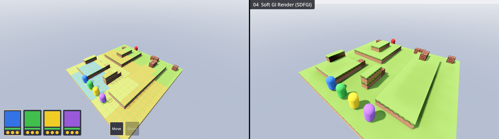

Real-time global illumination (SDFGI) with sky light and bounce, soft PCSS sun shadows and AO on a studio-grey backdrop. The closest to MagicaVoxel's own path-traced renders.

*Cost:* High (SDFGI is the most expensive option here)  ·  *Applying it changes:* CombatMap.tscn Environment/sky/sun; project.godot anti-aliasing

- **Environment:** `background_mode` Sky (2) · `ambient_light_source` Sky (3) · `ambient_light_energy` 0.3 · `tonemap_mode` Filmic (2) · `tonemap_exposure` 0.9 · `sdfgi_enabled` on · `sdfgi_use_occlusion` on · `sdfgi_read_sky_light` on · `sdfgi_bounce_feedback` 0.4 · `sdfgi_cascades` 4 · `sdfgi_min_cell_size` 0.15 · `sdfgi_energy` 0.8 · `ssao_enabled` on · `ssao_radius` 1 · `ssao_intensity` 1.8 · `ssao_power` 1.6 · `ssao_detail` 0.5
- **Sky (ProceduralSkyMaterial):** `sky_top_color` #bdc9e0 (0.74, 0.79, 0.88) · `sky_horizon_color` #ebedf2 (0.92, 0.93, 0.95) · `ground_horizon_color` #d1d6e0 (0.82, 0.84, 0.88) · `ground_bottom_color` #99a3ba (0.6, 0.64, 0.73) · `ground_curve` 0.1
- **Sun (DirectionalLight3D):** 55° above the horizon, coming from azimuth -35° (south-west, camera-left) · `light_color` #fff7eb (1, 0.97, 0.92) · `light_energy` 1.7 · `light_angular_distance` 3
- **Viewport / project rendering:** `msaa_3d` 4× (2)

---

## 05 · Colour Bounce (SSIL)

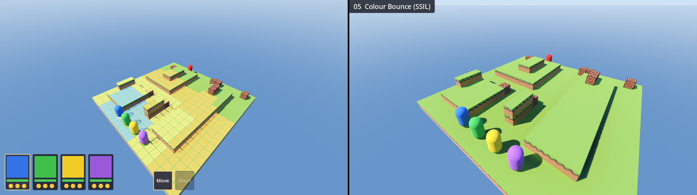

Screen-space indirect light: a cheaper bounce than SDFGI that lifts shadows with the colour of nearby surfaces, so shade near grass goes green.

*Cost:* Medium (SSIL)  ·  *Applying it changes:* CombatMap.tscn Environment/sky/sun; project.godot anti-aliasing

- **Environment:** `background_mode` Sky (2) · `ambient_light_source` Sky (3) · `ambient_light_energy` 0.6 · `tonemap_mode` Filmic (2) · `tonemap_exposure` 1 · `ssao_enabled` on · `ssao_radius` 1.2 · `ssao_intensity` 1.6 · `ssao_power` 1.6 · `ssao_detail` 0.5 · `ssil_enabled` on · `ssil_radius` 5 · `ssil_intensity` 3 · `ssil_sharpness` 0.98 · `ssil_normal_rejection` 1
- **Sky (ProceduralSkyMaterial):** `sky_top_color` #4780d9 (0.28, 0.5, 0.85) · `sky_horizon_color` #b3cceb (0.7, 0.8, 0.92) · `sky_curve` 0.15 · `ground_horizon_color` #9eb8d6 (0.62, 0.72, 0.84) · `ground_bottom_color` #5275a8 (0.32, 0.46, 0.66) · `ground_curve` 0.1
- **Sun (DirectionalLight3D):** 50° above the horizon, coming from azimuth -35° (south-west, camera-left) · `light_color` #fff2db (1, 0.95, 0.86) · `light_energy` 1.6 · `shadow_blur` 1
- **Viewport / project rendering:** `msaa_3d` 4× (2)

---

## 07 · Soft Pastel

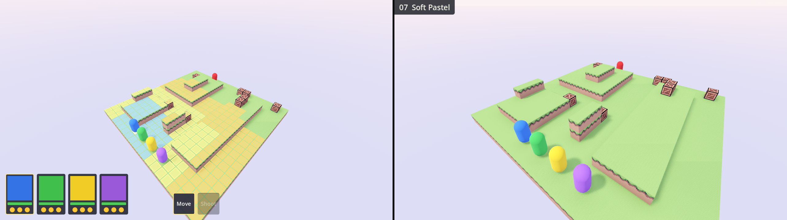

Pastel sky, wide soft shadows, strong AO, and block colours lightened and desaturated 22% by the block shader. Calm and Townscaper-like; the least saturated option.

*Cost:* Low  ·  *Applying it changes:* CombatMap.tscn Environment/sky/sun; project.godot anti-aliasing; new block shader + GridMap material hookup

- **Environment:** `background_mode` Sky (2) · `ambient_light_source` Sky (3) · `ambient_light_energy` 1.1 · `tonemap_mode` Filmic (2) · `tonemap_exposure` 1 · `ssao_enabled` on · `ssao_radius` 1.5 · `ssao_intensity` 2.2 · `ssao_power` 1.6 · `ssao_detail` 0.5
- **Sky (ProceduralSkyMaterial):** `sky_top_color` #b3c7f2 (0.7, 0.78, 0.95) · `sky_horizon_color` #fae6e6 (0.98, 0.9, 0.9) · `ground_horizon_color` #f0dbe6 (0.94, 0.86, 0.9) · `ground_bottom_color` #c2c2eb (0.76, 0.76, 0.92) · `ground_curve` 0.1
- **Sun (DirectionalLight3D):** 58° above the horizon, coming from azimuth -30° (south-west, camera-left) · `light_color` #fffaf2 (1, 0.98, 0.95) · `light_energy` 0.9 · `light_angular_distance` 6 · `shadow_opacity` 0.8
- **Viewport / project rendering:** `msaa_3d` 4× (2)
- **Block material (custom shader):** `voxel_block.gdshader`, `saturation` 0.78 · `brightness` 1.1

---

## 10 · Split-Tone Grade (1D LUT)

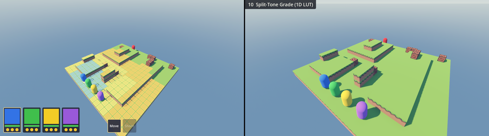

Per-channel curves: teal-lifted shadows, warm mids and highlights. A muted, filmic grade; the sky goes teal-grey.

*Cost:* Free  ·  *Applying it changes:* CombatMap.tscn Environment/sky/sun; project.godot anti-aliasing; generated LUT resource

- **Environment:** `background_mode` Sky (2) · `ambient_light_source` Sky (3) · `ambient_light_energy` 0.8 · `tonemap_mode` Filmic (2) · `tonemap_exposure` 1 · `ssao_enabled` on · `ssao_radius` 1.2 · `ssao_intensity` 1.6 · `ssao_power` 1.6 · `ssao_detail` 0.5
- **Sky (ProceduralSkyMaterial):** `sky_top_color` #4780d9 (0.28, 0.5, 0.85) · `sky_horizon_color` #b3cceb (0.7, 0.8, 0.92) · `sky_curve` 0.15 · `ground_horizon_color` #9eb8d6 (0.62, 0.72, 0.84) · `ground_bottom_color` #5275a8 (0.32, 0.46, 0.66) · `ground_curve` 0.1
- **Sun (DirectionalLight3D):** 50° above the horizon, coming from azimuth -35° (south-west, camera-left) · `light_color` #ffffff (1, 1, 1) · `light_energy` 1.3 · `shadow_blur` 1
- **Viewport / project rendering:** `msaa_3d` 4× (2)
- **Colour correction (1D LUT, GradientTexture1D, per-channel curves):** 0 → #0a1426 (0.04, 0.08, 0.15), 0.5 → #878075 (0.53, 0.5, 0.46), 1 → #fff5e0 (1, 0.96, 0.88)

---

## 11 · Tilt-Shift Miniature

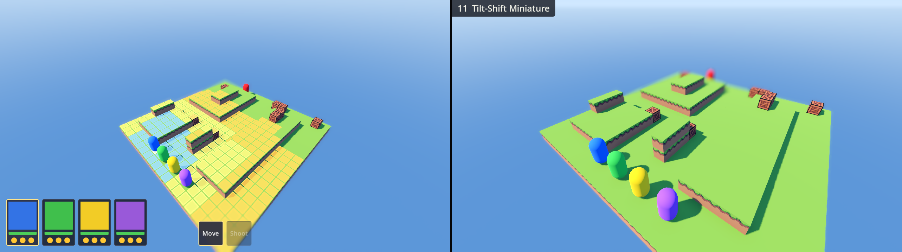

Near and far depth-of-field blur plus +20% saturation fake a tabletop miniature. The focus band is wide enough that units stay sharp; in game the focus distance should follow the camera zoom.

*Cost:* Medium (DOF)  ·  *Applying it changes:* CombatMap.tscn Environment/sky/sun; project.godot anti-aliasing; CameraRig.gd (focus follows zoom)

- **Environment:** `background_mode` Sky (2) · `ambient_light_source` Sky (3) · `ambient_light_energy` 0.8 · `tonemap_mode` Filmic (2) · `tonemap_exposure` 1 · `ssao_enabled` on · `ssao_radius` 1.2 · `ssao_intensity` 1.6 · `ssao_power` 1.6 · `ssao_detail` 0.5 · `adjustment_enabled` on · `adjustment_saturation` 1.2 · `adjustment_contrast` 1.06
- **Sky (ProceduralSkyMaterial):** `sky_top_color` #4780d9 (0.28, 0.5, 0.85) · `sky_horizon_color` #b3cceb (0.7, 0.8, 0.92) · `sky_curve` 0.15 · `ground_horizon_color` #9eb8d6 (0.62, 0.72, 0.84) · `ground_bottom_color` #5275a8 (0.32, 0.46, 0.66) · `ground_curve` 0.1
- **Sun (DirectionalLight3D):** 50° above the horizon, coming from azimuth -35° (south-west, camera-left) · `light_color` #fff2db (1, 0.95, 0.86) · `light_energy` 1.3 · `shadow_blur` 1
- **Camera attributes (CameraAttributesPractical, on WorldEnvironment):** `dof_blur_far_enabled` on · `dof_blur_far_distance` 27 · `dof_blur_far_transition` 10 · `dof_blur_near_enabled` on · `dof_blur_near_distance` 15 · `dof_blur_near_transition` 5 · `dof_blur_amount` 0.12
- **Same, for the close view only:** `dof_blur_far_distance` 17 · `dof_blur_far_transition` 8 · `dof_blur_near_distance` 7 · `dof_blur_near_transition` 3
- **Viewport / project rendering:** `msaa_3d` 4× (2)

---

## 15 · Toon Shading (built-in)

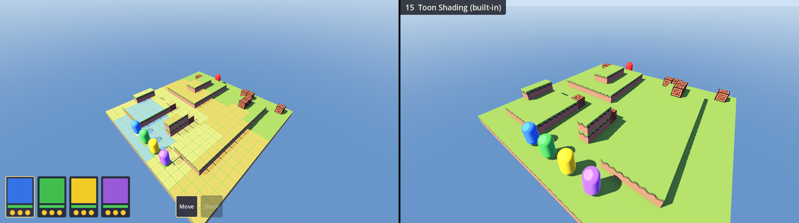

Godot's built-in toon diffuse on blocks and units (hard terminator), toon specular and rim on units, blue-violet ambient. Two-tone faces and crisp shadows.

*Cost:* Free  ·  *Applying it changes:* CombatMap.tscn Environment/sky/sun; project.godot anti-aliasing; block + unit materials

- **Environment:** `background_mode` Sky (2) · `ambient_light_source` Color (2) · `ambient_light_energy` 0.6 · `tonemap_mode` Filmic (2) · `tonemap_exposure` 1 · `ssao_enabled` on · `ssao_radius` 1.2 · `ssao_intensity` 1.6 · `ssao_power` 1.6 · `ssao_detail` 0.5 · `ambient_light_color` #8c99f2 (0.55, 0.6, 0.95)
- **Sky (ProceduralSkyMaterial):** `sky_top_color` #4780d9 (0.28, 0.5, 0.85) · `sky_horizon_color` #b3cceb (0.7, 0.8, 0.92) · `sky_curve` 0.15 · `ground_horizon_color` #9eb8d6 (0.62, 0.72, 0.84) · `ground_bottom_color` #5275a8 (0.32, 0.46, 0.66) · `ground_curve` 0.1
- **Sun (DirectionalLight3D):** 50° above the horizon, coming from azimuth -35° (south-west, camera-left) · `light_color` #fff2db (1, 0.95, 0.86) · `light_energy` 1.5 · `shadow_blur` 0.3
- **Viewport / project rendering:** `msaa_3d` 4× (2)
- **Block materials (StandardMaterial3D, on top of the importer's vertex-colour material):** `diffuse_mode` Toon (3) · `specular_mode` Disabled (2) · `roughness` 0.15
- **Unit capsule materials:** `diffuse_mode` Toon (3) · `specular_mode` Toon (1) · `roughness` 0.3 · `rim_enabled` on · `rim` 0.5 · `rim_tint` 0.3

---

## 19 · Tactical Readability (grid, AO, height)

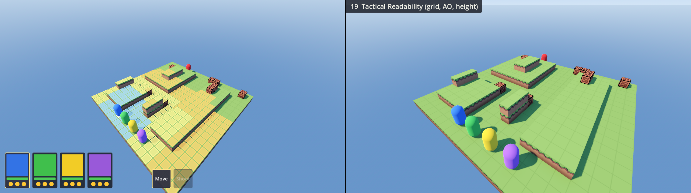

World-space tile grid lines on blocks, contact AO at wall bases, raised ground a little brighter per metre, darker map skirt, slightly calmer greens. For reading tiles, elevation and cover at a glance.

*Cost:* Free  ·  *Applying it changes:* CombatMap.tscn Environment/sky/sun; project.godot anti-aliasing; new block shader + GridMap material hookup

- **Environment:** `background_mode` Sky (2) · `ambient_light_source` Sky (3) · `ambient_light_energy` 0.8 · `tonemap_mode` Filmic (2) · `tonemap_exposure` 1 · `ssao_enabled` on · `ssao_radius` 1.2 · `ssao_intensity` 1.6 · `ssao_power` 1.6 · `ssao_detail` 0.5
- **Sky (ProceduralSkyMaterial):** `sky_top_color` #4780d9 (0.28, 0.5, 0.85) · `sky_horizon_color` #b3cceb (0.7, 0.8, 0.92) · `sky_curve` 0.15 · `ground_horizon_color` #9eb8d6 (0.62, 0.72, 0.84) · `ground_bottom_color` #5275a8 (0.32, 0.46, 0.66) · `ground_curve` 0.1
- **Sun (DirectionalLight3D):** 50° above the horizon, coming from azimuth -35° (south-west, camera-left) · `light_color` #fff2db (1, 0.95, 0.86) · `light_energy` 1.3 · `shadow_blur` 1
- **Viewport / project rendering:** `msaa_3d` 4× (2)
- **Block material (custom shader):** `voxel_block.gdshader`, `edge_darken` 0.18 · `edge_width` 0.02 · `contact_ao` 0.55 · `contact_ao_height` 0.7 · `height_gain` 0.08 · `skirt_darken` 0.6 · `green_saturation` 0.85; crate overrides: `edge_darken` 0

---

## 21 · Ink Outlines

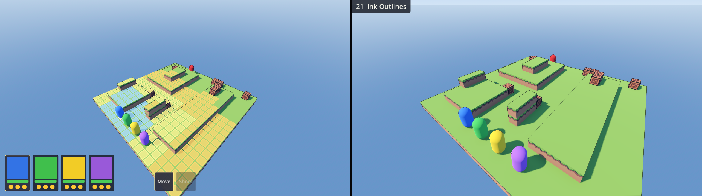

Full-screen depth + normal outline pass: 1 px dark ink silhouettes. It also exposes height changes that match the floor colour, such as the long raised strip on the right. Uses SMAA, because MSAA breaks the edge tests.

*Cost:* Low (one full-screen pass)  ·  *Applying it changes:* CombatMap.tscn Environment/sky/sun; project.godot anti-aliasing; new outline shader + full-screen quad node

- **Environment:** `background_mode` Sky (2) · `ambient_light_source` Sky (3) · `ambient_light_energy` 0.8 · `tonemap_mode` Filmic (2) · `tonemap_exposure` 1 · `ssao_enabled` on · `ssao_radius` 1.2 · `ssao_intensity` 1.6 · `ssao_power` 1.6 · `ssao_detail` 0.5
- **Sky (ProceduralSkyMaterial):** `sky_top_color` #4780d9 (0.28, 0.5, 0.85) · `sky_horizon_color` #b3cceb (0.7, 0.8, 0.92) · `sky_curve` 0.15 · `ground_horizon_color` #9eb8d6 (0.62, 0.72, 0.84) · `ground_bottom_color` #5275a8 (0.32, 0.46, 0.66) · `ground_curve` 0.1
- **Sun (DirectionalLight3D):** 50° above the horizon, coming from azimuth -35° (south-west, camera-left) · `light_color` #fff2db (1, 0.95, 0.86) · `light_energy` 1.3 · `shadow_blur` 1
- **Viewport / project rendering:** `msaa_3d` Disabled (0) · `screen_space_aa` SMAA (2)
- **Outline pass (`outline.gdshader` on a full-screen quad, render priority −128):** `line_color` #1a1224 (0.1, 0.07, 0.14) · `line_opacity` 0.9 · `line_width` 1

---

## 22 · Cartoon (toon + bold outlines)

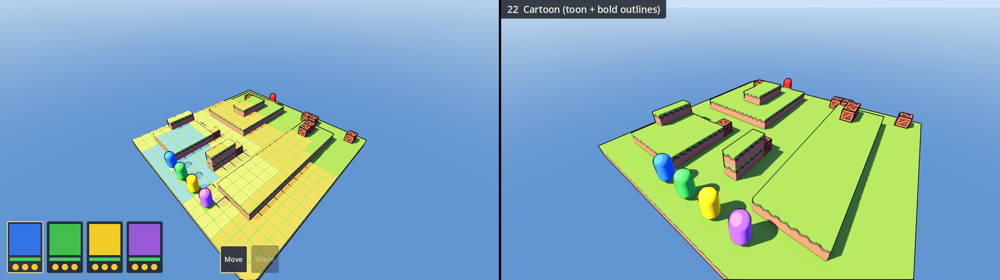

#15's toon shading with 2 px ink outlines, crease lines where walls meet the floor, and +15% saturation. Comic-book.

*Cost:* Low  ·  *Applying it changes:* CombatMap.tscn Environment/sky/sun; project.godot anti-aliasing; new outline shader + full-screen quad node; block + unit materials

- **Environment:** `background_mode` Sky (2) · `ambient_light_source` Color (2) · `ambient_light_energy` 0.6 · `tonemap_mode` Filmic (2) · `tonemap_exposure` 1 · `ssao_enabled` on · `ssao_radius` 1.2 · `ssao_intensity` 1.6 · `ssao_power` 1.6 · `ssao_detail` 0.5 · `ambient_light_color` #8c99f2 (0.55, 0.6, 0.95) · `adjustment_enabled` on · `adjustment_saturation` 1.15
- **Sky (ProceduralSkyMaterial):** `sky_top_color` #4780d9 (0.28, 0.5, 0.85) · `sky_horizon_color` #b3cceb (0.7, 0.8, 0.92) · `sky_curve` 0.15 · `ground_horizon_color` #9eb8d6 (0.62, 0.72, 0.84) · `ground_bottom_color` #5275a8 (0.32, 0.46, 0.66) · `ground_curve` 0.1
- **Sun (DirectionalLight3D):** 50° above the horizon, coming from azimuth -35° (south-west, camera-left) · `light_color` #fff2db (1, 0.95, 0.86) · `light_energy` 1.5 · `shadow_blur` 0.3
- **Viewport / project rendering:** `msaa_3d` Disabled (0) · `screen_space_aa` SMAA (2)
- **Block materials (StandardMaterial3D, on top of the importer's vertex-colour material):** `diffuse_mode` Toon (3) · `specular_mode` Disabled (2) · `roughness` 0.15
- **Unit capsule materials:** `diffuse_mode` Toon (3) · `specular_mode` Toon (1) · `roughness` 0.3 · `rim_enabled` on · `rim` 0.5 · `rim_tint` 0.3
- **Outline pass (`outline.gdshader` on a full-screen quad, render priority −128):** `line_color` #140d1a (0.08, 0.05, 0.1) · `line_opacity` 1 · `line_width` 2 · `crease_opacity` 0.6

---

## 23 · Bevelled Edge Highlights

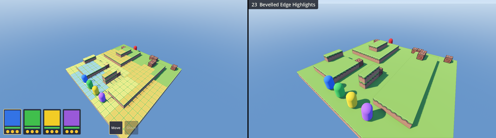

The outline pass used for definition rather than ink: silhouettes are a darker shade of the colour underneath, top edges of blocks get a light bevel line, floor/wall creases a soft dark line (t3ssel8r-style convex highlights). Subtle at full resolution; zoom in to see it.

*Cost:* Low  ·  *Applying it changes:* CombatMap.tscn Environment/sky/sun; project.godot anti-aliasing; new outline shader + full-screen quad node

- **Environment:** `background_mode` Sky (2) · `ambient_light_source` Sky (3) · `ambient_light_energy` 0.8 · `tonemap_mode` Filmic (2) · `tonemap_exposure` 1 · `ssao_enabled` on · `ssao_radius` 1.2 · `ssao_intensity` 1.6 · `ssao_power` 1.6 · `ssao_detail` 0.5
- **Sky (ProceduralSkyMaterial):** `sky_top_color` #4780d9 (0.28, 0.5, 0.85) · `sky_horizon_color` #b3cceb (0.7, 0.8, 0.92) · `sky_curve` 0.15 · `ground_horizon_color` #9eb8d6 (0.62, 0.72, 0.84) · `ground_bottom_color` #5275a8 (0.32, 0.46, 0.66) · `ground_curve` 0.1
- **Sun (DirectionalLight3D):** 50° above the horizon, coming from azimuth -35° (south-west, camera-left) · `light_color` #fff2db (1, 0.95, 0.86) · `light_energy` 1.3 · `shadow_blur` 1
- **Viewport / project rendering:** `msaa_3d` Disabled (0) · `screen_space_aa` SMAA (2)
- **Outline pass (`outline.gdshader` on a full-screen quad, render priority −128):** `line_tint_mix` 1 · `line_darken` 0.5 · `line_opacity` 0.7 · `crease_width` 2 · `highlight_opacity` 0.7 · `highlight_min_up` 0.5 · `crease_opacity` 0.4

---

## 27 · Long-Lens Diorama (FOV 40)

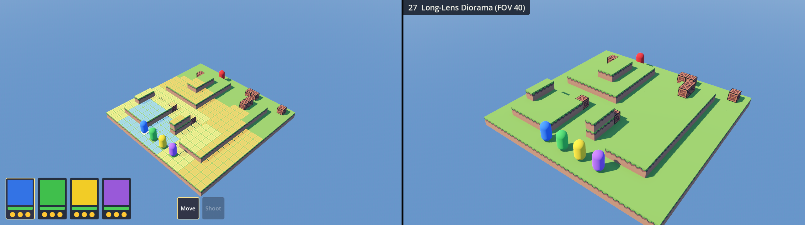

Camera FOV narrowed from 75° to 40° and pulled back to keep the framing. Much less perspective distortion, so the map reads like a tabletop and walls stay parallel. Changes the camera, not the art.

*Cost:* Free  ·  *Applying it changes:* CombatMap.tscn Environment/sky/sun; project.godot anti-aliasing; Camera3D fov + CameraRig distances

- **Environment:** `background_mode` Sky (2) · `ambient_light_source` Sky (3) · `ambient_light_energy` 0.8 · `tonemap_mode` Filmic (2) · `tonemap_exposure` 1 · `ssao_enabled` on · `ssao_radius` 1.2 · `ssao_intensity` 1.6 · `ssao_power` 1.6 · `ssao_detail` 0.5
- **Sky (ProceduralSkyMaterial):** `sky_top_color` #4780d9 (0.28, 0.5, 0.85) · `sky_horizon_color` #b3cceb (0.7, 0.8, 0.92) · `sky_curve` 0.15 · `ground_horizon_color` #9eb8d6 (0.62, 0.72, 0.84) · `ground_bottom_color` #5275a8 (0.32, 0.46, 0.66) · `ground_curve` 0.1
- **Sun (DirectionalLight3D):** 50° above the horizon, coming from azimuth -35° (south-west, camera-left) · `light_color` #fff2db (1, 0.95, 0.86) · `light_energy` 1.3 · `shadow_blur` 1
- **Camera3D:** `fov` 40, with CameraRig `near_distance`/`far_distance` scaled ×2.11 to keep the framing
- **Viewport / project rendering:** `msaa_3d` 4× (2)

---

## 28 · Recommended Blend

Claude's pick for the todo notes: #01's lighting with softer sun shadows; the block shader with calmer greens (green-only −18% saturation), light hand-shaded faces, contact AO at wall bases and a slight elevation gain; bevel outlines like #23; and a gentle vibrance LUT with cool shadows.

*Cost:* Low  ·  *Applying it changes:* CombatMap.tscn Environment/sky/sun; project.godot anti-aliasing; new block shader + GridMap material hookup; new outline shader + full-screen quad node; generated LUT resource

- **Environment:** `background_mode` Sky (2) · `ambient_light_source` Sky (3) · `ambient_light_energy` 0.8 · `tonemap_mode` Filmic (2) · `tonemap_exposure` 1 · `ssao_enabled` on · `ssao_radius` 1.2 · `ssao_intensity` 1.6 · `ssao_power` 1.6 · `ssao_detail` 0.5
- **Sky (ProceduralSkyMaterial):** `sky_top_color` #4780d9 (0.28, 0.5, 0.85) · `sky_horizon_color` #b3cceb (0.7, 0.8, 0.92) · `sky_curve` 0.15 · `ground_horizon_color` #9eb8d6 (0.62, 0.72, 0.84) · `ground_bottom_color` #5275a8 (0.32, 0.46, 0.66) · `ground_curve` 0.1
- **Sun (DirectionalLight3D):** 50° above the horizon, coming from azimuth -35° (south-west, camera-left) · `light_color` #fff2db (1, 0.95, 0.86) · `light_energy` 1.3 · `shadow_blur` 1 · `light_angular_distance` 1
- **Viewport / project rendering:** `msaa_3d` Disabled (0) · `screen_space_aa` SMAA (2)
- **Block material (custom shader):** `voxel_block.gdshader`, `green_saturation` 0.82 · `green_value` 1.03 · `top_tint` (1.04, 1.03, 0.98) · `side_z_tint` (0.92, 0.92, 1) · `side_x_tint` (0.78, 0.8, 0.95) · `contact_ao` 0.4 · `skirt_darken` 0.5 · `height_gain` 0.05
- **Outline pass (`outline.gdshader` on a full-screen quad, render priority −128):** `line_tint_mix` 1 · `line_darken` 0.45 · `line_opacity` 0.8 · `crease_width` 2 · `highlight_opacity` 0.55 · `highlight_min_up` 0.5 · `crease_opacity` 0.3
- **Colour correction (generated 33³ 3D LUT):** `vibrance` 0.45 · `cool_shadows` 0.8

---
## Code

The exact code that produced these renders is in [`harness/`](harness/):

- [`shaders/voxel_block.gdshader`](harness/shaders/voxel_block.gdshader): the block material used by 07, 19 and 28.
- [`shaders/outline.gdshader`](harness/shaders/outline.gdshader): the full-screen outline pass used by 21–23 and 28.
- [`Variants.gd`](harness/Variants.gd): how each setting is applied, including the sun direction, block materials, outline quad, LUT generation and FOV scaling.
- [`VariantList.gd`](harness/VariantList.gd): the values for every style, including the dropped ones.

## Research sources

- [hexaquo: Environment and light in Godot](https://hexaquo.at/pages/environment-and-light-in-godot-setting-up-for-photorealistic-3d-graphics/): SSAO with a large radius, sky ambient, and the warm-sun / cool-ambient idea behind the sky colours.
- [Godot docs: Environment and post-processing](https://docs.godotengine.org/en/4.4/tutorials/3d/environment_and_post_processing.html) and [GDQuest: tonemapping](https://www.gdquest.com/library/glossary/tonemap/): why Filmic keeps more saturation than ACES and AgX (all kept styles use Filmic).
- [Godot Shaders: post-process outline (depth/normal)](https://godotshaders.com/shader/post-process-outline-depth-normal/), a port of Roystan's outline shader, and [leopeltola's Godot 3D pixel-art stylizer](https://github.com/leopeltola/Godot-3d-pixelart-demo): the full-screen quad technique and the convex-edge highlight test (21–23, 28).
- [David Holland: 3D pixel art rendering](https://www.davidhol.land/articles/3d-pixel-art-rendering/) (t3ssel8r-style): dark silhouettes, light convex edges (23, 28).
- [Game Developer: Voxel art, reducing the greebles](https://www.gamedeveloper.com/design/voxel-art-reducing-the-greebles): shade voxels with hue as well as brightness (the face tints in 28).
- [80.lv: Building a UE4 game with voxels](https://80.lv/articles/intensive-exposure-building-ue4-game-with-voxels): AO plus LUT post-processing as the core of a voxel look (10, 28).
- [Godot Shaders: depth-based tilt-shift](https://godotshaders.com/shader/depth-based-tilt-shift/) and [CameraAttributesPractical](https://rokojori.com/en/labs/godot/docs/4.3/cameraattributespractical-class): miniature depth of field (11).
- [Calinou's Godot 3D LUT demo](https://github.com/calinou/godot-3d-lut-demo): colour grading through `adjustment_color_correction` (10, 28).
- [Godot 4.0 SDFGI article](https://godotengine.org/article/godot-40-gets-sdf-based-real-time-global-illumination/): SDFGI and SSIL (04, 05).
